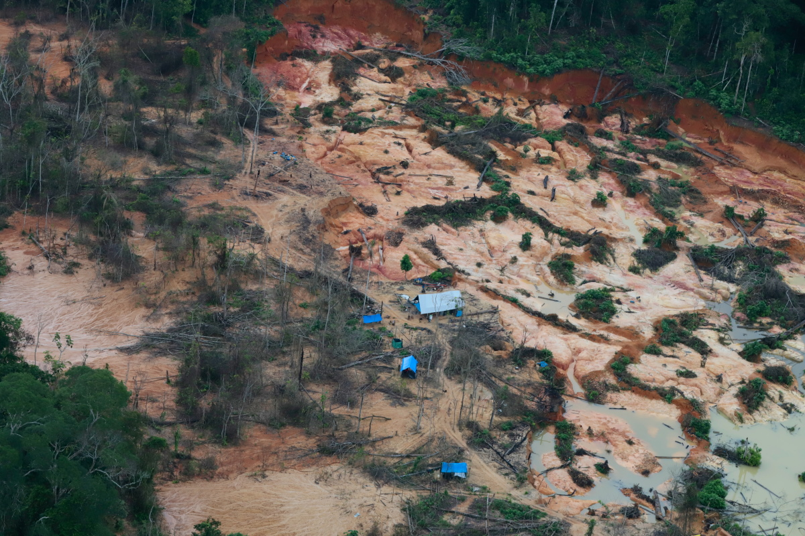
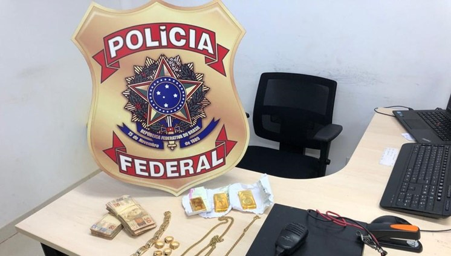

import Image from "!url-loader!../../images/fotos/GP1SU06V_High_res.jpg"

export const meta = {
  name: "brazil",
  title: "Corrida do ouro movimenta o mercado de mercúrio em Roraima",
  intro: "A maior e mais industrializada economia da América do Sul, o Brasil, não produz mercúrio. Mas as suas minas de ouro ilegais em plena expansão não podem funcionar sem a substância tóxica.",
  by: "Por Sam Cowie (texto). Videos por Rafael Norton, Luiz Felipe Saleh e Erik Von Poser.",
  image: Image,
  next: {
	slug: "guyana",
	title: "O Metal Tóxico à Sombra da Indústria do Ouro",
	description: "Apesar do seu risco à saúde e ao ambiente, o mercúrio é amplamente utilizado na extração de ouro, e para os mineiros na Amazônia, o líquido prateado é quase tão valioso como o próprio ouro."
  }
};

**Roraima, o Estado mais** ao norte do Brasil não possui [nenhuma mina de ouro legalizada](https://www.bbc.com/portuguese/internacional-48534473). Mas a estátua de sete metros de altura do **[Monumento ao Garimpeiro](https://g1.globo.com/rr/roraima/noticia/2020/06/08/monumento-ao-garimpeiro-e-alvo-de-pichacao-em-boa-vista.ghtml)** no centro da sua capital, a tranquila Boa Vista, deixa poucas dúvidas de onde residem muito do entusiasmo local.

A cada dia, frotas de carros, caminhões, [barcos, pequenos aviões](https://g1.globo.com/rr/roraima/noticia/2020/01/09/exercito-prende-15-garimpeiros-em-barcos-carregados-de-material-para-garimpo-na-terra-yanomami.ghtml) e [até helicópteros](https://folhabv.com.br/noticia/POLICIA/Ocorrencias/Helicoptero-que-era-usado-no-garimpo-e-apreendido-no-Paredao/65710) transportam homens com suprimentos para a mineração e ouro de e para centenas de áreas de mineração ilegal em reservas indígenas e rios nesse Estado amazônico pouco povoado. Alguns dos veículos carregam embalagens de mercúrio, a tóxica substância prateada amplamente utilizada pelos mineiros para o processamento do ouro.

<Video url="https://www.youtube.com/embed/7iIYvI604ac" />

Em uma madrugada recente, no final de junho, a polícia militar parou um carro com homens que se dirigiam a Boa Vista, voltando de um garimpo ilegal no distrito de Alto Alegre, onde está localizada parte da vasta reserva indígena Yanomami brasileira. De acordo com relatos, dias antes dois Yanomami  teriam sido mortos a tiros, e vários outros, feridos por garimpeiros na região.

Ao revistar o carro, os policiais encontraram oito munições, um conjunto de balanças digitais e duas pequenas garrafas de Coca-Cola contendo 10 kg de mercúrio; uma apreensão relativamente grande da substância na beira da estrada, mas apenas uma fração do que é usado no Estado a cada ano.

O Brasil, a maior e mais industrializada economia da América do Sul, não produz mercúrio. E, mesmo antes de 2017, [quando o país ratificou a Convenção de Minamata](http://www.mercuryconvention.org/DNNAdmin/AllENGLISHNewsEntry/tabid/3444/articleType/ArticleView/articleId/158175/language/en-US/Brazil-brings-to-74-the-number-of-future-Parties-to-the-Minamata-Convention.aspx), um tratado internacional para proteger a saúde humana das emissões de mercúrio, as vendas foram oficialmente proibidas e as agências federais mantiveram um [controle rigoroso](https://www.icmbio.gov.br/cepsul/images/stories/legislacao/Instrucao_normativa/2015/in_ibama_08_2015_estabelece_cadastro_tecnico_federal_atividades_poluidoras__rvg_p_ibama_395_1989_p_435_1989_p_32_1995_p_46_1996.pdf) sobre as importações registradas.

> "Se quase todos os mineiros artesanais da Amazônia brasileira usam mercúrio, essa nova corrida do ouro certamente levou a um aumento do uso ilícito da substância."

Mas nos últimos anos tem havido um aumento notável da mineração ilegal em Roraima, especialmente na [reserva indígena Yanomami](https://news.mongabay.com/2019/07/yanomami-amazon-reserve-invaded-by-20000-miners-bolsonaro-fails-to-act/). E, dado que quase todos os mineiros artesanais da Amazônia brasileira usam mercúrio, de acordo com estudos do governo, essa nova corrida do ouro certamente levou a um aumento do uso ilícito de mercúrio.

<Video url="https://www.youtube.com/embed/s6wbj5-VR8w" />

O mercúrio utilizado em milhares de garimpos em toda a Amazônia brasileira é normalmente contrabandeado dos países vizinhos ou importado legalmente para o uso na produção industrial do país, sendo depois canalizado para redes clandestinas.

O relatório de 2020 do Ministério Público Federal do Brasil "Mineração ilegal de ouro na Amazônia: marcos jurídicos e questões controversas",  destaca a importância das "ações de comando e controle de fronteiras e dos mercados informais de comercialização do mercúrio", caso o Brasil queira ser bem-sucedido em suas metas com base na Convenção de Minamata.

“Precisamos de fiscalizações permanentes e estruturais do lado brasileiro”, disse a deputada Joênia Wapichana, de Roraima, única parlamentar indígena do Brasil. “Mas também precisamos de medidas mais rígidas dos países produtores de mercúrio”, acrescentou.

## Garimpo em Roraima

Acredita-se que hoje milhares de garimpeiros estão extraindo ouro das ricas reservas indígenas de Roraima, destruindo habitats naturais e colocando em risco as populações locais, risco esse que aumentou com a crise da COVID-19. As repetidas operações de combate à mineração ilegal realizadas nos últimos anos pela Polícia Federal brasileira, pelas agências de fiscalização ambiental e pelas Forças Armadas levaram a várias prisões, grandes apreensões de ouro e outros bens, mas basicamente falharam em deter seu crescimento.

> “A maior parte da economia do Estado continua a funcionar pela mineração ilegal e por isso a pressão é enorme”, disse uma fonte.

 *Acredita-se que milhares de garimpeiros estão extraindo ouro das ricas reservas indígenas de Roraima. __Photo by Greenpeace__ *

A maioria dos próprios garimpeiros são homens pobres - às vezes mulheres -, muitas vezes explorados na base de uma pirâmide lucrativa de contrabando de ouro, do comércio ilegal e de logísticas, que, anualmente, movimentam bilhões de dólares em todo o Brasil.

É impossível obter as cifras exatas, devido à natureza ilícita do comércio. Estimam-se, no entanto, que milhares de quilos de ouro - incluindo, mais recentemente, quantias crescentes da vizinha Venezuela - são anualmente extraídos e traficados ilegalmente de Roraima, roubando do Estado muito da sua necessária receita tributária.

O processo é possibilitado pela pobreza do Estado, por suas fronteiras porosas e pelas agências de fiscalização sobrecarregadas, mas também por autoridades locais corruptas, empresários e investidores inescrupulosos.
> “Há uma tolerância social enorme na sociedade de Roraima, o garimpeiro ilegal não é visto como um criminoso”
disse Alisson Marugal, procurador da República em Roraima.

É um risco que compensa, ao menos para alguns. Os preços globais do ouro alcançaram níveis recordes, em torno de US$ 62.000 o quilo (preço em 4 de setembro), enquanto as agências de proteção ambiental e indígena do Brasil foram [prejudicadas pela crise da COVID-19](https://www.reuters.com/article/us-health-coronavirus-brazil-environment/exclusive-brazil-scales-back-environmental-enforcement-amid-coronavirus-idUSKBN21E15H) e pela [interferência](https://www.reuters.com/article/us-brazil-environment/televised-raid-on-illegal-amazon-mining-angers-brazil-government-leads-to-sacking-idUSKCN21W31A) do governo do presidente Jair Bolsonaro.

O líder de extrema direita foi eleito presidente em 2018 e [teve uma vitória retumbante](https://g1.globo.com/rr/roraima/eleicoes/2018/noticia/2018/10/29/jair-bolsonaro-vence-em-12-das-15-cidades-de-roraima.ghtml) aqui em Roraima, após uma campanha repleta de retórica pró-garimpeiro, incluindo promessas de afrouxar as regulamentações ambientais e legalizar a mineração em reservas indígenas.

<Video url="https://www.youtube.com/embed/Vqef9JdC1D0" />

> “Se eu fosse rei de Roraima, em 20 anos teríamos uma economia igual a do Japão”, disse Bolsonaro durante uma [visita em 2018](https://folhabv.com.br/noticia/POLITICA/Roraima/Bolsonaro---Se-eu-fosse-rei-de-Roraima--estado-teria-economia-igual-a-do-Japao-/38719).

Durante décadas, hordas de garimpeiros de todo o Brasil se aglomeraram neste El Dorado amazônico, na esperança de encontrar sua fortuna. Durante a década de 1980, cerca de 40 mil mineiros invadiram as terras Yanomami, que são maiores do que Portugal.

>Durante décadas, hordas de mineiros ilegais de todo o Brasil se aglomeraram neste El Dorado amazônico, na esperança de encontrar sua fortuna.

Como resultado, cerca de 15 a 20 por cento da tribo foi extinta por causa das doenças e da violência, dizem os antropólogos. Os garimpeiros acabaram sendo expulsos em 1992, quando a reserva foi oficialmente demarcada pelo governo brasileiro, embora sempre voltassem.

Em julho deste ano, a Polícia Federal prendeu Pedro Emiliano Garcia, de 59 anos, um infame ex-garimpeiro - o único brasileiro vivo a ser condenado por genocídio, após um massacre nas terras Yanomami em 1993 - com 2kg de ouro em Boa Vista, [acusado de operar aviões](http://www.pf.gov.br/imprensa/noticias/2020/07-noticias-de-julho-de-2020/pf-prende-suspeito-de-atuar-na-logistica-do-garimpo-em-terra-indigena-ianomami), transportar mineiros para a reserva e ser o “proprietário” de uma mina no local.

 *Em julho deste ano, a Polícia Federal prendeu Pedro Emiliano Garcia, de 59 anos, o único brasileiro vivo a ser acusado de genocídio. __Foto por Polícia Federal__ *

Isolada do restante do país, a outra única capital brasileira acessível de Roraima por rodovia é Manaus, a capital metropolitana da selva do Estado do Amazonas, ela própria apenas acessível por avião, uma longa viagem de barco através do rio ou guiando pelos 870 km da BR 319, rodovia não pavimentada, que pode ser virtualmente impossível de cruzar durante a estação chuvosa de novembro a março.

Mas Roraima compartilha fronteiras terrestres porosas com a Venezuela e a Guiana. A primeira foi abalada por sua própria corrida do ouro e por uma crise humanitária sem precedentes, com milhares de venezuelanos refugiados desesperados se estabelecendo no vizinho Estado brasileiro nos últimos anos.
Também houve um aumento no fluxo de contrabando, incluindo ouro, armas, cocaína e mercúrio, dizem os especialistas em segurança locais, com venezuelanos explorados, frequentemente coagidos a trabalhar para grupos criminosos.

Enquanto isso, a Guiana, um dos países mais pobres da América do Sul, com uma população de 780.000 habitantes, que recentemente começou a perfurar enormes reservas de petróleo marítimas, continua importando grandes quantidades de mercúrio - ao menos 34,5 toneladas em 2019 -, para usar em suas próprias operações de mineração artesanal de ouro.

Parte dele é traficado para Roraima, de acordo com várias fontes locais ouvidas pelo InfoAmazonia, que apontaram a Guiana como a principal fonte de mercúrio ilícito no Estado.

> "O acesso desse mercúrio (da Guiana) aos brasileiros é muito fácil”, disse um especialista em mineração ilegal em Roraima.

## Acesso fácil

A fronteira de Roraima com a Guiana é formada pelo Rio Tacutu. Em muitos pontos o rio tem menos de 100 m de largura. Possui travessias ilegais e, durante a estação da seca, pode até ser possível caminhar para o outro lado.

O rio é uma rota consolidada entre os dois países de tráfico de pessoas e contrabando de itens como álcool, produtos alimentícios, suprimentos médicos e, segundo fontes, mercúrio.

“Eles não precisam passar pela estrada. Eles vêm pelo rio e trazem a quantidade que querem. É muito fácil de comprar ”, disse uma fonte".
“A região, devido às suas características inóspitas, é uma grande facilitadora para qualquer transporte ilícito”, disse uma fonte policial.

De acordo com uma fonte da Polícia Rodoviária Federal do Brasil, responsável por apreensões na beira das estradas, parte do mercúrio é contrabandeado pela fronteira com a Guiana por meio de táxis e levado para Boa Vista. Esta versão também foi corroborada por fontes ouvidas para esta reportagem em Georgetown, capital da Guiana. A densidade da substância também a torna um produto fácil de contrabandear.

> “Uma garrafa de 2 litros de Coca-Cola pode conter 20 kg de mercúrio”, disse uma fonte. “É altamente improvável que você encontre uma tonelada de mercúrio, isso é o que torna as inspeções difíceis”.

Assim como a densidade, o tráfico de mercúrio é auxiliado pela ambiguidade da substância, de certa forma legal. Diferentemente da cocaína, da maconha ou do ouro, por exemplo, apesar das suas qualidades destrutivas, muitas pessoas não sabem que é ilegal, incluindo muitos policiais, disseram alguns.

“A maioria das pessoas não vê isso como um crime”, disse um agente da polícia federal, que antigamente trabalhava na Guiana.

Várias outras fontes sugeriram que pequenas quantidades de mercúrio foram trazidas da Venezuela, especialmente através do rio Uraricoera, mas pequenas quantidades de cada vez.

**Território Yanomami e os garimpos mapeados**
<iframe src="https://infoamazonia.org/en/embed/?map_only=1&map_id=59813&width=960&height=480" width="960" height="480" frameborder="0"></iframe>

“É o chamado trabalho de formiga, cada um leva 0,5l ou 1l”, disse uma fonte da polícia.
Outra fonte, com conexões com a mineração ilegal, disse que os aviões e os helicópteros das minas em Roraima, que pousavam no lado venezuelano da fronteira, às vezes pegavam mercúrio e o distribuíam no território Yanomami.

Existem até algumas evidências que sugerem que parte do mercúrio contrabandeado a Roraima também está sendo levado para outras regiões do Brasil.
No ano passado, a polícia rodoviária de Roraima, Estado vizinho do Amazonas, prendeu um homem com 150 kg de mercúrio em quatro garrafas de metal, aparentemente avaliado em R$ 90 mil, junto com 35 mil carteiras de cigarros.

Ele disse ter saído de Boa Vista e transportado o mercúrio para Manaus, que depois seria enviado para Itaituba, o mais importante **pólo** de mineração ilegal da Amazônia brasileira.

<Video url="https://www.youtube.com/embed/6mVE6V9aaWs" />

Em outras partes do Brasil, acredita-se que uma grande quantidade de mercúrio entra pela Bolívia, o segundo maior importador mundial depois da Índia, importando 196 toneladas em 2018, de acordo com estimativas do Banco Mundial.

Os Estados de Rondônia e Mato Grosso, que compartilham enormes fronteiras terrestres com a Bolívia, têm suas próprias extensas indústrias de mineração ilegal, bem como acesso rodoviário a grande parte da Amazônia brasileira.

No início deste ano, dois homens foram presos na rodovia BR-364, em Rondônia, transportando [80kg de mercúrio](https://g1.globo.com/ro/rondonia/noticia/2020/01/25/80-quilos-de-mercurio-sao-apreendidos-com-dupla-em-carro-na-br-364.ghtml), que, segundo eles, seriam vendidos em minas ilegais na cidade de Ariquemes.

O número de rotas potenciais mostra que o mercúrio é uma substância ágil, que pode se adaptar às diversas condições, incluindo restrições, apreensões e aumento de preço. Como muitas substâncias ilegais, acaba chegando onde existe demanda.

“É a mesma lógica do tráfico de drogas”, disse um perito forense da Polícia Federal baseado na região do Rio Tapajós, que preferiu permanecer anônimo. “Quantidades maiores são levadas aos locais e então divididas em quantidades menores para serem vendidas”.

Em toda a Amazônia brasileira, mercadorias vendidas em lugares distantes de mineração ilegal - muitas vezes acessíveis apenas por avião ou barco - como água, Coca-Cola, comida enlatada, álcool e serviço de internet, são vendidas a preços muito inflacionados e com o mercúrio acontece a mesma coisa.

<Sidenote side="right">
	Estudo do Inventário Nacional de Emissões de Mercúrio de 2018 avaliava em R$ 600 - 1.200 o quilo de mercúrio, dependendo do Estado.
</Sidenote>

Os preços do mercúrio no Brasil parecem flutuar, dependendo da região. Uma fonte disse que o mercúrio poderia ser comprado localmente em Roraima por R$ 500 o quilo, enquanto o Estudo do Inventário Nacional de Emissões de Mercúrio de 2018 avaliava em R$ 600 - 1.200 o quilo de mercúrio, dependendo do Estado.

O mercúrio também está aparentemente bastante disponível [online](https://www.construvolts.com.br/mercrio-vivo-azougue-100g-p136), mas por valores muito mais altos, R$ 850 por 100g, por exemplo.

Enquanto isso, no relatório de 2020 [A nova corrida do ouro na Amazônia](http://www.escolhas.org/wp-content/uploads/2020/05/TD_04_GARIMPO_A-NOVA-CORRIDA-DO-OURO-NA-AMAZONIA_maio_2020.pdf), da ONG ambientalista brasileira Instituto Escolhas, uma fonte pró-garimpo da região do Rio Tapajós alegou que o mercúrio custava R$ 1.500 e, portanto, era usado com "moderação".

## Emissões de mercúrio

As estimativas sobre a quantidade de mercúrio lançado no meio ambiente brasileiro a cada ano variam bastante.

Os grupos garimpeiros insistem que as emissões diminuíram nos últimos anos, devido ao aumento do [uso de retortas](https://lista.mercadolivre.com.br/recuperador-de-mercúrio-cadinho-para-garimpo) - um objeto de metal que parece uma grande chaleira, facilmente disponível para compra e relativamente barata online - que pode recuperar grandes quantidades de mercúrio.

Os varejistas de retorta afirmam que podem ser recuperados 100 por cento, enquanto estudos sugerem algo em torno de 70 por cento, em oposição aos métodos de filtragem padrão, que recuperam em média 50 por cento.

O estudo mais abrangente do Brasil sobre o uso de mercúrio na mineração artesanal, o Inventário Nacional de Emissões de Mercúrio, publicado em 2018, concluiu que algo entre 18,5 e 221,5 toneladas de mercúrio foram lançadas no meio ambiente em 2016, cerca de dois terços das quais vão para a atmosfera e o restante para o  solo e os rios.

A grande variação depende da quantidade de ouro extraído ilegalmente, que, de acordo com o relatório, pode variar entre 50 a 100 por cento da quantia declarada, embora, devido às dificuldades de medição, também possa ser maior.

> Nos primeiros quatro meses de 2020, o Brasil exportou 29 toneladas de ouro, um aumento de 15 por cento em relação ao mesmo período de 2019.

Nos primeiros quatro meses de 2020, o Brasil exportou 29 toneladas de ouro, um aumento de 15 por cento em relação ao mesmo período de 2019, segundo o relatório do Instituto Escolhas.

De acordo com o Inventário Nacional de Emissões de Mercúrio, a quantidade de mercúrio liberada no meio ambiente também depende de quanto o uso de retortas e das técnicas de filtragem é comum.

As técnicas de filtragem, que podem recuperar até 50 por cento do mercúrio, eram praticamente universais entre os 26 grupos de mineração artesanal estudados no relatório, o que faz sentido, dado o custo da substância, observou o relatório.

O relatório concluiu que, em média, os grupos de mineração artesanal no Brasil usariam 1g de mercúrio para produzir 1g de ouro, embora a média global seja de 3:1 de mercúrio para ouro.

“Com um quilo de mercúrio você pode trabalhar por meses”, disse uma fonte. “Mas com tanta gente trabalhando, aos poucos os danos se acumulam.”

## Impactos na saúde

Em uma decisão histórica recente, motivada pela crise da COVID-19 e pelo pedido de grupos de defesa dos indígenas,  a Suprema Corte do Brasil ordenou que as autoridades deveriam agir para retirar os milhares de garimpeiros da reserva Yanomami, onde ao menos quatro indígenas morreram da doença.

Mas mesmo que todos os mineiros partam, um resultado altamente ambicioso, reduzindo os riscos de transmissão da COVID-19, outro assassino silencioso permanece: o mercúrio.

O uso da substância na mineração artesanal pode envenenar rios locais e cadeias alimentares. Em 2019, em audiência pública na Câmara dos Deputados brasileira, pesquisadores apresentaram um estudo que relacionava a paralisia cerebral em crianças indígenas em áreas de mineração à exposição pré-natal ao mercúrio.

<Video url="https://youtube.com/embed/gFpOCFpCn8A" />

No mesmo ano, uma pesquisa da Fundação Oswaldo Cruz do Brasil descobriu que [56 por cento](https://oglobo.globo.com/brasil/estudo-da-fiocruz-mostra-que-56-dos-ianomamis-tem-mercurio-acima-do-limite-23852233) das mulheres e crianças indígenas testadas da reserva indígena Yanomami tinham níveis de mercúrio acima dos limites da Organização Mundial de Saúde.

Paulo Cesar Basta, um professor de saúde pública que conduziu a pesquisa, destacou os perigos do mercúrio: sua longevidade e capacidade de permanecer durante muito tempo no meio ambiente, sua capacidade de transitar entre águas, solos e peixes e sua capacidade de se acumular cada vez mais em humanos e em outros animais.

“Isso coloca em risco toda uma geração de crianças”, disse ele.

Hoje, as terras indígenas de Roraima enfrentam uma pressão crescente da mineração ilegal e do uso do mercúrio, em parte devido às promessas do presidente Jair Bolsonaro de legalizar a atividade do garimpo, dizem os defensores locais.

As pressões também vêm de dentro das comunidades. O senador pró-mineração de Roraima e aliado de Bolsonaro, Chico Rodrigues, gravou recentemente um vídeo sobre a comunidade indígena de Napoleão, incentivando a atividade, ao lado de lideranças indígenas pró-garimpo, incluindo Irisnaide Silva, que [se encontrou com Bolsonaro](https://abracambrasil.org.br/noticias/217-bolsonaro-recebe-indigenas-no-palacio-do-planalto-e-defende-mineracao-e-agropecuaria-em-suas-terras) em Brasília no ano passado.

Enquanto isso, na reserva indígena Raposa Serra do Sol, a segunda maior reserva do Estado, a recente invasão por cerca de 2.000 garimpeiros ilegais e o uso generalizado de mercúrio podem envenenar o abastecimento de água e as cadeias alimentares.

“Temos medo de que, com o início da temporada das chuvas, esse material (mercúrio) vá acabar atingindo rios e córregos, que antes não estavam contaminados”, disse Ivo Cípio Aureliano, advogado e assessor jurídico do Conselho Indígena de Roraima.

## Apreensão histórica

<Sidenote side="right">
	Entre 2006 e 2016, o Brasil importou em média 25 toneladas anuais; 20 toneladas em 2018, segundo o Banco Mundial.
</Sidenote>

O Brasil continua a importar mercúrio para sua própria produção industrial, principalmente em São Paulo e no rico Estado do sul do país, Santa Catarina. Entre 2006 e 2016, o Brasil importou em média 25 toneladas anuais; 20 toneladas em 2018, segundo o Banco Mundial.

Em 2018 a agência ambiental do Brasil, o Ibama, apreendeu um recorde de 430 kg de mercúrio e interceptou outros 1.700 kg, que estavam sendo importados legalmente da Turquia pela empresa química de Santa Catarina Quimidrol, que o Ibama alegou que seria desviado para o uso nas minas ilegais da Amazônia.
Durante anos, a empresa importou mercúrio que era usado no mercado brasileiro de ortodontologia, cujo uso se tornou obsoleto, quando novas tecnologias odontológicas surgiram, disseram os pesquisadores.

O mercúrio apreendido, porém, segundo o Ibama, deveria ser entregue a uma empresa de fachada no Estado de Mato Grosso, na fronteira com a Amazônia. Ela recebeu 8.700 kg de mercúrio da empresa química entre 2014 e 2017.

Documentos judiciais vistos pelo InfoAmazonia sobre o recurso da empresa, que foi rejeitado, mencionavam citações de um relatório confidencial do Ibama, que destacava que a empresa de fachada estava ligada a um conhecido fornecedor de mercúrio ilícito na região amazônica do sul do Brasil.

“Com a apreensão de uma quantia tão grande seria razoável imaginar que houvesse uma brecha no mercado e que as rotas de contrabando teriam aumentado”, disse um investigador que trabalhou no caso.

## Imagem maior

Fontes ouvidas pelo InfoAmazonia em Roraima disseram que a grande maioria das pessoas que contrabandeava mercúrio para o Estado era amadora, mesmo que em última análise trabalhassem em nome de grandes investidores ilegais de mineração.

Máquinas como plataformas de dragagem , que enchem os rios do território Yanomami, exigem custos iniciais mínimos de R$ 150 mil e os proprietários muitas vezes também possuem um negócio legítimo, como um posto de gasolina, um hotel, um supermercado ou uma loja de roupas.

“Nunca será identificado quem é o dono”, disse uma fonte. “Ele vai colocar um garimpeiro experiente como seu gerente”, acrescentou. “E esse cara vai mandar alguém adquirir o mercúrio.”

Plataformas de dragagem e outras máquinas utilizadas na mineração ilegal, como os moinhos (trituradores de rocha) na reserva Raposa Serra do Sol, requerem grande quantidade de gasolina para funcionar constantemente e é comum em Roraima que caminhões transportando milhares de litros de gasolina sejam parados e suas  cargas, apreendidas.

O mercúrio e os homens muitas vezes chegam às minas remotas por meio de pequenas aeronaves e companhias aéreas que operam em Roraima, que receberam contratos públicos milionários e também têm sido [investigadas](https://oglobo.globo.com/brasil/anac-abre-processo-para-apurar-possiveis-irregularidades-de-empresa-de-taxi-aereo-suspeita-de-atuar-em-garimpo-ilegal-1-24530676) por operar na logística aérea da mineração ilegal.

“Sem logística você não tem garimpo”, disse o Sr. Marugal, o Promotor Federal.

O transporte aéreo em Roraima é um mercado tão lucrativo que se acredita que até tenha levado ao [assassinato](http://g1.globo.com/brasil/noticia/2011/05/dono-de-empresa-aerea-e-morto-tiros-em-frente-pizzaria-de-boa-vista.html) de [empresários rivais](https://mp-rr.jusbrasil.com.br/noticias/100044596/acusado-de-executar-empresario-da-aviacao-e-condenado-a-21-anos) no passado.

Os helicópteros também estão sendo usados cada vez mais, de acordo com uma fonte, e houve várias apreensões reportadas recentemente, após esforços das agências de fiscalização para destruir pistas de pouso clandestinas.

## Ouro venezuelano

Para complicar ainda mais as coisas para, o ouro das centenas de minas ilegais da Venezuela está sendo cada vez mais traficado para Roraima e para fora do Brasil na cadeia de abastecimento global, mostraram investigações da Polícia Federal.

No ano passado, de acordo com o Comex Stat do Brasil, ao menos 668 quilos de ouro, que os agentes federais acreditam terem sido retirados da Venezuela e da reserva Yanomami, foram oficialmente exportados de Roraima, apesar de o Estado não ter uma operação legalizada.

O ouro foi a segunda maior exportação do Estado em 2019, com a Índia como o principal comprador. Naquele ano, a maior importação do Estado foram de aviões e peças associadas, essenciais para a logística do comércio ilegal de mineração de ouro.

> Para complicar ainda mais as coisas para, o ouro das centenas de minas ilegais da Venezuela está sendo cada vez mais traficado para Roraima e para fora do Brasil

No início deste mês, uma brasileira foi presa na cidade fronteiriça de Pacaraima com 11 kg de ouro e US$ 4.200 em dinheiro. No mesmo dia, a Polícia Federal  [fez uma busca e apreensão em vários endereços](https://g1.globo.com/rr/roraima/noticia/2020/08/06/pf-deflagra-operacao-contra-comercio-e-contrabando-de-ouro-da-terra-yanomami-e-venezuela.ghtml) em Roraima, assim como em São Paulo, visando a uma organização criminosa responsável pelo manuseio do ouro retirado ilegalmente da Venezuela e do território Yanomami.

Um dos endereços é o mesmo no cerne do escândalo que estourou no [final do ano passado](https://g1.globo.com/rr/roraima/noticia/2019/12/06/pf-mira-grupo-que-contrabandeou-12-tonelada-de-ouro-da-venezuela-por-rr-e-movimentou-r-230-milhoes.ghtml), envolvendo redes criminosas brasileiras e venezuelanas, com um venezuelano procurado pela Interpol.

O grupo, segundo a Polícia Federal, movimentou ao menos 1.200 kg de ouro em um período de dois anos. O ouro era contrabandeado da Venezuela para Roraima em pequenas quantias por meio de mulas e depois levado a São Paulo, onde era exportado para a Índia e para os Emirados Árabes Unidos.

“Somos um Estado de fronteira, com todas as fragilidades resultantes disso”, disse o Sr. Marugal, o Promotor Federal
