import Image from "!url-loader!../../images/ouro.jpg"

export const meta = {
  name: "gold",
  title: "Tracing Tainted Gold",
  intro: "An investigation of mercury trafficking networks in the Amazon reveals how Venezuelan gold is laundered into legitimate supply chains and could end up in products made by the world’s biggest corporations.",
  by: "By Bram Ebus (text and photos) Videos by Tom Laffay",
  image: Image
};

**Informality and corruption** prevail in the Guiana Shield region, where illegal gold mining greases the wheels of its jungle economies. In Guyana, police officers are seen with bigger golden necklaces and wristbands than the miners themselves, and some villages’ convenience stores label the price of basic products in grams of gold.

The industry is so powerful that it fuels a multi-million dollar shadow industry of mercury. An investigation of the dynamics of the formal and informal mercury trade in the Guiana Shield region found that gold mined in Guyana, Suriname, and even Venezuela flows along some of the same trafficking routes. Complex networks move their riches through the interior jungles, across uncontrolled borders and through major ports on the Northern Atlantic Ocean.

The northeastern Amazon has become one of the key transit points for illegal Venezuelan gold, as alleged by multiple gold traders, traffickers, and law enforcement sources. They claim the gold is trafficked across the region and scrubbed of its origins, eventually making its way into international markets and the products of some of the world’s largest multinational corporations.

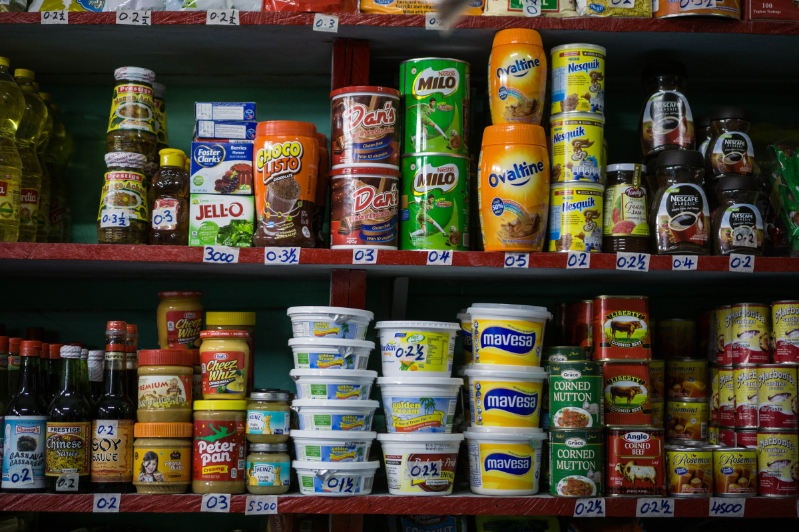 *In some villages’ convenience stores label the price of basic products in grams of gold.*

> Gold is often mined illegally in Guyana and Suriname, but does not share the violence that surrounds mining in Venezuela

Gold is often mined illegally in Guyana and Suriname, but does not share the violence that surrounds mining in Venezuela, where illegal mines are controlled by corrupt army officials, organized crime syndicates, and Colombian rebel groups. The gold industry in Venezuela is rife with human rights abuses and environmental violations, and since the creation of the Orinoco Mining Arc in 2016, a112,000-square-kilometer area in Venezuela destined for mining development, Venezuelan gold has faced increasing international pressure.

**The Orinoco Minning Arc**
<iframe height="480" src="https://infoamazonia.org/pt/embed/?map_only=1&map_id=17448&width=960&height=480"></iframe>

\>\> **In March 2019**, the United States Treasury Department’s Office of Foreign Assets Control (OFAC) sanctioned state mining company Minerven and its director, arguing that the gold sector gives the “Maduro regime” a lifeline to stay in power. “We will aggressively pursue those involved with Maduro’s reckless illicit gold trade which is contributing to this financial, humanitarian, and environmental crisis,” U.S. Treasury Secretary Steven Mnuchin said in [a statement](https://home.treasury.gov-/news/press-releases/sm631).

\>\> **In July 2020**, the European Parliament called for an immediate ban on the trade and circulation of Venezuelan gold. “\[T]his so-called blood gold is extracted and exploited at the expense of human rights and the environment under illegal and criminal conditions which seriously threaten both,” [the resolution said](https://www.europarl.europa.eu/doceo/document/TA-9-2020-0193_EN.html).

\>\> **Also in July 2020**, the United Nations Human Rights Office published [a report](https://www.ohchr.org/EN/HRBodies/HRC/RegulSession44/Documents/A_HRC_44_54.pdf) condemning criminal activities and grave human rights abuses in Venezuelan mining regions. “Authorities should take immediate steps to end labour and sexual exploitation, child labour and human trafficking, and should dismantle criminal groups controlling mining activities. They must also investigate, prosecute and punish those responsible for human rights violations, abuses and crimes,” Michelle Bachelet, U.N. High Commissioner for Human Rights, said in [a statement](https://news.un.org/en/story/2020/07/1068391).

Venezuela exports some gold to the refineries of its political and commercial allies, in countries such as Turkey, Iran, and the United Arab Emirates. Buyers in Europe and North America try to avoid tainted Venezuelan gold to protect their public image and to prevent a political fall-out.

> The tainted gold leaves the refineries in glittering bars stamped with their logos, and is sold to international corporations that incorporate the precious metal in our phones, computers, cars, and other technologies.

In 2019, the Trump administration went so far as to ban U.S. corporations from purchasing Venezuelan gold. But knowingly or unknowingly, Venezuelan gold may still run through their facilities after being laundered through Guyana, Suriname, and other gold-producing and transit countries in Latin America. From these countries, the tainted gold goes to international gold refiners. There, the gold is processed into glittering bars, stamped with the refiners’ logos, and sold to international corporations that incorporate the precious metal in our phones, computers, cars, and other technologies.

International prohibitions and sanctions have pushed the Venezuelan gold trade further into the hands of criminal actors, increased illicit revenues, and made it very hard to trace the origin, according to experts and Venezuelans involved in the gold trade. “The American government has to put together a strategy, because the more they close the door, the profit margin is greater for [the Maduro government],” one of the traffickers says.

---

One previously unknown route over which Venezuelan gold is trafficked is through Guyana. The former British colony is both a transit and destination country, where traffickers and international gold traders funnel the illegal gold into Guyana’s supply chain with false paperwork.

The gold enters Guyana by land, by river, and by air. Small quantities are moved by Venezuelan refugees that arrive from mining regions in Bolívar state and bring a few grams of gold with them instead of cash savings.

One Venezuelan woman claims that at the boat terminal of San Félix in southern Venezuela, the Venezuelan National Guard humiliates both men and women by forcing them to strip naked, bend over, and jump while squatting, to check for hidden bags with a few grams of gold. Many Venezuelan women, often refugees and single mothers, end up being sexually exploited in Guyana’s mining regions, where they are paid in gold.

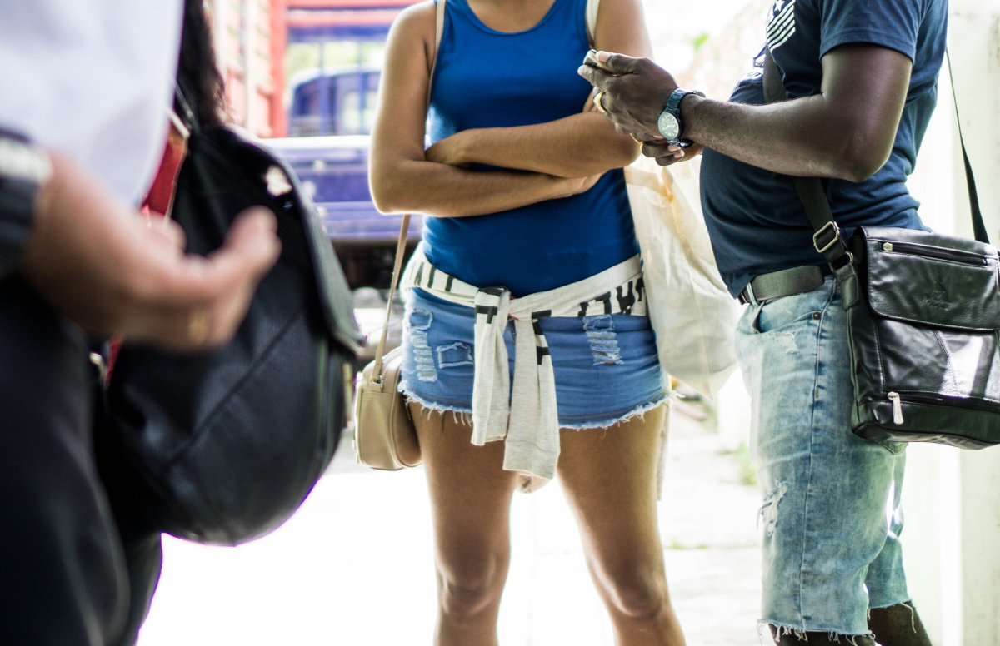 *Venezuelan refugees arrive from mining regions in Bolívar state and bring a few grams of gold with them instead of cash savings.*

But the amounts brought by refugees and migrants do not compete with the bigger players in the market, who move hundreds of kilograms of tainted gold.

A Guyanese gold dealer, who agreed to an interview on the condition of anonymity, admits to buying Venezuelan gold, and also claims that it’s brought into Guyana on clandestine jungle airstrips. According to the dealer, small planes fly from Venezuela to border areas in Guyana twice a month, carrying about 200 kilograms of gold on each flight. “We did come across planes and illegal airstrips in Guyana,” says Sam Sittlington, former advisor to Guyana’s Special Organized Crime Unit (SOCU).

<Video url="https://youtube.com/embed/667YSC2CFRc" />

Since the beginning of the economic and humanitarian crisis in Venezuela in 2013, hyperinflation in the country has spiraled out of control. Cash-strapped Venezuelan traders offer the gold at discount prices, sometimes at 40 percent under the market rate, to obtain foreign currencies. “There is no paperwork that comes with the gold,” says the
Guyanese gold dealer. “They’re so hungry for the U.S. dollar, and that is why they can afford to give 200 kilos on credit.”

Traffickers also bring Venezuelan gold into Guyana by way of Brazil. The Guyanese dealer claims that until recently, about 150 kilograms a week were trafficked into Guyana through the border down of Lethem, and then put on direct flights to Georgetown, the capital city on the coast.

Cash is taken back across the border into Venezuela or Brazil by couriers, according to various sources, including a foreign intelligence officer and the Guyanese gold trader, who both requested anonymity to speak freely. The border-hopping cash couriers carry millions in U.S. dollars, British Pounds, or Euros at a time. “Even if customs seized the money, they would return it back to the couriers within a couple of days,” Sittlington says.

> “There is no paperwork that comes with gold," says the guyanese gold dealer

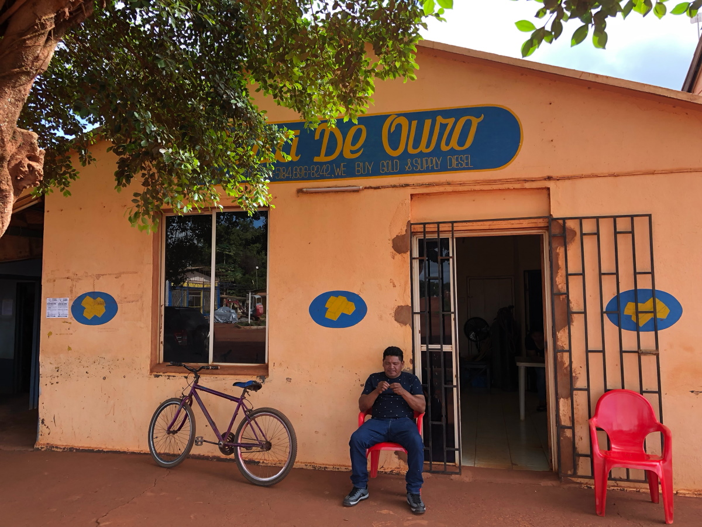 *Tens of kilos of gold have been trafficked into Guyana, a week, through border town Lethem.*

The couriers on the Brazilian border, often young students from Boa Vista, bring cash into Brazil as many as three times a week, according to the foreign intelligence officer. “They use very young guys and they pay $50 USD to bring it,” he says.

The total amount of Venezuelan gold moving through Guyana is unknown, but it’s clear that a portion ends up in the hands of some of Guyana’s main gold exporters, according to high-ranking sources working for the state, who spoke on the condition of anonymity. One mining expert, who has been aware of Venezuelan gold arriving in Guyana since 2018, believes that all of Guyana’s gold exporters are involved. “It's not difficult to transport from Venezuela to Georgetown,"
he says.

> “We have been receiving reports that we have dealers purchasing gold coming in from Venezuela,” says Eondrene Thompson, the Guyana Gold Board (GGB) general manager.

The Guyana Gold Board, which oversees the refining and export of gold in the country, is aware that Venezuelan gold may be leaching into the country's supply chain, but so far they have not been able to put a stop to it. “We have been receiving reports that we have dealers purchasing gold coming in from Venezuela,” says Eondrene Thompson, the Guyana
Gold Board (GGB) general manager. She cautioned that the board has no physical evidence to prove that Venezuelan gold is trafficked into Guyana.

<Gallery>

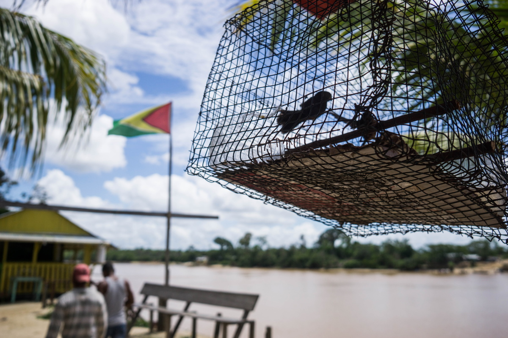 *It's not difficult to transport from Venezuela to Georgetown*

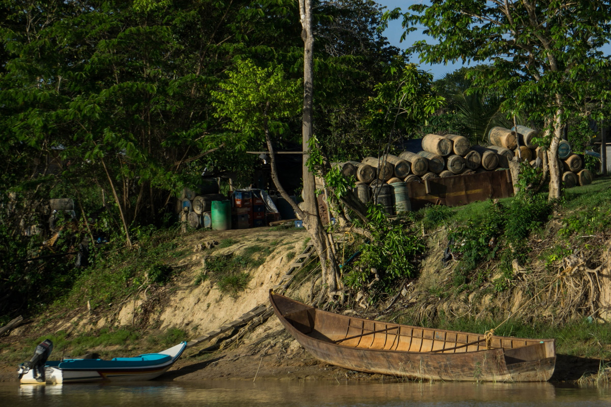

</Gallery>

But quantities of gold mined in Guyana differ from how much is actually declared and traded, according to Newell Dennison, head of the Guyana Geology and Mines Commission (GGMC). “The amount of gold that is declared to the GGB does not reconcile easily with the amount of gold that our officers from GGMC ascertain as being produced from the
operations on the ground,” he says. “We have had situations where the difference is troubling to us.”

Gold production in Guyana’s small-scale gold mines contracted in 2019, according to multiple sources, due to issues with access to fuel and decreasing public investments in the sector. Yet gold declarations by dealers and exporters rose in 2019, which could represent gold coming from illegal Guyanese mines, or gold trafficked into Guyana from other countries.

In the first five months of 2020, Guyanese gold dealers declared 940 kilograms more than the same period in 2019—a nearly 27 percent increase during the COVID-19 pandemic. The GGB has also found that miners register hotel addresses in Guyana’s interior, rather than mines, as places where they supposedly sourced their gold.

<Sidenote side="left">
	Gold dealers declared 940 kilograms more than the same period in 2019—a nearly 27 percent increase during the COVID-19 pandemic.
</Sidenote>

<iframe height="480" src="https://datawrapper.dwcdn.net/Dg0r7/2/"></iframe>

> Argor-Heraeus, for example, sells their gold to apple, Samsung, Microsoft, Phillip Morris, Ford and Tesla

Sources from within the sector, including gold traders, traffickers, and law enforcement, allege that at least two of Guyana’s licensed gold exporters—El Dorado Trading and Mohamed’s Trading, the country’s two largest private gold dealers—have purchased illicit Venezuelan gold. El Dorado Trading exports gold to Guardian International Gold Corp in
Canada, Tony Goetz in Belgium, and Argor-Heraeus in Switzerland. Mohamed’s Trading exports to Zee Gold DMCC in the United Arab Emirates.

Other companies, including several recognizable multinationals, then purchase the gold directly from these refineries. Argor-Heraeus, for example, sells their gold to Apple, Samsung, Microsoft, Phillip Morris, Ford, and Tesla. Tony Goetz’s clients include Sony, Starbucks, and Hewlett-Packard.

Sources familiar with the companies’ practices claim that Guyanese miners working in Venezuela bring the gold to Guyana and sell it to El Dorado Trading, and that both companies occasionally buy gold directly from Venezuelan criminals on the border, referred to as sindicatos or malandros.

El Dorado Trading denied allegations that the company has purchased Venezuelan gold, and Guardian International, Tony Goetz, and Argor-Heraeus all claimed that they had no reason to believe El Dorado had sold them Venezuelan gold. “Our own standards and the legal standards in Switzerland are amongst the strictest in the world and we are absolutely determined to follow them,” Argos-Heraeus’s head of communications wrote in an email.

Mohamed’s Trading did not respond to requests for comment.

One Venezuelan gold trafficker alleges that Mohammed’s Trading, owned by Nazar Mohamed, is buying gold from the Venezuelan regime’s military leadership. “Mohamed, that one, he is the tough one over there [in Guyana],” he says. “It’s him who is throwing dollars very hard at these people.” The trafficker claims that the military buys from the National Liberation Army (ELN) guerrillas near a mine called Corre Gente, in the Venezuelan Bolívar state. “There is an airstrip there,” he says.

> “From there, [the gold] illegally leaves for Guyana, they hand it over and bring dollars back.”

A source in a foreign intelligence service claims that Mohamed is the “main player” involved in trafficking illicit goods from Venezuela into Guyana, and then abroad. “[Mohamed] is buying Venezuelan gold, definitely he is the biggest buyer, no doubt about it. He is also trafficking cocaine and firearms from Venezuela,” explains the foreign intelligence officer, adding that the weapons are sold to clients in Suriname and the cocaine leaves for international markets.

The third party gold dealer also claims that the leadership at Mohamed and El Dorado Trading know about the companies’ involvement with Venezuelan gold. “They’re fully aware, because they have to put up the money up front for the purchase of U.S. currency in Guyanese dollars to pay for the gold, and they themselves will have their security sometimes fly into the bush, into the interior.” The gold dealer claims to have sold Venezuelan gold on one occasion to El Dorado Trading.

<Video url="https://youtube.com/embed/lpQ-zLmw6pE" />

The leadership at both companies appear to be connected to political elites in Guyana; both allegedly donated funds to both the ruling and former government party, and Mohamed reportedly donated an armored car to the new president, Irfaan Ali.

Tamesh Jagmohan, El Dorado Trading’s director, suggested that the allegations against the company “emanate from persons with ulterior motives. It is not uncommon in Guyana for certain private/public groupings to combine efforts to attack others for competitive,financial or political purposes.”

Regardless of the gold smuggling allegations against El Dorado Trading, Jagmohan himself has been investigated by the FBI for gold smuggling to the U.S. and he and his company are suspected of having laundered money for the terrorist organization Hezbollah. Jagmohan was stopped at the Miami airport in 2012 with 27 bars of gold he failed to declare. According to someone with knowledge of the investigation, he was fined $40,000 USD and had his visa revoked.

According to Sittlington, the SOCU has also found that individuals heavily adorned with gold jewelry smuggle gold on flights to markets in North America, such as Miami, and that bags containing gold have bypassed airport security: “In other words, there is corruption at the airport,” Sittlington adds. According to one government source, in late
2019, officials halted an El Dorado shipment of about 125 kilograms of gold ready to take-off to Barbados. The shipment aroused suspicions after officials identified irregularities with the seal and noticed that it was scheduled to leave from an airport that is not used for official gold transports.

> Individuals heavily adorned with gold jewelry smuggle gold on flights to markets in North America, such as Miami, and that bags containing gold have bypassed airport security:

Some of the gold is transited through Suriname, then brought to The Netherlands, sometimes on commercial KLM flights, before it’s taken to Belgium. KLM could not confirm or deny that it had transported gold shipments in the past due to the "sensitive nature of the shipments," but added that it decided in July 2019 to no longer transport Venezuelan
gold.

Besides trafficking Venezuelan gold, major gold buyers make hefty profits by using a different exchange rate for the U.S. Dollar than banks and the state, winning a few dollars on each gram of gold. More money is made through tax evasion. Miners sell their gold plus 8.5 percent in taxes, which El Dorado Trading and Mohamed’s Trading should pass on to the state. Oftentimes this does not happen, and the taxes paid by small-scale miners are pocketed by Guyana’s biggest gold exporters.

Despite officials’ knowledge of trafficking and tax evasion, they’ve been unable to put a stop to it. The foreign intelligence officer in Guyana complains that no legal cases can be built because of the deep corruption in Guyanese law enforcement. “The police force is part of the problem,” he says, “not part of the solution.”

---

Not all of the gold mined or trafficked into Guyana is directly sold to international refineries. The lawlessness and uncontrolled borders of the northern Amazon mean that much of that gold goes where taxes are lowest and foreign currencies are paid.

<Video url="https://youtube.com/embed/veX0nCa5ARQ" />

On the Guyanese banks of the Corentyne River lies a small town called Corriverton. Frequent boats ferry passengers and goods across the river to Suriname, offering ample opportunities to traffickers. Showtime*, a local criminal entrepreneur with a career in gold mining and trafficking, explains how contraband economies work in a nutshell. “All I know is to go to the interior and work, bring home the gold for my family,” Showtime says. “Now I realize that if I take that gold to Suriname, I’m going to get double the amount to look after my family. So I’m going to try to be creative enough to take my gold over there.”

> "If I take that gold to Suriname, I’m going to get double the amount to look after my family. So I’m going to try to be creative enough to take my gold over there.”

He is not alone. "The belief is that conservatively 35 to 45 percent of our gold production is smuggled out of the country, primarily to Suriname,” says Gabriel Lall, the former chairman of the GGB. “With the supposed Venezuelan gold surfacing [in Guyana], you add to that."

Until recently, Suriname was the most attractive country in the region to sell the precious metal: minimal tax and royalty collection on gold brought in miners from all across the Guiana Shield. Additionally, Surinamese gold shops often paid in U.S. dollars or Euros, while most—especially the smaller—Guyanese gold shops only offer GYD.

As the price of gold shot up over the last two years, gold shops in Suriname’s capital city of Paramaribo increased their revenues. Before the COVID-19 pandemic, some smaller and independent gold shops in the center of Paramaribo processed one or two kilograms a day and mainly bought small quantities from inland miners. But there were, and still are, bigger players on the market. One of the larger gold buyers with an export license claimed to have bought up to 50 kilograms a day, a market value of more than $3 million USD, from gold shops throughout the capital.

<Gallery>

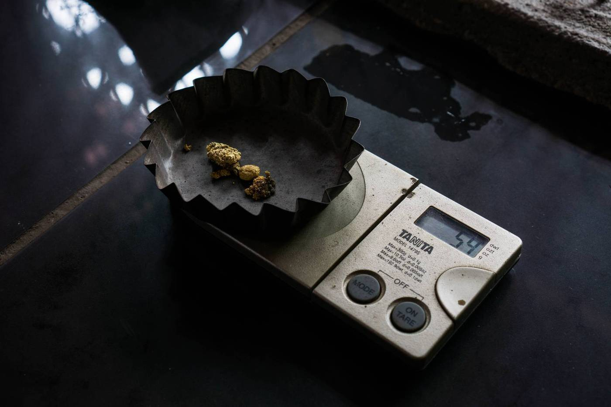 *As the price of gold shot up over the last two years, gold shops in Suriname’s capital city of Paramaribo increased their revenues.*

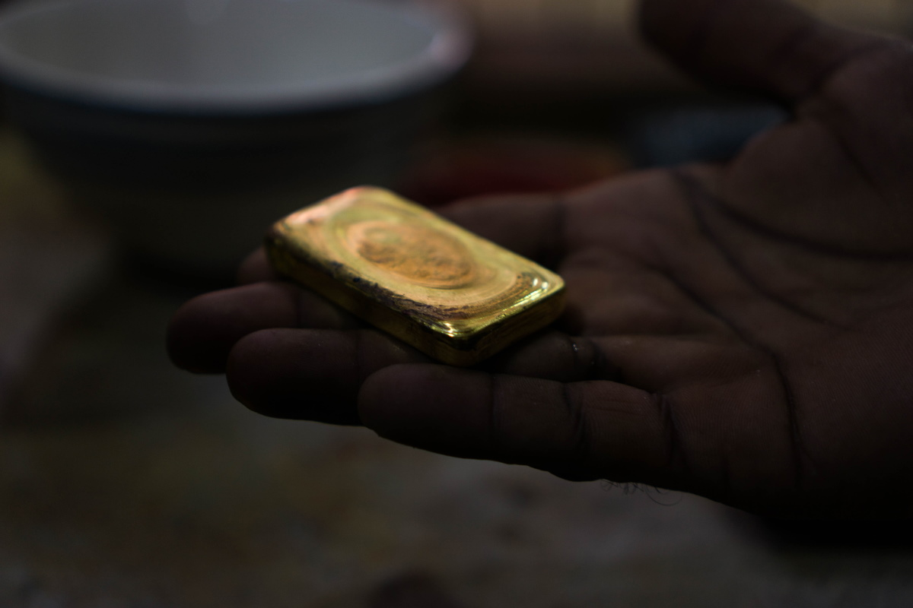

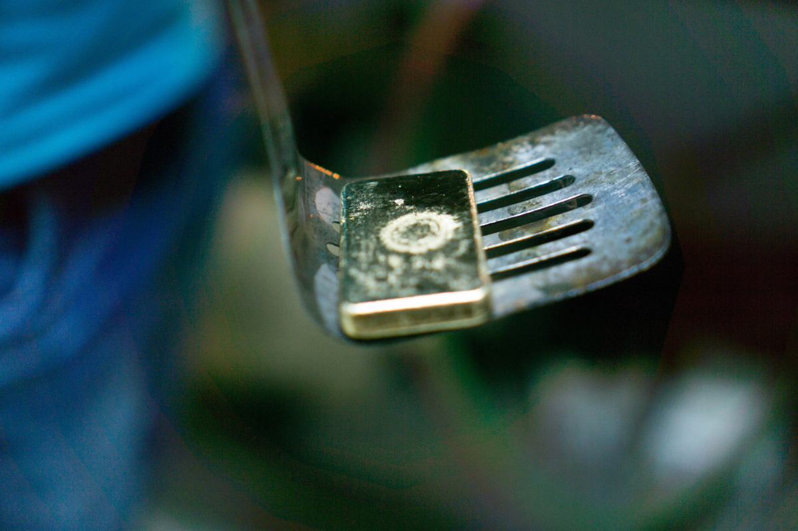

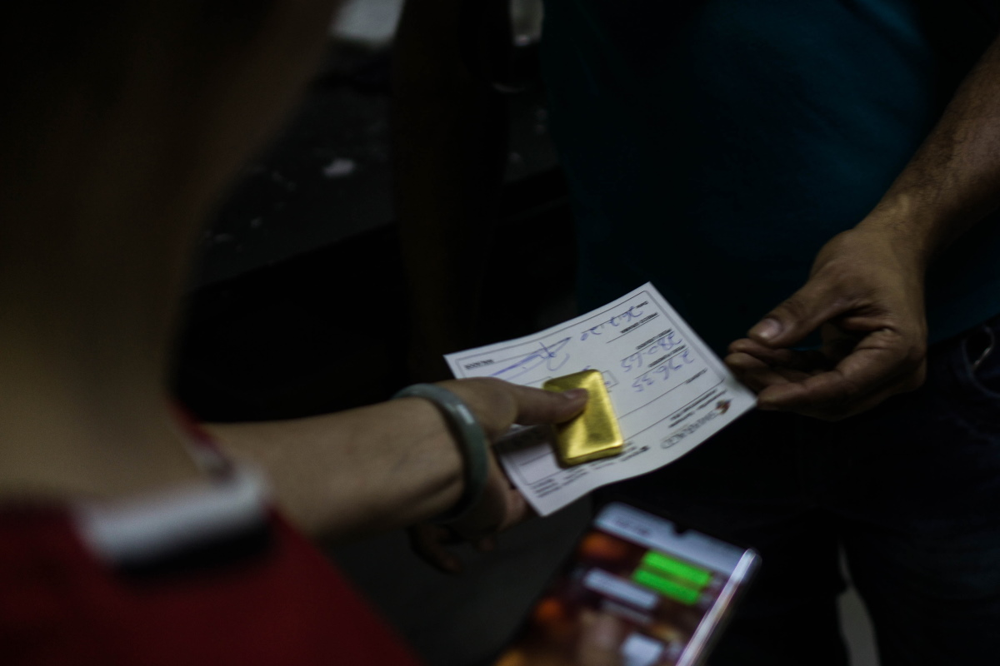

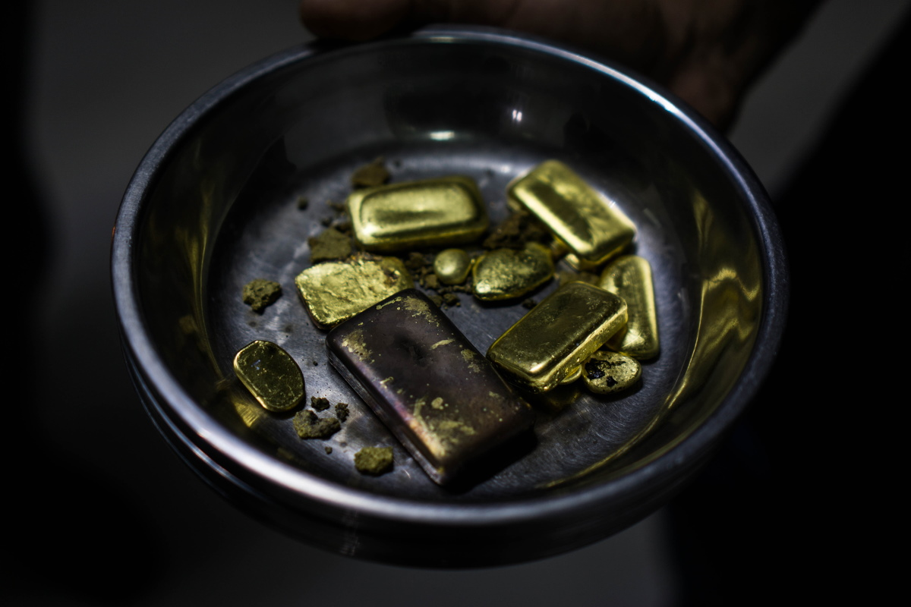

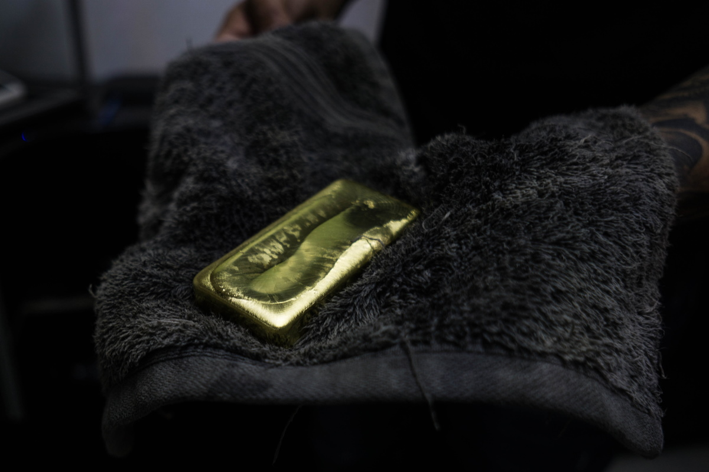

</Gallery>

Ourominas is one of the bigger gold buying chains in Suriname, with multiple storefronts in Paramaribo. Buyers like Ourominas aren't required to ask sellers for any sort of certification or papers of origin. In one of their shops in Paramaribo, an employee stated that the company does not demand for any paperwork to buy gold and therefore it is impossible to know if it was mined domestically or abroad.

“If it’s also Guyanese gold, we just don’t know that,” the employee says. At least 10 other gold shops in Paramaribo affirmed that the stores had no requirement nor process to find out where the gold has been mined. But some employees admitted to knowingly buying gold from neighbouring French-Guiana, Guyana, and even from the conflict-ridden Venezuelan mines.

One of the burners in a major gold shop, whose job is to burn the mercury off of the amalgams of gold and mercury that come from the mines, commented that a Venezuelan person enters once or twice a month to dispatch up to 30 kilograms of gold, but declined to provide any more information. A Venezuelan gold trafficker consulted for this report claims that traffickers use Suriname to launder illegally mined gold into the country’s legal supply chain.

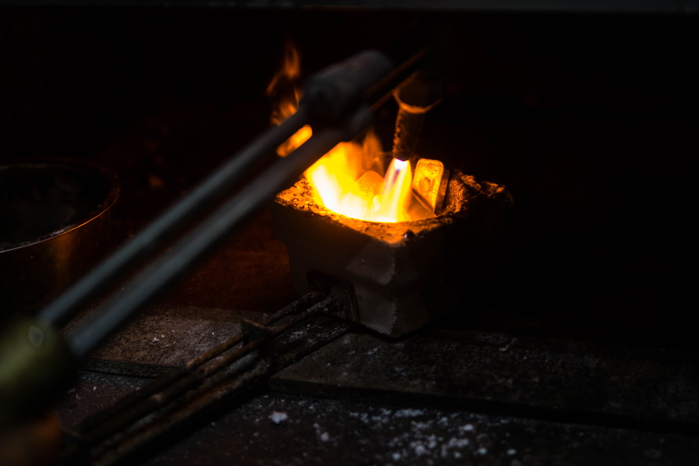*The job in a major gold shop is to burn the mercury off of the amalgams of gold and mercury that come from the mines*

Some of the gold shops sell gold to the international trader Kaloti Precious Metals, which has a refinery in Dubai, but the multinational also has a stake in the Kaloti Suriname Mint House (KSMH).

The KSMH, launched in 2015, smelts and analyses the gold, and then calculates the royalties that must be paid to Suriname's government. Most of the gold coming from Suriname’s small- and medium-scale mines has to pass through the KSMH, a joint venture between Kaloti's Dubai refinery, Surinamese business owners, and the state. Kaloti Precious Metals owns a majority stake in the operation, while Surinamese business owners own 30 percent, and the state owns just 10 percent.

The KSMH never actually owns the precious metal that comes through its doors, according to Ryan Tjon, the director of the KSMH. But Tjon confirms that Kaloti Dubai is one of the buyers of Surinamese gold. Kaloti considered building the Mint House in other countries in the Guiana Shield region, but ultimately chose Suriname due to its long-standing involvement with the country's gold industry. Kaloti's Dubai refinery has imported gold from Suriname since the 1990s.

The Mint House was supposed to turn Suriname into a "competitive bullion trading hub and center of excellence for the precious metals industry," [according to Munir Kaloti](http://www.kalotipm.com/Media-Center-PressReleases-Details/7/KALOTI-OPENS-SURINAMES-FIRST-GOLD-REFINERY), the chairman of Kaloti Precious Metals. The KSMH has a yearly processing capacity of 60,000 kilos of gold—much higher than Suriname’s national annual gold production. Its goal was always to process gold from all of the Guiana Shield countries, but the government failed to promote gold imports from its neighbors and the project has yet to turn a profit.

In 2019, the KSMH processed between 15,000 and 20,000 kilograms of gold, according to Tjon. In theory, that's most of the gold that the country's twelve exporters bought from either small-scale mining operations or from the country's numerous gold shops. But in practice, there are no guarantees that the gold these license holders send to the refinery before exporting is actually mined in Suriname. “It would be very difficult to say where it came from,” Tjon says.

The KSMH is in the position to deny gold if irregularities present themselves; for example, if unusual amounts of gold are moved through the Mint House. Nevertheless, this has not happened in the three years that Tjon has directed the company. The Mint House director is aware that gold trafficking is an issue, “but we are not the ones, the agency, to investigate where the gold actually comes from,” he says. “We are not a police officer.” Instead, the refinery relies on exporters to do their due diligence. If an exporter indicates that it’s Surinamese gold, the KMHS takes it in good faith, according to Tjon.

> “We are not a police officer.” Instead, the refinery relies on exporters to do their due diligence

A lack of oversight at every stage, from the smallest gold shop to the KSMH, has allowed traffickers to launder illegally mined gold into Suriname's legal supply chain. But one reason it’s so hard for authorities to crack down on the illicit trade is that, much like the mercury trade, the trafficking networks for illegally mined gold are always in flux.

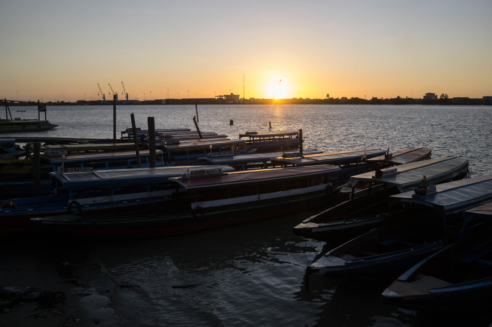 *Paramaribo, the Surinamese capital is suffering from the economic crisis since early 2020.*

Suriname’s economy took a deep dive after the outgoing Desi Bouterse government raided the Central Bank in February and restricted foreign exchange rates, causing a steep surge in inflation and the economy to nearly collapse. As a consequence of the ongoing economic disaster, foreign currencies became scarce and the Surinamese Dollar quickly lost value.

Some Paramaribo gold shops now only pay in Surinamese currency, according to one local gold miner, or charge an extra 10 percent for payments in USD. A more expensive exchange rate for the Euro or USD is applied in Suriname, leading to lower prices for gold, up to 20 percent less than the market price. Another trader claims that the recent changes have pushed the Surinamese gold trade back across the border. “Gold trafficking became attractive again in Suriname,” he says. “Our gold now goes to Guyana,” says another dealer, adding that those who are able to move gold across the border into Guyana can save thousands of U.S. dollars per kilogram.

The new administration in Suriname, headed by President Chan Santokhi, the former chief of police, has promised to reform the country’s gold mining sector, but the country’s new vice president, Ronnie Brunswijk, is a former rebel leader and drug trafficker, and a major player in Suriname’s gold industry, running several mines in the country’s interior. While it’s not unusual for political elites to have a stake in Suriname’s gold mining sector, it remains to be seen if the country can stamp out the black market while those who profit from it are in power.
