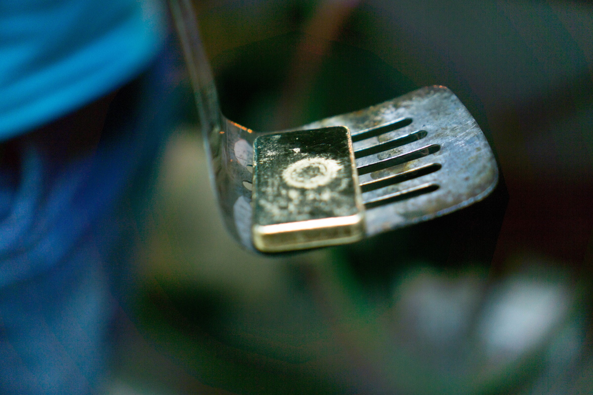
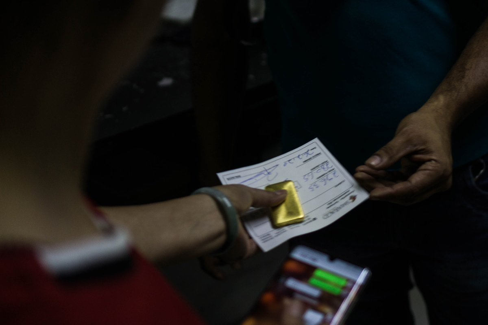
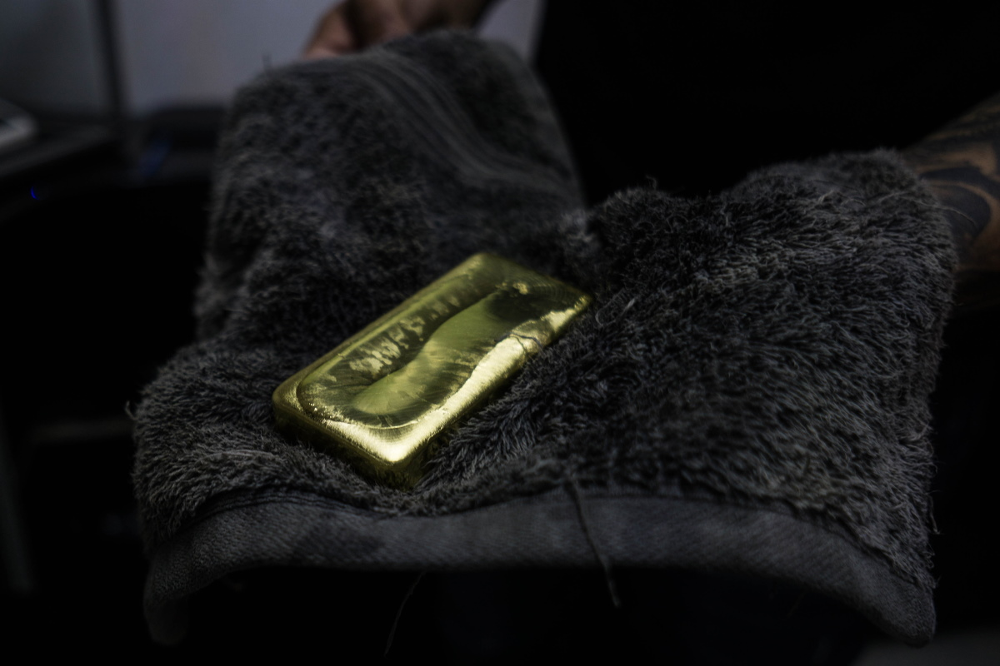
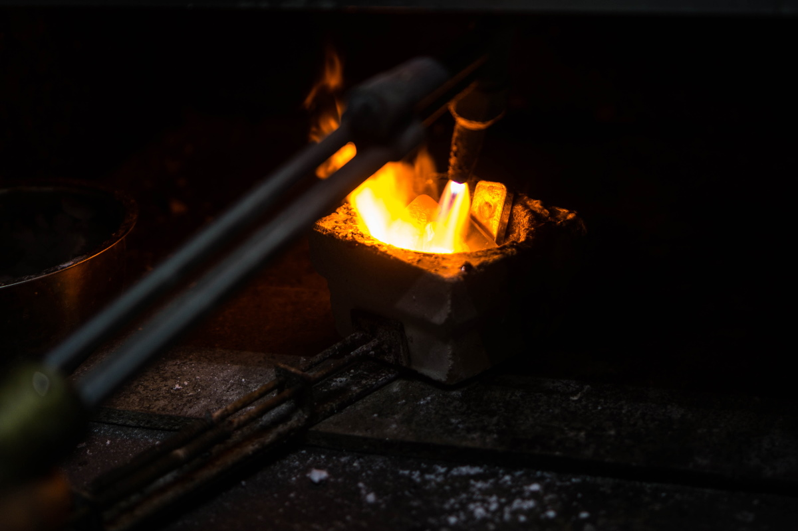

import Image from "!url-loader!../../images/ouro.jpg"

export const meta = {
  name: "gold",
  title: "Rastreando el oro contaminado",
  intro: "Una investigación de las redes de tráfico de mercurio en el Amazonas revela cómo el oro venezolano se blanquea en las cadenas de suministro legítimas y podría terminar en productos fabricados por las mayores corporaciones del mundo.",
  by: "Por Bram Ebus (texto y fotografía). Videos por Tom Laffay",
  image: Image
};

**La informalidad y la corrupción** prevalecen en la región del Escudo Guayanés, donde la minería ilegal de oro lubrica los motores de sus economías de selva. En Guyana -antigua Guayana Británica, al este de Venezuela- se observa a agentes de policía con collares y pulseras de oro aún más grandes que las que llevan los propios mineros y, en los minimercados de algunos pueblos, se etiqueta el precio de los productos básicos en gramos de oro.

El negocio es tan poderoso que alimenta una multimillonaria industria clandestina de mercurio. Una investigación sobre la dinámica del comercio formal e informal de mercurio en la región del Escudo Guayanés permitió comprobar a la vez que el oro extraído en Guyana, Surinam e, incluso, Venezuela, circula a lo largo de algunas de las mismas rutas de tráfico. Redes complejas mueven sus riquezas a través de las selvas interiores, por fronteras no supervisadas y los principales puertos del Océano Atlántico Norte.

El noreste del Amazonas se ha convertido en uno de los principales puntos de tránsito del oro venezolano ilegal, según aducen múltiples comerciantes de oro, traficantes y fuentes policiales. Aseguran que se trafica con él en toda la región y se le borran sus orígenes para terminar abriéndose camino a los mercados internacionales y hasta algunas de las mayores empresas multinacionales del mundo.

 *Las tiendas de conveniencia de algunos pueblos etiquetan el precio de los productos básicos en gramos de oro*

> El oro suele extraerse ilegalmente en Guyana y Surinam, pero no comparte el secreto y la violencia que envuelve a la minería en Venezuela

El oro suele extraerse de manera ilegal en Guyana y Surinam, pero esos lugares no comparten el secreto y la violencia que envuelven a la minería en Venezuela, donde las minas ilegales están controladas por oficiales del ejército corruptos, sindicatos del crimen organizado y grupos rebeldes colombianos. La industria del oro en Venezuela está plagada de abusos de los derechos humanos y violaciones del medio ambiente y, desde la creación del Arco Minero del Orinoco en 2016 -un área de 112.000 kilómetros cuadrados en Venezuela destinada al desarrollo minero-, el oro venezolano se ha enfrentado a una creciente presión internacional.

**El Arco Minero del Orinoco**
<iframe height="480" src="https://infoamazonia.org/pt/embed/?map_only=1&map_id=17448&width=960&height=480"></iframe>

\>\> **En marzo de 2019**, la Oficina de Control de Activos Extranjeros (Ofac, por sus iniciales en inglés) del Departamento del Tesoro de Estados Unidos sancionó a la empresa minera estatal venezolana Minerven y a su presidente, argumentando que el sector aurífero ofrece al “régimen de Maduro” una línea de salvamento para mantenerse en el poder. “Perseguiremos agresivamente a los involucrados en el insensato comercio ilícito de oro de Maduro que contribuye con esta crisis financiera, humanitaria y ambiental”, aseguró el Secretario del Tesoro estadounidense, Steven Mnuchin, en [una declaración](https://home.treasury.gov/news/press-releases/sm631).

\>\> **En julio de 2020**, el Parlamento Europeo pidió la prohibición inmediata del comercio y la circulación del oro venezolano. “El llamado oro de sangre se extrae y explota en circunstancias ilegales y criminales en detrimento de los derechos humanos y el medio ambiente”, [indica la resolución](https://www.europarl.europa.eu/doceo/document/TA-9-2020-0193_EN.html).

\>\> **Adicionalmente, en julio de 2020**, la Oficina de Derechos Humanos de las Naciones Unidas publicó [un informe](https://www.ohchr.org/EN/HRBodies/HRC/RegularSessions/Session44/Documents/A_HRC_44_54.pdf) que condena las actividades criminales y los graves abusos de los derechos humanos en las regiones mineras de Venezuela. “Las autoridades deben tomar medidas inmediatas para poner fin a la explotación laboral y sexual, al trabajo infantil y a la trata de personas, y deben desmantelar los grupos delictivos que controlan las actividades mineras. Asimismo, deben investigar, enjuiciar y castigar a los responsables de violaciones, abusos y crímenes en contra de los derechos humanos”, [declaró](https://news.un.org/en/story/2020/07/1068391) Michelle Bachelet, Alta Comisionada de las Naciones Unidas para los Derechos Humanos.

Venezuela exporta parte del oro a las refinerías de sus aliados políticos y comerciales en países como Turquía, Irán y los Emiratos Árabes Unidos. Los compradores en Europa y Norteamérica intentan evitar el sucio oro venezolano para proteger su imagen pública y evitar una repercusión política.

> El oro sucio sale de sus instalaciones en barras brillantes estampadas con sus logotipos y se vende a clientes internacionales

En 2019, el gobierno de Donald Trump llegó a prohibir a las empresas estadounidenses la compra de oro venezolano. Pero, ya sea con consciencia de ello o sin conocimiento, el oro venezolano sigue alcanzándolas después de que es lavado en Guyana, Surinam y otros países productores y de tránsito de oro en América Latina, y vendido a las refinerías de oro internacionales. El oro sucio sale de sus instalaciones en barras brillantes estampadas con sus logotipos y se vende a clientes internacionales, que incorporan el metal precioso a nuestros teléfonos, ordenadores, carros y otras tecnologías.

Las prohibiciones y sanciones internacionales han empujado con más fuerza el comercio del oro venezolano a las manos de actores criminales, lo que ha aumentado los ingresos ilícitos y dificultado el rastreo del origen, según afirman expertos y venezolanos involucrados en el comercio de oro. “El gobierno de Estados Unidos tiene que preparar una estrategia, porque cuanto más cierren la puerta, mayor será el margen de beneficios para [el gobierno de Maduro]”, dice uno de los traficantes.

---

Una ruta anteriormente desconocida, por la que se trafica con oro venezolano, corre a través de Guyana. La antigua colonia británica, vecino de Venezuela al este, es tanto un país de tránsito como de destino, donde traficantes y comerciantes internacionales canalizan el oro ilegal con documentos falsos hacia la cadena de suministro regular.

El oro entra a Guyana por tierra, río y aire. Pequeñas cantidades son trasladadas por refugiados venezolanos que llegan de las regiones mineras del estado Bolívar y traen consigo algunos gramos de oro en lugar de ahorros en efectivo.

Una mujer venezolana explica que antes de salir de la terminal de ferris y chalanas de San Félix, en el estado Bolívar, a orillas del río Orinoco, al sur de Venezuela, la Guardia Nacional venezolana humilla y obliga a hombres y mujeres a desnudarse, agacharse y saltar en cuclillas, en búsqueda de bolsas escondidas con unos gramos de oro. Muchas mujeres venezolanas, a menudo refugiadas y madres solteras, terminan siendo explotadas sexualmente en las regiones mineras de Guyana, donde se les paga con oro.

 *Muchas mujeres venezolanas, a menudo refugiadas y madres solteras, terminan siendo explotadas sexualmente en las regiones mineras de Guyana.*

Pero las cantidades que traen consigo los refugiados y migrantes no compiten con los grandes actores del mercado, quienes mueven cientos de kilogramos de oro sucio por vez.

Un comerciante de oro guyanés, que accedió a una entrevista con la condición de permanecer en el anonimato, admite haber comprado oro venezolano y también afirma que lo ha traído a Guyana por pistas de aterrizaje clandestinas en la selva. Según el traficante, aviones pequeños vuelan dos veces al mes de Venezuela a las zonas fronterizas de Guyana, transportando unos 200 kilos de oro en cada ocasión. “Nos encontramos con aviones y pistas de aterrizaje ilegales en Guyana”, dice Sam Sittlington, ex asesor de la Unidad Especial contra el Crimen Organizado de Guyana (Socu, por sus siglas en inglés).

<Video url="https://youtube.com/embed/667YSC2CFRc" />

Desde los inicios de la crisis económica y humanitaria en Venezuela en 2013, la hiperinflación en el país se ha disparado. Los comerciantes venezolanos que no disponen de efectivo ofrecen el oro a precios de descuento, a veces 40% por debajo de la tasa del mercado, con el fin de obtener divisas. “No hay  que hacer ningún papeleo con ese oro”, dice el comerciante de oro guyanés. “Están hambrientos de dólares, y por eso pueden permitirse dar 200 kilos a crédito”.

Los traficantes también llevan oro venezolano a Guyana a través de Brasil. El traficante guyanés afirma que, hasta hace poco, en Guyana se traficaban alrededor de diez kilos por semana a través de la frontera con Brasil por Lethem, en lo profundo de la selva en el alto río Esequibo, que luego enviaban en vuelos directos a Georgetown, la capital del país sobre la costa norte.

El dinero en efectivo se lleva a través de la frontera a Venezuela o a Brasil mediante transportistas ilegales, según afirman varias fuentes, incluyendo un oficial de inteligencia extranjero y un comerciante de oro de Guyana. Ambos solicitaron el anonimato para hablar libremente. Los transportistas ilegales de efectivo que cruzan de frontera a frontera llevan millones de dólares estadounidenses, libras esterlinas o euros, a la vez. “Incluso si la aduana incautara el dinero, lo devolvería a los transportistas ilegales en un par de días”, dice Sittlington.

> No hay ningún trámite con el oro”, dice el comerciante de oro guyanés

 *Centenas de kilos por semana son traficados en Guyana a través de la ciudad fronteriza de Lethem.*

Los transportistas ilegales, a menudo jóvenes estudiantes de Boa Vista -ciudad del estado brasileño de Roraima-, traen dinero en efectivo a Brasil hasta tres veces por semana, según el oficial de inteligencia extranjero. “Utilizan muchachos muy jóvenes y les pagan 50 dólares por traerlo”, asegura.

Se desconoce la cantidad total de oro venezolano que circula por Guyana, pero es evidente que una parte termina en manos de algunos de los principales exportadores de oro de Guyana, de acuerdo a fuentes gubernamentales de alto rango, que hablaron para este reportaje con la condición de permanecer en el anonimato. Un especialista en minería, familiarizado con la llegada del oro venezolano a Guyana desde 2018, cree que todos los exportadores de oro de Guyana están involucrados. “No es difícil transportarlo de Venezuela a Georgetown”, dice.

> “Hemos recibido informes de que tenemos comerciantes que compran oro proveniente de Venezuela”

La Junta de Oro de Guyana, que supervisa el refinado y la exportación de oro en el país, es consciente de que el oro venezolano puede estar filtrándose en la cadena de suministros del país pero, hasta ahora, no ha podido ponerle freno. “Hemos recibido informes de que tenemos comerciantes que compran oro proveniente de Venezuela”, dice Eondrene Thompson, gerente general de la Junta de Oro de Guyana (GGB, por sus siglas en inglés). Advirtió que, sin embargo, la junta no tiene pruebas físicas que demuestren que el oro venezolano se trafica en Guyana.

<Gallery>

 *It's not difficult to transport from Venezuela to Georgetown*

</Gallery>

Sin embargo, de acuerdo con Newell Dennison, comisionado de la Comisión de Geología y Minas de Guyana (GGMC, por sus siglas en inglés), las cantidades de oro extraído en Guyana difieren de la cantidad efectivamente declarada y comercializada. “La cantidad de oro que se declara a la GGB no se concilia fácilmente con la cantidad de oro que nuestros funcionarios de la GGMC determinan que se produce a partir de las operaciones in situ", dice. “Nos hemos encontrado con situaciones en las que la diferencia es alarmante”.

La producción de oro en las minas de menores dimensiones de Guyana se contrajo en el 2019, según múltiples fuentes, debido a problemas de acceso al combustible y a la reducción de las inversiones públicas en el sector. No obstante, las declaraciones de oro de los comerciantes y exportadores aumentaron en el 2019, lo que podría representar el oro procedente de minas ilegales de Guyana, o el oro traficado a través de Guyana desde otros países.

En los primeros cinco meses de 2020, los comerciantes de oro de Guyana declararon 940 kilos más que en el mismo período del 2019 -un aumento de casi 27% en medio de  la pandemia de la Covid-19-. La GGB también ha descubierto que los mineros registran las direcciones de los hoteles del interior de Guyana como el lugar de origen de donde supuestamente obtuvieron su oro, en vez de la dirección real de las minas.

<Sidenote side="left">
	Comerciantes de oro de Guyana declararon 940 kg más que en el mismo período del 2019 ―un aumento de casi el 27% durante la pandemia de la COVID-19
</Sidenote>

<iframe height="480" src="https://datawrapper.dwcdn.net/Dg0r7/2/"></iframe>

Fuentes del sector, incluidos comerciantes de oro, traficantes y organismos policiales, alegan que por lo menos dos de los exportadores de oro autorizados de Guyana, El Dorado Trading y Mohamed’s Trading, han comprado oro venezolano ilícito. El Dorado Trading exporta oro a Guardian International Gold Corp. en Canadá, Tony Goetz en Bélgica y Argor-Heraeus en Suiza. Mohamed’s Trading exporta a Zee Gold DMCC en los Emiratos Árabes Unidos.

Otras compañías, incluyendo varias multinacionales reconocidas, compran el oro directamente de estas refinerías. Argor-Heraeus, por ejemplo, vende su oro a Apple, Samsung, Microsoft, Phillip Morris, Ford y Tesla. Entre los clientes de Tony Goetz se encuentran Sony, Starbucks y Hewlett-Packard.

Fuentes familiarizadas con las prácticas de las empresas afirman que los mineros guyaneses que trabajan en Venezuela llevan el oro a Guyana y lo venden a El Dorado Trading y, en ocasiones, ambas empresas exportadoras compran oro directamente a delincuentes venezolanos, conocidos como malandros, en la frontera.

El Dorado Trading negó las acusaciones de que la empresa haya comprado oro venezolano, y Guardian International, Tony Goetz y Argor-Heraeus afirmaron que no tenían motivos para creer que El Dorado les hubiera vendido oro venezolano. "Nuestras propias normas y las normas legales en Suiza están entre las más estrictas del mundo y estamos absolutamente decididos a seguirlas", escribió el jefe de comunicaciones de Argos-Heraeus en un correo electrónico.

Mohamed's Trading no respondió a las solicitudes de comentarios.

Un traficante de oro venezolano alega que Mohamed’s Trading, propiedad de Nazar Mohamed, está comprando oro a líderes militares del régimen venezolano. “Mohamed, ese es quien manda allí [en Guyana]”, dice. “Él es quien está lanzando dólares a diestra y siniestra a esta gente”.

> “Desde allí, [el oro] sale ilegalmente hacia Guyana, lo entregan y traen dólares”

El traficante afirma que los militares le compran el oro a la guerrilla colombiana del Ejército de Liberación Nacional (ELN) cerca de una mina llamada Corre Gente, en el estado Bolívar, en Venezuela. “Allí hay una pista de aterrizaje”, afirma. “Desde allí, [el oro] sale ilegalmente hacia Guyana, lo entregan y traen dólares”.

Una fuente de un servicio de inteligencia extranjero afirma que Mohamed es el “principal protagonista” involucrado en el tráfico de bienes ilícitos de Venezuela a Guyana y luego al extranjero. “[Mohamed] está comprando oro venezolano; definitivamente es el mayor comprador, no hay duda. También está traficando cocaína y armas de fuego desde Venezuela”, explica el oficial de inteligencia extranjero, y añade que las armas se venden a clientes en Surinam y la cocaína sale a los mercados internacionales.

El traficante de oro también afirma que los líderes de Mohamed y El Dorado Trading tienen conocimiento de la relación de las empresas con el oro venezolano. “Están plenamente conscientes, porque tienen que dar el dinero por adelantado para la compra de moneda estadounidense en dólares de Guyana para pagar el oro y, a veces, ellos mismos mandan su valor por avión a través de la selva, hacia el interior”. La fuente afirmó haber vendido en una ocasión oro venezolano a El Dorado Trading.

<Video url="https://youtube.com/embed/lpQ-zLmw6pE" />

Los dirigentes de ambas empresas parecen estar conectados con las élites políticas de Guyana; ambos habrían aportado fondos tanto al actual partido gobernante como al anterior, y Mohamed habría donado un vehículo blindado al nuevo presidente, Irfaan Ali.

Tamesh Jagmohan, director de El Dorado Trading, sugirió que las acusaciones contra la empresa "emanan de personas con motivos ocultos": “No es raro en Guyana que ciertas agrupaciones privadas o públicas combinen esfuerzos para atacar a otras con fines competitivos, financieros o políticos", completa.

Independientemente de las acusaciones de contrabando de oro contra El Dorado Trading, el propio Jagmohan ha sido investigado por el la Oficina Federal de Investigaciones (FBI, por sus siglas en inglés) por contrabando de oro a Estados Unidos, y se sospecha que él y su compañía han lavado dinero para la organización terrorista libanesa Hezbollah. Jagmohan fue detenido en el aeropuerto de Miami en 2012 con 27 lingotes de oro que no declaró. Según una persona con conocimiento de la investigación, se le impuso una multa de 40.000 dólares y se le revocó la visa.

Según Sittlington, la Socu también ha descubierto que personas muy adornadas con joyas pasan oro de contrabando en vuelos a mercados de América del Norte, como Miami, y que las bolsas que contienen oro traspasan la seguridad del aeropuerto: "En otras palabras, hay corrupción en el aeropuerto", añade Sittlington. Según una fuente del gobierno, a finales de 2019, las autoridades detuvieron un envío de El Dorado de unos 125 kilogramos de oro listo para despegar hacia Barbados. El cargamento despertó sospechas después de que los funcionarios identificaron irregularidades con el sello y notaron que estaba previsto que saliera de un aeropuerto que no se utiliza para transportes oficiales de oro.

Parte del oro pasa por Surinam y luego se lleva a los Países Bajos, a veces en vuelos comerciales de KLM, antes de ser trasladado a Bélgica. KLM no pudo confirmar ni negar que había transportado oro en el pasado debido a la "naturaleza sensible de los envíos", pero añadió que en julio de 2019 decidió dejar de transportar oro venezolano.

Además de traficar con oro venezolano, los principales compradores de oro obtienen grandes beneficios utilizando para el dólar estadounidense un tipo de cambio diferente al de los bancos y el Estado, ganando unos pocos dólares por cada gramo de oro. También se gana más dinero a través de la evasión de impuestos. Los mineros venden su oro con un cargo por impuestos de 8,5 por ciento, que El Dorado Trading y Mohamed's Trading deben pagar al Estado. A menudo esto no sucede, y los impuestos pagados por los pequeños mineros se los quedan los mayores exportadores de oro de Guyana.

A pesar de que los funcionarios tienen conocimiento del tráfico y la evasión fiscal, no han podido ponerle fin. El oficial de inteligencia extranjera en Guyana se queja de que no se pueden construir casos legales debido a la profunda corrupción de las fuerzas del orden de Guyana. "La fuerza policial es parte del problema", dice, "no parte de la solución".

---

No todo el oro extraído o traficado en Guyana se vende directamente desde allí a refinerías internacionales. La anarquía y las fronteras sin supervisión del noreste de la cuenca amazónica permiten que gran parte de ese oro tenga todavía otra escala en lugares donde los impuestos son más bajos y donde se paga con divisas, como, por ejemplo, el vecino Surinam.

<Video url="https://youtube.com/embed/veX0nCa5ARQ" />

Sobre la ribera occidental del río Courantyne, que sirve de frontera entre Guyana y Surinam, se encuentra un pueblo pequeño llamado Corriverton. Desde allí, ferris transportan con frecuencia pasajeros y mercancía a través del río hasta Surinam, ofreciendo amplias oportunidades a los traficantes. Showtime (un seudónimo), comerciante ilegal de la localidad con trayectoria en la minería y el tráfico de oro, explica en pocas palabras cómo funcionan las economías de contrabando. “Todo lo que sé hacer es ir al interior, trabajar y llevar a casa el oro para mi familia”, dice Showtime. "Ahora me doy cuenta de que, si llevo ese oro a Surinam, voy a recibir el doble de dinero para mantener a mi familia. Así que voy a tratar de ser lo suficientemente creativo para llevar mi oro hasta allá”.

> "si llevo ese oro a Surinam, voy a recibir el doble de dinero para mantener a mi familia"

No es el único. “Se cree que, calculando por lo bajo, de 35% a 45% de nuestra producción de oro sale del país por contrabando, principalmente hacia Surinam”, dice Gabriel Lall, ex presidente de la GGB. “Y a eso le sumamos el supuesto oro venezolano que aparece [en Guyana]”.

Hasta hace poco, Surinam era el país más atractivo de la región para vender el metal precioso, con bajas tasas de regalías y ausencia de impuestos sobre el oro traído por los mineros de todo el Escudo Guayanés. Además, las tiendas de oro de Surinam solían pagar en dólares estadounidenses o euros, mientras que la mayoría de las tiendas de oro de Guyana, especialmente las más pequeñas, solo ofrecen la moneda local, el dólar guyanés.

A medida que el precio del metal se disparaba en los dos últimos años, las tiendas de oro brotaron como hongos por toda Paramaribo, la capital de Surinam, antigua Guayana Neerlandesa. Algunas tiendas de oro más pequeñas e independientes en el centro de la ciudad procesan uno o dos kilos al día y compran principalmente pequeñas cantidades a los mineros del interior. Sin embargo, hay participantes más grandes en el mercado. Uno de los mayores compradores de oro con licencia de exportación afirma que compra hasta 50 kilos por día a las tiendas de oro de toda la capital, un valor de mercado de más de tres millones de dólares.

<Gallery>

 *A medida que el precio del oro se disparaba en los dos últimos años, las tiendas de oro aparecieron como hongos por toda Paramaribo.*

</Gallery>

Ourominas es una de las mayores cadenas de compra de oro en Surinam, con múltiples tiendas en Paramaribo. Los compradores como Ourominas no están obligados a pedir a los vendedores ningún tipo de certificación o documentos de origen. En una de sus tiendas en Paramaribo, un empleado declaró que la empresa no exige ningún tipo de documentación para comprar oro y, por lo tanto, es imposible saber si fue extraído en el país o en el extranjero.

“Si es oro guyanés, tampoco lo sabemos”, dice el empleado. Por lo menos en otras diez tiendas de oro en Paramaribo ratificaron que no tenían ningún requisito ni proceso para averiguar de dónde proviene el oro, pero algunos empleados admitieron haber comprado con conocimiento oro de la vecina Guayana Francesa -al este-, de Guyana -al oeste-, e incluso de minas venezolanas.

Uno de los quemadores de una importante tienda de oro, cuyo trabajo es quemar el mercurio de las amalgamas de oro y mercurio que provienen de las minas, comentó que un venezolano entra una o dos veces al mes para despachar hasta 30 kilos de oro, pero se negó a dar más información. Un traficante de oro venezolano consultado para este informe afirma que los traficantes lavan el oro extraído ilegalmente de Venezuela, incorporándolo a la cadena de suministros legal de Surinam.

Algunas tiendas venden su oro al comerciante internacional de oro Kaloti Precious Metals, que tiene su refinería principal en Dubai, en Emiratos Árabes Unidos. Pero la multinacional también tiene una participación en la Casa de la Moneda de Kaloti Surinam (KMHS, por sus siglas en inglés).

La KMHS, inaugurada en 2015, funde y analiza el oro, y luego calcula las regalías que deben pagarse al gobierno de Surinam. Gran parte del oro proveniente de las pequeñas y medianas minas del interior de Surinam tiene que pasar por la KMHS, una empresa conjunta entre la refinería de Kaloti en Dubai, los comerciantes locales y el Estado de Surinam. Kaloti Precious Metals posee una participación mayoritaria en la operación, mientras que los comerciantes de Surinam poseen 30% y el Estado apenas 10%.

La KMHS nunca ha sido propietaria del metal precioso que entra por sus puertas, según su director, Ryan Tjon, pero sí monitorea a los compradores, y Tjon confirma que Kaloti Dubai es uno de los compradores de oro de Surinam. Kaloti consideró la construcción de esta industria en otros países de la región del Escudo Guayanés, pero finalmente eligió Surinam debido a su larga participación en la industria aurífera del país. La refinería de Kaloti en Dubai ha importado oro de Surinam desde la década de 1990.

La Casa de la Moneda debía convertir a Surinam en un “competitivo centro de comercio de lingotes de oro y un centro de excelencia para la industria de metales preciosos", [de acuerdo con Munir Kaloti](http://www.kalotipm.com/Media-Center-PressReleases-Details/7/KALOTI-OPENS-SURINAMES-FIRST-GOLD-REFINERY), presidente de Kaloti Precious Metals. La KMHS tiene una capacidad de procesamiento de 60.000 kilos de oro al año, un volumen mucho mayor que la producción anual de oro de Surinam. Su objetivo fue desde el inicio procesar el oro de todos los países del Escudo Guayanés, pero el gobierno no promovió la importación de oro de sus vecinos y el proyecto aún no ha generado ganancias.

En 2019, la KMHS procesó entre 15.000 y 20.000 kilos de oro, según Tjon. En teoría, esa es la mayoría del oro de Surinam que los doce exportadores del país compraron en operaciones de minería a pequeña escala o en las numerosas tiendas de oro del país. Pero, en la práctica, no hay garantías de que el oro que estos licenciatarios envían a la refinería antes de exportarlo realmente se extraiga en Surinam. “Sería muy difícil decir de dónde proviene”, declara Tjon.

La KMHS está en posición de rechazar oro si se presentan irregularidades, como, por ejemplo, si se mueven cantidades inusuales de oro a través de la Casa de la Moneda. Sin embargo, esto no ha sucedido en los tres años que Tjon ha dirigido la compañía. El director de la Casa de la Moneda es consciente de que el tráfico de oro es un problema, “pero nosotros, la agencia, no somos los que investigamos de dónde viene realmente el oro”, dice: “No somos un oficial de policía”. De acuerdo con Tjon, la refinería prefiere confiar en que los exportadores actúen con la debida diligencia. Si un exportador declara que es oro de Surinam, la KMHS lo acepta de buena fe.

> “No somos un oficial de policía”. De acuerdo con Tjon, la refinería más bien confía en que los exportadores actúen con la debida diligencia.

La falta de supervisión en todas las etapas, desde la tienda de oro más pequeña hasta la refinería con participación estatal, ha permitido a los traficantes lavar el oro, extraído ilegalmente, dentro de la cadena de suministros legal de Surinam. Pero una de las razones por las que es tan difícil para las autoridades tomar medidas drásticas contra el comercio ilícito es que, al igual que ocurre con el comercio de mercurio, las redes de tráfico de oro extraído ilegalmente están en continuo movimiento.

 *Paramaribo. La capital de Surinam está sufriendo la crisis económica.*

La economía de Surinam se desplomó después de que el gobierno saliente de Desi Bouterse allanara en febrero el Banco Central y restringiera los tipos de cambio, lo que generó un pronunciado incremento de la inflación y llevó la economía al punto del colapso. Como consecuencia del desastre económico en curso, las monedas extranjeras comenzaron a ser escasas y el dólar de Surinam perdió rápidamente su valor.

Algunas tiendas de oro de Paramaribo ahora sólo pagan en moneda surinamesa, según un minero de oro local, o  cargan 10% de comisión por los pagos en dólares estadounidenses. En Surinam se aplica un tipo de cambio más caro para el euro o el dólar estadounidense, lo que hace que los precios del oro sean ahora más bajos, hasta 20% menos que el precio previo de mercado.

Otro comerciante afirma que esos cambios recientes han cambiado la dirección del comercio de oro de Surinam a través de la frontera. "El tráfico de oro se volvió atractivo de nuevo en Surinam", dice. "Pero ahora nuestro oro va a Guyana", dice otro comerciante, añadiendo que aquellos que son capaces de mover oro a través de la frontera hacia Guyana pueden ahorrar miles de dólares por kilogramo.

El nuevo gobierno de Surinam, liderado por el presidente Chan Santokhi, ex comisario de policía, ha prometido reformar el sector de minería de oro del país, pero el nuevo vicepresidente del país, Ronnie Brunswijk, es un antiguo líder del grupo rebelde de la selva y narcotraficante, y uno de los principales actores de la industria del oro de Surinam, quien dirige varias minas en el interior del país. Si bien no es inusual que las élites políticas tengan una participación en el sector de la minería de oro de Surinam, queda por ver si el país puede acabar con el mercado negro mientras los que se benefician de él están en el poder.
