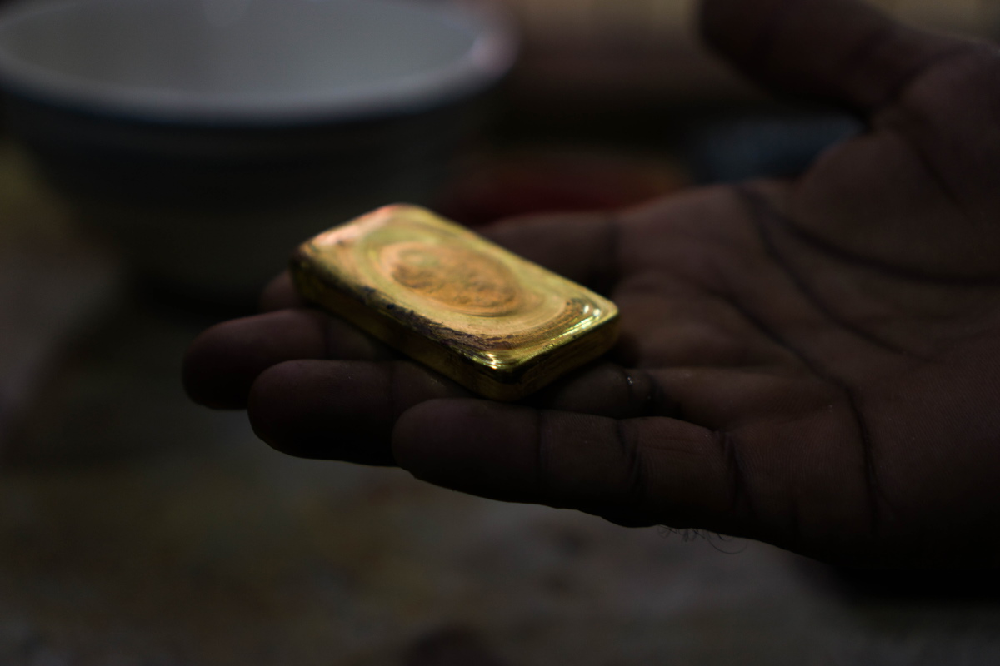
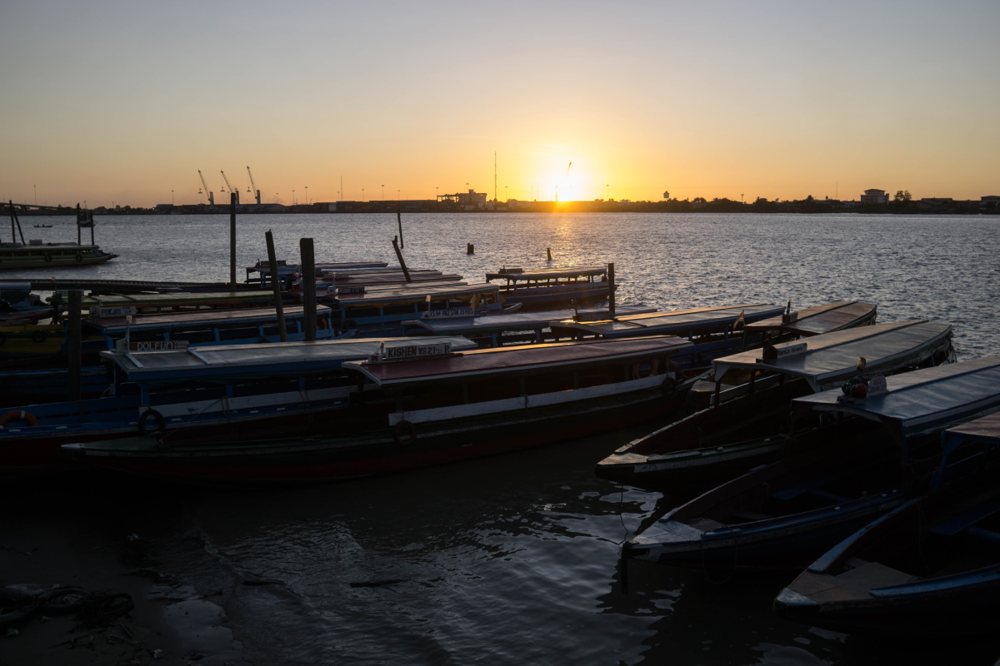

import Image from "!url-loader!../../images/ouro.jpg"

export const meta = {
  name: "gold",
  title: "Rastreando o ouro contaminado",
  intro: "Uma investigação das redes de tráfico de mercúrio na Amazônia revela como o ouro venezuelano é lavado em cadeias de abastecimento legítimas e pode acabar em produtos fabricados pelas maiores corporações do mundo.",
  by: "por Bram Ebus (texto e fotos). Vídeos por Tom Laffay",
  image: Image
};

**A informalidade e a corrupção prevalecem na região do Escudo das Guianas,** onde a mineração ilegal do ouro lubrifica as engrenagens da economia na selva. Na Guiana, policiais são vistos com colares e pulseiras de ouro maiores do que os dos próprios garimpeiros, e algumas lojas de conveniência das vilas tabelam o preço de produtos básicos em gramas de ouro.

A indústria é tão poderosa, que abastece uma sombria indústria multimilionária de mercúrio. Uma investigação sobre a dinâmica do comércio formal e informal do mercúrio na região do Escudo das Guianas revela que o ouro extraído na Guiana, no Suriname e até na Venezuela flui pelas mesmas rotas do tráfico. Redes complexas movimentam suas riquezas pelo interior das selvas, pelas fronteiras incontroláveis e pelos maiores portos do Atlântico Norte.

 *Algumas lojas de conveniência das aldeias rotulam o preço dos produtos básicos em gramas de ouro*

> O ouro é extraído de forma ilegal na Guiana e no Suriname, mas não compartilha da obscuridade e da violência presentes da Venezuela

O nordeste da Amazônia se tornou um dos pontos-chave para o transporte do ouro ilegal venezuelano, como alegam vários comerciantes, traficantes e fontes policiais. Segundo eles, o ouro é retirado das suas origens e traficado pela região, eventualmente entrando nos mercados internacionais e em algumas das maiores corporações multinacionais do mundo.

<iframe height="480" src="https://infoamazonia.org/pt/embed/?map_only=1&map_id=17448&width=960&height=480"></iframe>

O ouro é frequentemente extraído de forma ilegal na Guiana e no Suriname, mas não compartilha da obscuridade e da violência presentes na mineração da Venezuela, onde mineradoras ilegais são controladas por oficiais do exército corruptos, sindicatos do crime organizado e grupos rebeldes da Colômbia. A indústria do ouro na Venezuela está repleta de abusos aos direitos humanos e violações ambientais e, desde a criação do Arco Mineiro do Orinoco em 2016, em que 112.000 quilômetros quadrados foram destinados ao desenvolvimento da mineração na Venezuela, o ouro venezuelano tem enfrentando crescente pressão internacional.

\>\> **Em março de 2019**, o  Departamento do Tesouro do Office of Foreign Assets Control (OFAC), dos Estados Unidos, sancionou a companhia de mineração estadual Minerven e o seu president, argumentando que o setor do ouro dá ao "regime de Maduro" uma tábua de salvação para sua permanência no poder. "Nós iremos perseguir de forma agressiva aqueles envolvidos com o inconsequente comércio ilícito do ouro de Maduro, que está contribuindo para essa crise financeira, humanitária e do meio ambiente", [disse Steven Mnuchin, Secretário do Tesouro dos Estados Unidos](https://home.treasury.gov/news/press-releases/sm631).

\>\> **Em julho de 2020**, o Parlamento Europeu exigiu um veto imediato ao comércio e à circulação do ouro venezuelano. “O assim chamado ouro de sangue é extraído e explorado à custa dos direitos humanos e do meio ambiente, sob condições ilegais e criminosas, que ameaçam a ambos seriamente ", [diz a resolução](https://www.europarl.europa.eu/doceo/document/TA-9-2020-0193_EN.html).

\>\> **Também em julho de 2020**, o escritório de Direitos Humanos das Nações Unidas publicou [uma reportagem](https://www.ohchr.org/EN/HRBodies/HRC/RegularSessions/Session44/Documents/A_HRC_44_54.pdf) condenando as atividades criminosas e os graves abusos aos direitos humanos nas regiões mineradoras da Venezuela. "As autoridades deveriam tomar medidas imediatas para eliminar a exploração laboral e sexual, o trabalho infantil e o tráfico humano, e deveriam desmantelar grupos criminosos que controlam as atividades mineradoras. Eles também deveriam investigar, perseguir e punir aqueles responsáveis por violações, abusos e crimes contra os direitos humanos", disse em [uma declaração](https://news.un.org/en/story/2020/07/1068391) Michelle Bachelet, Alta-Comissária da ONU para os Direitos Humanos.

A Venezuela exporta um pouco de ouro para as refinarias dos seus aliados políticos e comerciais, em países como a Turquia, o Irã e os Emirados Árabes Unidos. Os compradores da Europa e da América do Norte tentam evitam o ouro sujo venezuelano, para proteger sua imagem pública e se precaver de uma discussão política.

> O ouro sujo sai das refinarias em barras cintilantes estampadas com seus logotipos e é vendido a clientes internacionais

Em 2019, a administração de Trump chegou a proibir as corporações dos Estados Unidos de comprarem ouro venezuelano. Mas, consciente ou inconscientemente, o ouro venezuelano pode ainda circular, depois de ser lavado na Guiana, no Suriname e em outros produtores de ouro e em países de trânsito na América Latina e vendido a refinarias de ouro internacionais. O ouro sujo sai das suas instalações em barras cintilantes estampadas com seus logotipos e é vendido a clientes internacionais,que incorporam o metal precioso nos nossos telefones, computadores, carros, e outras tecnologias.

As proibições e as sanções internacionais empurraram ainda mais o comércio do ouro venezuelano para as mãos de atores criminosos, aumentaram os faturamentos ilícitos, dificultando o rastreamento da sua origem, de acordo a especialistas venezuelanos envolvidos no comércio do ouro. "O governo americano precisa montar uma estratégia, porque, quanto mais fecham as portas, maior a margem de lucro para [o governo de Maduro]", diz um dos traficantes.

---

A Guiana é uma rota previamente desconhecida, por onde o ouro venezuelano é traficado. A ex-colônia britânica é tanto um país de trânsito como de destino, onde traficantes e comerciantes internacionais de ouro direcionam o ouro ilegal para a cadeia de abastecimento da Guiana, usando papelada falsa.

O ouro entra na Guiana por terra, pelo rio e pelo ar. Pequenas quantidades são deslocadas por refugiados venezuelanos, que chegam das regiões de mineração do estado bolivariano, trazendo alguns gramas de ouro, ao invés das suas economias em dinheiro.

Uma mulher venezuelana explica que, antes de deixar o terminal de barco de San Félix, no sul da Venezuela, a Guarda Nacional Venezuelana humilhou e forçou tanto homens como mulheres a se despirem, a se curvarem, a pularem de cócoras, além de procurar por bolsas escondidas com alguns gramas de ouro. Muitas mulheres venezuelanas, geralmente refugiadas e mães solteiras, terminam sendo exploradas sexualmente nas regiões
mineradoras da Guiana, onde são pagas em ouro.

> Muitas mulheres venezuelanas, geralmente refugiadas e mães solteiras, terminam sendo exploradas sexualmente nas regiões mineradoras da Guiana.

 *Refugiados venezuelanos chegam de regiões de mineração no estado de Bolívar e trazem algumas gramas de ouro com eles em vez de economias em dinheiro.*

Mas a quantidade trazida pelos refugiados e migrantes não pode competir com os grandes atores do mercado, que movimentam centenas de quilogramas de ouro sujo.

Um comerciante de ouro guianense, que concordou em dar entrevista sob a condição de anonimato, admite que compra ouro venezuelano. Também afirma que este chega à Guiana em pistas de pouso clandestinas na selva. De acordo com o comerciante, pequenos aviões voam da Venezuela para as áreas limítrofes na Guiana duas vezes por mês, carregando aproximadamente 200 quilogramas de ouro em cada voo. "Nós encontramos aviões e pistas de pouso ilegais na Guiana", disse Sam Sittington, ex-assessor da  Special Organized Crime Unit (SOCU) da Guiana.

<Video url="https://youtube.com/embed/667YSC2CFRc" />

Desde o início da crise econômica e humanitária na Venezuela em 2013, a hiperinflação do país saiu do controle. Comerciantes venezuelanos quebrados oferecem ouro com desconto, às vezes 40% abaixo do valor de mercado, para conseguir moedas estrangeiras. “Não existe papelada que acompanhe o ouro", diz o negociante de ouro guianense. “Eles estão tão famintos pelo dólar americano, que podem se permitir dar 200 quilos a crédito.”

Os traficantes também trazem ouro venezuelano à Guiana pelo Brasil. O traficante guianense afirma que, até recentemente, centenas de quilos eram traficados por semana à Guiana pela fronteira abaixo de Lethem, e então colocados em voos diretos à Georgetown, a capital no litoral.

O dinheiro é levado de volta pela fronteira da Venezuela ou do Brasil pelos mensageiros, de acordo com diversas fontes, incluindo o oficial de inteligência estrangeira e o comerciante de ouro guianense, que pedem anonimidade para falar abertamente. Os mensageiros de dinheiro que passam pela fronteira transportam milhões de dólares americanos, libras britânicas ou euros ao mesmo tempo. "Mesmo se a alfândega confiscar o dinheiro, eles o devolveriam aos mensageiros em alguns dias", diz Sittington.

> “Não existe papelada que acompanhe o ouro", diz o negociante de ouro guianense.

 *Centenas de quilos por semana são traficados para a Guiana através da cidade fronteiriça de Lethem*

Os mensageiros da fronteira brasileira, geralmente jovens estudantes de Boa Vista, trazem dinheiro ao Brasil em média três vezes por semana, de acordo com oficial de inteligência estrangeira. "Eles usam garotos bem jovens e pagam US$ 50 para trazê-lo", diz.

A quantia total do ouro venezuelano que cruza a Guiana é desconhecida, mas é evidente que uma porção termina nas mãos de alguns dos principais exportadores de ouro da Guiana, de acordo com fontes governamentais do alto escalão, que falaram sob a condição de anonimato. Um especialista em mineração, que está ciente da chegada do ouro venezuelano na Guiana desde 2018, acredita que todos os exportadores de ouro da Guiana estão envolvidos. "Não é difícil transportar da Venezuela para Georgetown", diz ele.

A Guyana Gold Board, que supervisiona o refino e a exportação do ouro no país, sabe que o ouro venezuelano deve estar vazando para a cadeia de suprimento do país, mas ainda não foram capazes de pôr um fim a isso. "Nós recebemos relatos sobre traficantes adquirindo ouro vindo da Venezuela", diz Eondrene Thompson, a gerente geral da Guyana Gold Board (GGB). Ela advertiu que a diretoria não tem evidência física para provar que o ouro venezuelano é traficado na Guiana.

> "Nós recebemos relatos sobre traficantes adquirindo ouro vindo da Venezuela"

<Gallery>

![Não é difícil transportar [ouro] da Venezuela para Georgetown](../../images/fotos/Guyana-10.jpg) *Não é difícil transportar [ouro] da Venezuela para Georgetown*

</Gallery>

Porém a quantidade de ouro extraído na Guiana difere do quanto atualmente é declarado e comercializado, de acordo com Newell Dennison, comissário da Guyana Geology and Mines Commission (GGMC). "A quantidade de ouro declarada à GGB não bate facilmente com a quantidade de ouro que nossos oficiais da GGMC certificam como sendo produzida das operações locais", diz. "Nós tivemos situações em que a diferença nos preocupa".

Em 2019, houve uma diminuição na produção aurífera das minas de ouro de pequena escala na Guiana, devido a problemas  envolvendo o acesso ao combustível e à diminuição dos investimentos públicos no setor, segundo diversas fontes. Mas as declarações de ouro feitas pelos negociantes e exportadores aumentaram em 2019. que poderia representar ouro proveniente de minas ilegais da Guiana, ou ouro traficado de outros países.

Nos primeiros cinco meses de 2020, negociantes de ouro da Guiana declararam 940 kg a mais do que no mesmo período de 2019 - um aumento de quase 27% durante a pandemia do COVID-19. A GGB também descobriu que os garimpeiros registram endereços de hotéis no interior da Guiana, em vez dos garimpos, como os locais onde supostamente obtiveram o ouro.

<Sidenote side="left">
	Negociantes de ouro da Guiana declararam 940 kg a mais do que no mesmo período de 2019 - um aumento de quase 27% durante a pandemia do COVID-19.
</Sidenote>

<iframe height="480" src="https://datawrapper.dwcdn.net/Dg0r7/2/"></iframe>

> Negociantes de ouro da Guiana declararam 940 kg a mais do que no mesmo período de 2019 - um aumento de quase 27% durante a pandemia do COVID-19

Fontes do setor, incluindo comerciantes de ouro, traficantes e policiais, alegam que, ao menos dois dos exportadores de ouro licenciados da Guiana - El Dorado Trading e Mohamed’s Trading - compraram ouro ilícito venezuelano. El Dorado Trading exporta ouro para a Guardian International Gold Corp no Canadá, Tony Goetz na Bélgica e Argor-Heraeus na Suíça. Mohamed’s Trading exporta para o Zee Gold DMCC nos Emirados Árabes Unidos.

Outras empresas, incluindo várias multinacionais reconhecidas, compram então o ouro diretamente dessas refinarias. A Argor-Heraeus, por exemplo, vende seu ouro à Apple, Samsung, Microsoft, Phillip Morris, Ford, e Tesla. Entre os clientes de Tony Goetz estão Sony, Starbucks e Hewlett-Packard.

Fontes familiarizadas com as práticas das empresas afirmam que os garimpeiros guianenses, que trabalham na Venezuela, trazem o ouro para a Guiana e o vendem para a El Dorado Trading, e que as duas empresas ocasionalmente compram ouro na fronteira diretamente de criminosos venezuelanos, conhecidos como malandros.

A El Dorado Trading negou alegações de que a empresa tenha comprado ouro venezuelano, e a Guardian International, Tony Goetz e Argor-Heraeus alegaram que não tinham motivos para acreditar que a El Dorado tivesse vendido ouro venezuelano. "Nossas próprias normas e as normas legais na Suíça estão entre as mais rigorosas do mundo e estamos absolutamente determinados a segui-las", escreveu o chefe de comunicações de Argos-Heraeus em um e-mail.
A Mohamed's Trading não respondeu aos pedidos de comentários.

Um traficante de ouro venezuelano alega que a Mohammed’s Trading, de propriedade de Nazar Mohamed, está comprando ouro da liderança militar do regime venezuelano. “Mohamed, aquele aí, ele é o durão lá [na Guiana]”, diz. “É ele quem está arremessando dólares com muita força para essas pessoas.”

O traficante afirma que o Exército compra das guerrilhas do Exército de Libertação Nacional (ELN), perto de uma mina chamada Corre Gente, no estado venezuelano bolivariano. “Há uma pista de aterrissagem lá”, diz ele. “De lá, [o ouro] sai ilegalmente para a Guiana, eles o entregam e trazem os dólares de volta."

Uma fonte de um serviço de inteligência estrangeiro afirma que Mohamed é o “principal ator” envolvido no tráfico de mercadorias ilícitas da Venezuela para a Guiana e, em seguida,  para o exterior. “[Mohamed] está comprando ouro venezuelano, com certeza ele é o maior comprador, sem dúvida nenhuma. Ele também está traficando cocaína e armas de fogo da Venezuela”, explica o oficial de inteligência estrangeiro, acrescentando que as armas são vendidas para clientes no Suriname e a cocaína segue para o mercado internacional.

> “De lá, [o ouro] sai ilegalmente para a Guiana, eles o entregam e trazem os dólares de volta."

O comerciante de ouro terceirizado também afirma que a liderança da Mohamed e da El Dorado Trading está ciente do envolvimento das empresas com o ouro venezuelano. “Eles estão totalmente cientes, porque precisam colocar dinheiro adiantado para a compra de moeda americana em dólares guianenses para pagar o ouro, e eles próprios terão sua segurança às vezes voando para o mato, para o interior.” O negociante de ouro afirma ter vendido ouro venezuelano em uma ocasião para a El Dorado Trading.

<Video url="https://youtube.com/embed/lpQ-zLmw6pE" />

A liderança de ambas as empresas parece estar ligada às elites políticas da Guiana; ambas alegadamente doaram fundos ao partido governista e ao antigo partido do governo, e Mohamed informou ter doado um carro blindado ao novo presidente, Irfaan Ali.

Tamesh Jagmohan, diretor do El Dorado Trading, sugeriu que as alegações contra a empresa "emanam de pessoas com motivos ocultos". Não é incomum na Guiana que certos grupos privados/públicos combinem esforços para atacar outros para fins competitivos, financeiros ou políticos".

Independentemente das alegações de contrabando de ouro contra a El Dorado Trading, o próprio Jagmohan tem sido investigado pelo FBI por contrabando de ouro para os EUA e ele e sua empresa são suspeitos de terem lavado dinheiro para a organização terrorista Hezbollah. Jagmohan foi detido no aeroporto de Miami em 2012 com 27 barras de ouro que ele não declarou. De acordo com alguém com conhecimento da investigação, ele foi multado em US$ 40.000 e teve seu visto revogado.

De acordo com Sittlington, o SOCU também descobriu que indivíduos fortemente adornados com jóias de ouro contrabandeiam ouro em vôos para mercados na América do Norte, como Miami, e que bolsas contendo ouro contornaram a segurança do aeroporto: "Em outras palavras, há corrupção no aeroporto", acrescenta Sittlington.

De acordo com uma fonte do governo, no final de 2019, as autoridades pararam um carregamento El Dorado de cerca de 125 quilos de ouro pronto para decolar para Barbados. O carregamento levantou suspeitas depois que as autoridades identificaram irregularidades com o selo e notaram que estava programado para partir de um aeroporto que não é utilizado para o transporte oficial de ouro.

Parte do ouro é transitado pelo Suriname, depois levado para a Holanda, às vezes em vôos comerciais da KLM, antes de ser levado para a Bélgica. A KLM não pôde confirmar ou negar que havia transportado ouro no passado devido à "natureza sensível dos carregamentos", mas acrescentou que decidiu em julho de 2019 não mais transportar ouro venezuelano.

Além de traficar ouro venezuelano, os grandes compradores de ouro obtêm grandes lucros utilizando uma taxa de câmbio para o dólar americano diferente da dos bancos e do estado, ganhando alguns dólares em cada grama de ouro. Mais dinheiro é feito através da evasão fiscal. Os mineiros vendem seu ouro mais 8,5% em impostos, que El Dorado Trading e Mohamed's Trading deveriam repassar ao estado. Muitas vezes isso não acontece, e os impostos pagos pelos mineiros de pequena escala são embolsados pelos maiores exportadores de ouro da Guiana.

Apesar dos conhecimentos dos funcionários sobre tráfico e evasão fiscal, eles não foram capazes de pôr um fim a isso. O oficial de inteligência estrangeira na Guiana reclama que nenhum caso legal pode ser construído devido à profunda corrupção na aplicação da lei da Guiana. "A força policial é parte do problema", diz ele, "não faz parte da solução".

---

Nem todo o ouro extraído ou traficado na Guiana é vendido diretamente para as refinarias internacionais. A ilegalidade e as fronteiras não controladas no norte da Amazônia comprovam que grande parte desse ouro vai para onde os impostos são mais baixos e o pagamento é feito com moedas estrangeiras.

<Video url="https://youtube.com/embed/veX0nCa5ARQ" />

Nas margens guianenses do rio Corentyne fica uma pequena vila chamada Corriverton. Barcos frequentes transportam passageiros e mercadorias pelo rio até o Suriname, oferecendo amplas oportunidades aos traficantes. Showtime*, um empresário criminoso local, com carreira em mineração do ouro e tráfico, explica de forma resumida como as economias do contrabando trabalham. “Tudo o que eu sei é ir para o interior e trabalhar, trazer para casa o ouro para a minha família”, diz Showtime. “Agora percebo que, se eu levar esse ouro para o Suriname, vou receber o dobro da quantia para cuidar da minha família. Então vou tentar ser criativo o suficiente para levar meu ouro até lá.”

> Se eu levar esse ouro para o Suriname, vou receber o dobro da quantia para cuidar da minha família.

Ele não está sozinho. “A crença é que de forma conservadora 35 a 45 por cento da nossa produção aurífera é contrabandeada para fora do país, principalmente para o Suriname”, diz Gabriel Lall, o ex-presidente da GGB. “Com o suposto ouro venezuelano vindo à tona [na Guiana], você acentua isso."

Até recentemente, o Suriname era o país mais atraente da região para vender o metal precioso: as baixas taxas de royalties e uma ausência de impostos sobre o ouro traziam mineradores de todo o Escudo das Guianas. Além disso, as lojas de ouro do Suriname geralmente pagavam em dólares americanos ou euros, enquanto a maioria das lojas de ouro da Guiana - especialmente as menores - oferece apenas GYD.

Como o preço do ouro disparou nos últimos dois anos, as lojas de ouro brotaram como cogumelos por toda a cidade de Paramaribo, capital do Suriname. Algumas lojas de ouro no centro de Paramaribo, menores e independentes, processam um ou dois quilos por dia e compram pequenas quantidades principalmente de mineradores do interior. Mas existem atores maiores no mercado. Um dos maiores compradores de ouro com licença para exportação afirma comprar até 50 quilos por dia de lojas de ouro em toda a capital, um valor de mercado de mais de US$ 3 milhões.

<Gallery>

 *Como o preço do ouro disparou nos últimos dois anos, as lojas de ouro brotaram como cogumelos por toda a cidade de Paramaribo.*

</Gallery>

A Ourominas é uma das maiores redes de compra de ouro do Suriname, com várias lojas em Paramaribo. Compradores como a Ourominas não são obrigados a pedir aos vendedores qualquer tipo de certificação ou documento de origem. Em uma das suas lojas em Paramaribo, um funcionário afirmou que a empresa não solicita nenhuma papelada para comprar ouro e, portanto, é impossível saber se foi extraído nacionalmente ou no exterior.

"Se também for ouro da Guiana, nós simplesmente não sabemos”, diz o funcionário. Ao menos outras 10 lojas de ouro em Paramaribo afirmaram que não possuíam requisitos nem procedimentos para descobrir de onde o ouro foi extraído. Mas alguns funcionários admitiram comprar conscientemente ouro da vizinha Guiana Francesa, da Guiana, e até mesmo das minas venezuelanas dominadas pelo conflito.

Um dos queimadores de uma grande loja de ouro, cujo trabalho é queimar o mercúrio das amálgamas de ouro e mercúrio que chegam dos garimpos, comentou que um venezuelano entra uma ou duas vezes por mês para despachar até 30 quilos de ouro, mas se recusou a fornecer mais informações. Um traficante venezuelano de ouro consultado para esta reportagem afirma que os traficantes usam o Suriname para lavar o ouro extraído ilegalmente para a cadeia de abastecimento legal do país.

 *Uma grande loja de ouro, cujo trabalho é queimar o mercúrio das amálgamas de ouro e mercúrio que chegam dos garimpos*

Algumas lojas vendem seu ouro exclusivamente para o comerciante internacional de ouro Kaloti Precious Metals, que possui uma refinaria em Dubai, mas a multinacional também tem uma participação na Casa da Moeda Kaloti Suriname (KMHS).

A KSMH, lançada em 2015, funde e analisa o ouro, e então calcula os royalties que devem ser pagos ao governo do Suriname. A maioria do ouro proveniente das mineradoras de pequena e média escalas do Suriname precisam passar pela KMHS, uma joint venture entre a refinaria Kaloti de Dubai, os proprietários de negócios surinameses e o estado. A Kaloti Precious Metals detém a participação majoritária na operação, enquanto os empresários surinameses possuem 30 por cento e o estado, apenas 10 por cento.

A KSMH nunca possui de fato o metal precioso que passa por suas portas, de acordo com Ryan Tjon, diretor da KSMH. Mas rastreia compradores, e Tjon confirma que a Kaloti Dubai é uma das compradoras de ouro do Suriname. Kaloti considerou construir a Casa da Moeda em outros países da região do Escudo das Guianas, mas finalmente escolheu o Suriname devido ao seu envolvimento de longa data com a indústria do ouro no país. A refinaria Kaloti em Dubai importa ouro do Suriname desde os anos 1990.

A Casa da Moeda deveria transformar o Suriname em um "centro competitivo de comércio de metais preciosos e em um centro de excelência para a indústria de metais preciosos", [de acordo com Munir Kaloti](http://www.kalotipm.com/Media-Center-PressReleases-Details/7/KALOTI-OPENS-SURINAMES-FIRST-GOLD-REFINERY), o presidente da Kaloti Precious Metals. A KSMH tem uma capacidade de processamento anual de 60.000 quilos de ouro - muito maior do que a produção anual de ouro nacional do Suriname. Sua meta sempre foi processar ouro de todos os países do Escudo das Guianas, mas o governo não conseguiu promover as importações de ouro dos seus vizinhos e o projeto ainda não obteve lucro.

Em 2019, a KSMH processou entre 15.000 e 20.000 quilos de ouro, de acordo com Tjon. Em teoria, essa é a maioria do ouro surinamesa que doze exportadores do país compraram tanto de operações de mineração de pequena escala quanto de numerosas lojas de ouro do país. Mas, na prática, não há garantia de que o ouro que esses detentores de licença enviam para a refinaria antes de exportar seja realmente extraído no Suriname. “Seria muito difícil dizer de onde veio”, diz Tjon.

A KSMH está em posição de rejeitar o ouro, se houver irregularidades; por exemplo, se quantidades incomuns de ouro forem movimentadas pela Casa da Moeda. No entanto, isso não aconteceu nos três anos em que Tjon dirigiu a companhia. O diretor da Casa da Moeda está  ciente de que o tráfico de ouro é um problema, “mas não somos nós, a agência, que investigamos de onde o ouro realmente vem”, diz ele. “Não somos policiais.” Em vez disso, a refinaria depende dos exportadores para fazer a devida diligência. Se um exportador indica que é ouro do Suriname, a KMHS aceita de boa-fé, de acordo com Tjon.

> “Não somos policiais.” Se um exportador indica que é ouro do Suriname, a KSMH aceita de boa-fé, afirma a Tjon.

A falta de supervisão em todas as fases, da menor loja de ouro à refinaria estatal, permitiu que os traficantes lavassem o ouro extraído ilegalmente na cadeia de abastecimento legal do Suriname. Mas um dos motivos pelos quais é tão difícil para as autoridades reprimir o comércio ilícito é que, assim como o comércio de mercúrio, as redes de tráfico de ouro extraído ilegalmente estão sempre em fluxo.

 *Paramaribo. a capital surinamesa está sofrendo com a crise econômica*

A economia do Suriname teve uma queda brusca, depois que o último governo de Desi Bouterse interveio no Banco Central em fevereiro e restringiu as taxas de câmbio estrangeiras, causando uma disparada abrupta da inflação e um quase colapso da economia. Como consequência do desastre econômico em curso, as moedas estrangeiras tornaram-se escassas e o dólar do Suriname rapidamente perdeu valor.

Algumas lojas de ouro Paramaribo agora só pagam em moeda surinamesa, de acordo com um minerador de ouro local, ou cobram um adicional de 10% para pagamentos em dólares. Uma taxa de câmbio mais cara para o euro ou o dólar americano é aplicada no Suriname, deixando a preços mais baixos para o ouro, até 20% a menos do que o preço de mercado.

Outro comerciante alega que as mudanças recentes transferiram o comércio de ouro surinamês para outro lado da fronteira. "O tráfico de ouro voltou a se tornar atraente no Suriname", diz ele. "Nosso ouro agora vai para a Guiana", diz outro comerciante, acrescentando que aqueles que são capazes de enviar para a Guiana e assim ganharem milhares de dólares por quilograma

A nova administração no Suriname, chefiada pelo presidente Chan Santokhi, o ex-chefe de polícia, prometeu reformar o setor de mineração de ouro do país, mas o novo vice-presidente do país, Ronnie Brunswijk, é um ex-líder rebelde do esquadrão da selva, narcotraficante e um importante ator na indústria de ouro do Suriname, administrando várias minas no interior do país.

Embora não seja raro que as elites políticas tenham participação no setor de mineração de ouro do Suriname, resta saber se o país pode acabar com o mercado negro enquanto aqueles que lucram com ele estão no poder.
