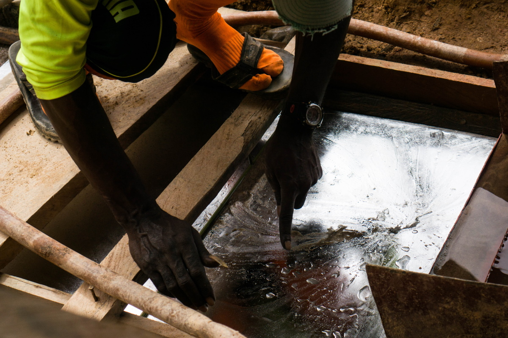
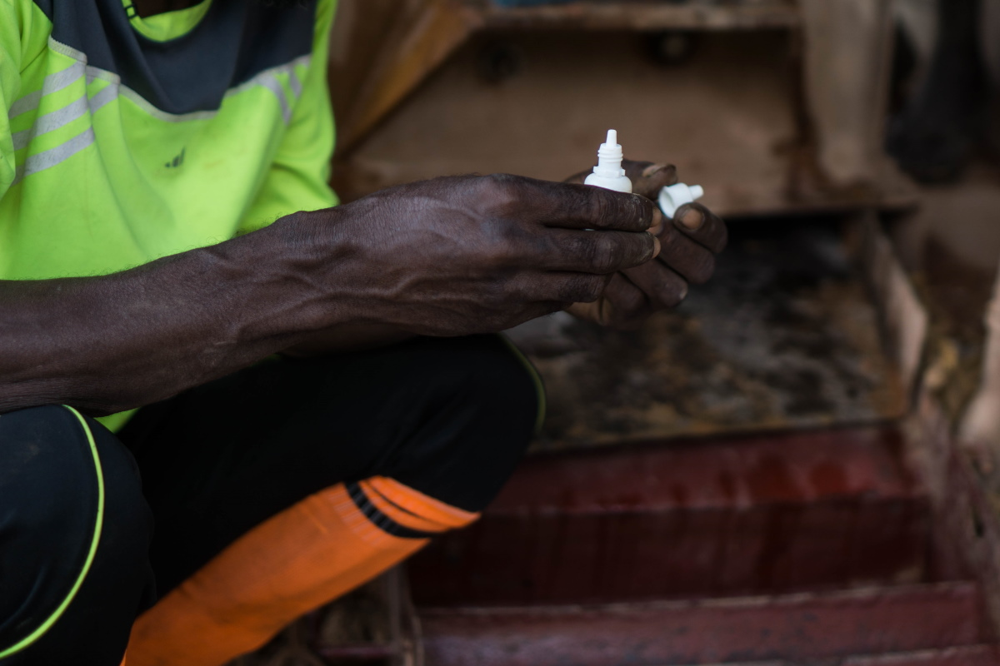
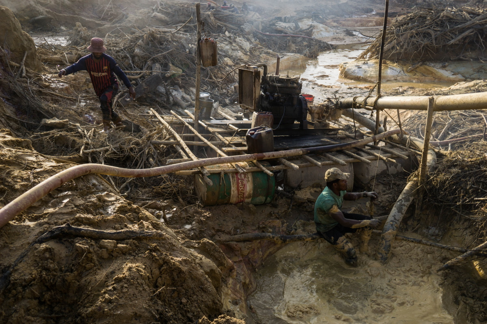
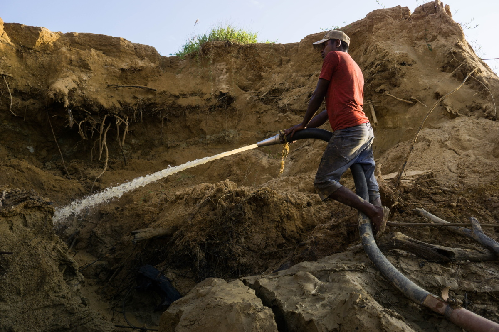
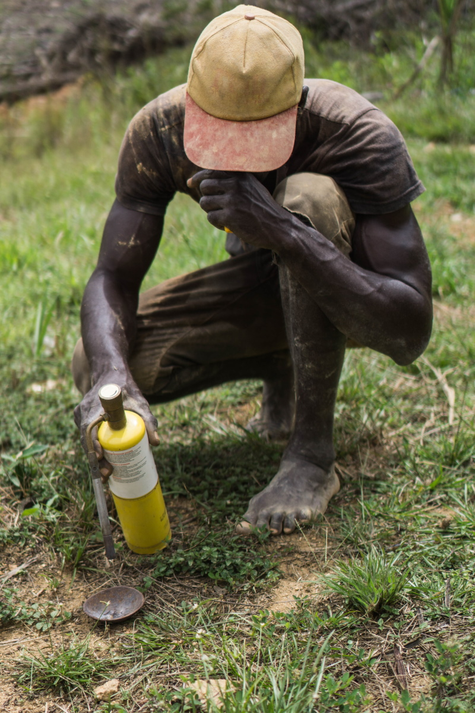

import Image from "!url-loader!../../images/fotos/DSC07021.jpg"
import MapGeorgetown from "../../images/minimaps/reports/minimap-guyana-georgetown.svg"

export const meta = {
  name: "guyana",
  title: "The Toxic Metal in the Shadow of the Gold Industry",
  intro: "Despite its health and environmental risk, mercury is widely used in gold mining, and to miners in the Amazon, the silvery liquid is almost as valuable as the gold itself.",
  by: "By Bram Ebus (text and photos) and IG Sutherland (text). Videos by Tom Laffay",
  image: Image,
  next: {
	slug: "suriname",
	title: "The Gold Rush threatening the World's greenest country",
	description: "Suriname’s waterways and trade winds carry mercury, a toxic metal used in gold extraction, to regions far removed from the country’s gold mines."
  }
};

**It’s late in Corriverton,** a small village on the western bank of the Corentyne River, the waterway that separates Guyana from Suriname. But a few local boatmen, who shuttle people and contraband across the river, are still hanging around in front of the village brothel, drinking beers and smoking weed while chatting with the sex workers who’ve come out for the night. Most of the women are Venezuelan refugees who fled the crisis in their home country or were trafficked abroad.

In a dark alley next to the brothel, Showtime* smokes a cigarette and watches over a few of the women. The native Guyanese spent years living and working in the United States, where he claims to have run a group of sex workers. Back in Guyana, he's still involved in the sex industry, but his main business now is moving contraband across the river.

<Video url="https://youtube.com/embed/fqPOWU235qI" />

Two commodities that are frequently taken over illegally are gold and mercury, and in the Guiana Shield region, one does not go without the other. Gold is Guyana’s primary export product thanks in large part to mercury, the toxic quicksilver used in its extraction process. In 2015, Guyana produced 19.1 tonnes of gold, according to official records, requiring an estimated [29 tonnes of mercury](https://www.iucn.nl/-files/groene_economie/regional_mercury_report_guyana.pdf). Both numbers are most likely much higher now, as gold production has increased since 2015 and a significant amount of Guyanese gold is trafficked abroad.

All of that mercury has grave impacts on human health and the environment, but efforts so far to curtail its use in the gold industry have only pushed supply chains underground, leaving many miners exposed to both the dire health consequences of the toxic substance and the legal risks of participating in the black market.

---

<Sidenote side="left">
	<MapGeorgetown />
</Sidenote>

Guyana and Suriname share the same Amazon ecosystems, access to the Northern Atlantic Ocean, and colonial past. Both countries endured centuries of British and Dutch occupations, only becoming independent in the 20th century.

<iframe src="https://datawrapper.dwcdn.net/xz5Yz/2/"></iframe>

Guyana is an especially poverty stricken nation. Plagued by corruption and underdevelopment, the collateral damage of its long colonial history, the gross income per capita amounts to just $4,760 U.S. dollars a year. Nearly a third of the country’s total population of 780,000 live in the capital city of Georgetown, where thousands of families live in buildings desperately in need of repair. Dilapidated wooden houses and urban junkyards are not an uncommon sight.  But economists are optimistic about the country’s future.

<Video url="https://youtube.com/embed/GtkqArJG52Y" />

Guyana is on the brink of becoming one of the wealthiest countries in Latin America. Massive offshore oil deposits were found in 2015 and will
bring in about 1.2 million barrels a day in the near future.

While oil is the talk of the town in Georgetown, the country’s 20,000 miners do not feel represented by their politicians.

In 2013, Guyana signed the Minamata Convention on Mercury, a global treaty designed to reduce mercury emissions to protect human health
and the environment. Named for a city in Japan where residents were poisoned by mercury released from a local factory, the convention calls for a ban on the use of mercury for mining. Guyana ratified the convention in 2014, and committed to reducing mercury use down to 75 percent of baseline levels by 2027.

> “We gotta get this silver to get the gold,” says one experienced miner in the interior of Guyana.

Newell Dennison, commissioner of the Guyana Geology and Mines Commission (GGMC), says that the first steps have been taken: “We’re already in the field going out to clustered areas,” where the GGMC discusses alternative mining techniques with the miners themselves. About 980 miners have received demonstrations, surveys, or workshops already, but their decision to continue with mercury or not so far depends on its effectiveness. “A lot of what’s going on is determined by what friends do, and what other miners do,” adds Dennison. “We recognize that it is not only about the GGMC going out there and doing things … it’s also about a culture shift.”

In the forests of Guyana, the upcoming mercury ban is met with discontent by communities of artisanal and small-scale miners who fear for their livelihoods as their gold production depends on the availability of mercury—also known as quicksilver, or to many miners, just “silver.”

<Gallery>

*The upcoming mercury ban is met with discontent by communities of artisanal and small-scale miners*

</Gallery>

In the runup to this year’s presidential election in March, won by opposition candidate Irfaan Ali after a protracted disaster with the vote count, the Guyana Gold and Diamond Miners Association (GGDMA) and the National Mining Syndicate (NMS) published a [list of demands](https://ggdma.com/pressnews/a-manifesto-for-mining/) for politicians seeking the organizations’ political support. The first was that before phasing out the use of mercury, the government must provide miners with affordable alternative technologies, along with the financial and technical assistance needed to use them.

Without more assistance, little will change when the prohibition kicks in, according to the miners. Mercury will still be available on the black market—for an increased price.
“If it goes underground the mercury gets more expensive, far more expensive, because it’s illegal,” says Kennard Williams*, a mine operator. Mercury traders in charge of the supply will get rich, he says, while the miners do “all the hard work.”
Gabriel Lall, the former chairman of the Guyana Gold Board, the state agency that manages the gold trade and buys and exports gold, agrees that the ban on mercury is likely to “empower the proliferation of criminal enterprises.”

> “OUR BORDERS ARE LONG AND POROUS, OUR OFFICERS—WITH DUE RESPECT TO THE FEW THAT ARE CLEAN—ARE K NOWN TO LOOK THE OTHER WAY FOR A PRICE,”

There is widespread corruption in Guyana, Lall warns, and law enforcement officers often turn a blind eye to the illicit trade in return for kickbacks. “Our borders are long and porous, our officers—with due respect to the few that are clean—are known to look the other way for a price,” he says. “If in any link of the chain of oversight you have weaknesses, then you might as well not have a chain.” The police did not respond to a request for comment.

---

Guyana is the only country in the Guiana Shield region that still imports licensed mercury. Between 2008 and 2013, yearly imports averaged around 70,000 kilograms, but after Guyana signed the Minimata Convention, signaling its support for a phase out of (and future ban on) mercury, imports crashed, averaging just over 20,000 kg in the years since. Most of the mercury, which comes mainly from Russia, the United Kingdom, India, the United States, and Turkey, entered Guyana through the Georgetown seaport.

<iframe title="Mercury imports in Guyana (2008-2018)&amp;nbsp;" aria-label="Column Chart" src="//datawrapper.dwcdn.net/Wqe1W/1/" scrolling="no" frameborder="0" style="border: none;" width="600" height="400"></iframe>

There are huge profits to be made in the trade. The retail price of mercury in Guyana can amount to more than 10 times the import price. On average, mercury is imported for $17.40 USD/kg. Wholesalers sell it for $126, but in mining areas the quicksilver goes over the counter for between $159 and $234.

Although the ban is not yet in effect, talking about mercury is already taboo for the licensed importers. None of them agreed to give an interview on the record, but one former importer, who stockpiled enough mercury to continue selling it on the national market, suggests that bribes are being paid to obtain the licenses, which are managed by Guyana’s Pesticide and Toxic Chemicals Control Board. “You see, you start to get into deeper politics,” he says, grinning while clasping his hands in front of his shop’s counter in Georgetown. (The Board did not comment on the bribery allegations, but claims it has “no information to substantiate the alleged trafficking of mercury into Guyana.") He answers each question carefully, quietly weighing each response before he speaks. But when asked whether all imports are still legal, he reacts quickly: “Jesus Christ, you know you have not even touched the tip of the iceberg,” the Georgetown businessman laughs. “People are smuggling it right now into this country.”

The Georgetown trader, three experts, and additional sources from within the sector claim that —in addition to the legal imports—Chinese traders are funneling illicit mercury into the Georgetown seaport.

<Video url="https://youtube.com/embed/lJuft01OY1E" />

The Chinese importers have a lot of sway with Guyana’s government, according to a Guyanese source working for the state. "These guys have
access,” he says. “These guys feel comfortable twisting the arm for calling in favours for which they pay very, very richly."

> The ease with which mercury moves into and around Guyana has made the country a gateway for channeling the quicksilver into neighbouring countries

Once it’s inside Guyana, there’s no restrictions on the trade or movement of mercury around the country. The ease with which mercury moves into and around Guyana has made the country a gateway for channeling the quicksilver into neighbouring countries, according to Guyana’s former environmental minister Raphael Trotman. “I’m certain about the cross border trafficking,” he wrote via WhatsApp. “Most of the information I've received speaks of Suriname, but I can't rule out the others.”

---

In the center of Georgetown, small combi-vans pick up passengers and take them to all the corners of the country. The vehicles, painted with flashy colors and designs, aggressively zigzag through the city’s traffic, honking at even the slightest provocation. Many of the vans are bound for remote jungle outposts.

One driver, headed for Lethem, a town on the border with Brazil, offers to shuttle mercury there—for a price. “Everyone has to get paid,” he says, standing in front of his company’ office. “Because remember, it’s a chance you take. If we’re going to smuggle it, it’s going to be expensive.” Drivers charge as much as $500 to take a flask of mercury, which contains 34.5 kg of the quicksilver, across the river at Lethem. They use informal crossings to avoid the Brazilian federal police. Once it’s safely in Brazil, cab drivers carry the mercury to the local market in the city of Boa Vista.Sometimes private cars take it a few hours further north, into Venezuela.

> “Because remember, it’s a chance you take. If we’re going to smuggle it, it’s going to be expensive.”

The combi-vans also supply mining towns in Guyana’s interior. A steady trickle of vans, piled high with small mining equipment and food supplies and packed with passengers jockeying for window space, make the eight-hour trip to Mahdia.

The mining enclave was only declared a municipality in 2018. Most of the buildings in the small town center are made of wood. There are a few nightclubs and a gold shop on nearly every street. The lush jungle around the village is marked by dried out creeks and massive ochre-colored pits, as if a meteorite had fragmented just above the town and left craters throughout the surrounding area.

<Video url="https://youtube.com/embed/ExEVqQRdPqk" />

In one of these jungle pits, a young man holds on tight to a water hose as high-pressure water bursts out of the nozzle. He is called a “jetman.” He washes the gold-containing slurry into muddy pools, where a “pitman” works chest-deep in the water removing stones and other large pieces of rubbish. From there the “marrackman” uses a suction pump to funnel the slurry from the pools into the sluice box, yet another contraption that separates coarse gold pieces from other suspended particles by weight.

Under a structure made with wooden sticks and a plastic sheet sits the operation's overseer Kennard Williams*. His job is to trap the tinyflecks of gold that remain in the muddy slurry. "The gold is like powder. It's so fine, without the silver, you can't trap it," he says, sprinkling the silvery liquid over a thin amalgam plate.

<Gallery>

 *Most of the miners in and around Mahdia are not in it for the riches; they are subsistence miners.*

</Gallery>

A generator kicks on and a muddy stream of water runs over the plate. Water and silt run through it while the amalgam is trapped on top. Occasionally, Williams pours more mercury over the plate, sometimes going through more than two pounds a day. The whole process on average takes a few days and multiple amalgam plates are used.

<Video url="https://youtube.com/embed/dOcQdbrynXo" />

Most of the miners in and around Mahdia are not in it for the riches; they are subsistence miners. Even after long days of backbreaking work, the miners are still barely able to support their families. Dexton Grant, an experienced miner who recently began working for Williams,carries heavy wooden planks on his shoulders as he slogs between the contaminated pits in the mine. There are few job opportunities in Mahdia outside the mining sector, according to Grant. He‘s grateful for the opportunity to put food on his family’s table.

The lack of educational opportunities and state investments in the region has condemned generations of villagers to a life in the muddy pits. Grant hopes that his children will have the chance to dedicate their lives to something else: “I’m in the mines to get this gold,” he says, and “to let them go to school.”

<Video url="https://youtube.com/embed/4SJe-illSZw" />

Small-scale miners are usually paid based on their production; the less gold they’re able to extract, the less they get paid. If mercury cannot be used anymore, Grant says it will be his exit from the sector. “It serves no purpose without the mercury, because it traps the gold much more,” he says. He’s more worried about his economic wellbeing than about his health.

There is no safe level of mercury exposure, according to experts, but Grant claims that mercury has not affected his body. It’s a belief that’s shared by many miners in Guyana.

<Video url="https://youtube.com/embed/noKstuzu1FQ" />

Harry Casey*, a Mahdia local who runs a mining project himself nearby, does not understand why people warn him about the mercury use. “It still gets me baffled, why is mercury so dangerous?” he asks out loud, driving his Toyota pickup truck through the jungle between mines. He smiles as he recalls playing with mercury as a child on visits to his father’s mine. His father used “buckets of mercury” as a miner and is still alive today. “My father is 84,” he says. “He made 17 children with my mother.”

Misconceptions about the health risks of mining with mercury are a serious issue in Guyana. But miners themselves are not the group that’s most affected by mercury contamination. In its liquid form, as miners use it, mercury is less of a risk to human health than in its gaseous form.

---

Gold shop workers, who burn the mercury off the amalgam, are most exposed to the toxic vapors. In the middle of one of the villages in the Guyanese goldfields of the interior, Leroy Persaud* chuckles nervously from behind his big desk in his gold shop, a one-story wood structure protected by solid metal bars. In 2013, after almost two years of buying gold from the mines and miners, burning the mercury off the amalgam sponges, and melting the
gold into small ingots, his health began to deteriorate.

 *The amalgamed gold*

“Things started to get out of hand with me,” Persaud explains. Later that year, he started waking up with headaches, suffering from diarrhea and vomiting, and losing his sight. He also got a temper. “I ended up hitting my girlfriend,” he says. “I never used to do that.” In 2013, Persaud went to the local clinic in his village, where he tested negative for malaria and dengue. His symptoms continued to worsen, and after one particularly traumatic incident, in which Persaud began shaking uncontrollably and nearly lost his sight completely,his local doctors sent him to the capital. “I thought I was going to die,” he recalls.

At Eureka Laboratories in Georgetown, the only facility then equipped to test for mercury poisoning, his blood tests showed his mercury levels were 160 nanograms per milliliter (ng/mL), at least 10 times the normal

> THE DOCTOR IN BRAZIL [TOLD ME], ‘QUIT THE WORK IF YOU WANT TO LIVE.’ BUT THIS IS THE ONLY WORK I KNOW HOW TO DO TO SURVIVE AND [PROVIDE] FOR MY FAMILY

levels. The doctors advised him to leave his work and the mining region, but there was no treatment available in Guyana. An ex-girlfriend urged him to go to a hospital in Manaus, Brazil, according to Persaud, but the treatment was expensive and he was short on cash. To raise the 2.5 million GYD he needed for the trip and treatment, he went back to work in his gold shop. When he finally reached the Saint Julia hospital in Manaus, the doctors did not understand how he was still alive: the latest tests revealed that the mercury levels in his blood had climbed to 320ng/mL. “The doctor in Brazil [told me], ‘Quit the work if you want to live.’ But this is the only work I know how to do to survive and [provide] for my family. But I came back prepared.”

 *Burning the mercury off and smelting the gold into small ingots*

Persaud continues to burn the toxic amalgam that miners sell to him. But now, fully suited up, with a mask and an extractor fan, Persaud argues that his activity is “90 percent safe.” The treatment he brought from Brazil, in combination with a healthy, vitamin-rich diet and an exercise routine to sweat the mercury out of his pores, helped him to get his levels back to 10ng/mL. “You don’t really see it, but you smell it,” Persaud laughs. “The scent I used to have is not there anymore.”

---

Today, seven years after Persaud made the trek to the capital, miners who want to get tested for mercury in Guyana still need to go to the Eureka Laboratories on Thomas Street in Georgetown. Inside, Dr. Rhonda Archer sees patients at the hospital bed in her office, separated from her desk by a light blue curtain.

 *Miners burning off the mercury in a gold mine.*

Archer is an expert on mercury poisoning. She runs through a long list of its potential health effects: respiratory illnesses, neurological problems, damage to the liver, kidneys, and immune systems, to name a few. But she couldn’t do much for her patients in Guyana until treatment became available in 2018. That year, fo ur employees of the Guyana Geology and Mines Commission died over a six-month period at a lab run by the Guyana Gold Board, where mercury was burned off raw gold. Officials blamed mercury fumes. The lab was subsequently shut down, and since then, mercury treatment beca me available, mainly imported from the U.S.

Before that, only 5 to 10 people a year came to see Archer in Georgetown to get a mercury test; most people didn’t bother, knowing that medical help was not available. Since 2018, the number of miners seeking medical attention from her has doubled, but that still only amounts to 10 to 20 people a year.

> Since 2018, the number of miners seeking medical attention from her has doubled, but that still only amounts to 10 to 20 people a year.

Meanwhile, there are as many as 20,000 small-scale miners in Guyana, and the vast majority work with mercury on a daily basis. Archer worries that too few miners are seeking help for mercury poisoning in the capital even now that treatment is available in Guyana.

The test for mercury is kind of costly in comparison to a person’s wage in this country,” Archer says. “That seems to be a deterrent.” Blood testing for mercury poisoning, and the battery of other tests required to determine how much damage it’s caused throughout the body, can cost over 40,000 GYD (equivalent to nearly $200 USD), or more than half the monthly wages of many small-scale miners. The subsequent treatment costs an additional 25,000 GYD, on average.

---

The morning prayer crackles through the speakers of the local mosque in Corriverton at 5am. It's still dark, save for a few flickering streetlights. Suddenly the sound from the mosque stops, as a blackout envelops the village. With the first sunlight over the Corentyne river, a sleepy smuggler shows up in front of a house and walks through the entrance to the back of a courtyard to open the metal gates that lead to the river. It is time to go.

<Video url="https://youtube.com/embed/eOLHxmi8WV4" />

The engine of a go-fast boat roars to life next to the nearby pier. At a short distance, an Indian man wades waist deep through the water and washes up for his morning prayer; he pays no attention to what happens next to him. Contraband is usually moved at night, ferried across the river into Suriname at informal crossings known as “the backtrack.” That is, if the changing tides from the nearby sea allow for a safe passage over the Corentyne river. Last night the tide was too low, but the captain is not worried. “[Contraband] never gets seized on the boat on the water,” he says, steering away from the riverbank toward Suriname.

“A lot of people make money out of the backtrack,” he adds. The mercury, which is stored in heavy metal flasks, each worth as much as $8,000 USD, is taken across the river and into Suriname at various points along the coast. Smugglers sometimes pack as many as six or seven flasks onto each boat.

Mercury trafficking is a steady, if not lucrative business for captains, who charge tens of thousands of Guyanese dollars for each trip to Suriname, according to Showtime. “It’s illegal over there, but it’s legal over here, so you’re gonna find that the demand is mad-high,” says Showtime, hammering away beers and rum the night before in Corriverton. Small quantities are moved at a time, and compared to moving drugs like cocaine over the same route, the legal consequences are much smaller. But it’s still a risk.

“If you get caught by the police in Suriname, you go to jail,” says the captain, after turning off the loud engine in the middle of the Corentyne River. But if all goes well, he adds, “the guy who purchased it will be on the other side waiting, with a taxi or his car or whatsoever. When we drop it off, he collects it.”

Trafficking routes are as fluid as the mercury itself. They quickly change depending on where law enforcement focuses its attention and on the ever changing supply and demand mechanisms that dictate the black market in minerals. Until recently, this exact spot was an active backtrack for mercury trafficking. A new control post on the Surinamese side of the river has diverted the flow of mercury. Now flasks are taken across further upstream, where the riverbanks are covered by dense jungle.

“It’s still going to Suriname,” he says, but now it’s taken across “without
the people’s eyes.”

*\*Some names have been changed to protect the identities of interviewees.*
