import Image from "!url-loader!../../images/fotos/DSC07021.jpg"
import MapGeorgetown from "../../images/minimaps/reports/minimap-guyana-georgetown.svg"

export const meta = {
  name: "guyana",
  title: "El metal tóxico a la sombra de la industria del oro",
  intro: "A pesar de su riesgo para la salud y el medio ambiente, el mercurio se utiliza ampliamente en la minería del oro, y para los mineros de la Amazonía, el líquido plateado es casi tan valioso como el propio oro.",
  by: "Por Bram Ebus (texto y fotos) y G. I. Sutherland (texto). Videos por Tom Laffay",
  image: Image,
  next: {
    slug: "suriname",
    title: "La fiebre del oro amenaza al país más verde del mundo",
    description: "Las vías fluviales y los vientos de Surinam llevan el mercurio, un metal tóxico utilizado en la extracción de oro, a regiones muy alejadas de las minas de oro del país."
  }
};

**Es tarde en Corriverton,** un pequeño pueblo en la ribera occidental del río Corentin, la vía fluvial que separa Guyana de Surinam, pero unos pocos barqueros locales, que transportan personas y hacen contrabando a través del río, siguen merodeando frente al burdel del pueblo, bebiendo cervezas y fumando marihuana mientras charlan con las trabajadoras sexuales que han salido por la noche. La mayoría de las mujeres son refugiadas venezolanas que huyeron de la crisis en su país de origen o fueron traficadas en el extranjero.

En un callejón oscuro junto al burdel, Showtime* fuma un cigarrillo y vigila a algunas de las mujeres. El nativo guyanés pasó años viviendo y trabajando en los Estados Unidos de América, donde afirma haber dirigido a un grupo de trabajadoras sexuales. De vuelta en Guyana, sigue involucrado en la industria del sexo, pero ahora su negocio principal es llevar contrabando al otro lado del río.

“Nunca va a ser un problema llevar tus vainas hacia allá”, dice, apuntando al este hacia el río y Surinam. Su grueso collar de oro roza la parte superior de su redondeado vientre mientras se inclina casualmente contra la pared. Las fuerzas del orden público siempre están un paso atrás. “No importa lo que hagan”, dice. “Tienen que construir una cerca en el maldito río”.

<Video url="https://youtube.com/embed/fqPOWU235qI" />

Dos productos básicos que suelen transportarse ilegalmente son el oro y el mercurio, y en la región del Escudo Guyanés, uno no va sin el otro. El oro es el principal producto de exportación de Guyana, gracias en gran parte al mercurio, el tóxico azogue utilizado en su proceso de extracción. En el 2015, Guyana produjo 19,1 toneladas de oro, de acuerdo con los registros oficiales, para lo que requirió un [estimado de 29 toneladas de mercurio](https://www.iucn.nl/files/groene_economie/regional_mercury_report_guyana.pdf). Es probable que ambas cifras ahora sean más altas, ya que la producción de oro ha aumentado desde el 2015 y una cantidad significativa de oro guyanés se trafica al extranjero.

Todo ese mercurio tiene graves repercusiones en la salud humana y el medio ambiente, pero los esfuerzos realizados hasta ahora para reducir su uso en la industria aurífera solo han llevado las cadenas de suministro a la clandestinidad, dejando a muchos mineros expuestos tanto a las consecuencias nefastas de la sustancia tóxica para la salud como a los riesgos legales de participar en el mercado negro.

---

<Sidenote side="left">
	<MapGeorgetown />
</Sidenote>

Guyana y Surinam comparten los mismos ecosistemas amazónicos, el acceso al Océano Atlántico Norte y el pasado colonial. Ambos países sobrellevaron siglos de ocupaciones británicas y holandesas, independizandose apenas en el siglo XX.

<iframe src="https://datawrapper.dwcdn.net/R9mcW/1/"></iframe>

Guyana es una nación especialmente azotada por la pobreza, plagada de corrupción y subdesarrollo, el daño colateral de su larga historia colonial, un ingreso bruto per cápita de apenas $4.760 al año. Casi un tercio de la población total del país, que asciende a 780.000 habitantes, vive en la capital, Georgetown, donde miles de familias viven en edificaciones que requieren reparaciones con urgencia. Casas de madera en ruinas y depósitos de chatarra urbanos no son una visión poco común; sin embargo, los economistas tienen una visión positiva sobre el futuro del país.

<Video url="https://youtube.com/embed/GtkqArJG52Y" />

Guyana está a punto de convertirse en uno de los países más ricos de América Latina. En el 2015, se descubrieron enormes depósitos de petróleo en el mar que reportarán alrededor de 1,2 millones de barriles al día muy brevemente.

Mientras que el petróleo es la comidilla de la ciudad en Georgetown, los 20.000 mineros del país no se sienten representados por sus políticos.

En el 2013, Guyana firmó el Convenio de Minamata, un tratado mundial destinado a reducir las emisiones de mercurio para proteger la salud humana y el medio ambiente. El convenio, que lleva el nombre de una ciudad de Japón donde los residentes se envenenaron con el mercurio liberado por una fábrica local, solicita la prohibición del uso de mercurio en la minería. Guyana ratificó el convenio en el 2014 y se comprometió a reducir el uso de mercurio hasta un 75% de los niveles basales para el 2027.

> “Tenemos que conseguir “silver” para obtener oro”, dice un minero experimentado en el interior de Guyana.

Newell Dennison, comisionado de la Comisión de Geología y Minas de Guyana (GGMC), indica que ya se han dado los primeros pasos. “Ya estamos en el sector saliendo a las áreas aglomeradas”, donde la GGMC discute técnicas mineras alternativas con los propios mineros. Cerca de 980 mineros ya han recibido demostraciones, encuestas o talleres, pero su decisión de continuar con el mercurio o no hasta ahora depende de su eficacia. “Mucho de lo que está sucediendo está determinado por lo que hacen los amigos y lo que hacen otros mineros”, añade Dennison. “Reconocemos que no se trata únicamente de que el GGMC salga y haga cosas... también se trata de un cambio de cultura”.

En los bosques del interior de Guyana, la inminente prohibición de mercurio es recibida con descontento por las comunidades de mineros artesanales y de pequeña escala, quienes temen por su sustento, puesto que su producción de oro depende de la disponibilidad de mercurio ―también conocido como azogue, o para muchos mineros, simplemente como “silver”.

<Gallery>

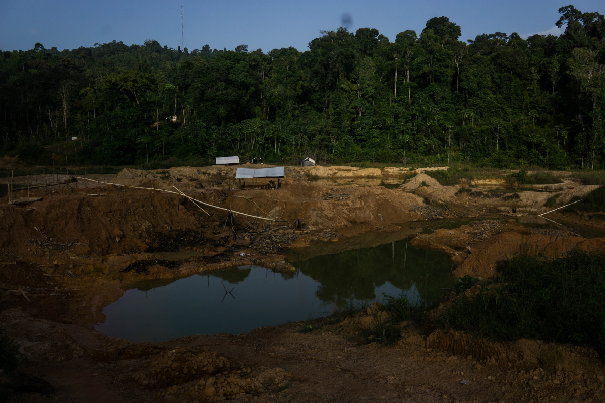*La inminente prohibición de mercurio es recibida con descontento por las comunidades de mineros artesanales*

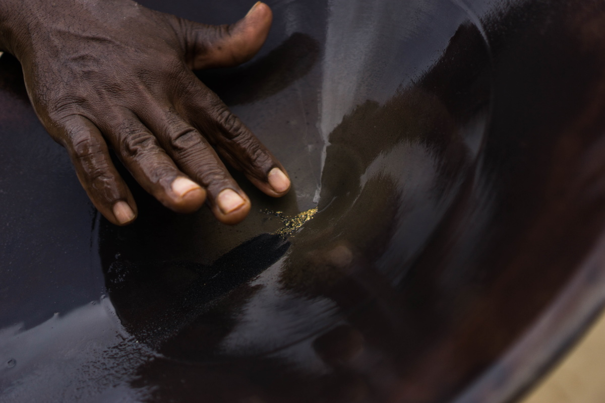

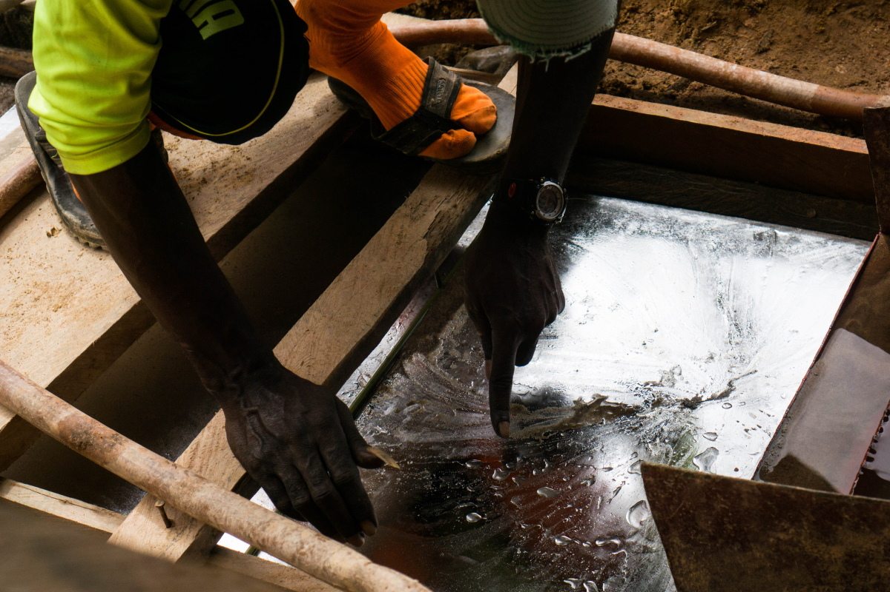

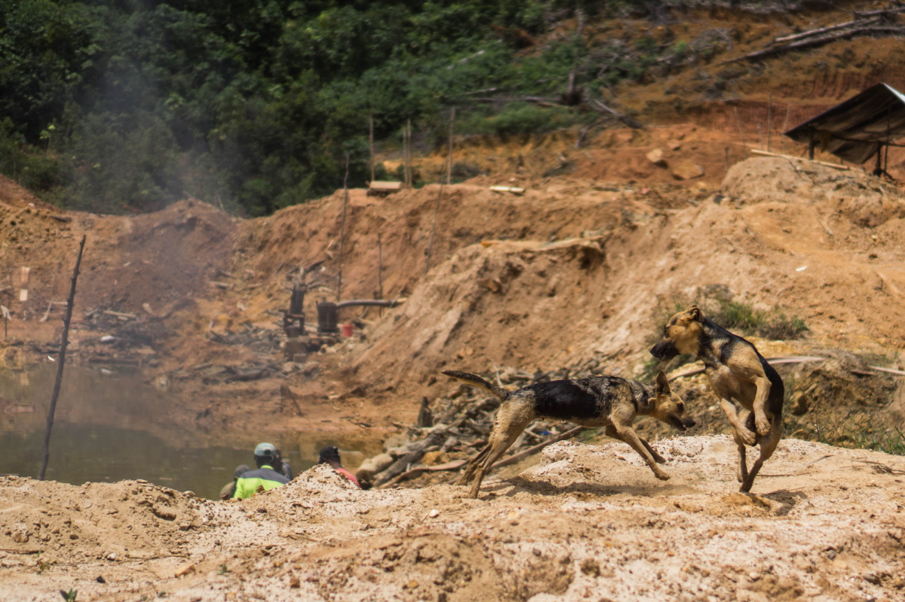

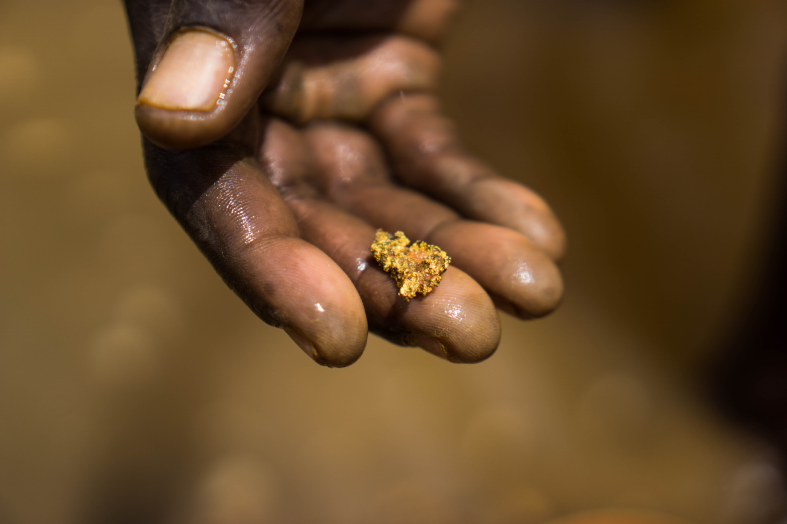

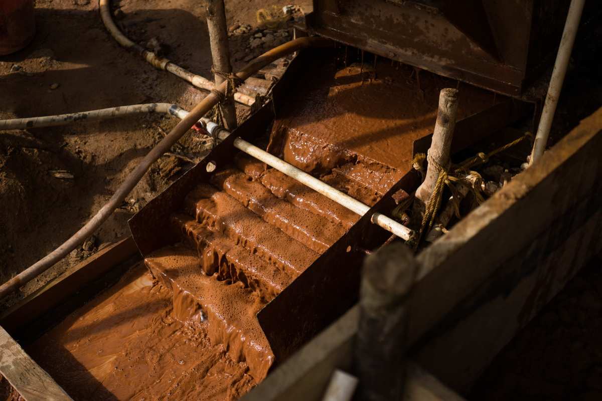

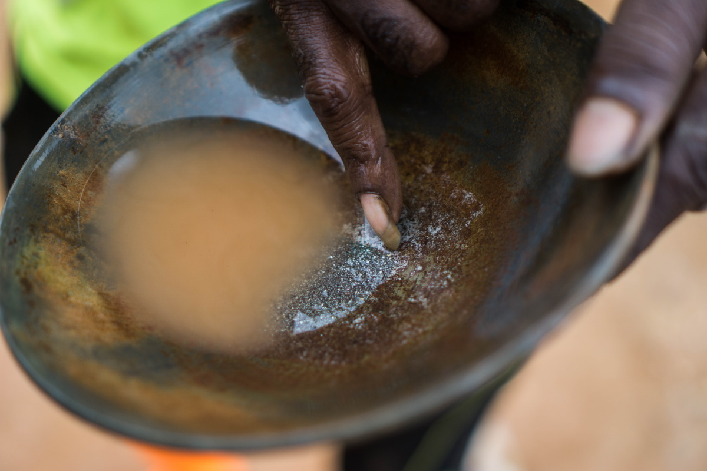

</Gallery>

En la víspera de las elecciones presidenciales de este año, ganadas por el candidato de la oposición Irfaan Ali después de un largo y desastroso conteo de votos, la Asociación de Mineros de Oro y Diamantes de Guyana (GGDMA) y el Sindicato Nacional de Minería (NMS) publicaron una [lista de exigencias]((https://ggdma.com/pressnews/a-manifesto-for-mining/)) para los políticos que buscan el apoyo político de las organizaciones. La primera era que, antes de eliminar paulatinamente el uso del mercurio, el gobierno debía facilitar a los mineros tecnologías alternativas asequibles, junto con la asistencia financiera y técnica necesarias para su uso.

“Si el mercurio pasa a la clandestinidad, se vuelve más costoso, mucho más costoso, porque es ilegal”, dice Kennard Williams*, un operador minero. Los comerciantes de mercurio a cargo del suministro se harán ricos, dice, mientras que los mineros hacen “todo el trabajo duro”.

Gabriel Lall, ex presidente de la Junta de Oro de Guyana (GGB en inglés), el organismo estatal que dirige el comercio de oro, está de acuerdo en que la prohibición del mercurio probablemente “fomente la proliferación de empresas criminales”.

> “Nuestras fronteras son largas y porosas; nuestros funcionarios ―con el debido respeto a los pocos que hay rectos― se sabe que miran hacia otro lado por un precio”

Lall advierte que en Guyana hay corrupción generalizada y que los agentes de orden público suelen hacerse la vista gorda ante el comercio ilícito a cambio de sobornos. “Nuestras fronteras son largas y porosas; nuestros funcionarios ―con el debido respeto a los pocos que hay rectos― se sabe que miran hacia otro lado por un precio”, dice. “Si hay puntos débiles en algún eslabón de la cadena de vigilancia, entonces es mejor no tener una cadena”. La policía no respondió a una solicitud de comentarios.

---

Guyana es el único país de la región del Escudo Guayanés que aún importa mercurio bajo licencia. Del 2008 al 2013, el promedio de las importaciones anuales fue de alrededor de 70.000 kg, pero después de que Guyana firmó el Convenio Minamata, en señal de su apoyo a una reducción (y futura prohibición) del mercurio, las importaciones se precipitaron, promediando poco más de 20.000 kg en los años posteriores. La mayor parte del mercurio, que proviene principalmente de Rusia, Reino Unido, India, Estados Unidos de América y Turquía, entró en Guyana por el puerto marítimo de Georgetown.

<iframe title="Mercury imports in Guyana (2008-2018)&amp;nbsp;" aria-label="Column Chart" src="//datawrapper.dwcdn.net/Wqe1W/1/" scrolling="no" frameborder="0" style="border: none;" width="600" height="400"></iframe>

Se generarán ganancias astronómicas en el comercio. El precio de venta al público del mercurio en Guyana puede llegar a superar 10 veces el precio de importación. En promedio, el mercurio se importa a $17.40 por kilo. Los mayoristas lo venden a $126, pero en las zonas mineras, el azogue se vende fuera del mercado por unos 159 a 234 dólares.

Aunque la prohibición aún no está en vigor, hablar de mercurio ya es tabú para los importadores autorizados. Ninguno de ellos accedió a conceder una entrevista oficial, pero un antiguo importador, quien almacenó suficiente mercurio para seguir vendiéndolo en el mercado nacional, sugiere que se están pagando sobornos para obtener las licencias, que son gestionadas por la Junta de Control de Plaguicidas y Productos Químicos Tóxicos de Guyana (PTCBB, en inglés). “Ya ves, empiezas a meterte en política más profunda”, dice sonriendo mientras se agarra las manos frente al mostrador de su tienda en Georgetown. (La Junta no hizo comentarios sobre las denuncias de soborno, pero afirma que “no tiene información que corrobore el presunto tráfico de mercurio hacia Guyana”).

Responde cada pregunta cuidadosamente, sopesando en silencio cada respuesta antes de hablar; pero, cuando se le pregunta si todas las importaciones aún son legales, reacciona de inmediato. “Jesucristo, sabes que ni siquiera has tocado la punta del iceberg”, el empresario de Georgetown se ríe. “En este momento ya lo están introduciendo de contrabando en este país”.

El comerciante de Georgetown, tres expertos y otras fuentes del sector afirman que, además de las importaciones legales, los comerciantes chinos están canalizando el mercurio ilícito hacia el puerto marítimo de Georgetown.

<Video url="https://youtube.com/embed/lJuft01OY1E" />

Los importadores chinos tienen mucha influencia sobre el gobierno de Guyana, según una fuente guyanesa que trabaja para el Estado. “Estos tipos tienen acceso”, dice. “Estos tipos se sienten cómodos retorciendo el brazo para pedir favores por los que pagan muy, muy bien."

> La facilidad con la que el mercurio se mueve alrededor de Guyana ha hecho del país una puerta de entrada para canalizar hacia los países vecinos

Una vez que entra a Guyana, no hay restricciones en el comercio o movimiento del mercurio por el país. La facilidad con la que el mercurio se mueve alrededor de Guyana ha hecho del país una puerta de entrada para canalizar hacia los países vecinos, indica el ex-ministro de medio ambiente de Guyana, Raphael Trotman. “Estoy seguro del tráfico transfronterizo”, escribió a través de WhatsApp. “La mayoría de la información que he recibido habla de Surinam, pero no puedo descartar los demás”.

---

En el centro de Georgetown, pequeñas furgonetas combi recogen a los pasajeros y los llevan a todos los rincones del país. Los vehículos, pintados con colores y diseños llamativos, zigzaguean agresivamente entre el tráfico de la ciudad, tocando la bocina ante la más mínima provocación. Muchas de las furgonetas se dirigen a puestos remotos en la selva.

Un conductor, que se dirige a Lethem, un pueblo en la frontera con Brasil, ofrece transportar mercurio hacia allá, a un costo. “Todo el mundo tiene que cobrar”, afirma, parado frente a la oficina de su compañía. “Porque recuerde, es un riesgo que se corre. Si lo vamos a pasar de contrabando, va a ser caro.” Los conductores cobran hasta $500 adicionales para llevar un frasco de 34,5 kg de mercurio al otro lado del río en Lethem. Usan cruces informales para evitar a la policía federal brasileña. Una vez que está a salvo en Brasil, los taxistas llevan el mercurio al mercado local en la ciudad de Boa Vista. A veces los vehículos privados lo llevan unas horas más al norte, a Venezuela.

> “Porque recuerde, es un riesgo que se corre. Si lo vamos a pasar de contrabando, va a ser caro.”

Las furgonetas combi también abastecen a las ciudades mineras del interior de Guyana. Un flujo continuo de furgonetas, abarrotadas con pequeños equipos de minería y suministros de alimentos y repletas de pasajeros que compiten por los asientos en las ventanas, hacen el viaje de ocho horas a Mahdia.

El enclave minero apenas fue declarado municipio en el 2018.La mayoría de las edificaciones del centro de la pequeña aldea son de madera. Hay algunos clubes nocturnos y una tienda de oro en casi todas las calles. La exuberante selva que rodea la aldea está marcada por arroyos secos y enormes fosas ocres, como si un meteorito se hubiera fraccionado justo encima del pueblo y hubiera dejado cráteres en los alrededores.

<Video url="https://youtube.com/embed/ExEVqQRdPqk" />

En una de estas fosas de la selva, un joven se aferra a una manguera de agua mientras el agua a alta presión sale de la boquilla; lo llaman “jetman” [operador de manguera a presión]. Lava el lodo que contiene oro en piscinas fangosas, donde un "pitman" [operador en fosa] trabaja hundido hasta el pecho en el agua removiendo piedras y otras piezas grandes de detrito. Desde allí, el "marrackman" [operador de bomba de succión] canalizar el lodo de las piscinas mediante la bomba de succión hacia el canalón ―otro artefacto que separa las piezas de oro gruesas de otras partículas suspendidas por peso.

Bajo una estructura de palos de madera y una lámina de plástico se encuentra el supervisor de la operación, Kennard Williams*. Su trabajo es atrapar partículas de oro diminutas que se quedan en el lodo fangoso. “El oro es como polvo; es tan fino, que no puedes agarrarlo sin la plata”, dice, rociando el líquido plateado sobre una placa fina de amalgama.

<Gallery>

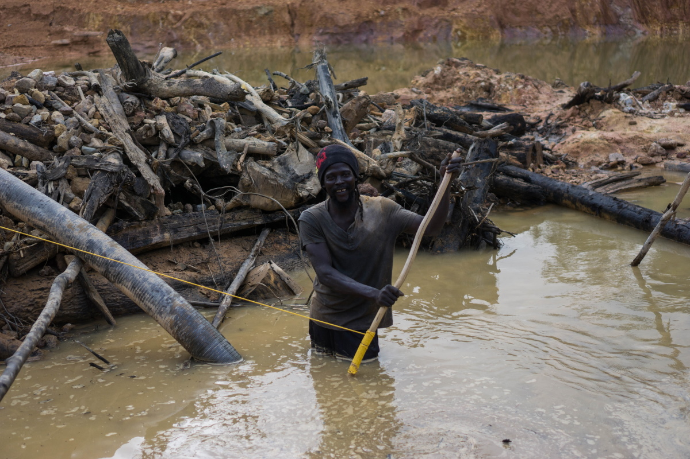 *A maioria dos garimpeiros de Mahdia e dos arredores não está nessa atividade pelas riquezas; eles são mineros de subsistência.*

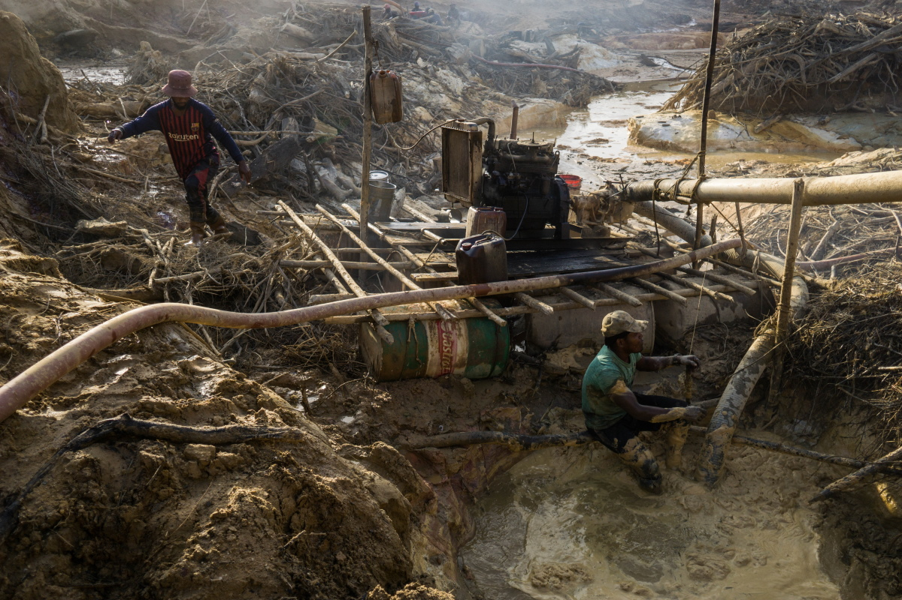

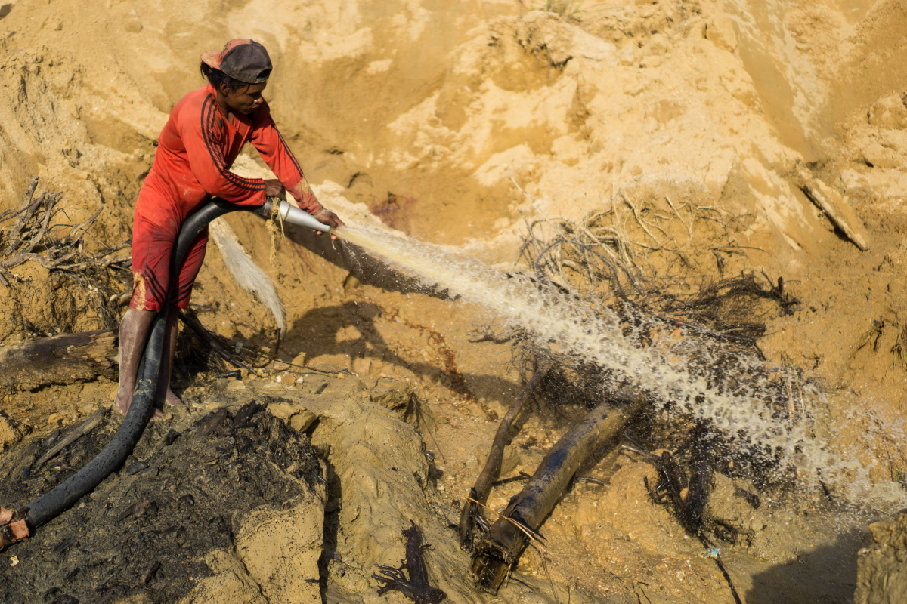

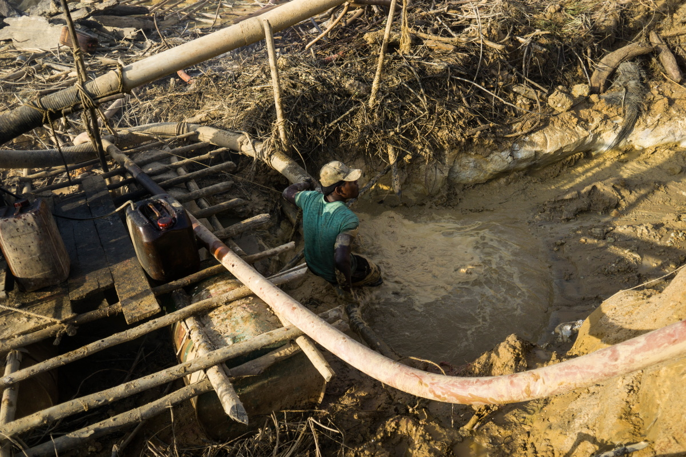

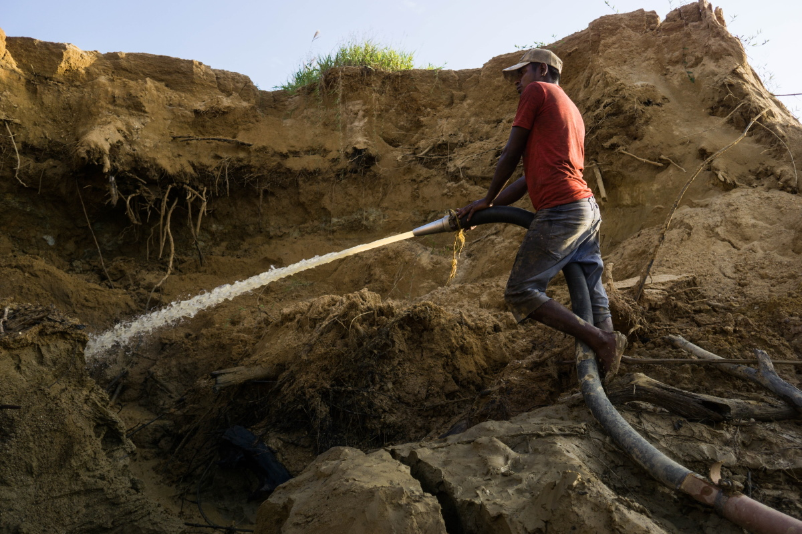

</Gallery>

Se enciende un generador y un chorro de agua fangosa corre sobre la placa. El agua y el limo corren a través de ella mientras la amalgama queda atrapada en la parte superior. De vez en cuando, Williams vierte más mercurio sobre la placa, a veces usando hasta más de un kilo al día. Todo el proceso toma en promedio unos pocos días y múltiples placas de amalgama son utilizadas.

<Video url="https://youtube.com/embed/dOcQdbrynXo" />

La mayoría de los mineros en Mahdia y sus alrededores no lo hacen por las riquezas, sino por la subsistencia. Incluso después de largos días de trabajo agotador, los mineros apenas pueden mantener a sus familias. Dexton Grant, un minero veterano que recientemente comenzó a trabajar para Williams, lleva tablas pesadas de madera sobre sus hombros mientras se desliza entre las lagunas contaminadas de la mina. Hay pocas oportunidades de trabajo en Mahdia fuera del sector minero, afirma Grant. Está agradecido por la oportunidad de poner comida en la mesa de su familia.

La falta de oportunidades educativas y de inversiones estatales en la región ha condenado a generaciones de aldeanos a una vida en las fosas fangosas. Grant espera que sus hijos tengan la oportunidad de dedicar sus vidas a otra cosa. “Estoy en las minas para conseguir este oro”, dice, y “para que puedan ir a la escuela”.

<Video url="https://youtube.com/embed/4SJe-illSZw" />

A los mineros artesanales se les suele pagar en función de lo que producen; cuanto menos oro puedan extraer, menos se les paga. Si el mercurio no se puede seguir usando, Grant dice que eso será su salida del sector. “No sirve de nada sin el mercurio, porque este atrapa mucho más el oro”, dice. Está más preocupado por su bienestar económico que por su salud.

En opinión de los especialistas, no hay un nivel seguro de exposición al mercurio, pero Grant afirma que el mercurio no ha afectado su cuerpo. Es una creencia que comparten muchos mineros en Guyana.

<Video url="https://youtube.com/embed/noKstuzu1FQ" />

Harry Casey*, un lugareño de Mahdia que dirige un proyecto minero en las cercanías, no entiende por qué la gente le advierte sobre el uso del mercurio. “Todavía me desconcierta ¿por qué es tan peligroso el mercurio?” pregunta en voz alta, conduciendo su Toyota a través de la selva entre las minas. Sonríe cuando recuerda haber jugado con mercurio de niño en las visitas a la mina de su padre, quien usaba “cubos de mercurio” como minero y hoy en día sigue vivo. “Mi padre tiene 84 años”, dice. “Tuvo 17 hijos con mi madre”.

Las concepciones erróneas sobre los riesgos a la salud por la minería con mercurio constituyen un problema grave en Guyana. Sin embargo, los mineros en sí no son el grupo más afectado por la contaminación con mercurio. En su forma líquida, tal como la usan los mineros, el mercurio es menos peligroso para la salud humana que en su forma gaseosa. Los trabajadores de las tiendas de oro, que queman el mercurio de la amalgama, están más expuestos a los vapores tóxicos.

---

En medio de una de las aldeas de los yacimientos de oro guyaneses del interior, Leroy Persaud* se ríe nerviosamente detrás de su gran escritorio en su tienda de oro, una estructura de madera de un piso, protegida por barras de metal sólido. En el 2013, después de casi dos años de comprar oro de las minas y los mineros, quemar el mercurio de las esponjas de amalgama y fundir el oro en pequeños lingotes, su salud comenzó a deteriorarse.

*El oro amalgamado* 

“Las cosas empezaron a salirse de control en mí”, explica Persaud. Más tarde ese año, empezó a despertarse con dolores de cabeza, padecer de diarrea y vómitos, y perder la vista. También se puso de mal humor. “Terminé golpeando a mi novia”, dice. “Nunca solía hacer eso”. En el 2013, Persaud fue a la clínica local de su pueblo, donde dio negativo para malaria y dengue. Sus síntomas siguieron empeorando y, después de un incidente particularmente traumático, en el que Persaud empezó a temblar descontroladamente y casi perdió la vista por completo, sus médicos locales lo enviaron a la capital. “Pensé que iba a morir”, recuerda.

En el laboratorio médico Eureka Laboratories de Georgetown, el único centro equipado en ese entonces para probar la intoxicación por mercurio, sus análisis de sangre mostraron que sus niveles de mercurio eran de 160 nanogramos por mililitro (ng/mL), por lo menos 10 veces por encima de los niveles

> “El médico en Brasil me dijo: ‘Si quieres vivir, deja el trabajo’”, dice Persaud. “Pero este es el único trabajo que sé hacer para sobrevivir y mantener a mi familia

normales. Los médicos le aconsejaron que abandonara su trabajo y la región minera, pero no había ningún tratamiento disponible en Guyana. Una ex novia le instó a que fuera a un hospital en Manaos, Brasil, pero el tratamiento era costoso y Persaud andaba escaso de dinero. Para reunir los 2,5 millones de GYD que necesitaba para el viaje y el tratamiento, volvió a trabajar en su tienda de oro. Cuando finalmente llegó al hospital Saint Julia en Manaos, los médicos no entendieron cómo seguía vivo ―las últimas pruebas revelaron que los niveles de mercurio en su sangre habían subido a 320 ng/mL. “El médico en Brasil me dijo: ‘Si quieres vivir, deja el trabajo’”, dice Persaud. “Pero este es el único trabajo que sé hacer para sobrevivir y mantener a mi familia; sin embargo, volví preparado”.

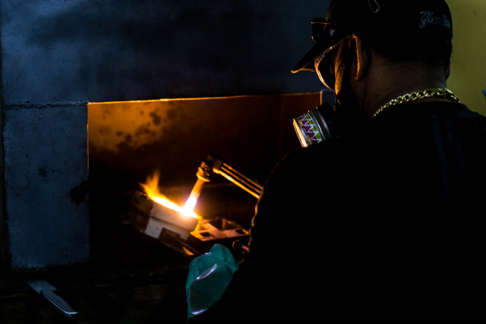 *En una tienda de oro, el mercurio se quema antes de fundir el oro en pequeños lingotes.*

Persaud sigue quemando la amalgama tóxica que le venden los mineros, pero ahora, totalmente equipado con una máscara y un extractor, Persaud argumenta que su actividad es “90% segura”. El tratamiento que trajo de Brasil, combinado con una dieta saludable y rica en vitaminas y una rutina de ejercicios para sudar el mercurio por sus poros, le ayudó a recuperar sus niveles a 10 ng/mL. “Realmente no lo ves, pero lo hueles”, se ríe Persaud. “El olor que solía tener ya no está ahí”.

---

Hoy en día, siete años después de que Persaud viajara a la capital, los mineros que quieren hacerse la prueba del mercurio en Guyana todavía tienen que acudir a Eureka Laboratories en la calle Thomas en Georgetown. En el interior, la Dra. Rhonda Archer ve a los pacientes en la camilla de su consultorio, separada de su escritorio por una cortina azul claro.

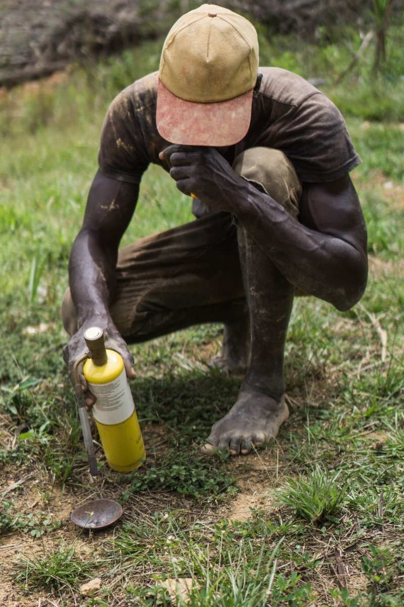 *Mineiro queima o mercúrio em uma mina de ouro.*

Archer se especializa en envenenamiento por mercurio; pasa una larga lista de sus efectos potenciales sobre la salud: enfermedades respiratorias, problemas neurológicos, daños al hígado, riñones y sistema inmunológico, por nombrar algunos; pero no pudo hacer mucho por sus pacientes en Guyana hasta que el tratamiento estuvo disponible en el 2018. Ese año, cuatro empleados de la Comisión de Geología y Minas de Guyana (GGMC) murieron durante un período de seis meses en un laboratorio dirigido por la Junta de Oro de Guyana (GBB), donde se quemaba el mercurio del oro en bruto. Funcionarios culparon a los vapores de mercurio. El laboratorio fue cerrado posteriormente y, desde entonces, se dispone de tratamiento de mercurio, principalmente importado de los EE.UU.

Antes de eso, solo unas 5 a 10 personas al año venían a ver a Archer en Georgetown para hacerse una prueba de mercurio; la mayoría de las personas ni se tomaban la molestia, porque sabían que no había ayuda médica disponible.

> Desde el 2018, la cantidad de mineros que buscan su atención médica se ha duplicado, pero, aun así, son solo de 10 a 20 personas al año.

Desde el 2018, la cantidad de mineros que buscan su atención médica se ha duplicado, pero, aun así, son solo de 10 a 20 personas al año. Mientras, hay hasta 20.000 mineros artesanales en Guyana, y la gran mayoría trabaja con mercurio a diario. A Archer le preocupa que sean muy pocos los mineros que buscan ayuda en la capital por envenenamiento con mercurio, mismo ahora con el tratamiento disponible.

“La prueba de mercurio es algo costosa en comparación con el salario de una persona en este país”, dice Archer. “Eso parece ser un elemento disuasivo”. Los análisis de sangre para detectar la intoxicación por mercurio y la batería de otras pruebas necesarias para determinar cuánto daño ha causado en todo el cuerpo pueden costar más de 40.000 GYD (lo que equivale a casi 200 dólares estadounidenses) o más de la mitad del salario mensual de muchos mineros a pequeña escala. El tratamiento posterior cuesta un promedio de 25.000 GYD adicionales.

---

La oración matutina bulle por los altavoces de la mezquita local de Corriverton a las 5 de la mañana. Todavía está oscuro, excepto por algunos faroles parpadeantes. De repente, el sonido de la mezquita se detiene, mientras un apagón envuelve el pueblo. Con la primera luz del sol sobre el río Corentin, un contrabandista aparece frente a una casa y camina por la entrada a la parte trasera de un patio para abrir las puertas metálicas que conducen al río. Es hora de irse.

<Video url="https://youtube.com/embed/eOLHxmi8WV4" />

El motor de una lancha rápida hace un estruendo junto al muelle cercano. A corta distancia, un indiano camina con el agua hasta la cintura y se lava para su oración matutina; no presta atención a lo que sucede a su lado. El contrabando se suele mover por la noche y se transporta a través del río hacia Surinam, en cruces informales conocidos como “backtrack” [rutas alternas], siempre que el cambio de mareas del mar cercano permita un paso seguro por el río Corentin. Anoche la marea estaba demasiado baja, pero el capitán no está preocupado. “[El contrabando] nunca es incautado en el barco en agua”, dice, alejándose de la orilla del río hacia Surinam.

“Mucha gente hace dinero en las backtrack”, añade. El mercurio, que se almacena en frascos de metal pesado, cada uno con un valor de hasta 8.000 dólares, se lleva al otro lado del río y a Surinam por varios puntos de la costa. Los contrabandistas a veces empacan hasta seis o siete frascos en cada barco.

El tráfico de mercurio es un negocio estable, si no lucrativo para los capitanes, que cobran decenas de miles de dólares guyaneses por cada viaje a Surinam, según indica Showtime. “Es ilegal allá, pero es legal aquí, así que verás que la demanda es muy alta”, dice Showtime, mientras bebe cerveza y ron la noche anterior en Corriverton. Se mueven pequeñas cantidades por vez, y comparado con el traslado de drogas, como la cocaína, por la misma ruta, las consecuencias legales son mucho menores; pero sigue siendo un riesgo.

“Si te atrapa la policía de Surinam, vas a la cárcel”, dice el capitán, después de apagar el ruidoso motor en medio del río Corentin; pero si todo sale bien, añade, “el tipo que lo compró estará en el otro lado esperando, con un taxi o su coche o lo que sea. Cuando lo dejamos, lo recoge”.

> Las rutas de tráfico son tan fluidas como el propio mercurio. Cambian rápidamente dependiendo de dónde centran su atención los agentes de orden público y de la dinámica de los mecanismos de oferta y demanda

Las rutas de tráfico son tan fluidas como el propio mercurio. Cambian rápidamente dependiendo de dónde centran su atención los agentes de orden público y de la dinámica de los mecanismos de oferta y demanda que dictan el mercado negro de minerales. Hasta hace poco, este punto exacto era una ruta alterna activa para el tráfico de mercurio. Un nuevo puesto de control en el lado surinamés del río ha desviado el flujo de mercurio. Ahora los frascos se llevan río arriba, donde las orillas del río están cubiertas por una densa selva.

“Sigue yendo a Surinam”, dice, pero ahora se lleva por “donde no hay ojos en la costa”.

*\*Algunos nombres han sido cambiados para proteger las identidades de los entrevistados.*
