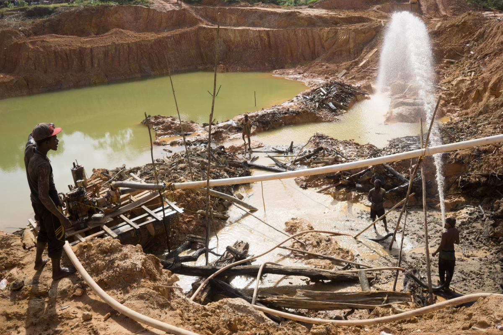
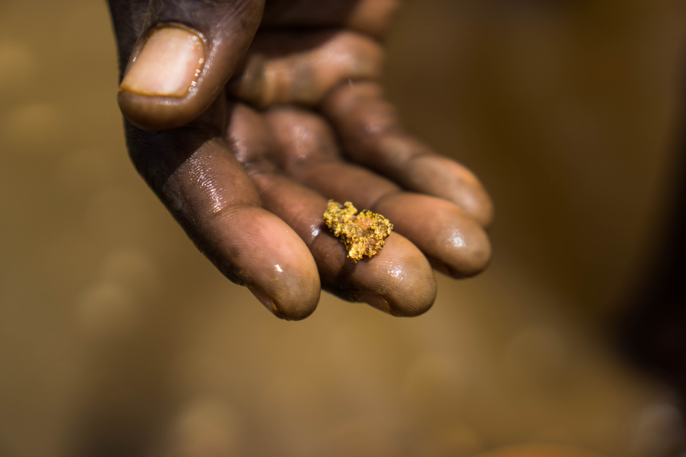
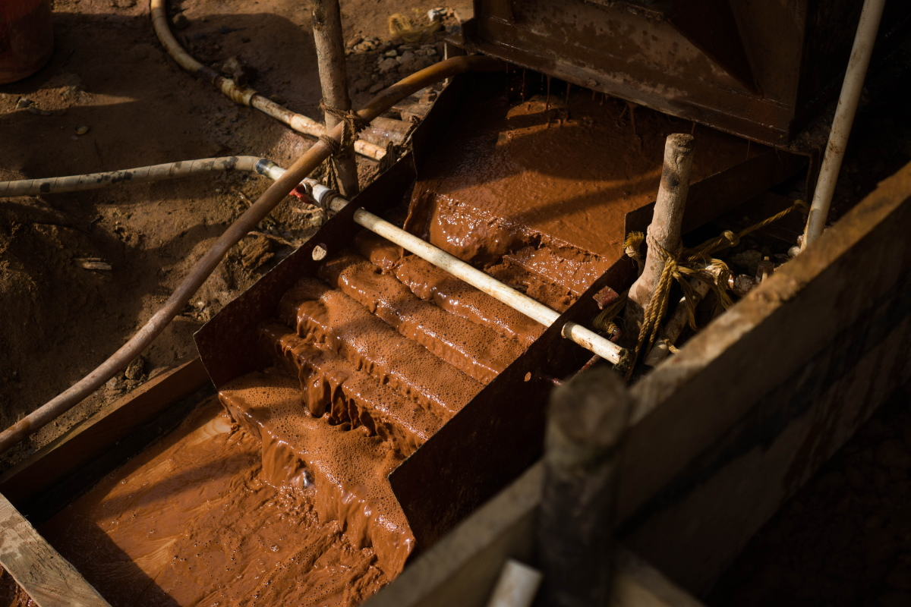
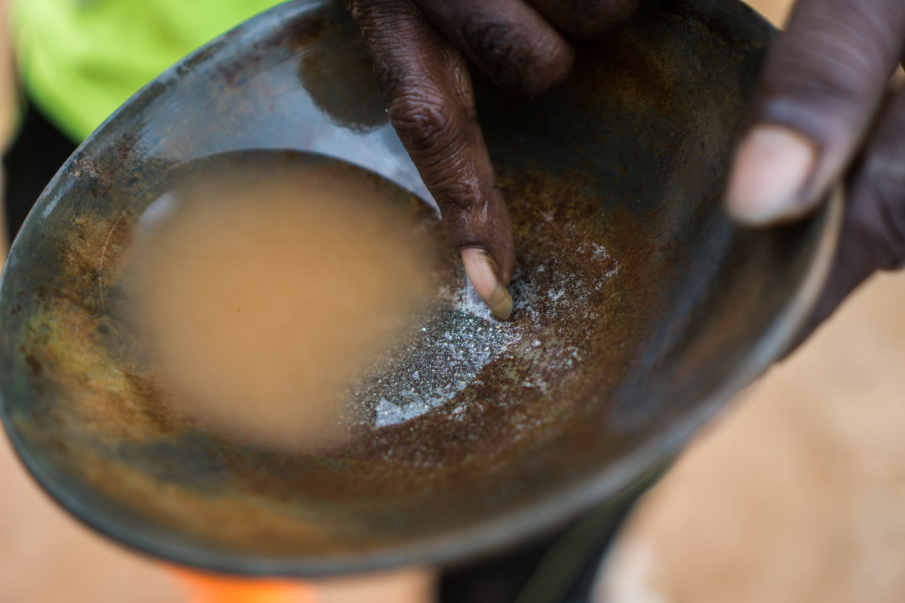
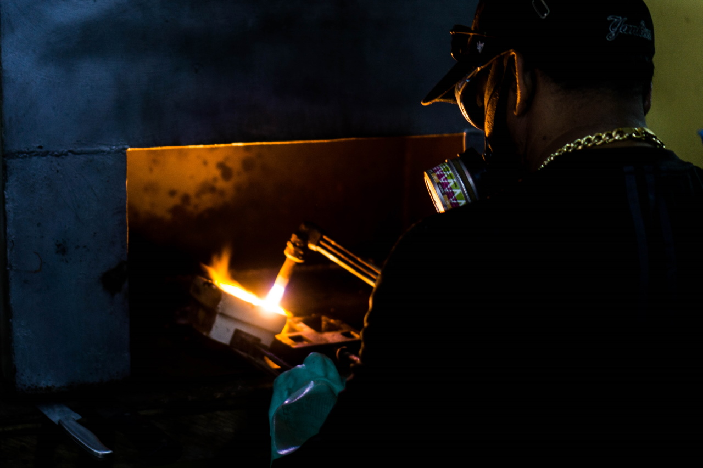

import Image from "!url-loader!../../images/fotos/DSC07021.jpg"
import MapGeorgetown from "../../images/minimaps/reports/minimap-guyana-georgetown-pt.svg"

export const meta = {
  name: "guyana",
  title: "O Metal Tóxico à Sombra da Indústria do Ouro",
  intro: "Apesar do seu risco à saúde e ao ambiente, o mercúrio é amplamente utilizado na extração de ouro, e para os mineiros na Amazônia, o líquido prateado é quase tão valioso como o próprio ouro.",
  by: "Por Bram Ebus (texto e fotos) e G. I. Sutherland (textos). Vídeos por Tom Laffay",
  image: Image,
  next: {
    slug: "suriname",
    title: "A Corrida do Ouro Ameaça o País mais Verde do Mundo",
    description: "Os cursos de água e os ventos do Suriname transportam mercúrio, um metal tóxico utilizado na extração de ouro, para regiões distantes das minas de ouro do país."
  }
};

**É tarde em Corriverton,** uma pequena vila na margem oeste do Rio Corentyne, canal navegável que separa a Guiana do Suriname. Mas alguns barqueiros locais, que transportam pessoas e contrabando para o outro lado do rio, ainda estão passando o tempo em frente ao bordel da vila, bebendo cerveja e fumando maconha, enquanto batem um papo com as profissionais do sexo, com quem saíram para passar a noite. A maioria das mulheres é de refugiadas venezuelanas, que fugiram da crise em seu país de origem ou foram traficada para o exterior.

Em um beco escuro próximo ao bordel, Showtime* fuma um cigarro e vigia algumas das mulheres. O guianense nativo passou anos vivendo e trabalhando nos Estados Unidos, onde afirma ter dirigido um grupo de profissionais do sexo. De volta à Guiana, ele ainda está envolvido com a indústria do sexo, mas seu principal negócio agora é movimentar o contrabando para o outro lado do rio.

"Nunca será um problema levar suas coisas para lá", diz ele, apontando para o leste em direção ao rio e ao Suriname. Seu grosso colar dourado desliza no topo da sua barriga arredondada, enquanto ele se encosta casualmente contra a parede. A aplicação da lei está sempre um passo atrás. "Não importa o que façam", afirma. "[Para impedir o contrabando] Eles têm que construir uma cerca neste maldito rio."

<Video url="https://youtube.com/embed/fqPOWU235qI" />

Duas mercadorias que são frequentemente adquiridas ilegalmente são o ouro e o mercúrio e, na região do Escudo das Guianas, um não anda sem o outro. O ouro é o principal produto de exportação da Guiana, graças em grande parte ao mercúrio, o metal tóxico usado no processo de mineração. Em 2015, a Guiana produziu 19,1 toneladas de ouro, de acordo com registros oficiais, o que exigiu um valor estimado de [29 toneladas de mercúrio](https://www.iucn.nl/-files/groene_economie/regional_mercury_report_guyana.pdf). Ambos os números são provavelmente muito maiores agora, pois a produção de ouro aumentou desde 2015 e uma quantidade significativa de ouro da Guiana é traficada para o exterior.

Todo esse mercúrio tem sérios impactos sobre a saúde humana e o meio ambiente, mas os esforços tomados até agora para reduzir seu uso na indústria do ouro apenas empurraram as cadeias de fornecimento para a clandestinidade, deixando muitos mineradores expostos tanto às terríveis consequências à saúde, por causa da substância tóxica, quanto aos riscos legais de participar do mercado negro.

---

<Sidenote side="left">
	<MapGeorgetown />
</Sidenote>

A Guiana e o Suriname têm muitas coisas em comum, os mesmos ecossistemas da Amazônia, o acesso ao Oceano Atlântico Norte e o passado colonial. Ambos os países foram por séculos ocupações britânicas e holandesas, tornando-se independentes apenas no século 20.

<iframe src="https://datawrapper.dwcdn.net/dColo/1/"></iframe>

A Guiana é uma nação especialmente afetada pela pobreza. Infestada pela corrupção e pelo subdesenvolvimento, dano colateral da sua longa história colonial. A renda bruta per capita é de apenas US$ 4.760 por ano. Quase um terço da população total de 780.000 habitantes do país vive na capital, na cidade de Georgetown, onde milhares de famílias vivem em edifícios que necessitam urgentemente de reparos. Casas de madeira dilapidadas e ferro-velho urbano não são uma visão incomum.

<Video url="https://youtube.com/embed/GtkqArJG52Y" />

Ainda assim, os economistas estão optimistas quanto ao futuro do país. A Guiana está prestes a se tornar um dos países mais ricos da América Latina. Grandes depósitos de petróleo offshore  foram encontrados em 2015 e vão gerar cerca de 1,2 milhão de barris por dia muito em breve

Enquanto o petróleo é o assunto na cidade de Georgetown, os 20.000 garimpeiros do país não se sentem representados por seus políticos.

Em 2013, a Guiana assinou a Convenção de Minamata, um tratado global projetado para reduzir as emissões de mercúrio para proteger a saúde humana e o meio ambiente. Com o nome da cidade do Japão, onde os moradores foram envenenados por mercúrio liberado por uma fábrica local, a convenção pede a proibição do seu uso na mineração. A Guiana ratificou a convenção em 2014 e se comprometeu a reduzir o uso de mercúrio em até 75% dos níveis padrões até 2027.

> "Temos de conseguir essa prata para pegar ouro", diz um garimpeiro experiente no interior da Guiana.

Newell Dennison, comissário da Guyana Geology and Mines Commission (GGMC), diz que os primeiros passos foram dados: "Já estamos no campo, saindo para as áreas aglomeradas", onde a GGMC discute técnicas alternativas de mineração com os próprios garimpeiros. Aproximadamente 980 mineiros já receberam demonstrações, mas sua decisão de continuar ou não com o mercúrio depende agora da sua eficácia. “Muito do que está acontecendo é determinado pelo que os amigos fazem e o que outros mineiros fazem”, acrescenta Dennison. “Reconhecemos que não se trata apenas da GGMC sair e fazer coisas... trata-se também de uma mudança cultural”.

No interior da selva da Guiana, a iminente proibição do mercúrio é recebida com descontentamento pelas comunidades de mineiros artesanais e de pequena escala, que temem por seus meios de subsistência, pois sua produção de ouro depende da disponibilidade de mercúrio - também conhecido como prata-viva ou, para muitos garimpeiros, apenas como "prata".

<Gallery>

</Gallery>

Na corrida para a eleição presidencial em março deste ano, ganha pelo candidato da oposição Irfaan Ali após uma longa e desastrosa contagem de votos, a Guyana  Gold and Diamond Miners Association (GGDMA) e o National Mining Syndicate (NMS)  publicaram uma [lista com demandas](https://ggdma.com/pressnews/a-manifesto-for-mining/) para políticos que buscam o apoio político das organizações. A primeira diz que, antes de acabar gradualmente com o uso do mercúrio, o governo deve fornecer aos garimpeiros tecnologias alternativas acessíveis, juntamente com a assistência financeira e técnica necessárias para utilizá-las.

Sem uma assistência maior, pouco mudará quando a proibição entrar em vigor, de acordo com os garimpeiros. O mercúrio ainda estará disponível no mercado negro - por um preço ainda maior.

"Se for clandestino, o mercúrio fica mais caro, muito mais caro, porque é ilegal", diz Kennard Williams*, um operador de minas. Os comerciantes de mercúrio encarregados em fornecê-lo ficarão ricos, diz ele, enquanto os garimpeiros fazem "todo o trabalho duro".

Gabriel Lall, ex-presidente do Guyana Gold Board, agência estatal que administra o mercado de ouro, concorda que a proibição do mercúrio provavelmente "facilitará a proliferação de empresas criminosas".

> "Nossas fronteiras são extensas e porosas, nossos oficiais - com o devido respeito aos poucos que são limpos - são conhecidos por fazer vista grossa por um preço", diz ele.

Existe uma corrupção extensa na Guiana, alerta Lall, e há agentes da polícia que frequentemente fecham os olhos para o comércio ilícito em troca de propinas. "Nossas fronteiras são extensas e porosas, nossos oficiais - com o devido respeito aos poucos que são limpos - são conhecidos por fazer vista grossa por um preço", diz ele. "Se, em qualquer elo da cadeia de supervisão, você tiver fraquezas, então é melhor talvez não ter uma cadeia". A polícia não respondeu a um pedido de comentários.

---

A Guiana é o único país da região do Escudo das Guianas que ainda importa mercúrio de forma legal. Entre 2008 e 2013, as importações anuais ficaram em torno de aproximadamente 70.000 quilogramas. Mas depois que a Guiana assinou a Convenção de Minamata, sinalizando seu apoio a uma redução (e futura proibição) do uso do mercúrio, as importações desmoronaram, com uma média um pouco acima de 20.000 kg nos anos seguintes. A maior parte do mercúrio proveniente principalmente da Rússia, do Reino Unido, da Índia, dos Estados Unidos e da Turquia entrou na Guiana pelo porto de Georgetown.

<iframe title="Importação de Mercúrio pela Guiana (2008-2018)&amp;nbsp;" aria-label="Column Chart" src="//datawrapper.dwcdn.net/Zx0Mn/1/" scrolling="no" frameborder="0" style="border: none;" width="600" height="400"></iframe>

Há enormes lucros obtidos pelo comércio do mercúrio. Na Guiana, o valor no varejo do mercúrio pode chegar a 10 vezes o valor de importação. Em média, o mercúrio é importado por US$ 17,40/kg. Os atacadistas o vendem a US$ 126, mas nas regiões de mineração, o azougue chega ao balcão entre US$ 159 e US$ 234.

Embora a proibição ainda não esteja em vigor, falar sobre mercúrio já é um tabu para os importadores licenciados. Nenhum deles concordou em gravar entrevista, mas um ex-importador, que armazenou mercúrio suficiente para continuar vendendo no mercado nacional, sugere que estão sendo pagas propinas para obter as licenças, que são gerenciadas pelo Pesticide and Toxic Chemicals Control Board da Guiana. "Veja, você começa a entrar em uma política mais profunda", diz ele sorrindo, enquanto aperta as mãos na frente do balcão da sua loja em Georgetown. (A instituição não comentou as alegações de propina, mas diz que “não possui informações para fundamentar o suposto tráfico de mercúrio na Guiana.”)

Ele responde a cada pergunta com cuidado, ponderando silenciosamente cada resposta, antes de falar. Mas, quando perguntado se todas as importações ainda são legais, ele reage rapidamente: "Jesus Cristo, você sabe que nem sequer tocou na ponta do iceberg", ri o empresário de Georgetown. “As pessoas estão contrabandeando isso nesse momento para este país".

O comerciante de Georgetown, três especialistas e fontes adicionais do setor afirmam que - além das importações legais - os comerciantes chineses estão direcionando mercúrio ilícito para o porto de Georgetown.

<Video url="https://youtube.com/embed/lJuft01OY1E" />

Os importadores chineses têm muita influência no governo da Guiana, de acordo com uma fonte guianense que trabalha para o Estado. "Esses caras têm acesso", diz ele. "Esses caras se sentem confortáveis torcendo o braço para pedir favores pelos quais pagam muito, muito bem."

> A facilidade com que o mercúrio avança em todas as direções da Guiana, tornou o país uma porta de entrada para canalizar aos países vizinhos

Uma vez dentro da Guiana, não há restrições ao comércio ou ao movimento do mercúrio por todo o país. A facilidade com que o mercúrio avança em todas as direções da Guiana, tornou o país uma porta de entrada para canalizar aos países vizinhos, de acordo com o ex-ministro do meio ambiente da Guiana, Raphael Trotman. “Tenho certeza do tráfico transfronteiriço”, escreveu via WhatsApp. “A maior parte das informações que recebi fala do Suriname, mas não posso descartar as outras.”

---

No centro de Georgetown, pequenas kombis pegam passageiros e os levam para todos os cantos do país. Os veículos, pintados com cores e desenhos chamativos, ziguezagueam agressivamente pelo tráfego da cidade, buzinando à menor provocação. Muitas das vans são destinadas aos postos remotos na selva.

Um motorista, com destino a Lethem, uma cidade na fronteira com o Brasil, se oferece para transportar mercúrio para lá - por um valor. “Todos precisam ser pagos”, diz ele, em frente ao escritório da sua empresa. "Porque, lembre-se, é uma chance que você agarra. Se vamos contrabandear, vai sair caro.” Os motoristas cobram até US$ 500 adicionais para levar um frasco de mercúrio, que contém 34,5 kg de azougue, para o outro lado do rio em Lethem. Eles usam travessias informais, para evitar a Polícia Federal brasileira. Uma vez em segurança no Brasil, os motoristas de táxi carregam o mercúrio para o mercado local na cidade de Boa Vista. Às vezes, os carros particulares levam algumas horas a mais ao norte, para a Venezuela.

> "Porque, lembre-se, é uma chance que você agarra. Se vamos contrabandear, vai sair caro.”

As vans também abastecem cidades mineradoras do interior da Guiana. Um fluxo constante de vans, empilhadas com pequenos equipamentos de mineração e suprimentos de alimento e lotadas de passageiros disputando o lugar na janela, fazem a viagem de oito horas até Mahdia.

O enclave de mineração só foi declarado município em 2018. A maioria dos edifícios no pequeno centro da vila é feita de madeira. Existem algumas boates e uma loja de ouro em quase todas as ruas. A exuberante floresta ao redor da vila é marcada por riachos secos e enormes buracos ocres, como se um meteorito tivesse se fragmentado logo acima da cidade e deixado crateras por toda a área circundante.

<Video url="https://youtube.com/embed/ExEVqQRdPqk" />

Em um desses buracos da selva, um jovem segura firme uma mangueira de água, enquanto irrompe do bico a água sob alta pressão. Ele é chamado de "jetman" (“homem jato”). Ele lava a lama que contém ouro em poças lamacentas, onde um “pitman” ("homem da poça”) trabalha coberto de água até o peito, removendo pedras e outros pedaços grandes de lixo. A partir daí, o "marrackman" usa uma bomba de sucção para canalizar a lama das poças para dentro da caixa de comporta, mais uma engenhoca que separa pelo peso as peças grosseiras de ouro de outras partículas em suspensão.

Embaixo de uma estrutura feita com gravetos de madeira e uma folha de plástico, senta-se o supervisor da operação, Kennard Williams*. Seu trabalho é capturar os minúsculos salpicos de ouro restantes na pasta lamacenta. "O ouro é como pó. É tão fino que, sem a prata, você não consegue apanhá-lo", diz ele, espalhando o líquido prateado sobre uma fina placa de amálgama.

<Gallery>

 *A maioria dos garimpeiros de Mahdia e dos arredores não está nessa atividade pelas riquezas; eles são mineros de subsistência.*

</Gallery>

Um gerador entra em ação e um fluxo lamacento de água corre sobre a placa. Água e lodo passam por ele, enquanto o amálgama fica preso em cima. Ocasionalmente, Williams derrama mais mercúrio sobre o prato, às vezes passando mais de 0,9 quilogramas por dia. Todo o processo leva em média alguns dias e várias placas de amálgama são usadas.

<Video url="https://youtube.com/embed/dOcQdbrynXo" />

A maioria dos garimpeiros de Mahdia e dos arredores não está nessa atividade pelas riquezas; eles são mineros de subsistência. Mesmo após longos dias de trabalho árduo, os garimpeiros mal conseguem sustentar suas famílias. Dexton Grant, um minerador experiente, que recentemente começou a trabalhar para Williams, carrega pesadas pranchas de madeira nos ombros, enquanto caminha entre as lagunas contaminadas na mina. Existem poucas oportunidades de emprego em Mahdia, além do setor de mineração, de acordo com Grant. Ele é grato pela oportunidade de colocar comida na mesa da sua família.

A falta de oportunidades educacionais e de investimentos estatais na região condenou gerações de aldeães a uma vida nos poços lamacentos. Grant espera que seus filhos tenham a oportunidade de dedicar suas vidas a alguma outra coisa: "Estou nas minas para conseguir esse ouro", diz ele, e "para deixá-los ir para a escola".

<Video url="https://youtube.com/embed/4SJe-illSZw" />

Mineradores de pequena escala são geralmente pagos com base em sua produção; quanto menos ouro conseguem extrair, menor o valor pago. Se o mercúrio não puder mais ser usado, Grant diz que será sua saída do setor. "Não serve para nenhum propósito sem o mercúrio, porque ele captura muito mais ouro", diz ele. Ele está mais preocupado com o seu bem-estar econômico do que com a sua saúde.

Não há um nível seguro de exposição ao mercúrio, de acordo com especialistas, mas Grant afirma que o mercúrio não afetou seu corpo. É uma crença compartilhada por muitos mineiros na Guiana.

<Video url="https://youtube.com/embed/noKstuzu1FQ" />

Harry Casey*, um morador de Mahdia que dirige um projeto de mineração nas proximidades, não entende por que as pessoas o alertam sobre o uso de mercúrio. "Isso ainda me deixa perplexo, por que o mercúrio é tão perigoso?", ele pergunta em voz alta, dirigindo seu Toyota Hilux pela selva entre os garimpos. Ele sorri ao se lembrar que brincava com mercúrio quando criança, nas visitas do seu pai à mina. Seu pai usou "baldes de mercúrio" como garimpeiro e ainda está vivo hoje. "Meu pai tem 84 anos", diz ele. "Ele fez 17 filhos com a minha mãe."

Equívocos sobre os riscos à saúde da mineração com mercúrio são um problema sério na Guiana. Mas os próprios garimpeiros não são o grupo mais afetado pela contaminação por mercúrio. Na forma líquida, como os mineradores o utilizam, o mercúrio representa menos risco para a saúde humana do que na forma gasosa. Os trabalhadores das lojas de ouro, que queimam o mercúrio do amálgama, estão mais expostos aos vapores tóxicos.

---

No meio de um dos povoados nos campos de ouro guianenses do interior, Leroy Persaud* ri nervosamente por trás da sua grande mesa em sua loja de ouro, uma estrutura de madeira de um andar, protegida por barras de metal sólidas. Em 2013, depois de quase dois anos comprando ouro das minase dos garimpeiros, queimando o mercúrio das esponjas de amálgama e derretendo ouro em pequenos lingotes, sua saúde começou a se deteriorar.

 *O ouro amalgamado*

"As coisas para mim começaram a sair do controle", explica Persaud. Mais tarde, naquele ano, começou a acordar com dores de cabeça, a ter diarreia e vômito e foi perdendo a visão. Ele também ficou temperamental. "Acabei batendo na minha namorada", diz ele. "Eu nunca costumava fazer isso." Em 2013, Persaud foi à clínica local em seu povoado, onde testou negativo para malária e dengue. Seus sintomas continuaram a piorar e, após um incidente particularmente traumático, no qual Persaud começou a tremer incontrolavelmente e quase perdeu completamente a visão, seus médicos locais o enviaram para a capital. "Pensei que fosse morrer", recorda.

Nos Laboratórios Eureka, em Georgetown, a única instalação então equipada para testar o envenenamento por mercúrio, seus exames de sangue mostraram que seus níveis de mercúrio eram de 160 nanogramas por mililitro (ng/mL), ao menos 10 vezes acima dos níveis normais. Os médicos o aconselharam a deixar seu trabalho e a região de mineração, mas não existia tratamento disponível na Guiana.

> "O médico no Brasil [me disse]: 'Deixe o trabalho, se quiser viver'", diz Persaud. “Mas esse é o único trabalho que sei fazer para sobreviver e [sustentar] minha família.

Os médicos o aconselharam a deixar seu trabalho e a região de mineração, mas não existia tratamento disponível na Guiana.

Uma ex-namorada exortou-o a ir a um hospital em Manaus, Brasil, mas, segundo Persaud, o tratamento era caro e ele não tinha dinheiro.. Para aumentar os 2,5 milhões de GYD necessários para a viagem e o tratamento, ele voltou a trabalhar em sua loja de ouro. Quando finalmente chegou ao hospital de Santa Júlia, em Manaus, os médicos não entendiam como ele ainda estava vivo: os testes mais recentes revelaram que os níveis de mercúrio no seu sangue tinham subido para 320 ng/mL. "O médico no Brasil [me disse]: 'Deixe o trabalho, se quiser viver'", diz Persaud. “Mas esse é o único trabalho que sei fazer para sobreviver e [sustentar] minha família. Mas voltei preparado.”

 *Em uma loja de ouro, o mercúrio é queimado antes de derreter o ouro em pequenos lingotes.*

Persaud continua a queimar o amálgama tóxico que os garimpeiros lhe vendem. Mas agora faz isso totalmente equipado, com uma máscara e um exaustor. Persaud argumenta que sua atividade é "90% segura.” O tratamento trazido do Brasil, combinado com uma dieta saudável e rica em vitaminas e uma rotina de exercícios para transpirar mercúrio pelos poros, o ajudaram a recuperar seus níveis de 10ng/mL. "Você realmente não vê isso, mas sente o cheiro", Persaud ri. "O cheiro que eu costumava ter não existe mais."

---

Hoje, sete anos depois de Persaud fazer a jornada para a capital, os mineradores que desejam fazer o teste de mercúrio na Guiana ainda precisam ir aos Laboratórios Eureka em Thomas Street, em Georgetown. Lá dentro, a Dra. Rhonda Archer examina pacientes na cama do hospital em seu consultório, separados da sua mesa por uma cortina azul clara.

 *Mineiros que queimam o mercúrio em uma mina de ouro.*

Archer é especialista em envenenamento por mercúrio. Ela analisa uma longa lista dos seus potenciais efeitos à saúde: doenças respiratórias, problemas neurológicos, danos ao fígado, aos rins e ao sistema imunológico, para citar alguns. Mas ela não conseguiu fazer muito por seus pacientes na Guiana, até que o tratamento se tornasse disponível em 2018. Naquele ano, quatro funcionários da Guyana Geology and Mines Commission morreram durante um período de seis meses em um laboratório administrado pelo Guiana Gold Board, onde o mercúrio era queimado do ouro bruto. Os funcionários culparam os vapores de mercúrio. O laboratório foi posteriormente fechado e, desde então, o tratamento com mercúrio se tornou disponível, importado principalmente dos EUA.

Antes disso, apenas 5 a 10 pessoas por ano vinham ver Archer em Georgetown para fazer um teste de mercúrio; a maioria das pessoas não se preocupava com isso, por saber que a ajuda médica não estava disponível.

> Desde 2018, o número de mineradores que procuraram atendimento médico com ela dobrou, mas são apenas 10 a 20 pessoas por ano.

Enquanto isso, há até 20.000 garimpeiros de pequena escala na Guiana, e a grande maioria trabalha com mercúrio diariamente. Archer teme que poucos garimpeiros estejam procurando ajuda para tratar envenenamento por mercúrio, mesmo agora que o tratamento está disponível na capital.

"O teste de mercúrio é meio caro, em comparação com o salário de uma pessoa neste país", diz Archer. "Isso parece ser um impedimento." Exames de sangue para analisar o envenenamento por mercúrio e a bateria de outros exames necessários para determinar o tamanho do dano causado em todo o corpo podem custar mais de 40.000 GYD (o equivalente a quase US$ 200), ou mais da metade do salário mensal de muitos mineradores de pequena escala. O tratamento subsequente custa, em média, 25.000 GYD adicionais.

---

A oração matinal estala pelos alto-falantes da mesquita local em Corriverton às 5 horas da manhã. Ainda está escuro, exceto por alguns postes de luz tremeluzentes. De repente, o som da mesquita para, quando um apagão envolve a vila. Com a primeira luz do sol sobre o rio Corentyne, um sonolento contrabandista surge na frente de uma casa e passa pela entrada dos fundos de um pátio para abrir os portões de metal que levam ao rio. É hora de ir.

<Video url="https://youtube.com/embed/eOLHxmi8WV4" />

O motor de um barco veloz ganha vida ao lado do cais próximo. A uma curta distância, um indiano entra na água até a cintura e se lava para a oração matinal; ele não presta atenção ao que acontece ao seu lado. O contrabando geralmente é movimentado à noite, transportado pelo rio para o Suriname em travessias informais, conhecidas como “a rota inversa”. Isto é, se a mudança das marés do mar próximo permitir uma passagem segura pelo rio Corentyne. Ontem à noite a maré estava muito baixa, mas o capitão não está preocupado. “[O contrabando] nunca é apreendido quando o barco está na água”, diz ele, afastando-se da margem do rio em direção ao Suriname.

"Muitas pessoas ganham dinheiro com a rota inversa", acrescenta. O mercúrio, que é armazenado em frascos de metal pesado, cada um custando até US$ 8.000, é transportado pelo rio para o Suriname em vários pontos ao longo da costa. Os contrabandistas às vezes colocam seis ou sete frascos em cada barco.

O tráfico de mercúrio também é um negócio estável, se não lucrativo, para os capitães, que cobram dezenas de milhares de dólares guianenses por cada viagem ao Suriname, segundo Showtime. "É ilegal por lá, mas é legal por aqui, então você verá que a demanda é absurdamente alta", diz Showtime, insistindo nas cervejas e no rum da noite anterior em Corriverton. Pequenas quantidades são transportadas de cada vez e, se comparadas com o transporte de drogas como cocaína pela mesma rota, as consequências legais são muito menores. Mas ainda assim é um risco.

“Se você for pego pela polícia no Suriname, você vai para a cadeia”, diz o capitão, depois de desligar o motor barulhento no meio do rio Corentyne. Mas se tudo correr bem, acrescenta, “o cara que comprou vai estar do outro lado esperando com um táxi ou com o carro, seja lá o que for. Quando o deixamos, ele o recolhe.”

> As rotas de tráfico são tão fluidas quanto o próprio mercúrio. Elas mudam rapidamente, dependendo de onde a polícia concentra sua atenção e dos mecanismos de oferta e demanda

As rotas de tráfico são tão fluidas quanto o próprio mercúrio. Elas mudam rapidamente, dependendo de onde a polícia concentra sua atenção e dos mecanismos de oferta e demanda em constante mudança, que ditam o mercado negro de minerais. Até recentemente, este local exato era uma rota inversa ativa do tráfico de mercúrio. Um novo posto de controle no lado surinamês do rio desviou o fluxo de mercúrio. Agora os frascos são levados rio acima, onde as margens do rio estão cobertas por uma densa floresta.

"Ele ainda está indo para o Suriname", diz ele, mas agora é levado para "onde não existem olhos".

*\*Alguns nomes foram mudados para proteger as identidades dos entrevistados.*
