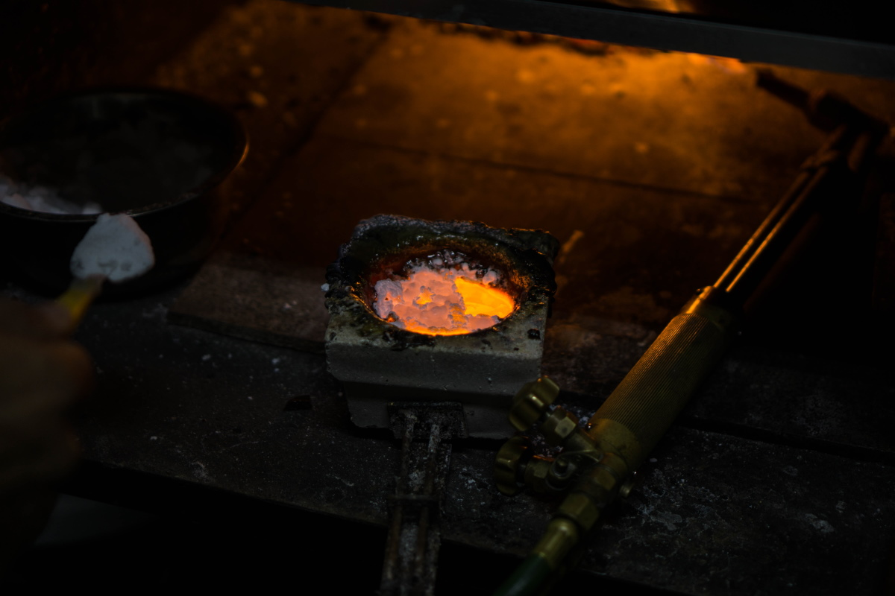
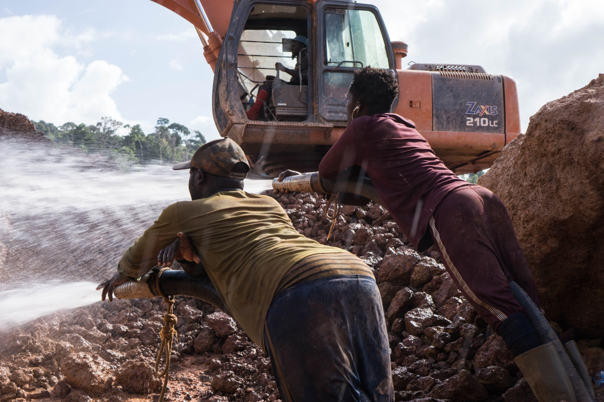
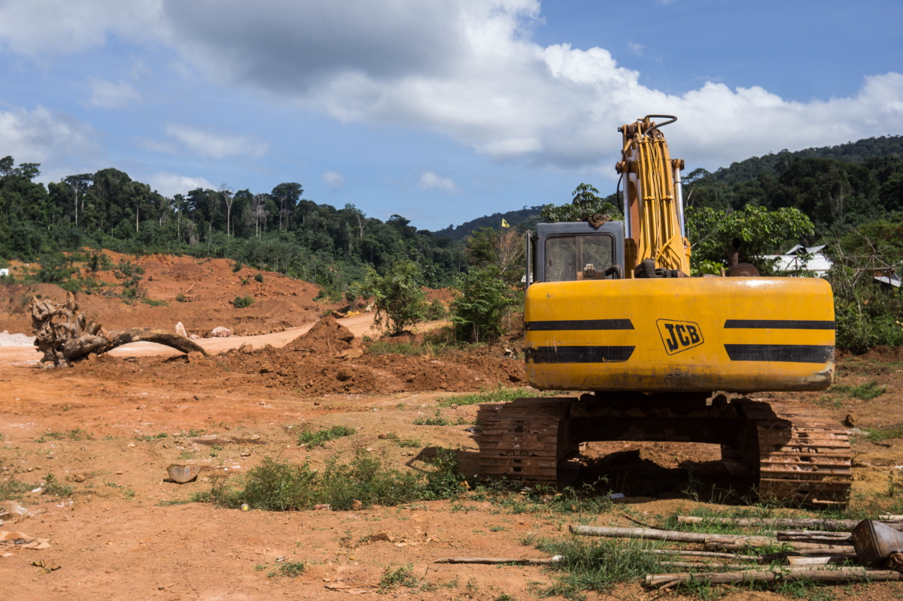

import Image from "!url-loader!../../images/fotos/suriname-900.jpg"

export const meta = {
  name: "suriname",
  title: "The Gold Rush threatening the World's greenest country",
  intro: "Suriname’s waterways and trade winds carry mercury, a toxic metal used in gold extraction, to regions far removed from the country’s gold mines.",
  by: "By Bram Ebus (texts and photos) and Wilfred Leeuwin (texts). Vídeos by Tom Laffay",
  image: Image,
  next: {
	slug: "venezuela",
	title: "On the shores of Cuyuní, Mercury shines brighter than gold",
	description: "The closer you get to Guyana, to the east, the cheaper you will find the sought-after ‘quicksilver.’ The opening of an air route last year between the capital Georgetown and the."
  }
};

**Fast-paced surinamese men** carrying sports bags heavy with gold rush through the entrance of one of the gold shops in the center of Paramaribo, the capital city of Suriname. The lookout, a man in sunglasses and shorts, watches from the parking lot, his hand resting on the crossbody bag fastened across his chest. Inside, Chinese, Portuguese, Surinamese, and Dutch can all be overheard as kilograms of gold change hands. No one asks the men where the gold was mined before they leave the shop, bags now heavy with cash.

At the counter, Harry Souza*, a muscular Brazilian man, shows off his tattoos and a small metal bucket full of gold bars in different sizes and colors. There are even some “sponges,” another name for the amalgam of mercury and gold that comes straight from the mines and looks like a luxurious coral reef. “The redder it is, the higher the quality,” says Souza. “The greener or blacker, the less [valuable].” In a backroom of the gold shop, a blowtorch is spitting flames, and Souza heads back to burn off the surplus mercury under an extractor hood. The amount of gold left behind in the bucket weighs around one kilogram—a market value of more than US$ 62,000 (as on September 4)

<Gallery>

 *Gold mining is the driving force of the Surinamese economy*

</Gallery>

Gold mining is the driving force of the Surinamese economy, a small country in the northeast corner of South America. On paper,Suriname produced about 32,800 kilograms of gold in 2019, and more than half of it came from artisanal and small-scale mining. Gold accounts for more than 80 percent of Suriname’s income from exports.

Much like in Guyana, Suriname's gold industry is propped up by a black market for mercury, the toxic metal used in the extraction process. The country uses over 50 tonnes of mercury a year, and experts believe all of it now enters the country illegally. Mercury pollution is rampant throughout the country, from the capital city on the coast to remote river basins in the interior, but without assistance from the government, small scale miners must often choose between supporting mercury trafficking networks or losing their livelihoods.

> "Suriname's gold industry is propped up by a black market for mercury. The country uses 50 tonnes a year, and experts believe all of it enters the country illegally."

<iframe src="https://datawrapper.dwcdn.net/bILLT/2/"></iframe>

---

In satellite images, Suriname is almost entirely green. The jungle covers 93 percent of the country, making it the most heavily forested nation in the world. But a modern gold rush is threatening the country’s lush green forests.

> Legal and illegal gold mining projects have become the biggest contributor to deforestation in Suriname.

Throughout the rainforest, many communities depend on mining, including the Maroons, the descendents of African slaves who escaped from Dutch plantations on the coast and settled in the interior, who have strong cultural connections with mining and gold. The spike in gold prices at the beginning of the 21st century has led to a rapid expansion of the gold mining industry, especially in Maroon territory. Legal and illegal gold mining projects have become the biggest contributor to deforestation in Suriname. Yearly deforestation in Suriname increased with 12 percent in 2018, which was the fifth highest increased deforestation rate in the world

<Video url="https://youtube.com/embed/B-6C1u8KqHw" />

The industry’s footprint is greatest in easily accessible settlements like Brownsweg, a small Maroon village in Suriname’s interior. A majority of the population is involved in mining. At night, a few wealthy miners show up to party in front of the Chinese supermarkets and liquor stores, drifting 360s with Lexusses in the jungle. But most are subsistence miners and scramble to make ends meet.

At a mining site an hour outside of Brownsweg, one of the local Maroon community leaders, called captains, walks around the ochre-colored craters that scar the green jungle. Sporting flip flops and a Pangi, the traditional Maroon cloth worn over his right shoulder, “Capy” explains that his miners use heavy machinery to dig the pits, but need mercury to separate the gold from the mud.

<Gallery>

 *In easily accessible settlements like Brownsweg, a small Maroon village in Suriname’s interior. A majority of the population is involved in mining*

</Gallery>

<Sidenote side="left" title="">
	About 98 percent of the miners in Suriname use mercury, which binds to small flecks of gold mixed in with the water and mud that’s flushed from the pits.
</Sidenote>

It is the mercury that greases the wheels of the local mining economies. About 98 percent of the miners in Suriname use mercury, which binds to small flecks of gold mixed in with the water and mud that’s flushed from the pits. Without the liquid quicksilver, the artisanal mines would be unable to efficiently extract the gold locked in the jungle’s soil, according to Jessica Naarendorp, the chief financial officer of NANA Resources, a Surinamese company that previously mined gold, but now mainly explores for national and foreign mining companies.

For every kilogram of gold that’s extracted, roughly three kilograms of mercury are used, most of which is released into the fragile Amazon ecosystem.

---

More than 100 kilometers to the north of Capy’s mine, Paul Ouboter, a biologist and the director of the [Institute for Neotropical Wildlife and Environmental Studies](https://www.neowild.org/) (also known as NeoWild) in Suriname, sits on the terrace of his house in Paramaribo. He traces the path of the country’s waterways on the maps on his laptop screen. Much of the mercury released by the mining sector ends up accumulating in the region’s rivers, according to Ouboter. From there, it travels up the food chain. Indigenous communities like the Maroon, who rely on fish for a large portion of their diet, are exposed to particularly high mercury levels.

<Video url="https://youtube.com/embed/-0sUAudv6CA" />

Research shows that nearly half of wild-caught, predatoryfish in Suriname have elevated levels of mercury. “That’s a problem because people like to eat big fish,” he grins. “It’s not easy to change people's habits in eating, but that’s what we have to do.” Giant wolffish, piranhas, and several catfish on the menu in Suriname should all be avoided, according to Ouboter.

But mercury is not only transported through water and fish; it also travels through the air after evaporating from the surface of water and vegetation or after miners burn mercury off the amalgam on-site. “What happens then is that it goes with the northeastern trade winds to the west and then it is deposited again, especially when it rains,” says Ouboter. Airborne mercury can end up in regions without any gold mining,such as the upper Coppename river basin.

Ouboter is calling for an immediate ban on mercury, though he cautions that it’s impossible to reverse the damage done to river systems. The mercury that’s in the ecosystem will remain there for centuries.

---

Capy, the gold miner in Brownsweg, is aware of the environmental impact of his operation, but claims it’s nothing compared to the international corporations that dig deeper than the small and medium-scale miners and apply toxic cyanide in their extraction process. Cyanide pollution, though not as persistent as mercury contamination, is still a major threat to wildlife and human health. “As I see it, the government has big interests in these large companies,” he says, “so they don't care.”

<Video url="https://youtube.com/embed/ii6Bi2Zy3Ng" />

The two big foreign mining multinationals in Suriname, IAMGOLD and Newmont Mining, use a process called cyanide heap leaching, which can extract finer concentrations of gold from the ground. With these advanced methods, the foreign investors can work through terrains previously mined by the Maroons in the interior, who can only trap about 30 percent of the available gold.

The Maroon captain complains that the mines are not the only source of mercury pollution. The gold shops in Paramaribo, he argues, use the same techniques to burn off mercury and isolate gold. “In the city they think that we inland residents are not good, nothing we do is good,” he says. “But when we bring our gold to the city, the same thing happens there. And no one can tell me that it is not harmful there.”

> “In the city they think that we inland residents are not good, nothing we do is good,”

---

Suriname’s small but bustling capital Paramaribo is a melting pot of ethnicities. Old Dutch colonial houses and an international cuisine make the city a destination for tourists, mostly arriving on direct flights from The Netherlands. Despite its small population of 586,000, the country has no dominant ethnicity. Indian and Chinese laborers brought in after the end of slavery in 1863 now make up over a quarter of Suriname’s population. The official language is Dutch, and the common language is Sranan Tongo, a Dutch, English, and Portuguese creole, but Portuguese dominates in the northern part of the city, a neighborhood called Little Belem–named after a Brazilian city located over 1,000 km from Paramaribo.

<Video url="https://youtube.com/embed/R4kwzxuetgE" />

Little Belem features many Brazilian supermarkets and storefront shops advertising ‘compra de ouro’—Portuguese for “buying gold.” The migrant community was built on decades of labor migration by Brazilians looking for brighter economic prospects. Most of them found work as garimpeiros, illegal gold miners, or running the trade in Paramaribo’s gold shops, which pour mercury vapor into the air above the city from rooftop chimneys.

Dennis Wip, a senior lecturer at the University of Suriname who specializes in mercury pollution, warns that these chimneys can be slow killers.

> “In Paramaribo we have seen measurements that are six to twelve times higher than in the goldfields

“Mercury pollution is a big issue in Suriname,” says Wip, and not only at remote mining sites, as many people assume. “In the city of Paramaribo the pollution is quite high,” he says. Emissions from the gold shops on occasion drive atmospheric mercury levels in the city to 30,000 nanograms per cubic meter, significantly higher than standards in the European Union and United States deem safe, according to the scientist. “In Paramaribo we have seen measurements that are six to twelve times higher than in the goldfields,” he says. “That means that in town we need to take care of the gold business.”

 *Emissions from the gold shops on occasion drive atmospheric mercury levels in Paramaribo*

Equipment in the gold shops, especially the retorts, which are mercury capture devices, are often dysfunctional or in bad shape, according to Wip. Most of the gold shops employees consulted for this report were either not aware of the harms of mercury contamination or downplayed the impact, which experts blame on the “macho culture” of the industry, lack of access to medical remedies and the slow-acting nature of the toxin.

Without better equipment and education about the risks, mercury emissions in Paramaribo could continue to increase as gold prices continue to rise, and more of the precious metal makes its way into the capital’s gold shops.

---

In 2018, Suriname ratified the Minamata Convention on Mercury, a global treaty designed to reduce mercury pollution, in part by eliminating its use in gold mining. But mercury continues to pour in across its borders, mostly through illegal channels. While mercury can be legally imported with a license, no permits have been granted since 2004.

[An estimated 56 tonnes](https://www.iucn.nl/-files/groene_economie/regional_mercury_report_suriname.pdf) of mercury were used in Suriname in 2018, the most recent year for which data is available, and various mining hardware stores, run by Brazilians, Indians, and Chinese owners, confirm that they can set a client up with the liquid quicksilver. "The wide availability of mercury in Suriname and the fact that no single legal mercury import took place in over 15 years gives rise to the suspicion that all the mercury on the market entered the country illegally," says Marieke Heemskerk, an anthropologist with a long track record investigating the Surinamese gold sector.

None of the store owners would divulge how they acquired the quicksilver in the first place, but it turns out it's not hard to find if you know who to ask.

 *Wrapped inside a newspaper a mercury dealer reveals a small, white bottle filled with a heavy and silvery liquid. “It comes from Guyana,” the man says.*

At around six in the afternoon, the bars near the gold shops of Little Belem and the streets of Paramaribo start to get noisier as the sun sets over the city. An Indian cab driver sips nervously from a half-liter can of Heineken beer while lingering next to his cab on the Anamoestraat, the main street in Little Belem. When asked about the liquid quicksilver, he offers to drive to a nearby gas station to make a quick phone call to a dealer. He hangs up and announces that a kilogram of mercury will cost $110, and that a seller is on the way.

Within a few minutes another car appears. The driver rolls down his window and holds up a rolled-up newspaper that he brought with him. “It comes from Guyana,” the man says. Wrapped inside is a small, white bottle filled with a heavy, silvery liquid. The dealer unscrews the plastic bottle and pours a tiny amount of quicksilver into the bottle cap to prove that he has the product. When asked how much more mercury he could get, he asks: “How much would you want?” There seems to be no shortage of it, despite the fact that not a single shipment of mercury has been seized on route from Guyana since 2014.

---

Not all of the illicit mercury in the country comes from Guyana, according to a source in Paramaribo, who agreed to an interview on the condition that he only be identified as an anonymous “gold entrepreneur.” On regular trips south, to work in the mines in the country's interior, he's learned that there are other routes by which mercury enters the country. During an interview, he calls his Chinese-Surinamese, mining-equipment trader for more information.

The Chinese-Surinamese trader claims that the Chinese provide most of the country’s mercury now. Shops buy containers of the mercury for $3000 USD and sell it for $3200. “If it comes from China, it only needs to pass through one location,” the entrepreneur says. “The [sea]port.”

A 2020 study from the International Union for Conservation of Nature National Committee of the Netherlands [(IUCN NL)](https://www.iucn.nl/-files/groene_economie/lr_mercury_brochure_digitaal_gebruik.pdf) found that no illegal mercury shipments from China have been intercepted, but informants told investigators that customs officials are commonly bribed to let illicit goods enter the country.

Back on “the backtrack,” the informal river crossings between Guyana and Suriname, a Surinamese boat-trafficker looks out over the Corentyne River near Nieuw Nickerie. He claims that mercury is taken from Suriname to Guyana, and that the contraband routes are very fugacious. He carried mercury across the river himself in the opposite direction, from Guyana to Suriname, in industrial-sized packaging until about five months ago. “The people buy the big bottles … and they pack it in smaller bottles to trade and sell it quicker,” the trafficker says.

<Video url="https://youtube.com/embed/wlKJb1KKJCc" />

Corruption, fast-changing modus operandi, and a lack of resources frustrate some of Suriname’s well-intentioned law enforcement officers. “The border is open,” says a local officer in the Nieuw Nickerie municipality. Multiple crossing points provide ample opportunities for smugglers. On the Surinamese banks of the river, there are many informal inroads and creeks, facilitating an easy entrance. We cannot have eyes on all places at a time," he says, adding that smugglers are "becoming smarter and smarter.”

> We cannot have eyes on all places at a time," he says, adding that smugglers are "becoming smarter and smarter."

---

Capy, the Maroon mine owner, has run his mine near Brownsweg for 15 years. Just as most miners interviewed for this report, he hopes to abandon the mercury, but lacks proper guidance. “We are willing. If they say there is another way, we want to work with it,” Capy says. “But they [the government] say nothing; they teach us nothing.”

The career miner’s argument is echoed by Naarendorp. “No one can be against Minamata,” she says, “but the moment you say we're going to ban something, you have to come up with an alternative.”

<Video url="https://youtube.com/embed/9uuO-lK0GnE" />

Many of the inland miners are hard workers, but uneducated, according to Naarendorp. She argues that the miners need not only to be educated, but also to be convinced about alternative or safe methods, which are often very costly or hard to access. “We all want to go-green,” she says, “but then it must be affordable.”

Capy admits that they need to buy mercury on the black market. “There is no specific place where it can be bought, because it is prohibited, just like cocaine, marijuana, and ecstasy. This kind of thing you just find on the street because it is forbidden stuff.”

*\*Some names have been changed to protect the identities of interviewees.*
