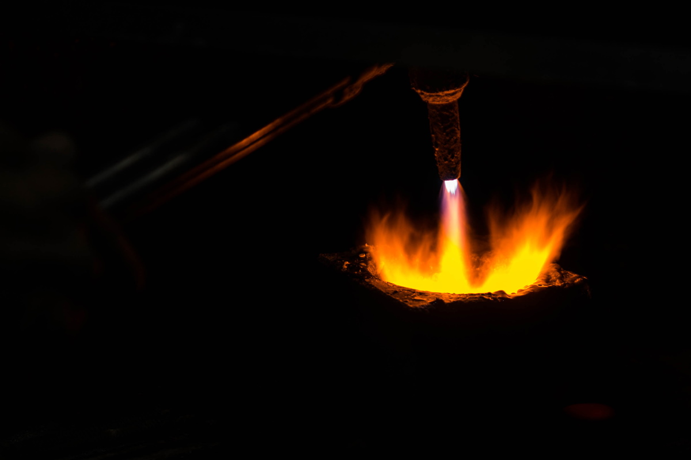
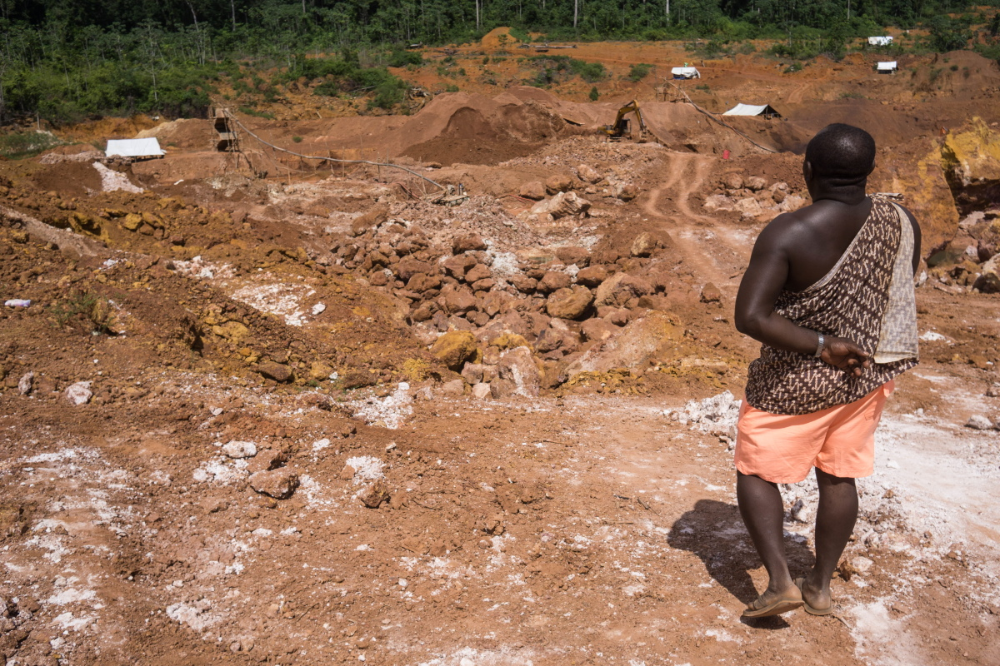

import Image from "!url-loader!../../images/fotos/suriname-900.jpg"

export const meta = {
  name: "suriname",
  title: "La fiebre del oro amenaza al país más verde del mundo",
  intro: "Las vías fluviales y los vientos de Surinam llevan el mercurio, un metal tóxico utilizado en la extracción de oro, a regiones muy alejadas de las minas de oro del país.",
  by: "por Bram Ebus (textos y fotografia) y Wilfred Leeuwin (textos). Vídeos por Tom Laffay",
  image: Image,
    next: {
	slug: "venezuela",
	title: "La fiebre del oro amenaza al país más verde del mundo",
	description: "Las vías fluviales y los vientos de Surinam llevan el mercurio, un metal tóxico utilizado en la extracción de oro, a regiones muy alejadas de las minas de oro del país."
  }
};

**Hombres de Surinam con** ritmo acelerado, cargando bolsos deportivos atestados de oro, cruzan la entrada de una de las tiendas de oro en el centro de Paramaribo, la capital de Surinam. El vigilante, un hombre con lentes de sol y shorts, mira desde el estacionamiento, con la mano apoyada en el bolso que lleva cruzado en el pecho. En el interior, se puede escuchar a chinos, brasileños, surinameses y holandeses mientras los kilogramos de oro cambian de manos. Nadie pregunta a los hombres de dónde se extrajo el oro, antes de que salgan de la tienda; ahora los bolsos ahora están llenos de dinero.

En el mostrador, Harry Souza*, un brasileño musculoso, muestra sus tatuajes y un pequeño cubo de metal lleno de barras de oro de diferentes tamaños y colores. Incluso hay algunas “esponjas”, otra manera de llamar la amalgama de mercurio y oro que viene directamente de las minas y parece un lujoso arrecife de coral. “Cuanto más rojo es, más alta es la calidad”, dice Souza. “Cuanto más verde o negro, menos [valioso]”. En la trastienda del local de oro, un soplete arroja llamas, y Souza regresa para quemar el mercurio sobrante bajo una campana de extracción. La cantidad de oro que queda en el recipiente pesa aproximadamente un kilo, un valor de mercado de más de US$62.000 (precio en 4 de septiembre).

<Gallery>

 *Gold mining is the driving force of the Surinamese economy*

</Gallery>

La minería del oro es la fuerza motriz de la economía de Surinam, un pequeño país en la esquina noreste de América del Sur. Oficialmente, Surinam produjo alrededor de 32.800 kilogramos de oro en el 2019, y más de la mitad de ese oro provino de la minería artesanal y en pequeña escala. El oro representa más del 80% de los ingresos de Surinam por exportaciones.

Tal como en Guyana, la industria aurífera de Surinam está apoyada por un mercado negro de mercurio, el metal tóxico utilizado en el proceso de extracción. El país utiliza más de 50 toneladas de mercurio al año, y los expertos creen que ahora todo entra en el país de forma ilegal. La contaminación por mercurio es desenfrenada en todo el país, desde la capital en la costa hasta las remotas cuencas fluviales en el interior; pero sin la ayuda del gobierno, los mineros artesanales deben elegir a menudo entre apoyar las redes de tráfico de mercurio o perder sus medios de subsistencia.

> Tal como en Guyana, la industria aurífera de Surinam está apoyada por un mercado negro de mercurio

<iframe src="https://datawrapper.dwcdn.net/rUFBE/2/"></iframe>

---

En las imágenes satelitales, Surinam es casi totalmente verde. La selva cubre el 93% del país, convirtiéndolo en una de las naciones más selváticas del mundo; sin embargo, una moderna fiebre del oro está amenazando las exuberantes selvas del país.

> Los proyectos de extracción de oro legales e ilegales se han convertido en el mayor contribuyente a la deforestación en Surinam.

Muchas comunidades a lo largo y ancho de la selva dependen de la minería, incluyendo a los cimarrones, descendientes de los africanos esclavizados que escaparon de las plantaciones holandesas de la costa y se asentaron en el interior, quienes tienen fuertes conexiones culturales con la minería y el oro. El aumento de los precios del oro a principios del siglo XXI ha dado lugar a una vertiginosa expansión de la industria de la minería del oro, especialmente en el territorio cimarrón. Los proyectos de extracción de oro legales e ilegales se han convertido en el mayor contribuyente a la deforestación en Surinam. La deforestación anual en Surinam aumentó en un 12% en el 2018 ―el quinto mayor aumento de la tasa de deforestación en el mundo.

<Video url="https://youtube.com/embed/B-6C1u8KqHw" />

La huella de la industria es mayor en los asentamientos de fácil acceso, como es el caso de Brownsweg, un pequeño pueblo cimarrón en el interior de Surinam. La mayoría de la población se dedica a la minería. En las noches, unos pocos mineros adinerados se presentan para festejar frente a los supermercados y licorerías chinas, derrapándose con giros de 360 grados con sus Lexus en la selva; pero la mayoría son mineros de subsistencia y luchan para llegar a fin de mes.

En una mina ubicada a una hora en las afueras de Brownsweg, uno de los líderes de la comunidad cimarrona local, llamados capitanes, camina alrededor de los cráteres ocres que marcan la selva verde. Luciendo chancletas y un Pangi, el tradicional paño cimarrón, que él lleva sobre su hombro derecho, “Capy” explica que sus mineros utilizan maquinaria pesada para cavar las fosas, pero necesitan mercurio para separar el oro del barro.

<Gallery>

 *In easily accessible settlements like Brownsweg, a small Maroon village in Suriname’s interior. A majority of the population is involved in mining*

</Gallery>

<Sidenote side="left" title="">
	Alrededor del 98% de los mineros de Surinam usan mercurio, que se une a pequeñas partículas de oro mezcladas con el agua y el lodo.
</Sidenote>

El mercurio es el que engrasa los engranajes de las economías mineras locales. Alrededor del 98% de los mineros de Surinam usan mercurio, que se une a pequeñas partículas de oro mezcladas con el agua y el lodo que sale de las minas. Sin el mercurio líquido, las minas artesanales no podrían extraer eficientemente el oro enclavado en el suelo de la selva, señala Jessica Naarendorp, directora financiera de NANA Resources, una empresa surinamesa que anteriormente extraía oro, pero que ahora explora principalmente para empresas mineras nacionales y extranjeras.

Por cada kilogramo de oro que se extrae, se utilizan aproximadamente tres kilogramos de mercurio y, de estos, la mayoría se libera en el frágil ecosistema amazónico.

---

A más de 100 kilómetros al norte de la mina de Capy, Paul Ouboter, biólogo y director del [Instituto de Vida Silvestre Neotropical y Estudios Ambientales](https://www.neowild.org/) (también conocido como NeoWild) en Surinam, se sienta en la terraza de su casa en Paramaribo. Traza el camino de las vías fluviales del país en los mapas de la pantalla de su portátil. Gran parte del mercurio liberado por el sector minero termina acumulándose en los ríos de la región, según indica Ouboter, y desde allí, viaja por la cadena alimenticia. Las comunidades indígenas como la cimarrona, que dependen del pescado para gran parte de su dieta, están expuestas a niveles de mercurio particularmente altos.

<Video url="https://youtube.com/embed/-0sUAudv6CA" />

La investigación muestra que casi la mitad de los peces depredadores capturados en su hábitat natural en Surinam tienen altos niveles de mercurio. “Eso es un problema porque a la gente le gusta comer peces grandes”, sonríe. “No es fácil cambiar los hábitos alimenticios de las personas, pero eso es lo que tenemos que hacer”. Ouboter advierte que se deberían evitar el pez lobo gigante, las pirañas y varios bagres del menú de Surinam.

Pero el mercurio no solo se transporta a través del agua y los peces, sino que también viaja por el aire después de evaporarse de la superficie del agua y la vegetación o después de que los mineros queman el mercurio de la amalgama en campo. “Lo que sucede entonces es que va con los vientos alisios del noreste hacia el oeste y luego vuelve a precipitarse, sobre todo cuando llueve”, dice Ouboter. El mercurio transportado por el aire puede llegar a regiones sin ninguna minería de oro, como la cuenca superior del río Coppename.

Ouboter exige una prohibición inmediata del mercurio, aunque advierte que es imposible revertir el daño causado a los sistemas fluviales. El mercurio que ya está en el ecosistema permanecerá allí durante siglos.

---

Capy, el minero de Brownsweg, es consciente del impacto ambiental de su operación, pero afirma que no es nada comparado con las corporaciones internacionales que cavan más profundo que los mineros de pequeña y mediana escala y aplican cianuro tóxico en su proceso de extracción. La contaminación por cianuro, aunque no tan persistente como la del mercurio, sigue siendo una gran amenaza para la vida salvaje y la salud humana. “A mi modo de ver, el gobierno tiene muchos intereses en estas grandes empresas”, dice, “por lo que no les importa”.

<Video url="https://youtube.com/embed/ii6Bi2Zy3Ng" />

Las dos grandes multinacionales mineras extranjeras de Surinam, IAMGOLD y Newmont Mining, utilizan un proceso llamado lixiviación en pilas con cianuro, que puede extraer concentraciones más finas de oro del suelo. Con estos métodos avanzados, los inversores extranjeros pueden trabajar en terrenos previamente explotados por los cimarrones del interior, quienes solo pueden obtener alrededor del 30% del oro disponible.

El capitán cimarrón se queja de que las minas no son la única fuente de contaminación por mercurio. Las tiendas de oro en Paramaribo, argumenta, usan las mismas técnicas para quemar el mercurio y aislar el oro. “En la ciudad piensan que los residentes del interior no somos buenos, nada de lo que hacemos es bueno”, dice. “Pero cuando sacamos nuestro oro a la ciudad, allí ocurre lo mismo, y nadie puede decirme que allí no es dañino.”

> “En la ciudad piensan que los residentes del interior no somos buenos, nada de lo que hacemos es bueno”

---

La pequeña pero bulliciosa capital de Surinam, Paramaribo, es un crisol de etnias. Las viejas casas coloniales holandesas y una cocina internacional hacen de la ciudad un destino para los turistas que, en su mayoría, llegan en vuelos directos desde los Países Bajos. A pesar de su población pequeña de 586.000 habitantes, el país no tiene una etnia dominante. Los trabajadores indios y chinos - traídos después del fin de la esclavitud en 1863 - ahora constituyen más de un cuarto de la población de Surinam. El idioma oficial es el holandés, y el idioma común es el Sranan Tongo, un criollo con base en el holandés, el inglés y el portugués, pero el portugués domina al norte de la ciudad, un barrio llamado Little Belem [pequeña Belén], llamado así por una ciudad brasileña situada a más de 1.000 km de Paramaribo.

<Video url="https://youtube.com/embed/R4kwzxuetgE" />

Little Belem tiene muchos supermercados brasileños y tiendas que anuncian ‘compra de ouro’ ―compra de oro en portugués. La comunidad migratoria se construyó sobre décadas de migración laboral de brasileños en busca de mejores perspectivas económicas. La mayoría de ellos encontraron trabajo como garimpeiros - mineros ilegales de oro - o dirigiendo el comercio en las tiendas de oro de Paramaribo, que vierten vapor de mercurio al aire sobre la ciudad desde las chimeneas de los tejados.

> “En Paramaribo hemos visto mediciones que son de seis a doce veces más altas que las de los yacimientos de oro”

Dennis Wip, profesor titular de la Universidad de Surinam especializado en la contaminación por mercurio, advierte que estas chimeneas pueden asesinar lentamente.

“La contaminación por mercurio es un gran problema en Surinam”, dice Wip, y no solo en sitios mineros remotos, como mucha gente supone. “En la ciudad de Paramaribo, la contaminación es bastante alta”, dice. De acuerdo al científico, las emisiones de las tiendas de oro en ocasiones elevan los niveles de mercurio atmosférico en la ciudad hasta 30.000 nanogramos por metro cúbico, significativamente más alto de lo que las normas de la Unión Europea y los Estados Unidos de América consideran seguro. “En Paramaribo hemos visto mediciones que son de seis a doce veces más altas que las de los yacimientos de oro”, dice. “Eso significa que tenemos que ocuparnos del negocio del oro en la ciudad”.

 *Emissions from the gold shops on occasion drive atmospheric mercury levels in Paramaribo*

Los equipos de las tiendas de oro, principalmente las retortas, que son dispositivos de captura de mercurio, suelen ser disfuncionales o estar en mal estado, según Wip. La mayoría de los empleados de las tiendas de oro, consultados para este informe, no eran conscientes de los daños de la contaminación por mercurio o restaron importancia a su impacto, lo que los expertos atribuyen a la “cultura machista” de la industria, la falta de acceso a recursos médicos y la naturaleza de acción retardada de la toxina.

Sin un mejor equipo y educación sobre los riesgos, las emisiones de mercurio en Paramaribo podrían seguir aumentando a medida que los precios del oro siguen en alza, y cada vez más del metal precioso llega a las tiendas de oro de la capital.

---

En el 2018, Surinam ratificó el Convenio de Minamata sobre el mercurio, un tratado mundial destinado a reducir la contaminación por mercurio, en parte eliminando su uso en la minería de oro. No obstante, el mercurio sigue llegando a través de sus fronteras, principalmente por canales ilegales; si bien el mercurio se puede importar legalmente bajo licencia, no se han concedido permisos desde 2004.

[Un estimado de 56 toneladas](https://www.iucn.nl/-files/groene_economie/regional_mercury_report_suriname.pdf) de mercurio se utilizaron en Surinam en el 2018, el año más reciente del que se disponen datos, y varias ferreterías mineras, dirigidas por propietarios brasileños, indios y chinos, confirman que pueden proveer mercurio líquido a un cliente. “La amplia disponibilidad de mercurio en Surinam y el hecho de que no se haya producido ninguna importación legal de mercurio en más de 15 años hace sospechar que todo el mercurio del mercado entró en el país de forma ilegal”, dice Marieke Heemskerk, antropóloga con una larga trayectoria en la investigación del sector aurífero de Surinam.

Ninguno de los propietarios de las tiendas quiso divulgar cómo adquirieron el mercurio en primer lugar, pero resulta que no es difícil de encontrar si se sabe a quién preguntar.

 *Wrapped inside a newspaper a mercury dealer reveals a small, white bottle filled with a heavy and silvery liquid. “It comes from Guyana,” the man says.*

Aproximadamente a las seis de la tarde, los bares cerca de las tiendas de oro de Little Belem y las calles de Paramaribo empiezan a ser más ruidosos a medida que el sol se oculta en la ciudad. Un taxista indio bebe nerviosamente de una lata de medio litro de cerveza Heineken mientras se queda al lado de su taxi en la Anamoestraat, la calle principal de Little Belem. Cuando se le pregunta por el mercurio líquido, se ofrece a conducir hasta una gasolinera cercana para hacer una rápida llamada telefónica a un distribuidor. Cuelga y anuncia que un kilogramo de mercurio costará $110 y que un vendedor está en camino.

En pocos minutos aparece otro automóvil. El conductor baja la ventanilla y sostiene un periódico enrollado que ha traído consigo. “Viene de Guyana”, dice el hombre. Dentro hay una pequeña botella blanca llena de un líquido pesado y plateado. El traficante desenrosca la botella de plástico y vierte una pequeña cantidad de mercurio en la tapa de la botella para demostrar que tiene el producto. Cuando se le pregunta cuánto más mercurio podría conseguir, pregunta: “¿Cuánto querría?” No parece haber escasez de él y no se ha incautado ni un solo transporte de mercurio en ruta desde Guyana desde el 2014.

---

No todo el mercurio ilícito del país proviene de Guyana, indica una fuente de Paramaribo, quien accedió a una entrevista con la condición de que solo se le identificara como un “empresario del oro” anónimo. En sus viajes regulares al sur para trabajar en las minas del interior del país, ha aprendido que hay otras rutas por las que el mercurio entra en el país. Durante una entrevista, llama a su comerciante chino-surinamés de equipos mineros para obtener más información.

El comerciante chino-surinamés afirma que ahora los chinos proveen la mayor parte del mercurio del país. Las tiendas compran contenedores de mercurio por $3000 y los venden por $3200 ―una ganancia de $200. “Si viene de China, solo tiene que pasar por un lugar”, dice el empresario. “El puerto [marítimo]”.

Un estudio realizado en 2020 por el Comité Nacional de la Unión Internacional para la Conservación de la Naturaleza de los Países Bajos ((IUCN NL))[(https://www.iucn.nl/-files/groene_economie/lr_mercury_brochure_digitaal_gebruik.pdf)] arrojó que no se han interceptado remesas ilegales de mercurio procedentes de China, pero los informantes dijeron a los investigadores que los funcionarios de aduanas por lo general son sobornados para que dejen entrar en el país mercancías ilícitas.

De vuelta en el “backtrack”, los cruces informales del río entre Guyana y Surinam, un surinamés traficante en bote observa el río Corentin cerca de Nieuw Nickerie. Afirma que el mercurio se lleva de Surinam a Guyana y las rutas de contrabando son muy fugaces. Hasta hace cinco meses, él mismo llevó el mercurio por el río en la dirección opuesta, de Guyana a Surinam, en envases de tamaño industrial. “La gente compra las botellas grandes... y las envasan en botellas más pequeñas para comercializarlas y venderlas más rápido”, relata el traficante.

<Video url="https://youtube.com/embed/wlKJb1KKJCc" />

La corrupción, los rápidos cambios en el modus operandi y la falta de recursos frustran a algunos de los bienintencionados agentes de orden público de Surinam. “La frontera está abierta”, dice un funcionario local del municipio de Nieuw Nickerie. Los múltiples puntos de cruce ofrecen amplias oportunidades a los contrabandistas. En las riberas surinamesas del río hay muchas rutas internas y riachuelos informales que facilitan la entrada. No podemos tener los ojos puestos en todos los lugares a la vez”, dice, y añade que los contrabandistas “se están volviendo cada vez más inteligentes”.

> No podemos tener los ojos puestos en todos los lugares a la vez”, dice, y añade que los contrabandistas “se están volviendo cada vez más inteligentes”.

---

Capy, el cimarrón propietario de una mina cerca de Brownsweg, la ha dirigido durante 15 años. Como la mayoría de los mineros entrevistados para este informe, espera abandonar el mercurio, pero le falta la orientación adecuada. “Estamos dispuestos. Si dicen que hay otra manera, queremos trabajar con ella”, dice Capy. “Pero ellos [el gobierno] no dicen nada; no nos enseñan nada”.

El argumento de los mineros de carrera se hace eco en Naarendorp. “Nadie puede estar en contra de Minamata”, dice, “pero en el momento en que dices que vamos a prohibir algo, tienes que ofrecer una alternativa”.

<Video url="https://youtube.com/embed/9uuO-lK0GnE" />

Muchos de los mineros del interior son trabajadores hábiles, pero sin formación, según Naarendorp. Ella sostiene que además de instruir a los mineros también es necesario convencerlos de métodos alternativos o seguros, pero estos suelen ser muy costosos o de difícil acceso. “Todos queremos ser más responsables con el medioambiente”, declara, “pero debe ser asequible”.

Capy admite que necesitan comprar mercurio en el mercado negro. “No hay un lugar específico donde se pueda comprar, porque está prohibido, al igual que la cocaína, la marihuana y el éxtasis. Este tipo de mercancía solo se encuentran en la calle porque están prohibidas”.

*\*Algunos nombres han sido cambiados para proteger las identidades de los entrevistados.*
