import Image from "!url-loader!../../images/fotos/suriname-900.jpg"

export const meta = {
  name: "suriname",
  title: "A Corrida do Ouro Ameaça o País mais Verde do Mundo",
  intro: "Os cursos de água e os ventos do Suriname transportam mercúrio, um metal tóxico utilizado na extração de ouro, para regiões distantes das minas de ouro do país.",
  by: "Por Bram Ebus (textos e fotos) e Wilfred Leeuwin (textos). Vídeos por Tom Laffay",
  image: Image,
  image: Image,
    next: {
	slug: "venezuela",
	title: "Nas margens de Cuyuní, o mercúrio brilha mais do que o ouro",
	description: "O mercúrio é mais seguro e mais lucrativo para o comércio do que o próprio ouro. Quanto mais perto você chegar da Guiana, mais barato você encontrará o procurado \"quicksilver\"."
  }
};

**Homens, em ritmo** acelerado, carregando pesadas bolsas esportivas com ouro, passam pela entrada de uma das lojas de ouro no centro de Paramaribo, a capital do Suriname. O vigia, um homem de óculos escuros e bermuda, observa do estacionamento e sua mão repousa na pochete, presa sobre o seu peito. Lá dentro, os idiomas chinês, português e holandês podem ser ouvidos,  à medida que os quilogramas de ouro passam de mão em mão. Ninguém pergunta aos homens de onde o ouro foi extraído antes deles saírem da loja. As bolsas agora estão pesadas com dinheiro vivo.

No balcão, Harry Souza*, um brasileiro musculoso, mostra suas tatuagens e um pequeno balde de metal cheio de barras de ouro em diferentes cores e tamanhos.  Existem até algumas "esponjas", outro nome para o amálgama de mercúrio e ouro vindo diretamente das minas e parecido com um luxuoso recife de coral. “Quanto mais vermelho, maior a qualidade”, diz Souza. “Quanto mais verde ou preto, menos [valioso].” Nos fundos da loja de ouro, um maçarico cospe chamas e Souza retorna para queimar o excesso de mercúrio sob um exaustor. A quantidade de ouro deixada para trás no balde pesa cerca de um quilograma - um valor de mercado de mais de US$ 62.000 (preço em 4 de setembro)

<Gallery>

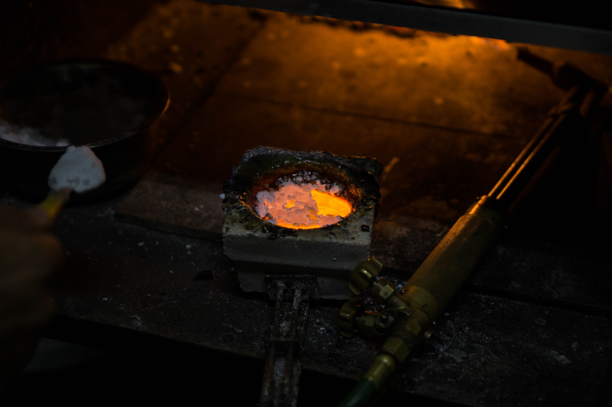 *Gold mining is the driving force of the Surinamese economy*

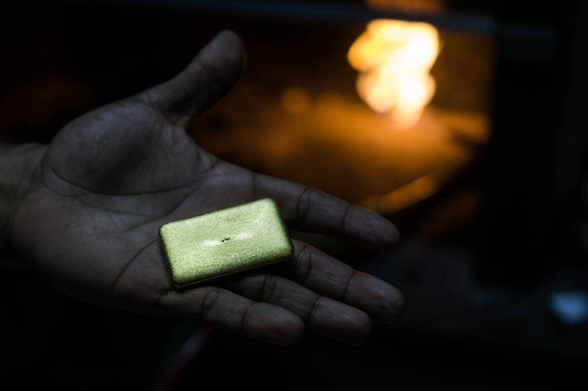

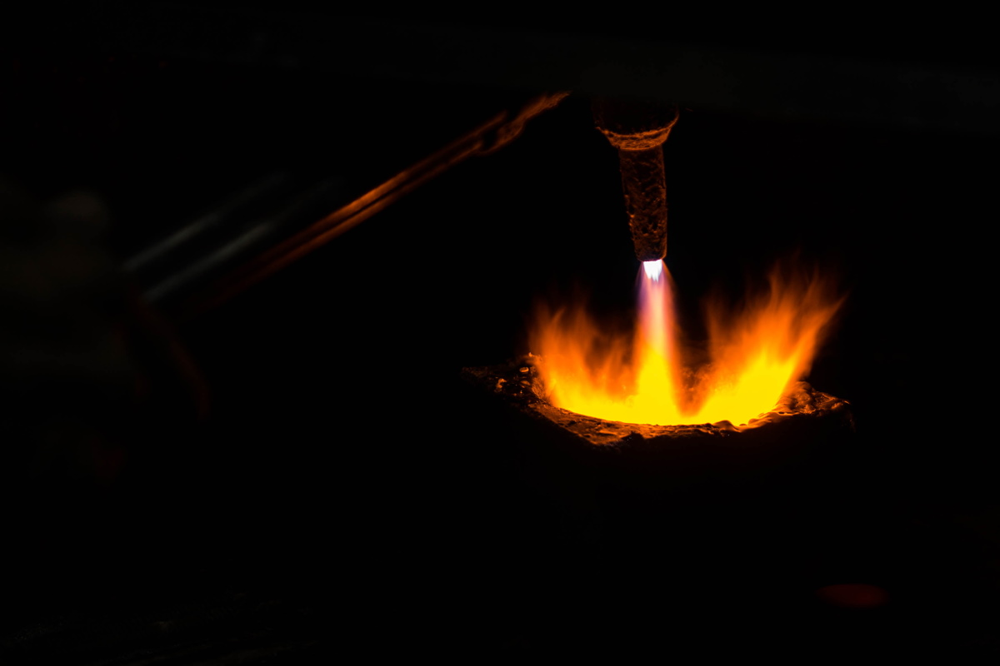

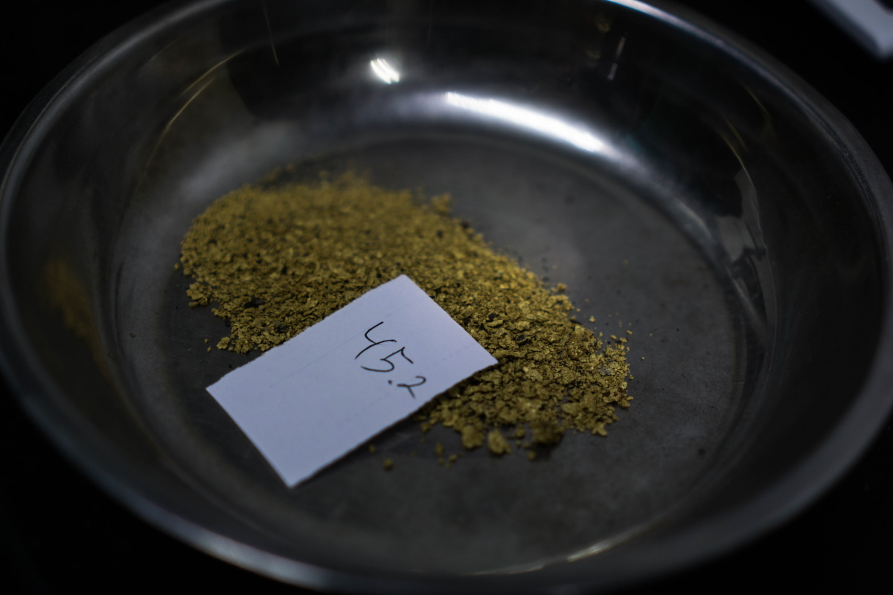

</Gallery>

A mineração de ouro é a força motriz da economia do Suriname, um pequeno país no canto nordeste da América do Sul. No papel, o Suriname produziu cerca de 32.800 quilos de ouro em 2019 e mais da metade disso veio da mineração artesanal e de pequena escala. O ouro é responsável por mais de 80% da receita do Suriname em exportações.

Tal como na Guiana, a indústria do ouro no Suriname é sustentada pelo mercado negro do mercúrio, o metal tóxico usado no processo de extração. O país usa mais de 50 toneladas de mercúrio ao ano, e os especialistas acreditam que toda essa quantia entra hoje ilegalmente no país. A poluição por mercúrio é galopante em todo o país, da capital litorânea até remotas bacias hidrográficas do interior, mas, sem a assistência do governo, os pequenos mineradores geralmente precisam escolher entre sustentar as redes de tráfico de mercúrio ou perder seus meios de subsistência.

> Tal como na Guiana, a indústria do ouro no Suriname é sustentada pelo mercado negro do mercúrio

<iframe src="https://datawrapper.dwcdn.net/0dj3l/2/"></iframe>

---

Nas imagens de satélite, o Suriname é quase totalmente verde. A selva cobre 93% do país, tornando-o uma das nações mais densamente florestadas do mundo. Mas uma moderna corrida pelo ouro está ameaçando as exuberantes florestas do país.

Por toda a floresta tropical, muitas comunidades dependem da mineração, incluindo os Maroons, descendentes de escravos africanos que escaparam das plantações holandesas no litoral, estabelecendo-se no interior e que possuem fortes conexões culturais com a mineração e o ouro. O aumento vertiginoso dos preços do ouro no início do século 21 levou a uma rápida expansão da indústria da mineração, especialmente no território quilombola. Projetos legais e ilegais de extração de ouro se tornaram os maiores responsáveis pelo desmatamento no Suriname. O desmatamento anual no Suriname aumentou 12% em 2018, sendo a quinta maior taxa de desmatamento no mundo.

> Projetos legais e ilegais de extração de ouro se tornaram os maiores responsáveis pelo desmatamento no Suriname.

<Video url="https://youtube.com/embed/B-6C1u8KqHw" />

O impacto da indústria é maior em assentamentos de fácil acesso, como Brownsweg, uma pequena vila maroon no interior do Suriname. A maioria da população está envolvida na mineração. À noite, alguns poucos garimpeiros mais abastados aparecem para festejar em frente aos supermercados chineses e às lojas de bebidas alcóolicas, perambulando com seus Lexus ES 360 na selva. Mas a maioria deles são garimpeiros de subsistência e fazem de tudo para se virar.

Em um garimpo a uma hora de Brownsweg, um dos líderes da comunidade marron local, chamados de capitães, anda pelas crateras de cor ocre, que formam uma cicatriz na floresta verde. Com chinelos esportivos e uma Pangi, a roupa tradicional  marron usada sobre seu ombro direito, “Capy” explica que seus garimpeiros usam maquinário pesado para escavar as minas, mas precisam do mercúrio para separar o ouro da lama.

<Gallery>

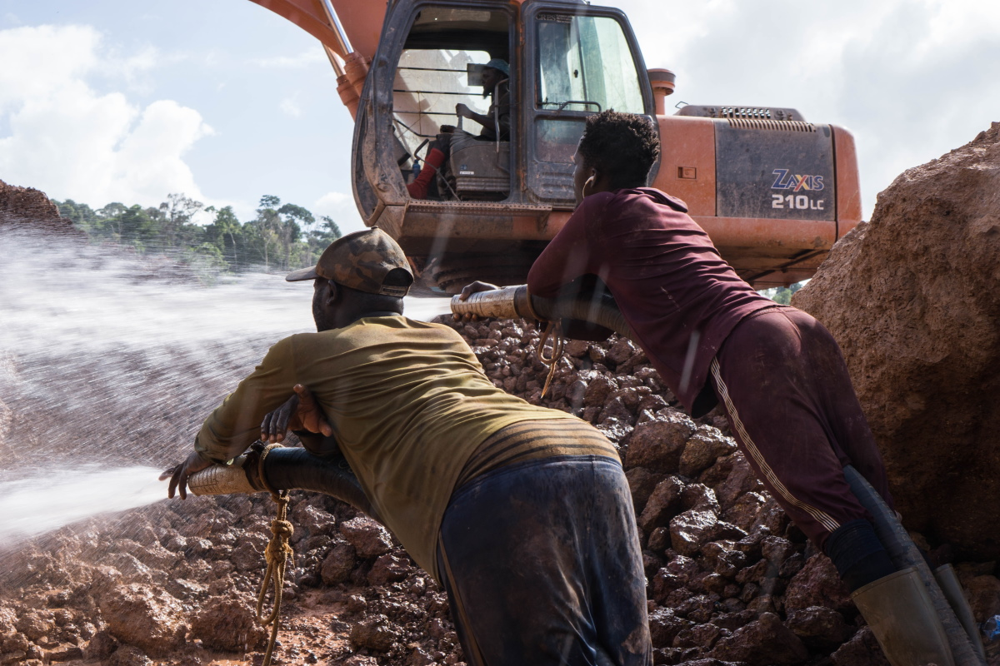 *Em povoados de fácil acesso como Brownsweg, um pequeno vilarejo marron no interior do Suriname. A maioria da população está envolvida na mineração.*

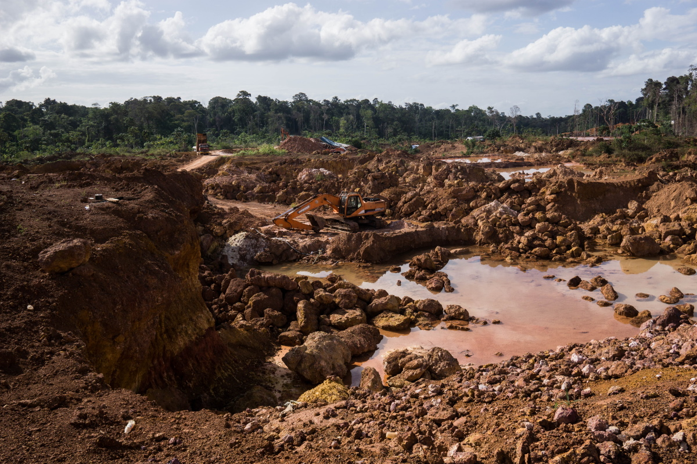

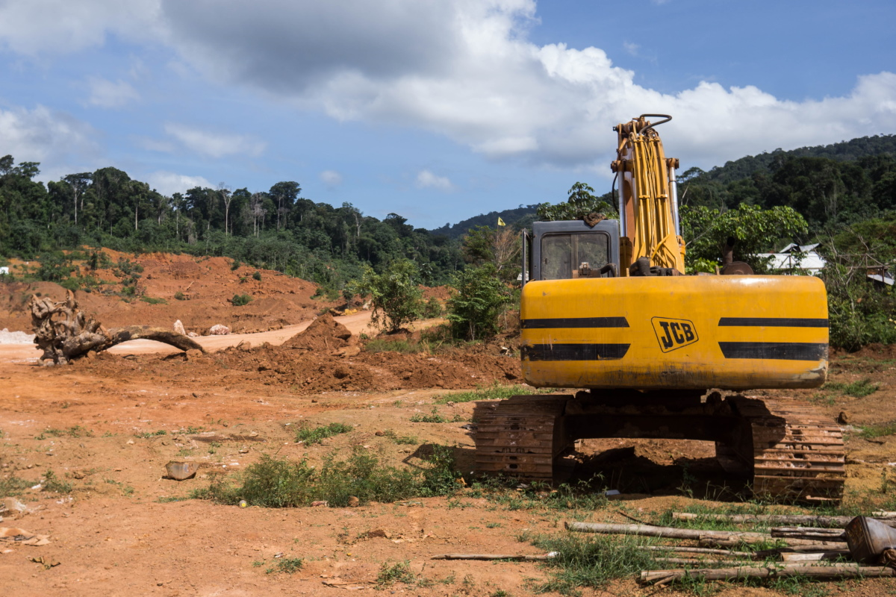

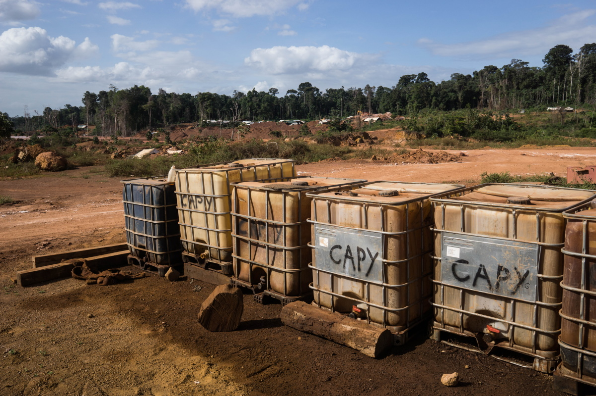

</Gallery>

<Sidenote side="left" title="">
	Cerca de 98% dos garimpeiros do Suriname usam mercúrio, que se liga aos pequenas fagulhas de ouro misturados à água e à lama
</Sidenote>

É o mercúrio que faz girar as economias de mineração locais. Cerca de 98% dos garimpeiros do Suriname usam mercúrio, que se liga aos pequenas fagulhas de ouro misturados à água e à lama, que são eliminadas das minas. Sem o  azougue líquido, os garimpos artesanais seriam incapazes de extrair de forma eficiente o ouro preso no solo da selva, de acordo com Jessica Naarendorp, diretora financeira da NANA Resources, uma empresa surinamesa que anteriormente extraía ouro, mas que agora explora principalmente para empresas de mineração nacionais e estrangeiras.

Para cada quilograma de ouro extraído, são utilizados aproximadamente três quilogramas de mercúrio, e a maior parte é liberada no frágil ecossistema da Amazônia.

---

Mais de 100 quilômetros ao norte da mina do Capy, Paul Ouboter, biólogo e diretor do [Institute for Neotropical Wildlife and Environmental Studies no Suriname (também conhecido como NeoWild)](https://www.neowild.org/), senta-se no terraço da sua casa em Paramaribo. Ele traça na tela do seu laptop as vias fluviais do país nos mapas. Grande parte do mercúrio liberado pelo setor de mineração acaba se acumulando nos rios da região, segundo Ouboter. De lá, o mercúrio acaba chegando à cadeia alimentar. Comunidades indígenas, como os Maroons, que dependem em grande parte do peixe na sua dieta alimentar, estão expostas a níveis particularmente altos de mercúrio.

<Video url="https://youtube.com/embed/-0sUAudv6CA" />

Pesquisas mostram que quase metade dos peixes predadores pescados no Suriname apresenta níveis elevados de mercúrio. "Isso é um problema, porque as pessoas gostam de comer peixes grandes", ele diz com um sorriso largo. "Não é fácil mudar os hábitos alimentares das pessoas, mas é o que precisamos fazer". Peixe lobo gigante, piranhas e vários bagres deveriam ser evitados no cardápio do Suriname, de acordo com Ouboter.

Mas o mercúrio não é transportado apenas pela água e pelos peixes, ele também viaja pelo ar, após sua evaporação das superfícies da água e da vegetação, ou depois que os garimpeiros queimam o mercúrio do amálgama no local. "O que acontece então é que o metal segue com os ventos alísios do nordeste para o oeste e depois é depositado novamente, especialmente quando chove", diz Ouboter. O mercúrio suspenso no ar pode chegar a regiões sem nenhum garimpo, como a bacia superior do rio Coppename.

Ouboter está solicitando a proibição imediata do mercúrio, apesar de advertir que é impossível a reversão dos danos causados aos sistemas fluviais. O mercúrio que já se encontra no ecossistema permanecerá por lá durante séculos.

---

Capy, o garimpeiro em Brownsweg, está ciente do impacto ambiental da sua operação, mas afirma que isso não é nada, se comparado às corporações internacionais, que escavam mais profundamente do que os garimpeiros de pequena e média escalas e que aplicam cianeto tóxico no seu processo de extração. A poluição por cianeto, embora não tão persistente quanto a contaminação por mercúrio, é ainda uma grave ameaça à vida selvagem e à saúde humana. "A meu ver, o governo possui grandes interesses nessas grandes empresas", ele diz, "então eles não se importam".

<Video url="https://youtube.com/embed/ii6Bi2Zy3Ng" />

As duas grandes multinacionais estrangeiras de mineração no Suriname, IAMGOLD e Newmont Mining, utilizam um processo chamado lixiviação por cianeto, que consegue extrair concentrações mais finas de ouro do solo. Com esses métodos avançados, os investidores estrangeiros podem trabalhar em terrenos anteriormente minerados pelos Maroons, que conseguem capturar apenas cerca de 30% do ouro disponível.

O capitão maroon reclama que as minas não são a única fonte de poluição por mercúrio. As lojas de ouro em Paramaribo, ele argumenta, usam as mesmas técnicas para queimar o mercúrio e isolar o ouro. "Na cidade, eles acham que nós, residentes do interior, não somos bons, nada do que fazemos é bom", diz ele. “Mas quando trazemos nosso ouro para a cidade, a mesma coisa acontece lá. E ninguém pode me dizer que isso não é prejudicial”.

> "Na cidade, eles acham que nós, residentes do interior, não somos bons, nada do que fazemos é bom"

---

Paramaribo, a pequena e agitada capital do Suriname, é um caldeirão de etnias. Antigas casas coloniais holandesas e uma cozinha internacional fazem da cidade um destino para turistas, a maioria chegando em voos diretos da Holanda. Apesar da sua pequena população de 586.000 habitantes, o país não possui uma etnia dominante. Trabalhadores indianos e chineses, trazidos depois do fim da escravidão em 1863, constituem  atualmente mais de um quarto da população do Suriname. O idioma oficial é o holandês, e o idioma comum é o Sranan Tongo, crioulo de base holandesa, inglesa e portuguesa, mas o português é dominante na parte norte da cidade, em um bairro chamado Little Belém - em homenagem à cidade brasileira localizada a mais de 1.000 km de distância de Paramaribo.

<Video url="https://youtube.com/embed/R4kwzxuetgE" />

Little Belém caracteriza-se por ter muitos supermercados e fachadas de lojas brasileiras anunciando em português a "compra de ouro". A comunidade de migrantes foi construída em décadas de migração da mão de obra de brasileiros em busca de melhores perspectivas econômicas. A maioria deles encontrou trabalho como garimpeiros, mineradores ilegais de ouro ou operando o comércio nas lojas de ouro de Paramaribo, que despejam vapor de mercúrio sobre o ar da cidade pelas chaminés dos telhados.

> "Em Paramaribo, vimos medições seis a doze vezes mais altas do que nos campos auríferos"

Dennis Wip, professor sênior na Universidade do Suriname, especialista em poluição por mercúrio, alerta que essas chaminés podem ser lentos assassinos.

"A poluição por mercúrio é um grande problema no Suriname", diz Wip, e não apenas em locais remotos de mineração, como muitas pessoas supõem. "Na cidade de Paramaribo, a poluição é bastante alta", diz ele. Ocasionalmente, as emissões na cidade das lojas de ouro elevam os níveis atmosféricos de mercúrio para 30.000 nanogramas por metro cúbico, significativamente mais altos do que os padrões considerados seguros pela União Europeia e pelos Estados Unidos, segundo o cientista. "Em Paramaribo, vimos medições seis a doze vezes mais altas do que nos campos auríferos", diz ele. "Isso significa que precisamos cuidar dos negócios de ouro da cidade".

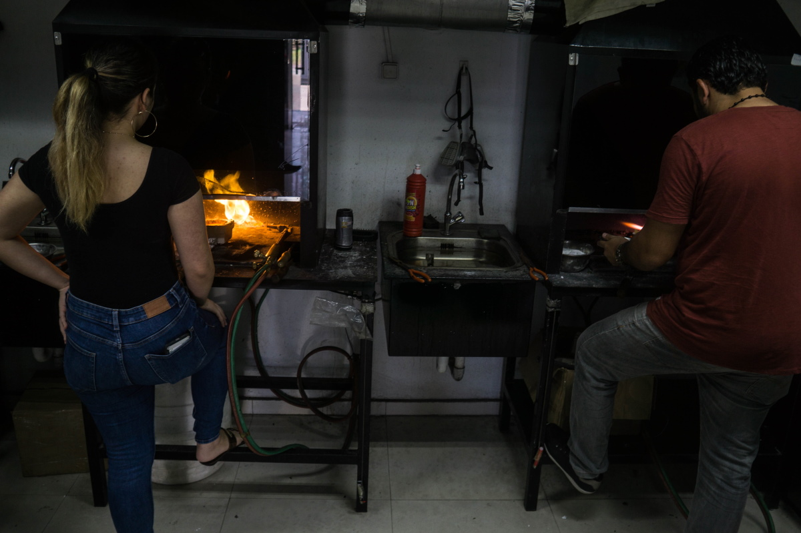 *As emissões das lojas de ouro elevam os níveis de mercúrio atmosférico em Paramaribo.*

Os equipamentos das lojas de ouro, especialmente as retortas, que são dispositivos de captura de mercúrio, são geralmente disfuncionais ou estão em mau estado, de acordo com Wip. A maioria dos funcionários das lojas de ouro consultada por esta reportagem não estava ciente dos danos causados pela contaminação por mercúrio ou subestimava seu impacto, o que os especialistas atribuem à “cultura machista” da indústria, à falta de acesso aos medicamentos e à natureza de ação lenta da toxina.

Sem melhores equipamentos e educação sobre os riscos, as emissões de mercúrio em Paramaribo poderiam continuar a aumentar, enquanto os preços do ouro continuam a subir e mais do precioso metal segue seu caminho até as lojas de ouro da capital.

---

Em 2018, O Suriname ratificou a Convenção de Minamata sobre Mercúrio, um tratado global projetado para reduzir a poluição por mercúrio, em parte pela eliminação do seu uso na extração do ouro. Mas o mercúrio continua chegando em grande quantidade por suas fronteiras, principalmente pelos canais ilegais. Embora o mercúrio possa ser legalmente importado com uma licença, nenhuma permissão foi concedida desde 2004.

[Estima-se que 56 toneladas](https://www.iucn.nl/files/groene_economie/regional_mercury_report_suriname.pdf) de mercúrio foram utilizadas em 2018 no Suriname, o ano mais recente para o qual há dados disponíveis, e várias lojas de ferramentas de mineração, operadas por proprietários brasileiros, indianos e chineses, confirmam que conseguem arranjar mercúrio ao cliente. "A ampla disponibilidade de mercúrio no Suriname e o fato de que nenhuma importação legal de mercúrio ocorreu em mais de 15 anos provocam a suspeita de que todo o mercúrio do mercado entrou no país de forma ilegal", diz Marieke Heemskerk, uma antropóloga com um histórico de uma longa trajetória pesquisando o setor do ouro no Suriname.

A princípio, nenhum dos lojistas divulgaria como adquiriu o mercúrio, mas acaba não sendo difícil descobrir, se você sabe a quem perguntar.

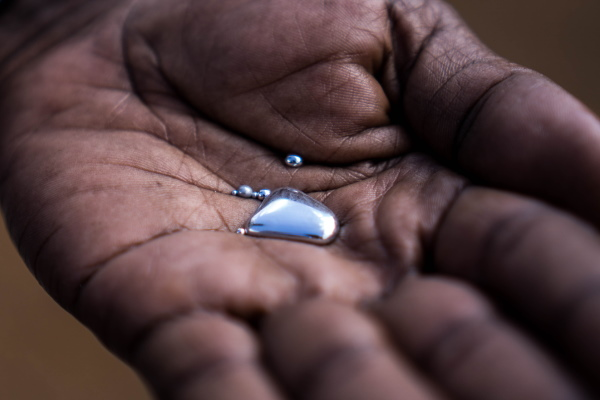 *Wrapped inside a newspaper a mercury dealer reveals a small, white bottle filled with a heavy and silvery liquid. “It comes from Guyana,” the man says.*

Por volta das seis da tarde, os bares próximos às lojas de ouro de Little Belém e as ruas de Paramaribo começam a ficar mais barulhentos, à medida que o sol se põe sobre a cidade. Um motorista de táxi indiano dá um gole nervoso em uma lata de meio litro de cerveja Heineken, enquanto fica ao lado do seu táxi na Anamoestraat, a principal rua de Little Belém. Quando questionado sobre o mercúrio, ele se oferece para ir a um posto de gasolina próximo, para fazer uma ligação rápida para um traficante. Ele desliga e anuncia que um quilograma de mercúrio custará US$ 110 e que um vendedor está a caminho.

Dentro de alguns minutos, aparece outro carro. O motorista abaixa a janela e segura um jornal enrolado que trouxe com ele. "Vem da Guiana", diz o homem. Embrulhada no seu interior está uma pequena garrafa branca cheia de um líquido pesado e prateado. O traficante destampa a garrafa de plástico e despeja uma pequena quantidade de prata-viva na tampa da garrafa, para provar que ele tem o produto. Quando perguntado sobre quanto mais mercúrio ele poderia conseguir, ele pergunta: "Quanto você quer?" Parece não haver escassez desse produto, e nem um único carregamento de mercúrio foi confiscado na rota da Guiana desde 2014.

---

Nem todo o mercúrio ilícito do país vem da Guiana, de acordo com uma fonte em Paramaribo, que concordou em dar entrevista, com a condição de que só seria identificado como um anônimo "empresário do ouro". Em viagens regulares ao sul para trabalhar nas minas no interior do país, ele aprendeu que existem outras rotas por onde o mercúrio entra no país. Durante a entrevista, ele liga para o seu comerciante de equipamentos de mineração chinês-surinamês para obter mais informações.

O comerciante chinês-surinamês afirma que os chineses fornecem agora a maior parte do mercúrio ao país. As lojas compram contêineres de mercúrio por US$ 3000 e os vendem por US$ 3200, com um lucro de US$ 200. "Se vem da China, só é necessário passar por um local", diz o empresário. "O porto [marítimo]."

Um estudo de 2020 da Union for Conservation of Nature National Committee of the Netherlands ([IUCN NL](https://www.iucn.nl/files/groene_economie/lr_mercury_brochure_digitaal_gebruik.pdf)) descobriu que nenhuma remessa ilegal de mercúrio vinda da China foi interceptada, mas informantes disseram aos investigadores que as autoridades alfandegárias geralmente recebem propinas para permitir que mercadorias ilícitas entrem no país.

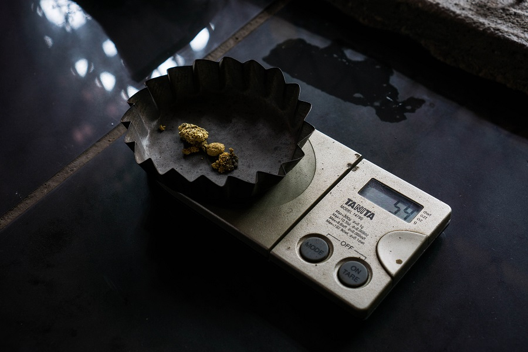 *{TROCAR ESTA IMAGEM} Imagem Map Suriname.jpg Crédito IUCN*

De volta à “backtrack”, como são chamadas as travessias fluviais informais entre a Guiana e o Suriname, um traficante surinamês com seu barco zela por todo o rio Corentyne, próximo de Nieuw Nickerie. Ele afirma que o mercúrio é levado do Suriname para a Guiana e que as rotas de contrabando são muito fugazes. Ele próprio transportou mercúrio pelo rio na direção oposta, da Guiana para o Suriname, em embalagens em tamanho industrial até aproximadamente cinco meses atrás. "As pessoas compram as garrafas grandes... e embalam em garrafas menores para negociar e vender mais rapidamente", diz o traficante.

<Video url="https://youtube.com/embed/wlKJb1KKJCc" />

A corrupção, a rápida mudança do modus operandi e a falta de recursos frustram alguns dos policiais bem-intencionados do Suriname. "A fronteira está aberta", diz um policial local da municipalidade de Nieuw Nickerie. Vários pontos de passagem oferecem amplas oportunidades para os contrabandistas. Nas margens surinamesas do rio, existem muitas invasões e canais informais, facilitando uma entrada fácil. “Não podemos ter olhos para todos os lugares ao mesmo tempo", diz ele, acrescentando que os contrabandistas estão “se tornando cada vez mais inteligentes".

> “Não podemos ter olhos para todos os lugares ao mesmo tempo", diz ele, acrescentando que os contrabandistas estão “se tornando cada vez mais inteligentes".

---

Capy, o proprietário maroon, administra sua mina perto de Brownsweg há 15 anos. Assim como a maioria dos garimpeiros entrevistados para esta reportagem, ele espera abandonar o mercúrio, mas falta orientação adequada. "Nós estamos dispostos. Se eles dizem que há outra maneira, queremos trabalhar com ela”, diz Capy. “Mas eles [o governo] não dizem nada; eles não nos ensinam nada".

O argumento do minerador é ecoado por Naarendorp. "Ninguém pode ser contra Minamata", diz ela, "mas no momento em que você diz que alguma coisa será proibida, precisa apresentar uma alternativa."

<Video url="https://youtube.com/embed/9uuO-lK0GnE" />

Muitos dos garimpeiros do interior são trabalhadores esforçados, mas sem instrução, de acordo com Naarendorp. Ela argumenta que os garimpeiros precisam não apenas ser educados, mas também ser convencidos de métodos alternativos ou seguros, que geralmente são muito caros ou de difícil acesso. "Todos nós queremos ser sustentáveis", diz ela, "mas isso deve ser acessível."

Capy admite que precisam comprar mercúrio no mercado negro. “Não existe um local específico onde possa ser comprado, porque é proibido, assim como a cocaína, a maconha e o ecstasy. Esse tipo de coisa que você só encontra na rua porque é uma coisa proibida".

*\*Alguns nomes foram mudados para proteger as identidades dos entrevistados.*
