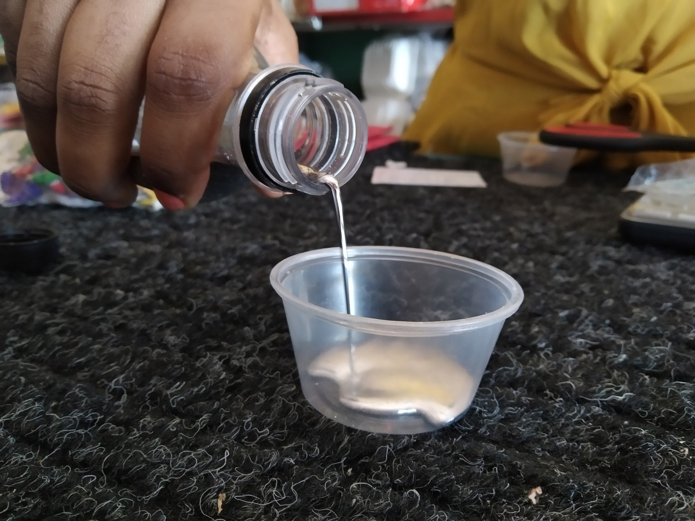

import Image from "!url-loader!../../images/venezuela/8.jpg"
import Map1 from "../../images/minimaps/reports/minimap-1-en.svg"
import Map2 from "../../images/minimaps/reports/minimap-2-en.svg"

export const meta = {
  name: "venezuela",
  title: "On the shores of Cuyuní, Mercury shines brighter than gold",
  intro: "The closer you get to Guyana, to the east, the cheaper you will find the sought-after ‘quicksilver.’ The opening of an air route last year between the capital Georgetown and the",
  by: "By Marcos David Valverde (text and photos)",
  image: Image,
  next: {
	slug: "brazil",
	title: "New gold rush moves illicit mercury markets in Roraima",
	description: "South America’s largest and most industrialized economy, Brazil, doesn’t produce mercury. But its booming illegal gold mines can't work without the toxic substance."
  }
};

**Cañamú does not exist** for Guyana, much less for Venezuela. Nor for Google Maps. The name, given to a two-row hamlet of ranches and buildings made of wooden planks and zinc panels, doesn't even exist for many of those who live in it. But the tiny village is still there, stubborn, growing among the dense greenery of the jungle on the eastern bank of the Cuyuní River in the disputed Essequibo territory controlled by Guyana, and across from San Martín de Turumbán, another hamlet on Venezuelan soil on the opposite bank.

Cañamú is nothing more than the name with which some locals—amalgamating syllables the same way they amalgamate gold with mercury—synthesize the routine side of the place's brief history: CAÑA (booze) y MUjeres (women).

There is also no consensus as to its founding date. Many say it dates back three years. Others say four or five. In all the disagreement, there is one tacit agreement that revolves around the payment methods for any exchange: There is no restriction on what counts as currency in the village. It can be Guyanese dollars, bolívars in cash, gold, or even cellphones. Alcohol and prostitution (the booze, the women, as the name summarizes). Gasoline for electric plants. Cigarettes. Some weed to smoke.

> There is no restriction on what counts as currency in the village. It can be Guyanese dollars, bolívars in cash, gold, or even cellphones.

In reality, what few call Cañamú, which has grown between an unpaved airstrip and Etheringbang (a spit of land, also on the shores of Cuyuní, on Guyanese soil) is, above all, a consequence of the Venezuelan diaspora. Many of those who were unable to legally emigrate across Bolívar state from north to south and into Brazil are now there. And to be there is to leave without having done it. Venezuela is just a couple of minutes away from Cañamú by boat. You do not need a passport. Not even an ID. Anyone can enter Cañamú crossing the Cuyuní from the port (a beach with a rickety dock made of rotten boards, slippery with mold and eaten away). In Cañamú, there is a menu of the most convenient rules and norms, cherry-picked from those of Venezuela and Guyana. One of them, from the latter country, is the freedom to buy and sell mercury in any store.

## Sympathize and you'll win

 *Venezuela is just a couple of minutes away from Guyana by boat.*

<Sidenote side="left">
	<Map1 />
</Sidenote>

In 2016, the same year of the Tumeremo massacre, in Bolívar state, southern Venezuela, in which at least 17 miners were killed by organized crime, the Venezuelan government created the Orinoco Mining Arc (Since then, at least 18 other killings have occurred in the designated mining zone, a territory of 111,000 square kilometers). In August of that year, president Nicolás Maduro announced by decree "The prohibition of the use of mercury in all activities related to the mining industry in Venezuela, absolutely and totally."

> Nicolás Maduro announced by decree "The prohibition of the use of mercury in all activities related to the mining industry in Venezuela, absolutely and totally."

That decree was perhaps a public gesture from Maduro to show that Venezuela was indeed willing to abide by the Minamata Convention, the 2013 international agreement in which 128 countries pledged to reduce the use of mercury.

At the same time, in Venezuela there were voices that insisted that something should be done to stop mercury contamination. They all met in the Network of Non-Governmental Environmental Organizations of Venezuela (Red ARA, in spanish), which also in 2013 published the [study](https://drive.google.com/file/d/0B5CV2YJ5UI8WMzhOZUtvd0NDaWc/edit) “Mercury contamination in Venezuelan Guiana: A proposal for dialogue for action.”

“Mercury contamination in Venezuelan Guiana has been recognized as a public health problem for more than 25 years. During this time, a significant number of investigations have been carried out that have revealed the presence of high mercury concentrations in people living in mining areas. Likewise, high mercury values have been found in the sediments of water bodies, and in fish used as food,” the report detailed.

It was a good time to act, and signing onto the Convention seemed like a sure step. But by 2019, 123 of the 128 countries ratified the agreement, and Venezuela, with Nicolás Maduro in command, was not one of them.

 *The Venezuelan migration crisis was the driving force behind the establishment of a hamlet located between Eterimbán and San Martín de Turumbán that some insist on calling Cañamú.*

Luis (a pseudonym), is a veteran smuggler who moves through the southeast of the state of Bolívar charming his way through the military roadblocks that cross his path. In January 2020, he confidently confirmed a known secret: mercury circulates regardless of presidential decrees or the Minamata agreement, packaged in plastic bottles on the streets and highways of the mining areas.

<Sidenote side="left">
	<Map2 />
</Sidenote>

“People who are very trustworthy call me and say: ‘Hey, I need to bring some bottles.’ They look like brake fluid reservoir pots. That comes well sealed. They give them to me and I put them in the car. They are like four little pots. They give me 100 gramas (as the gram of gold is called in southern Bolívar); 25 gramas for each pot (each weighs more than one kilo).”

There are other traffickers, he says, who will carry them for less. Luis’s starting point is San Félix, the eastern wing of Ciudad Guayana—the main urban area of Bolívar state—on the mouth of the Caroní River in the Orinoco. From there, after crossing Upata, a livestock enclave, he passes through the most important mining axis in the region: Guasipati, El Callao, Tumeremo, El Dorado, Las Claritas, and Kilometer 88.

Azogue (quicksilver in spanish), the most common name for mercury in the mining zones in Bolívar state, regularly has one destination in one of those towns. “The one that I carry comes from Colombia. There are also other things that are smuggled, such as fuel and explosives. There are trucks that carry 80 liters of fuel and that also has to be paid for at all the roadblocks. They can even carry drugs. There are not even X-rays. I know everyone [in the roadblocks],” he explains.

> He dodges problems with charisma when he transfers-or smuggles, to be more honest and precise-mercury trough one of the most difficult checkpoints

Thus, by going back and forth, Luis has learned to recognize the military hierarchies of the checkpoints. He dodges problems with charisma when he transfers-or smuggles, to be more honest and precise-mercury trough one of the most difficult checkpoints Casa Blanca, a National Guard roadblock in Troncal 10 (the land route that crosses the state of Bolívar and the only road that connects Venezuela with Brazil). “Dude, we are dying of thirst,” a sergeant dressed in green and tanned by the sun tells Luis. He gives the soldier ice, water, and a pack of coffee, and continues along his route. This time not by Troncal 10, but by the detour to the east for the highway to San Martín de Turumbán, which begins a few meters from Casa Blanca.

## More checkpoints, less control

Fifteen or 20 years ago, getting to San Martín de Turumbán from Casa Blanca was a 40-minute drive along a paved highway. Now, it takes at least four hours to navigate through the dust and avoid the potholes that mar the deteriorating road. It’s not suitable for those with weak stomachs.

Those who talk about the route to San Martín de Turumbán speak, in the tenor of someone telling a ghost story, of a tiger that ate a child and spit his head from a tree, of the times when the road was better and, of course, of the camps that the Colombian National Liberation Army (ELN, a guerrilla army with Colombian origins) has on the route.

The presence of the guerrillas has been frequently denounced since General Justo Noguera Pietri won the state government in 2017. He was elected on behalf of the ruling United Socialist Party of Venezuela (Psuv), though the results of those elections have been questioned due to numerous irregularities. According to critics, such as Américo de Grazia, an opposition MP of the National Assembly now living in exile in Italy, the guerrillas operate in the mining areas with the consent of Noguera and, above all, of Nicolás Maduro.

At the halfway point, there is the hamlet of San José de Anacoco, which essentially survives by sowing. There are also entrances to several mines along the way: Rabin Rico, La Libertad, Caño Negro, La Salle, Párate Bueno, Buracón…

 *San Martín de Turumbán is part of the municipality of Sifontes, in the state of Bolívar. It is the most accessible bend between Venezuela and Guayana Esequiba.*

There are three checkpoints on the way into San Martín de Turumbán. One is run by the Army at the military post on Anacoco Island (in which a sign, scribbled with red paint, states: “Here you do not speak badly of Chavez”). The second is that of the National Guard; only a lucky few—Luis among them—make it through without being searched, after the usual smiles and niceties. The third is the indigenous checkpoint, at which a greeting is enough to enter the town. “*Wakupe auyesak Kongman/Bienvenidos a/Welcome to San Martín de Turumbán*,” reads one wooden sign.

Though it’s still part of the Sifontes municipality and, therefore, of Venezuela, in practice, the economy of San Martín de Turumbán works like the neighboring Etheringbang. On the shore of the Cuyuní, there are dredges that dig into the earth in search of gold and carve out holes, as if a gigantic spoon had penetrated the riverbanks for several meters.

Near San Martín there is a mine called La Ganadería, which means cattle industry. On the way to it, there are indeed cows grazing. In the open pit of the mine itself, several men shake the gold pans and dip their legs into a greenish lagoon into which the mercury falls.

 *La Ganadería mine, near San Martín de Turumbán, reveals the consequences of mercury: contaminated water and devastated land.*

An emaciated indigenous woman (whose name is omitted to protect her), visits her husband at the mine, bringing along their three children. She watches her husband shake a gold pan, the artifact with which the miners strain the sediment from the river in search of gold. “With this it’s not like one does a lot,” she says. The method produces two points of gold—a little less than a gram. “And with that you buyflour, a pack of rice.”

Without being asked, she talks about the manipulation of mercury, pointing out that without it, work is impossible. “It’s the only way to trap gold because it concentrates it like a magnet. Only when it is cochano [a nugget], you can grab it by hand”. In Venezuela, when gold is found like this in its natural state, without being combined in alloys and without the need for physical-chemical processes, it is called “cochano gold.”

She claims that she once watched a friend’s hand turn black, until it had to be amputated, after a small wound on the miner’s hand was exposed to a drop of mercury.

It’s not the only case. There have been lungs that collapse, feet and legs that ooze, and eyes that go blind in San Martín de Turumbán. From the town’s ramshackle boat dock you can see Cañamú, the hamlet where the miners usually buy the mercury used here.

<Video url="https://youtube.com/embed/klicn8X7LgE" />

## Payment is the limit

At his convenience store in Etheringbang, customers ask Francisco Perez (a pseudonym) for the price of sugar, beer and gas. But before he arrived in Etheringbang, Perez owned an advertising agency in Ciudad Bolívar, the state capital formerly known as Angostura del Orinoco, until he went bankrupt due to a debt that the state oil company PDVSA owed him, but never paid.

> By then he'd grown tired of Venezuela's high crime rates, he moved to Guyana, where he opened his business selling, among other things, mercury.

“If you need it, I’ll get it. Right now, nobody has it,” he said in January 2020. “Let me explain: when December approaches, everyone comes out of [the mines]. Then sales [of mercury] stop until March, which is when the machines start up again. But it is a good business because a liter of that is worth a quite a bit of gold .”

When Etheringbang was still a largely unknown territory for many Venezuelans, mercury trafficking from Guyana to Venezuela was the norm. From Georgetown, Guyana’s capital—which sits on the Atlantic coast of the country, east of the Essequibo River—the mercury distribution chain began, gradually reaching Etheringbang.

But does it mean that the route between Guayana Esequiba and the state of Bolívar has been one of the most important and frequent points for the entry of quicksilver to Venezuela? Not necessarily. The main reason was the difficulty of its transport, since crossing Guyana from east to west increased costs.

That changed in 2019. That year, an airline equipped with single-engine aircrafts, opened a route between Georgetown and Etheringbang. The conditions were established for an increase in the volumes of contraband. In 2013, before Guyana signed onto the Minamata Convention, annual mercury imports averaged 70 tons. Since then, international purchases from suppliers in Russia, India, Turkey, the United States, and the United Kingdom have decreased stabilizing at just 20 tons per year. For now, trade and transport of mercury is still legal in Guyana—at least until the ban, announced in the wake of Minamata, is finalized.

But the global economic slowdown due to Covid-19 stopped the opportunities for those who were thinking of smuggling mercury to Venezuela more frequently by air. If talking about real numbers regarding smuggling is already complicated, delving into a projection of what would have happened without a pandemic is, of course, pure speculation. Beyond conjecture, it can be said that there is small-scale mercury trafficking from Etheringbang to the Venezuelan riverbanks.

 *Guyana’s mercury has been cheaper in Eterimbán for a few months due to the opening of an air route to Georgetown.*

A walk through the hamlet is enough to ask about the mercury and bargain for it. “It’s ten gramas [of gold] for a kilo,” says a Venezuelan who works for a Guyanese vendor who owns a kiosk that displays food, chimó (a type of chewing tobacco), and quicksilver. After haggling, he agrees to make it nine grams of gold per kilo. “No problem.”

“*It’s not illegal. This is what they use for gold* [in english]” explains a saleswoman in another bodega, where jars of mercury coexist with screwdrivers, tinderboxes, light switches, beers, soft drinks, shirts, trinkets, and toothbrushes. Determined to finalize the sale, she makes a final offer: “One kilo, eight gramas of gold.”

<Video url="https://youtube.com/embed/Co9bqOoQEos" />

Francisco Perez explains his way of getting mercury, which is the way all vendors in Etheringbang acquire it. “What I do is order it from Georgetown. About the price, I ask for 11 gramas per kilo. If you want more than a kilo, I’ll lower the price for you. If you want a full bottle, it’s 8.5 gramas. There are five kilos. And the one that comes from Georgetown is a flask that is sealed and pure. Here (in Guyana) it’s not that it’s legal at all, because to be legal you must have a mining license to show that you have a concession. But as this area is a mining area, it’s normal.” The monthly amount depends on demand. There’s no fixed amount.

Buying mercury in Guyana has a great advantage, according to Perez: It’s pure mercury. There is no possibility that it contains additives or that it is recycled, like mercury that comes from other countries.

“That flask is not manipulated at all: you take something, sure of what you are going to sell,” he says. “In Venezuela what’s happening is that they take the electric transformers, break them, take that mercury out of it and sell you the bottle. It’s already contaminated. In Venezuela, the thug steals this and wants to sell it more expensively. You stole it. You got it out of a transformer! How are you going to sell it more expensively?”

 *You can buy mercury with no restrictions in any bodega in Eterimbán.*

## Not so free of impurities

On the winding road to the Rabin Rico mine (**Rabino Rico**, or rich Rabbi, originally), surrounded by scrubland and red earth, the motorcycle engine cuts out. The driver turns it on. A few meters later, it goes out again. He turns it on again. “It’s been broken for a while,” says the owner, who also runs a mill in a mine, near San Martín de Turumbán.

> During those seconds when the motorcycle is silent, lowering his voice and pointing to the surroundings with his eyes, he says:"There's the ELN."

Rabin Rico is a small town. There are bodegas, ranches, a makeshift mechanic shop, and a versatile evangelical church that turns into a nightclub on weekends. “Everyone wakes up rascao,” says a local, using a Creole euphemism for drunkenness. “Don’t even think about taking photos,” add another one, warning that records are forbidden there and that taking a photo could be the difference between life or death.

For small-scale miners like the ones in Rabin Rico—where gold processing mills abound—there’s a big problem: The majority of mercury they work with is recycled. And the more it’s used, the less effective it becomes.

Visually, there are marked differences between pure and recycled mercury. Pure mercury is heavy, and quite like a gray oil paint. Recycled mercury loses its thickness and concentrates in bubbles. Many miners still opt for the latter to lower their production costs.

 *Pure or recycled, mercury in the state of Bolívar circulates through checkpoints and highways, its passage ensured with bribes.*

“You don’t know what the material is mixed with,” says the owner of the mill and motorcycle. “With diesel, for example, or with any chemical substance. In the process [of gold extraction], you have to add a kilo of quicksilver for two kilos of gold. When you use it on soil, the quicksilver becomes contaminated by what was in the soil. You can squeeze it through a cloth [to get it back] or there are a lot of other options. Another way to recover it is to clean it with gasoline and wheat flour.”

Recycled mercury is not an easy option, but it’s the only one for those who seek to lower costs. “That quicksilver is a problem. You have to put it in the pan, add bleach, wash it. The impurity comes out with the chlorine but it’s no longer the same,” says Juan Gómez, a Venezuelan miner based in Etheringbang.

The distribution of recycled mercury and its use in several mines in Bolívar is one of the reasons for the scarce flow of the material to Bolívar from western Guyana—also known by Venezuelans as Guayana Esequiba, because it is on the western bank of the Essequibo River and in reference to Venezuela’s 19th-century claim on the territory.

<Video url="https://youtube.com/embed/YyUPwU_0-E8" />

Lowering costs will always be the priority for artisanal miners, despite the impacts of recycled mercury on the gold extraction process, and on the health of those who manipulate it.

“The recycled [mercury] is contaminated. The pure is not. The recycled one has also a different process. After you remove the mercury from the electric transformer you have to add gasoline, Ace [a brand of powdered detergent], and even lemon. The transformer has an oil that contaminates the gold that the mercury produces. Throughout this process, we are not cautious. We know that this causes lung, skin, and vision problems.

> I know people who have gone crazy, with lung problems. They can't breathe dust or perfume or anything like that.

I have cuts that don't heal because of the mercury. Even wearing masks, you still consume the quicksilver, because it evaporates and when it cools, it goes down. This is how one absorbs it through the pores,” details a miller in El Callao.

The provenance and process for moving the mercury are matters of little importance to small miners. It doesn’t matter where it comes from; it only matters that it arrives and that it’s cheap, like recycled mercury. “The one we use here comes mostly from Ciudad Bolívar. You already know the people in the checkpoints. You talk, pay what you have to pay, and continue. But since that is strategic material, if they catch you and you don't know how it works, they stop you. The same happens with recycled mercury,” the miller says, as he pours recycled mercury into a cup. Beside him, a woman accompanying him says: “Before, when I was a girl, in the house, my dad brought that and we played with those small balls.”

## The tacit complicity

Testimonies such as that of the El Callao miller, the driver Luis or any miner in the area demonstrate that the presidential ban on the use of mercury in the mines is a dead letter.

 *In El Callao, any miner can demonstrate that the presidential ban on the use of mercury in the mines is a dead letter*

The coincidence of the voices consulted is invariable and constant: The military and security forces' checkpoints facilitate, rather than block, the smuggling of mercury in Bolívar.

“What you have to do is to turn the situation around. When you come from there to here [from Bolívar state to Guyana] you need to tell everyone at the check points what's up, very clearly.  After you talk to everyone, you bring back the goods and you pay everyone on the way back. [the bribes for the police and the military]. They don't have to check you or anything because they already know how much you have. ‘Bro, here’s your thing.’ And you’re good,” says Francisco Pérez, then issues a warning: “If you get caught, it's sad. I have a friend who didn’t succeed; ugly, ugly, ugly. He had a load of chicken, a refrigerated truck, and two jerrycans with mercury. He has not yet been able to recover the truck.”

> I have a friend who didn’t succeed; ugly, ugly, ugly. He had a load of chicken, a refrigerated truck, and two jerrycans with mercury.

Article 34 of the Venezuelan Organic Act against Organized Crime and Terrorism Financing specifies that: “The person who illegally traffics in precious metals or stones, strategic, nuclear or radioactive resources or materials, their products or derivatives, may be punished with imprisonment of eight to twelve years.” It is a statute that has been violated a thousand times by the military and police in Bolívar's checkpoints.

Dominique Suárez—a miner and resident of Etheringbang, and a regular buyer of mercury for his trade—exposes the risks that exist if there are no agreements with the officials of the checkpoints.

 *The boats cross the Cuyuní River dozens of times a day between San Martín and Eterimbán.*

"Bringing mercury from Tumeremo to here is a risk. You'd be better off if you killed someone than if they catch you with a kilo of quicksilver. There is nothing that can save you. From here [from Guyana] you buy it and take it to the mines near San Martín and there is no problem. But if you go further into Venezuela and they grab you, you have no recourse and it’s a real pain in the ass to get out. Five or ten thousand dollars. It’s better to buy it here, grab it and get out. And by the way it’s cheaper: In Tumeremo, you have to pay 10 or 12 gramas for a kilo.” That’s one reason why many don’t consider trafficking mercury from Guyana to Bolívar on the San Martín de Turumbán route to be lucrative. The absence until recently of an air route between Etheringbang and Georgetown was another. On top of that obstacle, the coronavirus arrived. In this regard, Junior Pernía, who owns a restaurant with three plastic tables and an austere hotel with mats and fans in Cañamú, outlines the scale.

“You can sell the quicksilver brought from Venezuela here for 14 grams per kilo. The mercury from here [Guyana] is nine. But that is now. Before, it was more expensive because there were no flights, so it was cheaper to bring it from Tumeremo,” says the merchant from San Félix who, as an epilogue for each sentence, says: “By the mercy of God.”

## Sure profit

By whatever route, mercury is available to anyone who requires it in any mining town in the state of Bolívar. Four years after its official ban in Venezuela, it’s still a common piece of merchandise. Miners continue to use it, polluting rivers and exposing themselves to the toxic metal, and suffering the consequences of its use. Meanwhile, the police and the military continue to profit from the bribes they’re paid by smugglers to look the other way. Nobody seems to have the slightest intention to abandon the element.

> Meanwhile, the police and the military continue to profit from the bribes they’re paid by smugglers to look the other way.

“It’s all because a network of mining interests that has been here for more than 30 years has prevented that situation from being controlled,” says a Venezuelan academic and researcher, who prefers that his name be omitted. “And that is consistent with the situation in Colombia, Brazil, or Peru. We speak of the complicity of all the actors involved. We have to shed the notion that the issue is recent, because, as I said, it’s more than 30 years old. But in 2011 the issue has grown in a way that has never happened in the history of Venezuela before. There are between 300,000 and 400,000 miners between Bolívar, Amazonas, and Delta Amacuro.”

He also points out that the Orinoco Mining Arc is the culmination of the last three decades of slow and consistent devastation. It's a hidden catastrohpe. There is no data on the number of people affected by mercury. It affects the kidneys, joints, and nervous system. A highly contaminated person enters a catatonic state and dies. There are people with symptoms such as tremors in the hands, difficulties in memorizing numbers and names. It’s a potential disaster of great magnitude covered by huge interests that have spent many years preventing the studies from being done. In other countries, there are epidemiological statistics on the effects of mercury. Not here,” he concludes.

The sale—illegally, obviously—continues in 2020. In any business that buys and sells gold, customers can find bottles of mercury as well.

These transactions highlight a necessary truth of the trafficking networks. “Mercury is more profitable than gold. With gold, you can have a loss; with mercury, you cannot. It will never diminish. Unless there is control. But the Venezuelan National Guard itself distributes it. If the National Guard wanted to stop that, they would raid all those stores, and they would take so many kilos of mercury. But the traffickers pay everyone: the military and the thugs. And while you pay, you can go through those checkpoints and smuggle weapons, drugs, quicksilver. Whatever you want.”

This trafficking network that has enabled mercury, wherever it comes from, to flow through Venezuelan rivers. “The trafficked mercury has to come from different sources,” says the Venezuelan academic and researcher. “Mercury from southern Amazonas is not the same as that used in the Cuyuní basin. I have no doubt that some may come from the north of Venezuela. For example, Canada sells mercury to Cuba, which raises the question: Why does Cuba want this mercury?”

Marcello Veiga, a professor of mining and the environment at the University of British Columbia in Vancouver, Canada, who has studied the effects of mercury for 40 years, has the same question. Veiga was in Venezuela in 1995 as an envoy of the United Nations for Industrial Development Organization (UNIDO) with one goal: To promote the reduction of the use of quicksilver in mining.

“There are more than 20 million miners around the world. It’s more profitable for a person to be a miner than a farmer. It's about legalizing and educating; giving technical assistance. The government makes laws but doesn’t provide technical assistance,” he says, and warns that the ban will not do much good. “What works, then? The education of miners, and government presence to educate the miners.

> It’s more profitable for a person to be a miner than a farmer. It's about legalizing and educating; giving technical assistance.

One fact stands out: the United States exported 2.8 tons of mercury to Guyana in 2019 at a price of $15 per kilo. “It’s clear that this mercury is of low quality, that it’s useless,” says Veiga, “but it’s useful for the miners. They use it saying that it's for medical use, but at that price it can’t be distilled mercury. It is clear that this mercury, either from Russia or Turkey, is of low quality. And that mercury is then smuggled to Venezuela.”

In a July 2020 report on the Orinoco Mining Arc, Michelle Bachelet, the United Nations High Commissioner for Human Rights, pointed out that failing to reduce the use of mercury is “a breach of duty of the Maduro government."

Guyana's mercury mainly pollutes the waters of the mines near San Martín de Turumbán. The boats that move over the Cuyuní (another victim of mercury pollution) throughout the day and some of the night between Venezuela and Guyana are only one part of the international trafficking network.

Unwritten rules and norms govern the no man's land within the corridor between Bolívar state and Guayana Esequiba. The thriving region has become nearly devoid of inhabitants and the economic opportunities it once offered. But it survives by these unspoken, and unbreakable rules. It’s a bend in the meandering Cuyuní River, next to Eterimbán and a neighbor of San Martín de Turumbán, that some insist on calling Cañamú.
