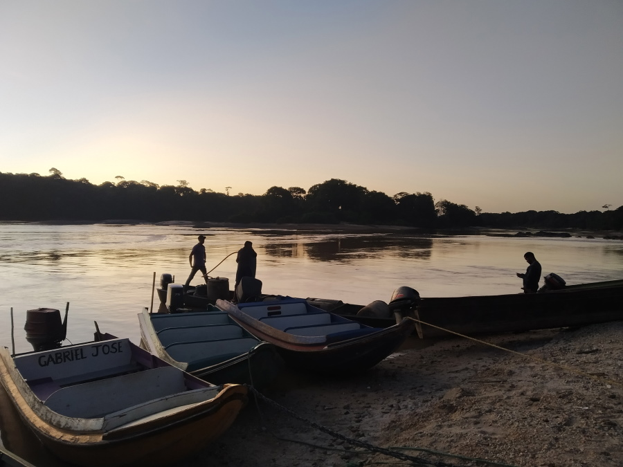
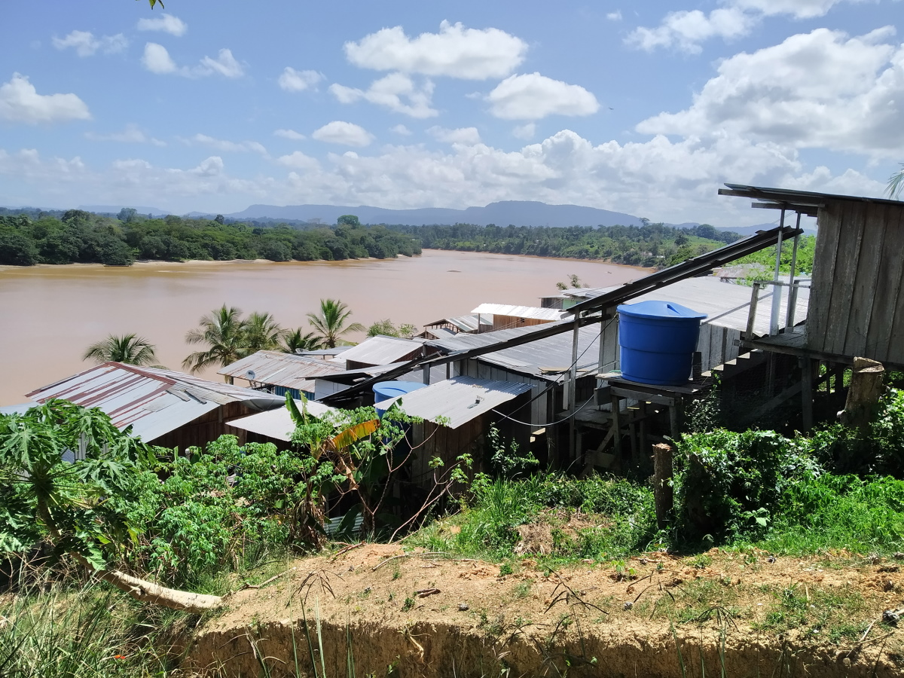
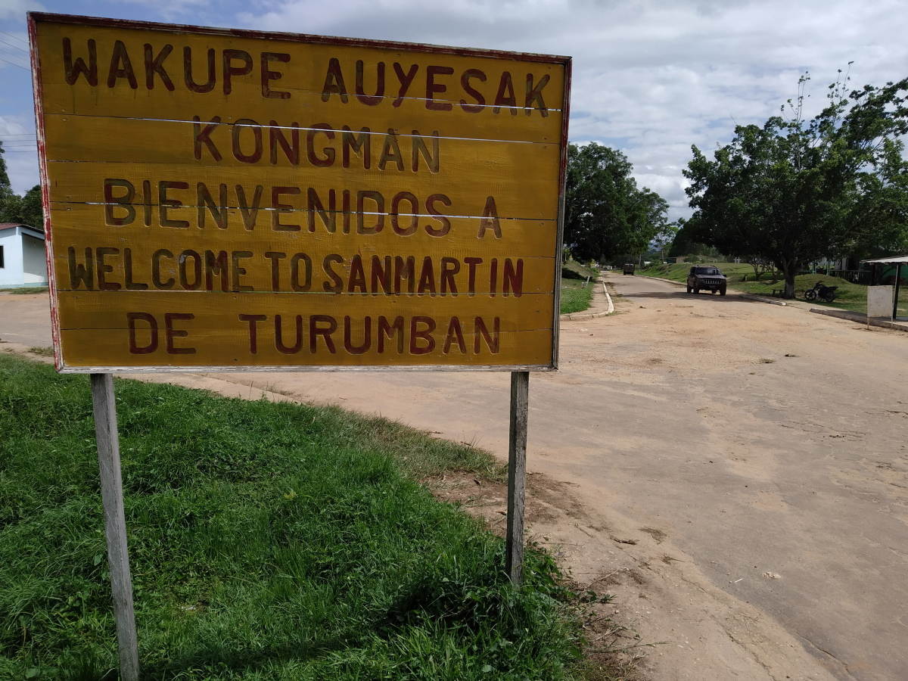
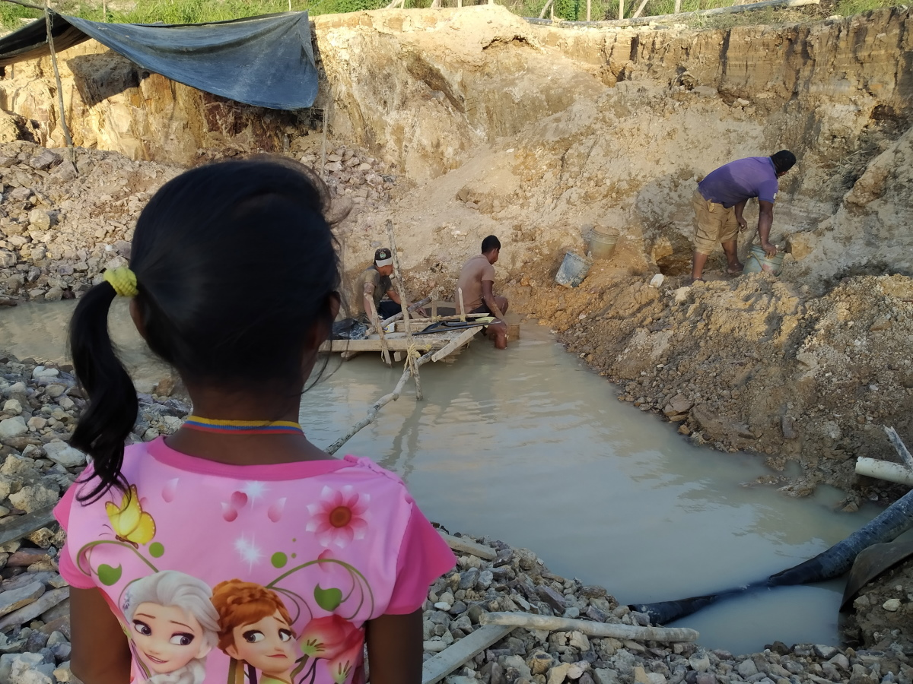
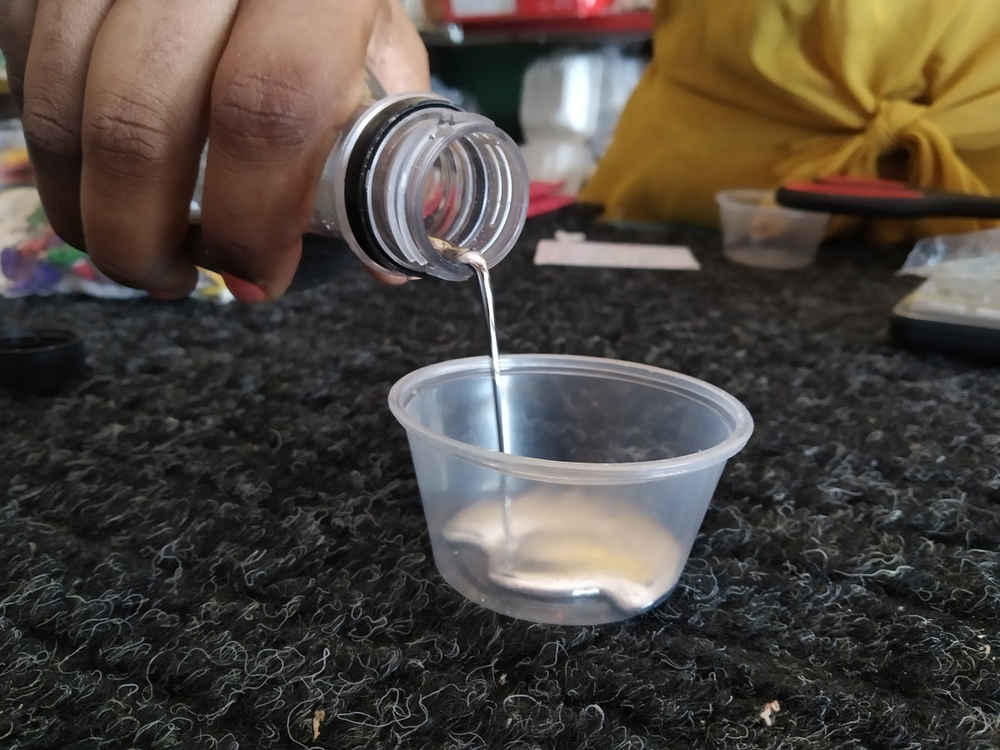
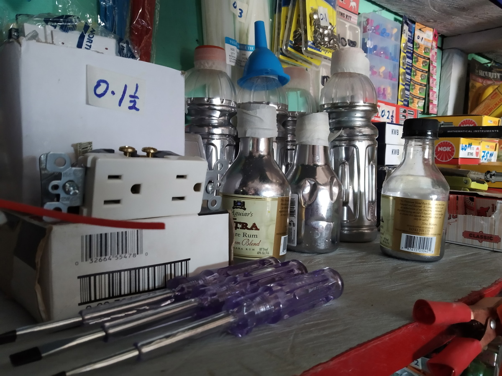
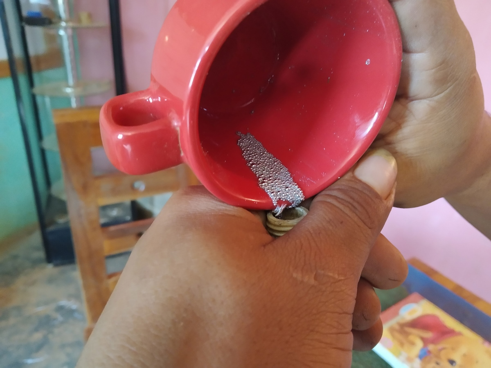
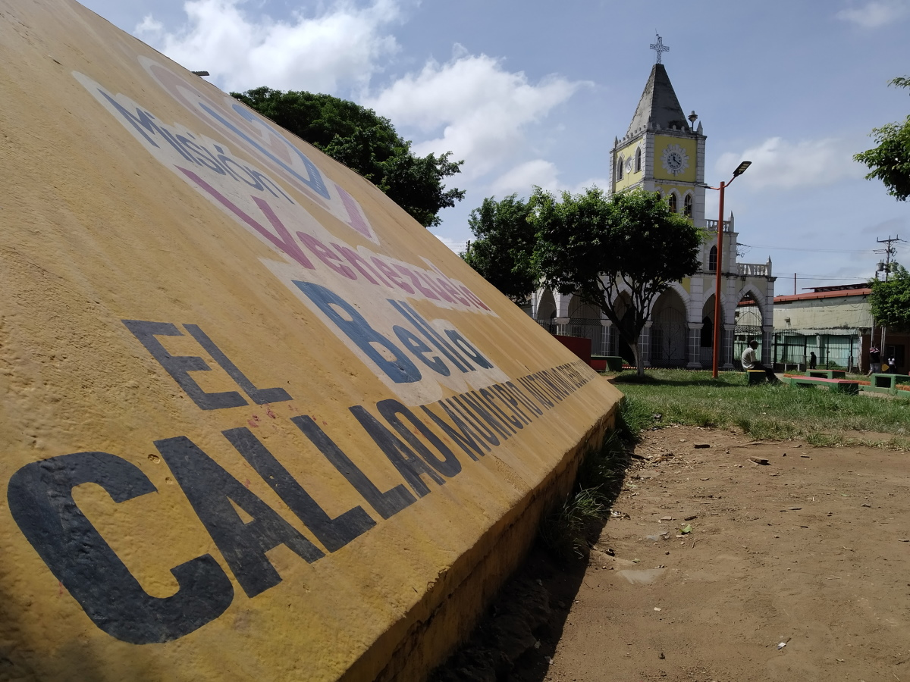
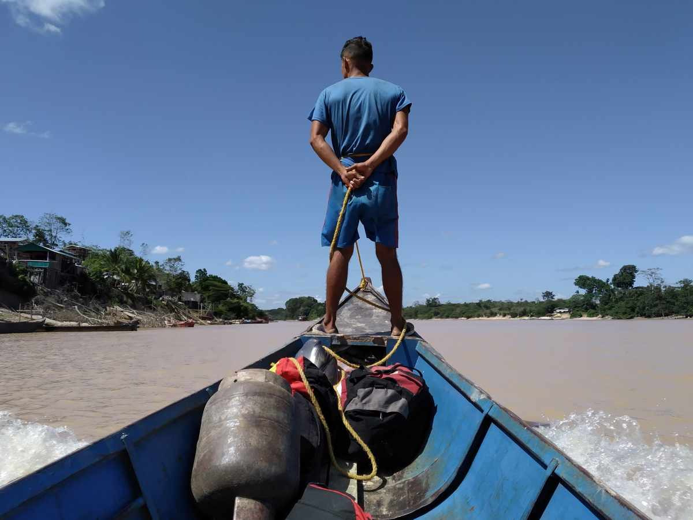

import Image from "!url-loader!../../images/venezuela/8.jpg"
import Map1 from "../../images/minimaps/reports/minimap-1-en.svg"
import Map2 from "../../images/minimaps/reports/minimap-2-en.svg"

export const meta = {
  name: "venezuela",
  title: "A orillas del Cuyuní, el mercurio brilla más que el oro",
  intro: "El mercurio es más seguro y más rentable de comerciar que el oro mismo. Cuanto más te acerques a Guyana, más barato encontrarás el tan buscado \"azogue\".",
  by: "por Marcos David Valverde (texto y fotografía)",
  image: Image,
  next: {
	slug: "brazil",
	title: "Nueva fiebre del oro activa mercados ilícitos de mercurio en Roraima",
	description: "La economía más grande e industrializada de Sudamérica, Brasil, no produce mercurio. Pero sus florecientes minas de oro ilegales no pueden funcionar sin la sustancia tóxica."
  }
};

**Cañamú no existe** para Guyana y menos para Venezuela. Tampoco para Google Maps. Ese nombre, que se le da a un caserío de dos hileras de ranchos y quioscos de tablones y zinc, ni siquiera existe para muchos de los que viven en él. Pero la aldea de chabolas sigue allí, terca, creciendo entre el verdor tupido de la selva sobre la margen oriental del río Cuyuní, Territorio Esequibo controlado por Guyana, y frente a San Martín de Turumbán, otro caserío sobre la ribera opuesta, ya en suelo venezolano.

Cañamú es nada más el apelativo con el que algunos lugareños, amalgamando sílabas, tal como amalgaman el oro con el mercurio, sintetizan el lado rutinario de la breve historia del lugar: CAÑA y MUjeres.

Tampoco hay consenso en cuanto a su fecha de fundación. Muchos dicen que data de hace tres años. Otro, que cuatro o cinco.

Entre tanto diferendo, el único acuerdo tácito gira en torno a los métodos de pago para el intercambio. No hay restricción para lo que quiera que mueva la economía de la aldea. Pueden ser dólares guyaneses, bolívares en efectivo, oro o, incluso, teléfonos celulares. Alcohol y prostitución (la caña, las mujeres, como compendia el apelativo). Gasolina para las plantas eléctricas. Cigarrillo. Alguna hierba para fumar.

> No hay restricción para lo que quiera que mueva la economía de la aldea. Pueden ser dólares guyaneses, bolívares en efectivo, oro o, incluso, teléfonos celulares.

En realidad, eso que pocos llaman Cañamú, que ha crecido entre una pista de aterrizaje sin asfalto y Eterimbán (una lengüeta de tierra, también a orillas del Cuyuní, en suelo guyanés), es, sobre todo, una consecuencia de la diáspora venezolana. Muchos de los que no pudieron emigrar legalmente cruzando de norte a sur el estado Bolívar hasta Brasil, están ahora allí. Y estar allí es irse sin haberlo hecho. Desde ese lugar, Venezuela queda a un par de minutos de distancia en lancha. No hace falta el pasaporte. Ni siquiera la cédula. A Cañamú entra cualquiera atravesando el Cuyuní desde el puerto (un playón con un muelle destartalado de tablas podridas, resbaladizas por el moho y carcomidas). Y en Cañamú funciona un menú de las normas que más convengan, tomadas de las de Venezuela y de Guyana. Una de ellas, de este último país, es la libertad para comprar y vender mercurio en cualquier bodega.

## Simpatiza y vencerás

 *Venezuela is just a couple of minutes away from Guyana by boat.*

<Sidenote side="left">
	<Map1 />
</Sidenote>

En agosto de 2016, mismo año de la creación por parte del Gobierno venezolano de la Zona Especial Arco Minero del Orinoco, así como de la casi simultánea masacre de Tumeremo (llamada así por el pueblo homónimo del Municipio Sifontes del estado Bolívar; la primera de, al menos, 18 matanzas ocurridas a partir de entonces en ese territorio de 111.000 kilómetros cuadrados), Nicolás Maduro anunció por decreto “la prohibición del uso de mercurio en todas las actividades conexas a la industria minera de Venezuela, absolutamente y totalmente”.

> Nicolás Maduro anunció por decreto “la prohibición del uso de mercurio en todas las actividades conexas a la industria minera de Venezuela, absolutamente y totalmente”.

Aquel decreto fue quizás un gesto público de Maduro para demostrar que, en efecto, Venezuela tenía la voluntad de acatar el [Convenio de Minamata](http://www.mercuryconvention.org/Countries/Parties/tabid/3428/language/en-US/Default.aspx), el acuerdo internacional de 2013 en el que 128 países se comprometieron a reducir el uso del mercurio.

A la par, en Venezuela hubo voces que insistieron en que algo debía hacerse para frenar la contaminación mercurial. Todas se reunieron en la Red de Organizaciones Ambientales no Gubernamentales de Venezuela (Red ARA), que también en 2013 [publicó el estudio](https://drive.google.com/file/d/0B5CV2YJ5UI8WMzhOZUtvd0NDaWc/edit) La contaminación por mercurio en la Guayana Venezolana: Una propuesta de diálogo para la acción.

“En Venezuela, se ha reconocido la contaminación por mercurio en la Guayana venezolana como un problema de salud pública desde hace más de 25 años. Durante este tiempo se han realizado un número importante de investigaciones que han revelado la presencia de mercurio en concentraciones elevadas en personas que viven en las zonas mineras. Igualmente se han encontrado valores altos de mercurio en los sedimentos de los cuerpos de agua y en peces usados
como alimento”, se detalla en el informe.

Era entonces un buen momento para actuar Y suscribir la convención parecía un paso certero. Pero todo quedó allí: para 2019, 123 de los 129 países ratificaron el acuerdo. Venezuela, con Nicolás Maduro al mando, no había sido uno de ellos.

 *La crisis migratoria venezolana fue el motor de origen de un caserío ubicado entre Eterimbán y San Martín de Turumbán que algunos se empeñan en llamar Cañamú.*

En enero de 2020 un transportista veterano que se mueve por el suroriente del estado Bolívar repartiendo simpatías en cada pueblo, alcabala y quiosco que se le cruce (y quien en adelante será identificado con el nombre ficticio de Luis), confirma con desparpajo el secreto a voces: el mercurio circula sin que importen decretos presidenciales ni convenios de Minamata, envasado en botellas de plástico por las carreteras, calles y autopistas de las zonas mineras.

<Sidenote side="left">
	<Map2 />
</Sidenote>

“A mí me llama gente de mucha confianza y me dice: ‘Coño, necesito llevar unos frasquitos’. Parecen unos potes de liga de freno. Eso viene bien selladito. A mí me los dan y yo los acomodo en el carro. Son como cuatro potecitos. Me dan 100 gramas (como se le llama en el sur de Bolívar al gramo de oro). 25 gramas por cada pote (cada uno pesa más de un kilo). Pero hay quien los lleva por menos”.

El punto de partida de Luis es San Félix, ala oriental de Ciudad Guayana, la principal zona urbana del estado Bolívar, en su zona noreste, sobre la desembocadura del río Caroní en el Orinoco. Desde allí, luego de atravesar Upata, un enclave ganadero, transita el eje minero más importante de la región: Guasipati, El Callao, Tumeremo, El Dorado, Las Claritas y Kilómetro 88.

El azogue, el nombre más corriente para el mercurio en las zonas mineras del estado Bolívar, tiene regularmente un solo destino en alguno de esos pueblos. “El que yo llevo viene de Colombia. También hay otras cosas que se llevan de contrabando, como combustible y explosivos. Hay camiones que llevan 80 litros de combustible y eso es pagando en todas las alcabalas. Pero allí puede ir hasta droga. No hay ni rayos X. Yo los conozco a todos (en las alcabalas)”, explica.

> Con empatía es como sortea sin problemas, cuando traslada –cuando contrabandea, para ser precisos- mercurio, uno de los puntos más difíciles

Así, a punta de idas y vueltas, Luis ha conocido las jerarquías militares de los puestos de control. Con empatía es como sortea sin problemas, cuando traslada –cuando contrabandea, para ser precisos- mercurio, uno de los puntos más difíciles: Casa Blanca, una alcabala de la Guardia Nacional en la Troncal 10 (la vía terrestre que atraviesa el estado Bolívar y la única que conecta Venezuela con Brasil). “Viejo, estamos muriéndonos de sed”, le dice algún sargento ataviado de verde y curtido por el sol. Él le deja hielo, agua y un paquete de café. Y sigue su ruta. Esta vez no por la Troncal 10, sino por el desvío al este para la carretera hacia San Martín de Turumbán, que comienza a pocos metros de Casa Blanca.

## Más alcabalas, menos control

Hace 15 o 20 años, llegar a San Martín de Turumbán desde Casa Blanca era un viaje de 40 minutos a través de una carretera pavimentada. Ahora, por el deterioro, son al menos cuatro horas que transcurren entre el polvo, el bamboleo por los desniveles y los huecos, aceleramientos y frenazos y una que otra maniobra para esquivar los derrumbes del asfalto. Nada apto para estómagos endebles.

Quien habla de la ruta a San Martín de Turumbán habla, como quien narra un cuento de fantasmas, de un tigre que se comió a un niño y que escupió la cabeza desde un árbol, de los tiempos en que la carretera era mejor y, por supuesto, de los campamentos que en la ruta tiene el Ejército de Liberación Nacional (ELN) de Colombia.

La presencia de esta guerrilla ha sido denunciada con frecuencia desde la llegada al poder del gobernador regional, el general Justo Noguera Pietri, electo en 2017 en representación del oficialista Partido Socialista Unido de Venezuela (Psuv) en unos comicios cuyos resultados han sido puestos en duda por numerosas irregularidades. De acuerdo con denunciantes como el diputado Américo de Grazia, de la Asamblea Nacional, hoy en el exilio en Italia, los guerrilleros operan en las zonas mineras con la anuencia de Noguera y, más arriba, de Nicolás Maduro.

A mitad de camino está el caserío de San José de Anacoco, que sobrevive esencialmente por la siembra. En el transcurso también están las entradas a varias minas: Rabin Rico, La Libertad, Caño Negro, La Salle, Párate Bueno, Buracón…

 *San Martín de Turumbán forma parte del municipio Sifontes, del estado Bolívar. Es el recodo más accesible entre Venezuela y la Guayana Esequiba.*

La entrada a San Martín de Turumbán está antecedida por tres alcabalas. Una del Ejército en el puesto militar de la Isla de Anacoco (en la que un letrero, garabateado con pintura roja, sentencia: “Aquí no se habla mal de Chavez”, sin tilde, aunque sí esté mal escrito el apellido del difunto expresidente). La segunda es la de la Guardia Nacional, que pocos atraviesan sin ser revisados, Luis entre ellos, luego de las consabidas sonrisas y simpatías. Y la tercera es la indígena, en la que basta con un saludo para entrar en el pueblo. “*Wakupe auyesak Kongman/ Bienvenidos a/ Welcome to San Martín de Turumbán*”, se lee en una tabla.

Aunque sigue siendo parte del municipio Sifontes y, por lo tanto, de Venezuela, la economía de San Martín de Turumbán funciona prácticamente como la vecina Eterimbán. En la orilla del Cuyuní hay dragas que tasajean la superficie en busca de oro y terrenos cercenados como si una cuchara gigantesca los hubiera penetrado a lo largo de varios metros.

Cerca de San Martín hay una mina, La Ganadería. En el camino a ella, en efecto, hay vacas pastando. Por ello su nombre. En la propia mina, a cielo abierto, varios hombres remueven las bateas y hunden sus piernas en una laguna verduzca en la que cae el mercurio.

 *La mina La Ganadería, cercana a San Martín de Turumbán, deja ver las secuelas del mercurio: agua contaminada y tierra devastada.*

Una indígena enflaquecida (cuyo nombre se omite por protección), madre de tres niños que la acompañan en el recorrido, ve cómo su esposo menea una batea, el artefacto con el que los mineros cuelan la arena del río en pos del oro. “Con esto no es que uno hace mucho. Se producen dos puntos (de oro, poco menos de un gramo) y con eso te compras una harina, un arroz”.

Sin que se lo pregunten, ella misma habla de la manipulación del mercurio. Lo primero que apunta es que sin él, el trabajo es imposible. “Es la única forma de atrapar el oro porque lo concentra como si fuera un imán. Si (el oro) es de cochanos es otra cosa, porque uno lo agarra con la mano”. Sintetizando: no hay otra forma de separar el oro de la tierra. Solo con azogue es posible. En Venezuela, se llama oro cochano al que se encuentra en estado natural, sin combinarse en aleaciones y sin necesidad de procesos físico-químicos.

Asegura que una vez vio cómo la mano de un amigo quedó renegrida hasta que hubo que amputarla. El minero tenía una pequeña herida y una gota de mercurio que le cayó bastó para lo que pasó después, con el paso de unos días.

No es el único caso. Ha habido pulmones que colapsan, pies y piernas que supuran y cegueras en San Martín de Turumbán, desde cuyo puerto (el playón aquel del muelle destartalado de tablas podridas, resbaladizas por el moho y carcomidas) se ve el caserío en el que, habitualmente, los mineros compran el mercurio que aquí se utiliza. Allí, con el Cuyuní de por medio, está la para muchos invisible Cañamú.

<Video url="https://youtube.com/embed/klicn8X7LgE" />

## El pago es el límite

En su bodega de Eterimbán le preguntan por el precio del azúcar, de la cerveza y de la gasolina. Pero antes de estar aquí, Francisco Pérez (nombre ficticio) era dueño de una empresa de publicidad en Ciudad Bolívar, la antigua Angostura del Orinoco, capital del estado, hasta que quebró por una deuda que la estatal petrolera Pdvsa adquirió con él pero nunca pagó. Cansado, además, de la delincuencia, se mudó a Guyana, en donde abrió su negocio en el que, entre otras cosas, vende mercurio.

> Cansado, además, de la delincuencia, se mudó a Guyana, en donde abrió su negocio en el que, entre otras cosas, vende mercurio.

“Si necesitas yo te lo consigo.  Ahorita (enero de 2020) nadie tiene. Te explico: cuando se acerca diciembre todo el mundo sale de eso. Luego se paran las ventas (de mercurio) como hasta marzo, que es cuando arrancan las máquinas completamente. Pero es un negocio porque un litrico de eso vale un poco de oro”.

Cuando Eterimbán era todavía un territorio casi desconocido para muchos venezolanos, el tráfico de mercurio desde Guyana hacia Venezuela era la norma. Desde Georgetown, la capital (en la costa atlántica del país, al este del río Esequibo), comenzaba la cadena de distribución del mercurio que a cuentagotas llegaba a Eterimbán en la misma medida que el poblamiento.

Pero ¿significa que la ruta entre la Guayana Esequiba y el estado Bolívar haya sido uno de los puntos más álgidos y frecuentes para la entrada del azogue a Venezuela? No necesariamente. La razón fundamental era la dificultad del traslado, pues atravesar Guyana de este a oeste encarecía los costos.

<Video url="https://youtube.com/embed/EiSqEnu2-gY" />

Eso estuvo a punto de cambiar en 2019. Entonces una línea aérea, equipada con aeronaves monomotores, abrió una ruta entre Georgetown y Eterimbán. Las condiciones quedaban establecidas para un incremento en los volúmenes del contrabando. Desde 2013, año en el que las importaciones de mercurio a Guyana promediaron 70 toneladas, las compras internacionales a proveedores de Rusia, India, Turquía, Estados Unidos y Reino Unido, disminuyeron dramáticamente, hasta estabilizarse en apenas 20 toneladas por año. Sin embargo, el comercio y transporte de mercurio sigue siendo legal en ese país de habla inglesa, al menos hasta que se concrete la anunciada proscripción que se deriva de la firma definitiva por parte de Guyana del Convenio de Minamata.

Pero la ralentización económica mundial por la Covid-19 frenó las posibilidades para quienes, ya por vía aérea, pensaron en el negocio de contrabandear mercurio para Venezuela con más frecuencia. Si ya hablar sobre números reales respecto del contrabando es complicado, ahondar en una proyección respecto de lo que hubiese ocurrido sin pandemia es, claro está, especulación. Más allá de las conjeturas, se puede afirmar que hay un tráfico de mercurio a pequeña escala desde Eterimbán a la ribera venezolana.

 *El mercurio de Guyana es, desde hace pocos meses, más económico en Eterimbán debido a la apertura de una ruta aérea hacia Georgetown.*

Una caminata por el caserío basta para preguntar por el mercurio y regatearlo. “En diez gramas está el kilo”, traduce una venezolana que trabaja para un vendedor guyanés, dueño de un quiosco en el que se exhibe comida, chimó y azogue. Luego de un regateo, accede a que sean nueve gramos de oro por el kilo. “No hay problema”.

“*It's not illegal. This is what they use for gold*”, explica una vendedora en otra bodega en la que los frascos con mercurio conviven con destornilladores, yesqueros, interruptores, cervezas, refrescos, camisas, chucherías y cepillos de dientes. Y, con el ánimo de concretar la venta, lanza una oferta: “One kilo, ocho gramas de oro”.

Francisco Pérez explica su modalidad para conseguir el mercurio. Que es, a fin de cuentas, la modalidad de todos los vendedores de Eterimbán. “Yo lo que hago es pedirlo a Georgetown. Sobre el precio, yo pido once gramas por un kilo. Si quieres más de un kilo, yo te voy bajando el precio. Si quieres la garrafa completa, te queda en 8,5 gramas. Son cinco kilos. Y el que viene de Georgetown es una garrafa que está sellada y está pura. Aquí (en Guyana) no es que sea legal del todo, porque para ser legal debes tener una licencia minera de que tienes una concesión. Pero como esta zona es minera, es normal”. La cantidad mensual dependerá, entonces, de la demanda que reciba. No hay una cantidad fija.

> “Yo lo que hago es pedirlo a Georgetown. Sobre el precio, yo pido once gramas por un kilo.

Comprar el mercurio en Guyana tiene, añade, una gran ventaja: es mercurio puro. No hay posibilidades de que contenga añadidos o de que sea reciclado, como el que viene de otros países.

“Esa garrafa no está ni manipulada ni nada: tú te llevas algo, seguro de lo que vas a vender. En Venezuela lo que está pasando es que agarran los transformadores, los rompen, le sacan ese mercurio y te venden la botellita. Ya viene contaminado. En Venezuela, el malandro se roba esto y lo quiere vender más caro. ¡Lo robaste, lo sacaste de un transformador! ¿Cómo lo vas a vender más caro?”.

 *En cualquier bodega de Eterimbán y sin restricción se puede comprar mercurio.*

## Ni tan libres de impurezas

Entre matorrales y caminos sinuosos de tierra roja, en vía a la mina Rabin Rico (Rabino rico, originalmente), la motocicleta se apaga por primera vez. Su conductor la prende. Unos metros más adelante se apaga otra vez. Y la prende. Siempre la prende. “Tiene tiempo con esa falla”, dice el dueño de la moto y de un molino de la mina, próxima a San Martín de Turumbán. Durante esos segundos de catalepsia de la moto, entre el silencio de los matorrales, bajando la voz y señalando el entorno con los ojos, asegura: “Allí está el ELN”.

> Durante esos segundos de catalepsia de la moto, entre el silencio de los matorrales, bajando la voz y señalando el entorno con los ojos, asegura: “Allí está el ELN”

Rabin Rico es prácticamente un pueblo. Hay bodegas, ranchos, un improvisado taller mecánico y una versátil iglesia evangélica que se convierte en discoteca los fines de semana. “Todo el mundo amanece rascado”, dice un lugareño apelando a ese eufemismo criollo para la ebriedad. “No se te ocurra tomar fotos”, añade otro, advirtiendo así que allí están prohibidos los registros y que tomar una foto podría ser la diferencia entre estar vivo o muerto.

Para los pequeños mineros como los que hay en Rabin Rico (en donde abundan los molinos para el oro), hay un gran problema: la mayoría del mercurio con el que trabajan es reciclado como el que describe Francisco Pérez. Y entre más usado, menos efectivo.

Visualmente hay diferencias marcadas entre uno y otro mercurio. El puro es espeso y bastante parecido a una pintura gris de aceite. El reciclado pierde su espesor y se concentra en burbujas. Muchos mineros, para abaratar costos de su producción, optan por este último.

 *Puro o reciclado, el mercurio en el estado Bolívar circula a través de alcabalas y carreteras con el salvoconducto de los sobornos.*

“Tú no sabes con qué viene mezclado el material. Con gasoil, por ejemplo, o con cualquier sustancia química. En el proceso (de extracción del oro) tienes que echar un kilo de azogue por dos kilos de oro. Cuando lo utilizas en la tierra, el azogue ya viene contaminado con lo que vino ahí. Lo puedes exprimir (para recuperarlo) o pare de contar. La manera de recuperarlo es limpiarlo con gasolina y harina de trigo. El de Guyana es el que viene ya limpio”, describe el dueño del molino y de la moto.

No es una alternativa ni sencilla ni cómoda. Pero es la única para quien busque abaratar costos. “Ese azogue es un problema. Hay que meterlo en la batea, echarle cloro, lavarlo. La impureza sale con el cloro pero ya no es lo mismo”, apunta Juan Gómez, minero venezolano radicado en Eterimbán.

La distribución del mercurio reciclado y su uso en varias minas de Bolívar es uno de los porqués del escaso flujo del material desde el oeste de Guyana (también conocida como Guayana Esequiba, por estar en la ribera occidental del río Esequibo y en referencia del decimonónico reclamo territorial de Venezuela) a Bolívar. Siempre abaratar costos será la prioridad para los mineros artesanales. Aunque eso, además, incide en mayor medida sobre el proceso de extracción de oro. Y en la salud de quien lo manipule.

<Video url="https://youtube.com/embed/YyUPwU_0-E8" />

“El reciclado está contaminado. El puro no. El reciclado tiene un proceso distinto también. Después de que sacas el mercurio del transformador tienes que echarle gasolina, Ace (genérico de una marca de detergente en polvo) y hasta limón. El transformador tiene un aceite que contamina las planchas del oro que se va a producir. En todo ese proceso no tenemos precaución.

Sabemos que eso causa problemas en pulmones, la piel y la vista. Conozco personas que han quedado locas, con problemas en los pulmones. No pueden respirar polvo ni perfume ni nada de eso. Yo tengo cortadas que no se me curan por el azogue. Con las mascarillas igualito consumes el azogue, porque se evapora y cuando se enfría, baja. Así uno lo absorbe por los poros”, detalla un molinero en El Callao.

> Conozco personas que han quedado locas, con problemas en los pulmones. No pueden respirar polvo ni perfume ni nada de eso.

La procedencia y el proceso para trasladar el mercurio son asuntos de poca importancia para ese eslabón de la cadena que representan los mineros pequeños. De donde venga, no importa. Importa que llegue y que sea barato. Como el reciclado.

“El que usamos aquí viene más que todo de Ciudad Bolívar. Ya conocen a la gente en las alcabalas. Hablan, pagan lo que tengan que pagar y siguen. Pero como eso es material estratégico, si te agarran y no sabes, te detienen. Igualmente pasa con el reciclado”, apunta el molinero mientras, en una taza, vierte el mercurio reciclado. A su lado, una mujer que lo acompaña dice: “Antes, cuando yo era niña, en la casa mi papá llevaba eso y jugábamos con esas peloticas”.

## La complicidad tácita

Testimonios como el del molinero de El Callao, del conductor Luis o de cualquier minero de la zona son los que permiten afirmar que la prohibición presidencial del uso de mercurio en las minas es letra muerta.

 *En El Callo, cualquier minero de la zona son afirma que la prohibición presidencial del uso de mercurio en las minas es letra muerta.*

La coincidencia de las voces consultadas es invariable y constante: las alcabalas militares y de cuerpos de seguridad sirven de ducto, más que de contención, para el contrabando de mercurio en Bolívar. Venga de donde venga. Todo está nada más en saber con quién asociarse.

“Aquí tú lo que tienes es que crear la vuelta. Cuando vengas de allá para acá (es decir, desde Bolívar hacia Guyana) vienes hablando en cada alcabala de una vez clarito y raspao: voy a traer esto, voy a buscar. Palabreaste a todo el mundo, compraste la cantidad y saliendo de aquí es dándoles lo suyo (es decir, la coima para policías y militares). No tienen que revisarte ni nada porque ya saben cuánto tienes. ‘Mano: aquí está lo suyo’. Y te curas en salud”, puntualiza Francisco Pérez, para luego advertir: “Si te caes, es triste. Yo tengo un amigo que se cayó feo, feo, feo. Tenía una carga de pollo, el camión, las cavas y las dos pimpinas de mercurio. Todavía no ha podido recuperar el camión”.

> Yo tengo un amigo que se cayó feo, feo, feo. Tenía una carga de pollo, el camión, las cavas y las dos pimpinas de mercurio.

El Artículo 34 de la Ley Orgánica contra la Delincuencia Organizada y Financiamiento al Terrorismo especifica que: “La persona que trafique ilícitamente con metales o piedras preciosas, recursos o materiales estratégicos, nucleares o radioactivos, sus productos o derivados, podrá ser penada con prisión de ocho a doce años”. Es el estatuto mil veces ultrajado por militares y policías en las alcabalas de Bolívar.

Dominique Suárez, también minero, también habitante de Eterimbán, también comprador habitual de mercurio para su oficio, expone los riesgos que hay si no hay acuerdos con los funcionarios de las alcabalas. Y los respectivos pagos.

 *Las lanchas recorren decenas de veces al día el río Cuyuní entre San Martín y Eterimbán.*

“Traer de Tumeremo para acá es un riesgo. Es mejor que tú mates a alguien a que te agarren con un kilo de azogue. No tienes con qué pagarlo. De aquí (desde Guyana) tú lo compras y lo llevas para las minas cerca de San Martín y no hay problema. Pero si te vas más allá y te agarran, no tienes beneficios de nada y te piden un coñazo de real para soltarte. Cinco o diez mil dólares. Mejor uno lo compra aquí, lo agarraste y te fuiste. Y de paso es más barato: en Tumeremo tienes que pagar diez o doce gramas por un kilo”. Las palabras de Suárez perfilan también una de las razones por las que muchos no contemplan como lucrativo el tráfico de mercurio desde Guyana a Bolívar por la ruta de San Martín de Turumbán.

Como se dijo, la ausencia hasta hace poco de una ruta aérea entre Eterimbán y Georgetown fue otra de las razones por las que el tráfico de mercurio no fue un negocio contemplado por muchos. Salvado ese obstáculo, llegó el coronavirus. Al respecto, Junior Pernía, quien es dueño de un restaurante de tres mesas plásticas y de una posada de colchonetas y ventiladores en Cañamú, bosqueja un baremo.

“El azogue que traen de Venezuela lo vendes aquí en 14 gramas el kilo. El de aquí (de Guyana), en nueve. Pero eso es ahora. Antes era más caro porque no había vuelo, por eso antes era más económico traer de Tumeremo”, dice el comerciante oriundo de San Félix quien a modo de epílogo para cada frase dice: “Por la misericordia de Dios”.

## Ganancia segura

Por la ruta que sea, el mercurio está al alcance de quien lo requiera en cualquier pueblo minero del estado Bolívar. A cuatro años de su prohibición oficial en Venezuela, sigue siendo mercancía de intercambio corriente. Los mineros siguen utilizándolo, contaminando ríos y exponiéndose a cualquiera de las consecuencias de su uso. Mientras, policías y militares continúan lucrándose de las coimas por las que permiten el contrabando. Nadie parece tener ni la menor intención de desentenderse de ese elemento.

> Mientras, policías y militares continúan lucrándose de las coimas por las que permiten el contrabando.

“Todo es porque un entramado de intereses mineros que tiene más de 30 años aquí impidió que esa situación se controlara. Y eso es concordante con la situación en Colombia, Brasil o Perú. Hablamos de la complicidad de todos los actores involucrados. Tenemos que deslastrarnos del hecho de que el tema es reciente, porque, como dije, tiene más de 30 años. Pero en 2011 el tema ha crecido como nunca ha ocurrido en la historia de Venezuela. Hay entre 300.000, 400.000 mineros entre Bolívar, Amazonas y Delta Amacuro”, refiere un académico venezolano e investigador de los efectos del mercurio en las zonas mineras venezolanas que prefiere que se omita su nombre.

Si insiste en las tres décadas de devastación lenta y consistente del mercurio, también apunta que el Arco Minero del Orinoco ha sido la cúspide del proceso. “Es una catástrofe escondida. No hay un dato de la cantidad de personas afectadas por el mercurio. Afecta riñones, articulaciones y sistema nervioso. Una persona muy contaminada entra en estado catatónico y muere. Hay personas con síntomas como temblor en las manos, dificultades para memorizar números y nombres. Es un potencial desastre de gran magnitud tapado por enormes intereses que han tenido muchos años impidiendo que se hagan los estudios. En otros países hay estadísticas epidemiológicas sobre la afectación por mercurio. Aquí no”, remata.

La venta, ilegal, es obvio remarcarlo, continúa en 2020. ¿En Guasipati? Se vende y se compra mercurio. ¿En El Callao? Igualmente. ¿En Tumeremo? En cualquier negocio de compra y de venta de oro están las botellas de mercurio aguardando por los clientes, cualquiera que sea.

“Lo que compre cada quien es variable. Un dueño de máquina te compra un kilo, dos o tres. El minero que trabaja con bomba te compra 300 gramos. Un bateero te compra diez gramos, doce gramos”, dice un minero en Tumeremo.

En esa transacción está una parte del entramado necesario para el tráfico. “Eso (el mercurio) te da más ganancia que el oro. Con el oro puedes tener pérdida, con el mercurio no. Jamás va a mermar. A menos que haya control. Pero la misma Guardia lo distribuye. Si la Guardia quisiera parar eso, allana todas esas compras y cuántos kilos de mercurio agarraría. Pero a todo el mundo le pagan: a los militares y a los malandros. Y mientras pagues, puedes pasar por esas alcabalas armas, drogas, azogue. Lo que quieras”.

Basta una mirada para constatar la devastación que ha causado la minería a ambos lados del Cuyuní
Video por: Bram Ebus
<Video url="https://youtube.com/embed/hjupKLDUHvM" />

Es una red que ha posibilitado que el mercurio, venga de donde venga, fluya por los ríos venezolanos. “El tráfico tiene que venir de distintas fuentes. El mercurio del sur de Amazonas no es el mismo utilizado en la cuenca del Cuyuní. No me quedan dudas de que una parte puede venir del norte de Venezuela. Por ejemplo, Canadá es un país productor de mercurio. Se supone que ha parado pero desde Canadá hay venta de mercurio a Cuba. Viene la pregunta: ¿Cuba para qué quiere ese mercurio?”, cuestiona el académico e investigador venezolano.

Concuerda con esa duda Marcello Veiga, ingeniero metalúrgico con maestría en Geoquímica ambiental y profesor de Minería y Medio ambiente en University of British Columbia, de Vancouver, Canadá. Estudioso durante 40 años de los efectos del mercurio, Veiga estuvo en Venezuela en 1995 como enviado de la Organización de Naciones Unidas para el Desarrollo Industrial (Onudi) con un fin: promover la reducción del uso del azogue en la minería.

“En todo el mundo hay más de 20 millones de mineros. Da más ganancia a una persona ser minero que agricultor. Se trata de legalizar y educar. Dar asistencia técnica. El gobierno hace leyes pero no da asistencia técnica”, critica. Y sentencia sin miramientos que la prohibición no servirá para mucho. “¿Qué sirve entonces? Educación de los mineros y presencia del gobierno educando a los mineros. Hasta ahora, los más favorecidos son los contrabandistas: venden mercurio a precio alto y compran oro a precio bajo. Si haces la prohibición afecta a los mineros, pero a los contrabandistas, nada”.

> Da más ganancia a una persona ser minero que agricultor. Se trata de legalizar y educar. Dar asistencia técnica.

Resalta un dato: Estados Unidos exportó 2,8 toneladas de mercurio a Guyana en 2019, por un precio de quince dólares por kilo. Entonces, para Veiga, “es claro que ese mercurio es de baja calidad, que no sirve para nada pero sirve para los mineros. Lo usan diciendo que es para uso médico, pero un mercurio destilado no puede estar en ese precio: es claro que ese mercurio, sea de Rusia o de Turquía. es de baja calidad. Y ese mercurio después es contrabandeado para Venezuela”.

En un informe de julio de 2020 dedicado exclusivamente al Arco Minero del Orinoco, la oficina de la Alta Comisionada para los Derechos Humanos, Michelle Bachelet, puntualiza que la reducción del uso del mercurio es deuda del gobierno de Maduro.

El mercurio de Guyana contamina principalmente las aguas de las minas cercanas a San Martín de Turumbán. En esas lanchas que se mueven a través del Cuyuní (otra víctima del material) durante todo el día y parte de la noche entre Venezuela y Guyana está apenas una parte de la red internacional de este contrabando.

Es la ley en tierra de nadie dentro de ese corredor entre el estado Bolívar y la Guayana Esequiba. Un esquema que tiene como uno de sus ejes ese recodo que, parafraseando a Hemingway, era una fiesta y ahora, por la apertura de rutas aéreas, ha quedado desprovisto de habitantes y de la movilidad económica de otrora. Sobrevive con sus propias reglas, tácitas y casi inquebrantables. Es ese recodo de un meandro del río Cuyuní, junto a Eterimbán y vecino de San Martín de Turumbán, que algunos se empeñan en llamar Cañamú.
