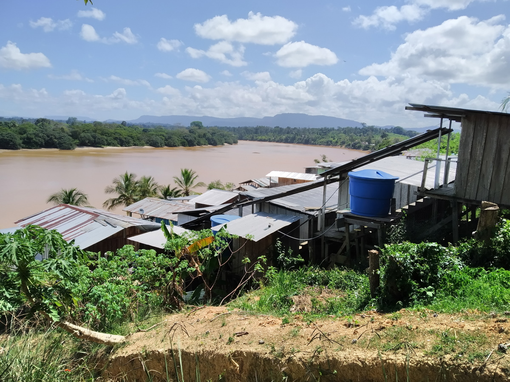
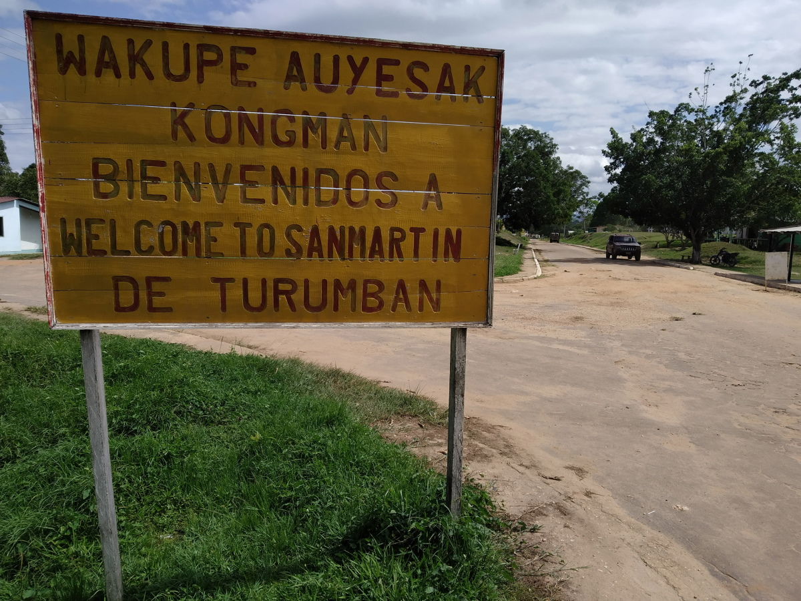
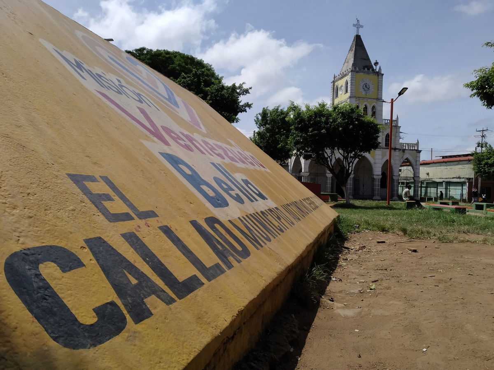
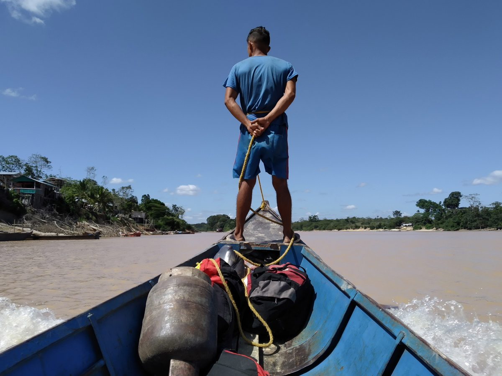

import Image from "!url-loader!../../images/venezuela/8.jpg"
import Map1 from "../../images/minimaps/reports/minimap-1-pt.svg"
import Map2 from "../../images/minimaps/reports/minimap-2-pt.svg"

export const meta = {
  name: "venezuela",
  title: "Nas margens de Cuyuní, o mercúrio brilha mais do que o ouro",
  intro: "O mercúrio é mais seguro e mais lucrativo para o comércio do que o próprio ouro. Quanto mais perto você chegar da Guiana, mais barato você encontrará o procurado \"quicksilver\"",
  by: "por Marcos David Valverde (texto e fotografía)",
  image: Image,
  next: {
	slug: "brazil",
	title: "Corrida do ouro movimenta o mercado de mercúrio em Roraima",
	description: "A maior e mais industrializada economia da América do Sul, o Brasil, não produz mercúrio. Mas as suas minas de ouro ilegais em plena expansão não podem funcionar sem a substância tóxica."
  }
};

**Cañamú não existe** para a Guiana, nem para a Venezuela e muito menos para o Google Maps. Esse nome, dado a uma vila de duas fileiras de ranchos e quiosques de tábuas e zinco, não existe nem para muitos dos que vivem lá. Mas o povoado com barracões continua ali, teimoso, crescendo entre a densa vegetação da selva, na margem oriental do rio Cuyuní, no território de Essequibo, controlado pela Guiana, e em frente a San Martín de Turumbán, outra vila na margem oposta, já em solo venezuelano.

Cañamú nada mais é do que o nome dado por alguns moradores juntando as sílabas CAÑA (cana) e MUjeres (mulheres), sintetizando a história do lugar.

Também não existe consenso quanto à data da sua fundação. Muitos dizem que são três anos, outros, quatro ou cinco. O único acordo tácito gira em torno dos métodos de pagamento: não há restrição para o que quer que movimente a economia do vilarejo. Podem ser dólares guianenses, bolívares em dinheiro, ouro ou até mesmo celulares. Álcool e prostituição (cana e mulheres, como sintetiza o nome do lugar); gasolina para as usinas de energia; cigarro; e um pouco de maconha para fumar.

> O único acordo tácito gira em torno dos métodos de pagamento: não há restrição para o que quer que movimente a economia do vilarejo.

Na verdade, isso que poucos chamam de Cañamú, que cresceu entre uma pista não pavimentada de pouso e Eterimbán (uma faixa de terra, também às margens do Cuyuní, em solo guianense) é, sobretudo, resultado da diáspora venezuelana. Muitos dos que não conseguiram emigrar legalmente, cruzando do norte ao sul o estado de Bolívar até o Brasil, agora estão ali. E estar ali é sair sem ter feito isso. A Venezuela fica a alguns minutos de barco. Você não precisa de documento algum, qualquer pessoa entra em Cañamú atravessando o Cuyuní do porto (uma praiona com um ancoradouro minúsculo de tábuas podres, escorregadias pelo mofo e corroídas). E em Cañamú funciona um menu com as regras que mais convêm, vindas da Venezuela e da Guiana. Uma delas, desse último país, é a liberdade de comprar e vender mercúrio em qualquer armazém.

## Seja simpático e vencerá

 *A Venezuela fica a alguns minutos de barco. Você não precisa de documento algum, qualquer pessoa entra em Cañamú.*

<Sidenote side="left">
	<Map1 />
</Sidenote>

Em agosto de 2016, no mesmo ano em que o governo venezuelano criou a Zona Especial do Arco Mineiro do Orinoco, bem como o massacre quase simultâneo de Tumeremo (chamado assim em homenagem à cidade homônima do Município de Sifontes, no estado de Bolívar; o primeiro de ao menos 18 massacres ocorridos desde então naquele território de 111.000 quilômetros quadrados), Nicolás Maduro anunciou por decreto "a proibição do uso de mercúrio em todas as atividades relacionadas à indústria de mineração na Venezuela, absoluta e totalmente".

> Nicolás Maduro anunciou por decreto "a proibição do uso de mercúrio em todas as atividades relacionadas à indústria de mineração na Venezuela, absoluta e totalmente"

Esse decreto foi talvez um gesto público de Maduro para mostrar que a Venezuela estava de fato disposta a cumprir a Convenção de Minamata, um acordo internacional de 2013, em que 128 países se comprometeram a reduzir o uso de mercúrio.

Ao mesmo tempo, houve, na Venezuela, vozes que insistiram que algo deveria ser feito para deter a contaminação por mercúrio. Todas se reuniram na Rede de Organizações Ambientais Não Governamentais da Venezuela (Red ARA), que também [publicou em 2013 o estudo](https://drive.google.com/file/d/0B5CV2YJ5UI8WMzhOZUtvd0NDaWc/edit): La contaminación por mercurio en la Guayana Venezolana: Una propuesta de diálogo para la acción. (A contaminação por mercúrio na Guiana Venezuelana: Uma proposta de diálogo para a ação).

<Sidenote side="left">
	<Map2 />
</Sidenote>

“Na Venezuela, a contaminação por mercúrio na Guiana venezuelana foi reconhecida como um problema de saúde pública há mais de 25 anos. Durante esse tempo, foi realizado um número significativo de pesquisas, revelando a presença de mercúrio em altas concentrações em pessoas que vivem nas zonas de mineração. Da mesma forma, foram encontrados elevados níveis de mercúrio em sedimentos de corpos d'água e nos peixes usados como alimento”, detalhou o relatório.

Foi então um bom momento para agir e assinar a convenção parecia um passo certeiro. Em 2019, 123 dos 129 países ratificaram o acordo, mas a Venezuela, governada por Nicolás Maduro, não foi um deles.

 *A crise migratória venezuelana originou um povoado localizado entre Eterimbán e San Martín de Turumbán, que alguns insistem em chamar de Cañamú*

Em janeiro de 2020, um veterano transportador, que sempre circula pelo sudeste do estado de Bolívar distribuindo ‘cordialidades’ em cada cidade, alcabala (como são chamados os postos de controle) e quiosque que encontra (e que a partir de agora será identificado com o nome fictício de Luis), confirma o segredo: o mercúrio circula independentemente dos decretos presidenciais ou dos acordos de Minamata, embalado em garrafas plásticas pelas estradas, ruas e rodovias nas zonas de mineração.

“Pessoas muito confiáveis ​​me ligam e dizem: 'Meu chapa, preciso levar alguns frasquinhos'. Parecem potes de liga de freio. Isso vem bem seladinho. Eles me dão e eu os coloco no carro. Eles são como quatro pequenos potes. Eles me dão 100 gramas (como é chamado o grama de ouro no sul de Bolívar). 25 gramas por cada pote (cada um pesa mais de um quilo). Mas há quem os leve por menos”.

O ponto de partida de Luis é San Félix, ao leste da Ciudad Guayana, principal zona urbana do estado de Bolívar, na região nordeste, na foz do rio Caroní no Orinoco. A partir daí, depois de cruzar Upata, um enclave pecuário, transita o eixo mineiro mais importante da região: Guasipati, El Callao, Tumeremo, El Dorado, Las Claritas e Quilômetro 88.

O “azougue”, nome mais comum para o mercúrio nas áreas de mineração do estado de Bolívar, costuma ter apenas um destino em uma dessas vilas. “O que eu levo vem da Colômbia. Também há outras coisas que são contrabandeadas, como combustível e explosivos. Há caminhões que transportam 80 litros de combustível e isso é feito pagando em todas as alcabalas. Mas podem levar até drogas. Não há raio-X. Eu conheço todos (nas alcabalas)”, explica.

> Com sua cordialidade, ele transporta sem problemas, o mercúrio até mesmo em um dos pontos mais difíceis:

Assim, indo e voltando, Luis conheceu as hierarquias militares dos postos de controle. Com sua cordialidade, ele transporta sem problemas, o mercúrio até mesmo em um dos pontos mais difíceis: a Casa Blanca, uma alcabala da Guarda Nacional em Troncal 10 (a via terrestre que atravessa o estado de Bolívar e a única que liga a Venezuela ao Brasil). “Cara, estamos morrendo de sede”, diz um sargento enfeitado de verde, com a pele curtida pelo sol. Ele lhe deixa gelo, água e um pacote de café. E segue seu caminho. Dessa vez, não pela Troncal 10, mas pelo desvio ao leste, pela rodovia até San Martín de Turumbán, que começa a poucos metros de Casa Blanca.

## Mais acabalas, menos controle

Há 15 ou 20 anos, chegar a San Martín de Turumbán saindo de Casa Blanca era uma viagem de 40 minutos por uma rodovia pavimentada. Agora, por conta da deterioração da estrada, são ao menos quatro horas de viagem.

Quem fala da rota para San Martín de Turumbán, fala como quem conta uma história de fantasia, da época em que a estrada era melhor e, claro, dos acampamentos do Exército de Libertação Nacional (ELN) da Colômbia existentes no percurso.
A presença dessa guerrilha tem sido denunciada com frequência desde a chegada ao poder do governador regional, o general Justo Noguera Pietri, eleito em 2017 em nome do Partido Socialista Unido da Venezuela (Psuv), em eleições cujos resultados foram questionados, devido às inúmeras irregularidades. Segundo os denunciantes, como o deputado Américo de Grazia da Assembleia Nacional, hoje exilado na Itália, os guerrilheiros atuam nas zonas de mineração com o consentimento de Noguera e, mais acima, de Nicolás Maduro.

Na metade do caminho está a vila de San José de Anacoco, que sobrevive essencialmente da plantação. No percurso também se encontram as entradas para várias minas: Rabin Rico, La Libertad, Caño Negro, La Salle, Párate Bueno, Buracón...

 *San Martín de Turumbán faz parte do município de Sifontes, no estado de Bolívar. É a curva mais acessível entre a Venezuela e Guayana Esequiba.*

A entrada de San Martín de Turumbán é precedida por três alcabalas. Uma do Exército no posto militar da Isla de Anacoco (em que uma placa, rabiscada com tinta vermelha, diz: "Aqui você não fala mal de Chavez", embora, sem acento, o sobrenome do falecido presidente esteja mal-escrito). A segunda é a da Guarda Nacional, que poucos atravessam sem serem revistados, entre eles Luis, depois dos sorrisos e da cordialidade habituais. E a terceira é a indígena, em que basta uma saudação para entrar no povoado. “*Wakupe auyesak Kongman / Bem-vindos  a/ Welcome to San Martín de Turumbán*”, diz uma placa.

Embora continue fazendo parte do município de Sifontes e, portanto, da Venezuela, a economia de San Martín de Turumbán funciona praticamente como a vizinha Eterimbán. Na margem do Cuyuní existem dragas que mutilam a superfície em busca de ouro e dilaceram terras como se uma colher gigantesca as tivesse penetrado por vários metros.

Perto de San Martín existe uma mina, La Ganadería. No caminho até lá, de fato, há vacas pastando, daí seu o nome. Na própria mina, a céu aberto, vários homens removem as bateias e mergulham suas pernas em uma lagoa esverdeada com mercúrio.

 *A mina La Ganadería, próxima a San Martín de Turumbán, revela as consequências do mercúrio: água contaminada e terra devastada.*

Uma indígena debilitada (cujo nome foi omitido por proteção), mãe de três filhos que a acompanham no percurso, observa o marido sacudir uma bateia, artefato usado pelos garimpeiros para coar a areia do rio em busca do ouro. “Com isso não é que se faça muito. São produzidos dois pontos (de ouro, um pouco menos de um grama) e com isso você compra uma farinha, um arroz”.

Sem ser questionada, ela mesma fala sobre a manipulação do mercúrio. A primeira coisa que aponta é que, sem ele, o trabalho é impossível. “É a única forma de capturar ouro, porque ele o une como se fosse um ímã. Se (o ouro) for de cochanos, é outra coisa, porque a pessoa o agarra com a mão”. Sintetizando: não há outra maneira de separar o ouro da terra. Somente com mercúrio isso é possível. Na Venezuela, é chamado ouro cochano o que se encontra em seu estado natural, sem ser combinado em amálgamas e sem a necessidade de processos físico-químicos.

Ela assegura que certa vez viu como a mão de um amigo escureceu até precisar ser amputada. O mineiro tinha um pequeno ferimento e uma gota de mercúrio que caiu sobre ele foi o suficiente para o que aconteceu pouco tempo depois.

Não é o único caso. Houve pulmões que colapsaram, pés e pernas que infeccionaram e pessoas cegas em San Martín de Turumbán, de cujo porto se avista a vila, onde, normalmente, os mineiros compram o mercúrio que é utilizado aqui. Ali, com o Cuyuní no meio, está a invisível para muitos Cañamú.

<Video url="https://youtube.com/embed/klicn8X7LgE" />

## O pagamento é o limite

Em seu armazém em Eterimbán, perguntam sobre o preço do açúcar, da cerveja e da gasolina. Mas, antes de estar ali, Francisco Pérez (nome fictício) era dono de uma empresa de publicidade em Ciudad Bolívar, a antiga Angostura del Orinoco, capital do estado, até falir por conta de uma dívida adquirida pela petroleira estatal PDVSA, mas que nunca foi paga. Cansado, mudou-se para a Guiana, onde abriu seu negócio e onde vende, entre outras coisas, mercúrio.

> Cansado, mudou-se para a Guiana, onde abriu seu negócio e onde vende, entre outras coisas, mercúrio.

"Se você precisar, eu consigo para você. Agorinha (janeiro de 2020) ninguém tem. Deixe-me explicar: quando dezembro se aproxima, todo mundo sai disso. Então param as  vendas (de mercúrio) até março, que é quando as máquinas voltam a operar totalmente. Mas é um negócio porque um litrinho disso vale um pouco de ouro”.

Quando Eterimbán ainda era um território quase desconhecido para muitos venezuelanos, o tráfico de mercúrio da Guiana para a Venezuela era a regra. De Georgetown, a capital (na costa atlântica do país, a leste do rio Essequibo), começava a cadeia de distribuição de mercúrio, que chegava a conta-gotas a Eterimbán, no mesmo ritmo do povoamento.

Mas isso significa que a rota entre Guayana Esequiba e o estado de Bolívar têm sido um dos pontos principais e frequentes para a entrada do mercúrio na Venezuela? Não necessariamente. O principal motivo era a dificuldade do transporte, já que atravessar a Guiana de leste a oeste aumentava os custos.

Isso esteve prestes a mudar em 2019. Então uma companhia aérea, equipada com aviões monomotores, abriu uma rota entre Georgetown e Eterimban. As condições foram estabelecidas para o aumento dos volumes de contrabando. Desde 2013, ano em que as importações de mercúrio para a Guiana foram em média de 70 toneladas, as compras internacionais de fornecedores na Rússia, na Índia, na Turquia, nos Estados Unidos e no Reino Unido diminuíram drasticamente, estabilizando-se em apenas 20 toneladas ao ano. No entanto, o comércio e o transporte de mercúrio continuam legais nesse país de língua inglesa, ao menos até que se concretize a anunciada proibição com a assinatura definitiva pela Guiana da Convenção de Minamata.

Mas a desaceleração econômica mundial por causa da Covid-19 conteve as possibilidades de quem, já por via aérea, pensava no negócio de contrabandear mercúrio para a Venezuela com maior frequência. Se já é complicado falar em números reais a respeito do contrabando, mergulhar em uma projeção sobre o que teria acontecido sem uma pandemia é, obviamente, especulação. Além de conjecturas, pode-se afirmar que existe um tráfico de mercúrio de pequena escala de Eterimbán para a costa venezuelana.

 *O mercúrio da Guiana ficou, há poucos meses, mais barato em Eterimbán, devido à abertura de uma rota aérea até Georgetown.*

Uma caminhada pela vila é suficiente para perguntar sobre o mercúrio e barganhar por ele. “Dez gramas por quilo”, traduz um venezuelano que trabalha para um vendedor guianense, dono de um quiosque, onde exibe alimento, chimó e mercúrio. Depois de uma barganha, concorda em fazer nove gramas de ouro por quilo. "Não há problema".

“*It's not illegal. This is what they use for gold”, (“Não é ilegal. É o que usam para o ouro*”), explica uma vendedora de outro armazém, onde coexistem garrafas com mercúrio, chaves de fenda, isqueiros, interruptores, cervejas, refrigerantes, camisetas, bugigangas e escovas de dente. E, com o objetivo de finalizar a venda, lança uma oferta: “Um quilo, oito gramas de ouro”.

<Video url="https://youtube.com/embed/Co9bqOoQEos" />

Francisco Pérez explica seu método para conseguir mercúrio. Que é, no final das contas, o jeito usado por todos os vendedores de Eterimbán. “O que eu faço é pedi-lo em Georgetown. Quanto ao preço, peço onze gramas por um quilo. Se quiser mais do que um quilo, vou baixando o preço. Se quiser a garrafa cheia, fica  por 8,5 gramas. São cinco quilos. E a que vem de Georgetown é uma garrafa lacrada e pura. Aqui (na Guiana) não é que seja totalmente legal, porque para ser legal você precisa ter uma licença de mineração de que tem uma concessão. Mas como essa área é de mineração, é normal”. A quantidade mensal vai depender, então, da demanda. Não existe uma quantia fixa.

Comprar mercúrio na Guiana tem, acrescenta, uma grande vantagem: é mercúrio puro. Não há possibilidade de que contenha aditivos ou que seja reciclado, como o que vem de outros países.

“Essa garrafa não é manipulada nem nada: você leva algo, com a certeza do que vai vender. Na Venezuela o que está acontecendo é que eles pegam os transformadores, quebram, tiram aquele mercúrio e vendem a garrafa. Já vem contaminado. Na Venezuela, o bandido rouba isso e quer vender mais caro. Você roubou, você o tirou de um transformador! Como vai vender mais caro?”.

 *Mercúrio pode ser comprado em qualquer armazém de Eterimbán, sem restrições.*

## Não tão livre de impurezas

Entre matagais e estradas sinuosas de terra vermelha, a caminho da mina Rabin Rico (**Rabino rico**, originalmente), a motocicleta é desligada pela primeira vez. Seu motorista a liga. Poucos metros à frente, desliga novamente. E ele a liga. Ele sempre a liga. “Essa falha ocorre há um tempo”, diz o proprietário da motocicleta e de um moinho da mina, próxima a San Martín de Turumbán. Durante esses segundos de catalepsia da motocicleta, entre o silêncio do matagal, baixando a voz e apontando para entorno com os olhos, garante: “Lá está o ELN”.

> Durante esses segundos de catalepsia da motocicleta, entre o silêncio do matagal, baixando a voz e apontando para entorno com os olhos, garante: “Lá está o ELN”

Rabin Rico é praticamente uma cidade. São armazéns, ranchos, uma oficina mecânica improvisada e uma versátil igreja evangélica que vira boate nos finais de semana. "Todo mundo acorda arranhado", diz um morador local, apelando para o eufemismo crioulo para embriaguez. “Nem pense em tirar fotos”, acrescenta outro, alertando que o registro é proibido ali e que tirar foto pode fazer a diferença entre estar vivo ou morto.

Para os pequenos mineiros, como os de Rabin Rico (onde abundam os moinhos para o ouro), existe um grande problema: grande parte do mercúrio com que trabalham é reciclado, como o descrito por Francisco Pérez. E quanto mais usado, menos eficaz.

Visualmente, existem diferenças marcantes entre um e outro mercúrio. O puro é espesso, parecido com uma tinta a óleo cinza. O reciclado perde sua espessura e se concentra em bolhas. Muitos garimpeiros, para reduzir seus custos de produção, optam por esse último.

 *Puro ou reciclado, o mercúrio no estado de Bolívar circula por alcabalas e rodovias com o salvo conduto dos subornos.*

“Você não sabe com o que o material vem misturado. Com diesel, por exemplo, ou com qualquer substância química. No processo (de extração do ouro) você precisa adicionar um quilo de mercúrio para dois quilos de ouro. Quando você o usa na terra, o mercúrio já está contaminado com o que veio ali. Você pode espremer (para recuperá-lo). A forma de recuperá-lo é limpá-lo com gasolina e farinha de trigo. O da Guiana é o que já vem limpo ”, descreve o dono da usina e da moto.

Não é uma alternativa nem simples nem confortável. Mas é a única para quem busca baratear os custos. “Esse mercúrio é um problema. É preciso colocá-lo na bateia, pôr cloro, lavar. A impureza sai com o cloro, mas já não é mais o mesmo”, diz Juan Gómez, mineiro venezuelano radicado em Eterimbán.

A distribuição do mercúrio reciclado e seu uso em diversas minas de Bolívar é um dos motivos do escasso fluxo do material do oeste da Guiana (também conhecida como Guayana Esequiba, por estar na margem oeste do rio Esequibo e em referência à reivindicação territorial do século XIX da Venezuela) a Bolívar. Sempre baixar os custos será a prioridade dos mineiros artesanais. Embora isso também tenha um impacto maior no processo de extração de ouro e na saúde de quem o manipula.

<Video url="https://youtube.com/embed/YyUPwU_0-E8" />

Lowering costs will always be the priority for artisanal miners, despite the impacts of recycled mercury on the gold extraction process, and on the health of those who manipulate it.

“O reciclado está contaminado. O puro não. O reciclado tem um processo diferente também. Depois de retirar o mercúrio do transformador, é preciso adicionar gasolina, Ace (genérico de uma marca de detergente em pó) e até limão. O transformador possui um óleo que contamina as placas de ouro que serão produzidas. Em todo esse processo não somos cautelosos. Sabemos que isso causa problemas no pulmão, na pele e na visão.

> Conheço pessoas que enlouqueceram, com problemas pulmonares. Elas não podem respirar poeira, nem perfume, nem nada disso.

Tenho cortes que não se cicatrizam por causa do mercúrio. Com as máscaras, você consome o mercúrio do mesmo jeito, porque ele evapora e, quando esfria, desce. É assim que é absorvido pelos poros”, detalha um minerador de El Callao.

A procedência e o processo para transportar o mercúrio são assuntos de pouca importância para esse elo da cadeia representado pelos pequenos mineiros. De onde vem, não importa. Importa que chegue e seja barato. Como o reciclado.

“O que usamos aqui vem principalmente de Ciudad Bolívar. Já conhecem as pessoas nas alcabalas. Conversam, pagam o que precisam pagar e seguem. Mas como esse é um material estratégico, se te pegam, eles te detém”, destaca o minerador, enquanto despeja o mercúrio reciclado em um copo. Ao lado dele, uma mulher que o acompanha diz: "Antes, quando eu era menina, em casa meu pai usava isso e brincávamos com essas bolinhas".

## A cumplicidade tácita

Testemunhos como o do minerador de El Callao, do motorista Luís ou de qualquer garimpeiro da região permitem afirmar que a proibição de Maduro ao uso de mercúrio nas minas é letra morta.

 *Em El Callo, qualquer garimpeiro da região sabe que a proibição de Maduro ao uso de mercúrio nas minas é letra morta.*

A coincidência das vozes consultadas é invariável e constante: as alcabalas militares e as brigadas de segurança servem de duto, mais do que de contenção, para o contrabando de mercúrio em Bolívar. De onde quer que venha. É questão de saber com quem se associar.

“Aqui, você precisa criar um esquema. Quando vier de lá para cá (isto é, de Bolívar para a Guiana) você vem falando em cada alcabala com clareza: vou trazer isso para vocês, vou buscar. Batendo um papo com todos, comprando a quantidade e para sair daqui é dando o deles (ou seja, o suborno para os policiais e militares). Eles não precisam revistá-lo nem nada, porque já sabem o quanto você tem. ‘Mano: aqui está o seu’. E tudo resolvido”, pontua Francisco Pérez, para logo advertir:“Se cair, é triste.

> Eu tenho um amigo que caiu feio, feio, feio. Tinha  um carregamento de frango, o caminhão,e duas garrafas de mercúrio. Ele ainda não conseguiu recuperar o caminhão”.

O Artigo 34 da Lei Orgânica contra o Crime Organizado e Financiamento ao Terrorismo especifica que: “A pessoa que traficar ilegalmente metais ou pedras preciosas, recursos ou materiais estratégicos, nucleares ou radioativos, seus produtos ou derivados, pode ser punida com pena de prisão de oito a doze anos”. É o estatuto mil vezes ultrajado pelos militares e policiais nas alcabalas de Bolívar.

Dominique Suárez, também mineiro, também morador de Eterimbán, também comprador regular de mercúrio para o seu trabalho, expõe os riscos que existem, se não houver acordos com os funcionários das alcabalas e os respectivos pagamentos.

 *Os barcos cruzam o rio Cuyuní dezenas de vezes ao dia entre San Martín e Eterimbán.*

Trazer de Tumeremo para cá é um risco. É melhor matar alguém, do que te pegarem com um quilo de mercúrio. Você não tem com o que pagar. Daqui (da Guiana) você compra e leva para as minas próximas a San Martín e não tem problema. Mas se você for mais longe e  te pegarem, você não terá nenhum benefício com nada e pedirão uma verdadeira fortuna para te deixar ir. Cinco ou dez mil dólares. Melhor comprar aqui, você pega e vai embora. E, além disso, é mais barato: em Tumeremo você precisa pagar dez ou doze gramas por um quilo”. As palavras de Suárez também destacam um dos motivos pelos quais muitos não consideram lucrativo o tráfico de mercúrio da Guiana para Bolívar pela rota de San Martín de Turumbán.

Conforme mencionado, a ausência até recentemente de uma rota aérea entre Eterimban e Georgetown era outra razão pela qual o tráfico de mercúrio não foi um negócio contemplado por muitos. Além desse obstáculo, veio o coronavírus. Nesse sentido, Junior Pernía, dono de um restaurante com três mesas de plástico e de uma pousada com esteiras e ventiladores em Cañamú, esboça uma planilha.

“O mercúrio que trazem da Venezuela é vendido aqui por 14 gramas o quilo. Esse aqui (da Guiana), por nove. Mas isso é agora. Antes era mais caro, porque não havia voo, por isso antes era mais barato trazer de Tumeremo”, diz o comerciante de San Félix, que, diz em forma de epílogo para cada frase diz:“ Pela misericórdia de Deus ”.

## Lucro seguro

Por qualquer via, o mercúrio está ao alcance de quem precisar em qualquer cidade mineira do estado de Bolívar. Quatro anos depois da sua proibição oficial na Venezuela, continua sendo uma mercadoria de troca comum. Os mineiros continuam a usá-lo, poluindo os rios e se expondo a qualquer uma das consequências do seu uso. Enquanto isso, a polícia e os militares continuam lucrando com os subornos, que permitem o contrabando. Ninguém parece ter a menor intenção de se desligar desse elemento.

> Enquanto isso, a polícia e os militares continuam lucrando com os subornos, que permitem o contrabando.

“Tudo porque uma estrutura de interesses ligados à mineração, que tem mais de 30 anos aqui, impediu que essa situação fosse controlada. E isso é coerente com a situação na Colômbia, no Brasil ou no Peru. Falamos da cumplicidade de todos os atores envolvidos. Precisamos nos livrar do fato de que o tema é recente, porque, como eu disse, tem mais de 30 anos. Mas em 2011 o assunto aumentou como nunca aconteceu na história da Venezuela. Há entre 300.000, 400.000 mineiros entre Bolívar, Amazonas e Delta Amacuro”, diz um acadêmico venezuelano e pesquisador dos efeitos do mercúrio nas zonas mineiras venezuelanas, que prefere que seu nome seja omitido.

Se você insiste nas três décadas de lenta e consistente devastação pelo mercúrio, você também aponta que o Arco de Mineração do Orinoco foi o auge do processo. “É uma catástrofe oculta. Não há dados sobre o número de pessoas afetadas pelo mercúrio. Afeta os rins, as articulações e o sistema nervoso. Uma pessoa altamente contaminada entra em estado catatônico e morre. Existem pessoas com sintomas como tremores nas mãos, dificuldade para memorizar números e nomes. É um desastre potencial de grande magnitude, coberto por enormes interesses que há muitos anos impedem a realização de pesquisas. Em outros países existem estatísticas epidemiológicas sobre os efeitos do mercúrio. Aqui não”, conclui.

A venda, ilegal, é óbvio destacar, continua em 2020. Em Guasipati? O mercúrio é vendido e comprado. Em El Callao? Igualmente. Em Tumeremo? Em qualquer negócio de compra e venda de ouro, há garrafas de mercúrio esperando pelos clientes, sejam eles quais forem.

“O que cada pessoa compra é variável. O dono de uma máquina compra um quilo, dois ou três. O mineiro que trabalha com bomba compra 300 gramas. Um bateeiro compra dez gramas, doze gramas”, diz um garimpeiro em Tumeremo.

Nessa transação está uma parte do tecido necessário para o tráfico. “Isso (o mercúrio) dá mais lucro do que ouro. Com ouro você pode ter uma perda, com mercúrio não. Jamais vai diminuir. A menos que haja controle. Mas a própria Guarda o distribui. Se a Guarda quisesse impedir isso, vasculharia todas essas compras e pegaria vários quilos de mercúrio. Mas pagam para todo mundo: aos militares e bandidos. E enquanto você pagar, pode passar por essas alcabalas armas, drogas e mercúrio. O que você quiser".

Basta um olhar para constatar a devastação que a mineração tem causado nos dois lados do Cuyuní
Video: Bram Ebus
<Video url="https://youtube.com/embed/hjupKLDUHvM" />

É uma rede que possibilitou que o mercúrio, de onde quer que venha, flua pelos rios venezuelanos. “O tráfico tem de vir de distintas fontes. O mercúrio do sul do Amazonas não é o mesmo usado na bacia de Cuyuní. Não me restam dúvidas de que uma parte pode vir do norte da Venezuela. Por exemplo, o Canadá é um país produtor de mercúrio. Supõe-se que tenha parado, mas do Canadá há venda de mercúrio para Cuba. Surge a pergunta: por que Cuba quer esse mercúrio?”, questiona o acadêmico e pesquisador venezuelano.

Marcello Veiga, engenheiro metalúrgico com mestrado em geoquímica ambiental e professor de Mining and the Environment da University of British Columbia, Vancouver, Canadá, concorda com essa questão. Estudioso durante 40 anos dos efeitos do mercúrio, Veiga esteve na Venezuela em 1995 como enviado da Organização das Nações Unidas para o Desenvolvimento Industrial (ONUDI) com um propósito: promover a redução do uso de mercúrio na mineração.

“No mundo todo há mais de 20 milhões de mineiros. É mais lucrativo ser mineiro do que agricultor. Trata-se de legalizar e educar. Dar assistência técnica. O governo faz leis, mas não dá assistência técnica”, critica. E sentencia implacavelmente que a proibição não adiantará muito. "O que serve, então? Educação dos mineiros e a presença do governo educando os mineiros. Até agora, os mais favorecidos são os contrabandistas: eles vendem mercúrio por um preço alto e compram ouro por um preço baixo. Se você fizer a proibição, isso afeta os mineiros, mas os contrabandistas, nada”.

> No mundo todo há mais de 20 milhões de mineiros. É mais lucrativo ser mineiro do que agricultor.

Destaca um dado: Os Estados Unidos exportaram 2,8 toneladas de mercúrio para a Guiana em 2019, por quinze dólares o quilo. Assim, para Veiga, “é claro que esse mercúrio é de baixa qualidade, que não serve para nada, mas é útil para os mineiros. Eles o usam dizendo que é para uso médico, mas um mercúrio destilado não pode ter esse preço: é claro que esse mercúrio, seja da Rússia ou da Turquia, é de baixa qualidade. E esse mercúrio é contrabandeado para a Venezuela".
Em um relatório de julho de 2020, dedicado exclusivamente ao Arco Mineiro do Orinoco, o gabinete da Alta Comissária para os Direitos Humanos, Michelle Bachelet, aponta que a redução do uso do mercúrio é uma dívida do governo de Maduro.

O mercúrio da Guiana polui principalmente as águas das minas próximas a San Martín de Turumbán. Nessas embarcações que passam pelo Cuyuní (outra vítima do material) durante todo o dia e parte da noite entre a Venezuela e a Guiana está apenas uma parte da rede internacional desse contrabando.

É lei em terra de ninguém dentro desse corredor entre o estado de Bolívar e Guayana Esequiba. Um esquema que tem como um de seus eixos essa curva que, parafraseando Hemingway, era uma festa e agora, devido à abertura das rotas aéreas, ficou desprovida de habitantes e da mobilidade econômica de outrora. Sobrevive com suas próprias regras tácitas e quase inabaláveis. É nessa dobra, em uma curva do rio Cuyuní, próxima a Eterimbán e vizinha a San Martín de Turumbán, que alguns insistem em chamar de Cañamú.
